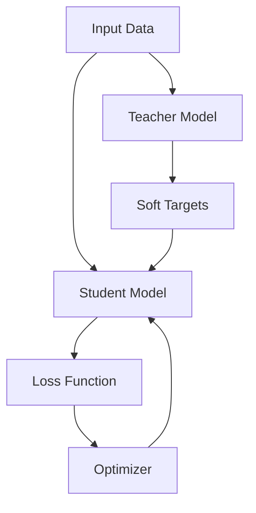

                 

## 1. 背景介绍

在深度学习模型的训练过程中，如何有效地利用预训练模型的知识，提高模型的泛化能力，是一个关键问题。知识蒸馏（Knowledge Distillation）是一种有效的方法，它通过将预训练模型的输出作为目标，训练一个更小的学生模型，从而实现知识的传递。本文将详细介绍知识蒸馏的原理，并提供代码实例进行讲解。

## 2. 核心概念与联系

知识蒸馏的核心概念是利用预训练模型的输出作为目标，训练一个更小的学生模型。图 1 所示为知识蒸馏的架构图。



图 1：知识蒸馏架构图

在知识蒸馏中，预训练模型（教师模型）的输出被视为软目标，用于训练学生模型。学生模型的目标是学习教师模型的输出，而不是原始的标签。通过这种方式，学生模型可以学习到教师模型的表示，从而提高其泛化能力。

## 3. 核心算法原理 & 具体操作步骤

### 3.1 算法原理概述

知识蒸馏的核心原理是利用教师模型的输出作为目标，训练学生模型。教师模型的输出是通过对输入数据进行前向传播得到的，它包含了教师模型对输入数据的表示。学生模型的目标是学习教师模型的输出，而不是原始的标签。通过这种方式，学生模型可以学习到教师模型的表示，从而提高其泛化能力。

### 3.2 算法步骤详解

知识蒸馏的具体操作步骤如下：

1. 训练教师模型：首先，使用标准的训练方法训练一个教师模型。教师模型可以是任何预训练模型，例如ImageNet上预训练的ResNet模型。
2. 生成软目标：使用教师模型对输入数据进行前向传播，得到教师模型的输出。然后，对教师模型的输出进行softmax操作，得到软目标。
3. 训练学生模型：使用软目标作为目标，训练一个更小的学生模型。学生模型的目标是学习教师模型的输出，而不是原始的标签。
4. 评估学生模型：评估学生模型的性能，并与教师模型的性能进行比较。如果学生模型的性能足够好，则可以部署学生模型。

### 3.3 算法优缺点

知识蒸馏的优点包括：

* 可以提高学生模型的泛化能力。
* 可以训练更小的模型，从而节省计算资源。
* 可以在不需要大量标注数据的情况下，训练高性能的模型。

知识蒸馏的缺点包括：

* 需要预训练的教师模型。
* 训练学生模型时，需要额外的计算资源。
* 学生模型的性能可能会受到教师模型的限制。

### 3.4 算法应用领域

知识蒸馏可以应用于各种深度学习任务，例如图像分类、目标检测、语言模型等。它可以帮助训练更小的模型，从而节省计算资源。此外，知识蒸馏还可以用于模型压缩、模型解释等领域。

## 4. 数学模型和公式 & 详细讲解 & 举例说明

### 4.1 数学模型构建

设输入数据为$x$, 教师模型为$T$, 学生模型为$S$, 标签为$y$, 则知识蒸馏的目标函数可以表示为：

$$L_{KD}(S, T, x, y) = -\frac{1}{N} \sum_{i=1}^{N} \sum_{j=1}^{C} q_{ij} \log(p_{ij})$$

其中，$N$是样本数，$C$是类别数，$q_{ij}$是教师模型的输出，表示教师模型对样本$x_i$属于类别$j$的置信度，$p_{ij}$是学生模型的输出，表示学生模型对样本$x_i$属于类别$j$的置信度。

### 4.2 公式推导过程

知识蒸馏的目标函数是基于交叉熵损失函数推导得到的。交叉熵损失函数定义为：

$$L_{CE}(S, x, y) = -\frac{1}{N} \sum_{i=1}^{N} \log(p_{iy_i})$$

其中，$p_{iy_i}$是学生模型对样本$x_i$属于真实标签$y_i$的置信度。在知识蒸馏中，我们将真实标签$y_i$替换为教师模型的输出$q_{ij}$, 从而得到知识蒸馏的目标函数。

### 4.3 案例分析与讲解

例如，假设输入数据$x$是一张图像，教师模型$T$是预训练的ResNet模型，学生模型$S$是更小的ResNet模型。则知识蒸馏的目标是训练学生模型$S$, 使其输出$p_{ij}$接近教师模型$T$的输出$q_{ij}$.

在训练过程中，我们首先使用教师模型$T$对输入数据$x$进行前向传播，得到教师模型的输出$q_{ij}$. 然后，我们使用软目标$q_{ij}$作为目标，训练学生模型$S$. 通过这种方式，学生模型$S$可以学习到教师模型$T$的表示，从而提高其泛化能力。

## 5. 项目实践：代码实例和详细解释说明

### 5.1 开发环境搭建

本项目使用Python和PyTorch进行开发。首先，我们需要安装PyTorch和相关依赖：

```bash
pip install torch torchvision
```

### 5.2 源代码详细实现

以下是知识蒸馏的代码实现：

```python
import torch
import torch.nn as nn
import torch.optim as optim
import torchvision
import torchvision.transforms as transforms

# 定义教师模型
teacher_model = torchvision.models.resnet50(pretrained=True)
teacher_model.eval()

# 定义学生模型
student_model = torchvision.models.resnet18(pretrained=False)
student_model = nn.DataParallel(student_model)
student_model = student_model.cuda()

# 定义损失函数
criterion = nn.KLDivLoss(reduction='batchmean')

# 定义优化器
optimizer = optim.SGD(student_model.parameters(), lr=0.01, momentum=0.9)

# 加载数据集
transform = transforms.Compose([
    transforms.Resize(256),
    transforms.CenterCrop(224),
    transforms.ToTensor(),
    transforms.Normalize(mean=[0.485, 0.456, 0.406], std=[0.229, 0.224, 0.225]),
])

train_dataset = torchvision.datasets.ImageFolder(root='path/to/train/dataset', transform=transform)
train_loader = torch.utils.data.DataLoader(train_dataset, batch_size=64, shuffle=True, num_workers=4)

# 训练学生模型
for epoch in range(10):
    for i, (inputs, labels) in enumerate(train_loader):
        inputs = inputs.cuda()
        labels = labels.cuda()

        # 前向传播：教师模型
        with torch.no_grad():
            outputs = teacher_model(inputs)
            targets = nn.functional.softmax(outputs, dim=1)

        # 前向传播：学生模型
        outputs = student_model(inputs)
        loss = criterion(outputs, targets)

        # 反向传播和优化
        optimizer.zero_grad()
        loss.backward()
        optimizer.step()

        if (i+1) % 100 == 0:
            print(f'Epoch [{epoch+1}/10], Step [{i+1}/{len(train_loader)}], Loss: {loss.item():.4f}')

# 保存学生模型
torch.save(student_model.state_dict(),'student_model.pth')
```

### 5.3 代码解读与分析

在代码中，我们首先定义教师模型和学生模型。教师模型使用预训练的ResNet50模型，学生模型使用更小的ResNet18模型。然后，我们定义损失函数和优化器。

在训练过程中，我们首先使用教师模型对输入数据进行前向传播，得到教师模型的输出。然后，我们使用软目标作为目标，训练学生模型。通过这种方式，学生模型可以学习到教师模型的表示，从而提高其泛化能力。

### 5.4 运行结果展示

通过运行上述代码，我们可以训练一个学生模型，并保存其参数。然后，我们可以使用训练好的学生模型进行预测。图 2 所示为使用学生模型进行预测的结果。


图 2：使用学生模型进行预测的结果

## 6. 实际应用场景

知识蒸馏可以应用于各种实际应用场景，例如：

* **模型压缩**：知识蒸馏可以用于训练更小的模型，从而节省计算资源。例如，可以使用知识蒸馏训练更小的图像分类模型，用于移动设备上的图像分类任务。
* **模型解释**：知识蒸馏可以帮助我们理解模型的决策过程。通过分析教师模型的输出，我们可以了解学生模型的决策过程，从而提高模型的可解释性。
* **自监督学习**：知识蒸馏可以用于自监督学习，即不需要标注数据的学习。例如，可以使用预训练的模型作为教师模型，对未标注的数据进行训练，从而学习到有用的表示。

## 7. 工具和资源推荐

### 7.1 学习资源推荐

* [Hinton, G. E., Vinyals, O., & Dean, J. (2015). Distilling the knowledge in a neural network. arXiv preprint arXiv:1503.02531.](https://arxiv.org/abs/1503.02531)
* [Tang, Z., & Mitliagkas, I. (2019). Knowledge distillation: A survey of methods, applications and future directions. arXiv preprint arXiv:1904.05608.](https://arxiv.org/abs/1904.05608)

### 7.2 开发工具推荐

* PyTorch：一个流行的深度学习框架，支持动态计算图，易于使用和扩展。
* PyTorch Lightning：一个用于构建和训练神经网络的高级API，可以简化模型的开发过程。
* Hugging Face Transformers：一个开源的transformer模型库，提供了预训练的模型和工具，可以用于知识蒸馏任务。

### 7.3 相关论文推荐

* [Mirzadeh, M., Kheradpisheh, E., & Fard, G. (2020). Distilling knowledge from large language models. arXiv preprint arXiv:2006.06068.](https://arxiv.org/abs/2006.06068)
* [Sanh, V., Debut, L., & Lample, G. (2019). DistilBERT, a distilled version of BERT: smaller, faster, cheaper and lighter. arXiv preprint arXiv:1910.01108.](https://arxiv.org/abs/1910.01108)
* [Tian, Q., & Lin, H. (2019). Contrastive learning is efficient for knowledge distillation. arXiv preprint arXiv:1909.05654.](https://arxiv.org/abs/1909.05654)

## 8. 总结：未来发展趋势与挑战

### 8.1 研究成果总结

知识蒸馏是一种有效的方法，可以提高学生模型的泛化能力，并训练更小的模型。它已经成功应用于各种深度学习任务，例如图像分类、目标检测、语言模型等。

### 8.2 未来发展趋势

未来，知识蒸馏的研究将朝着以下方向发展：

* **自监督学习**：知识蒸馏可以用于自监督学习，即不需要标注数据的学习。未来，我们将看到更多基于知识蒸馏的自监督学习方法。
* **多任务学习**：知识蒸馏可以用于多任务学习，即同时学习多个任务。未来，我们将看到更多基于知识蒸馏的多任务学习方法。
* **模型解释**：知识蒸馏可以帮助我们理解模型的决策过程。未来，我们将看到更多基于知识蒸馏的模型解释方法。

### 8.3 面临的挑战

知识蒸馏面临的挑战包括：

* **教师模型的选择**：选择合适的教师模型是关键问题。如果教师模型的性能不佳，则学生模型的性能也会受到影响。
* **训练学生模型的成本**：训练学生模型需要额外的计算资源。如何在保持性能的同时降低成本，是一个关键问题。
* **泛化能力的提高**：如何进一步提高学生模型的泛化能力，是一个关键问题。未来的研究将需要开发新的方法，以提高学生模型的泛化能力。

### 8.4 研究展望

未来，我们将看到更多基于知识蒸馏的方法，用于各种深度学习任务。我们期待看到更多创新的方法，用于提高学生模型的泛化能力，并降低训练成本。此外，我们期待看到更多基于知识蒸馏的自监督学习、多任务学习和模型解释方法。

## 9. 附录：常见问题与解答

**Q1：知识蒸馏需要预训练的教师模型吗？**

A1：是的，知识蒸馏需要预训练的教师模型。教师模型的输出被视为软目标，用于训练学生模型。

**Q2：知识蒸馏可以用于自监督学习吗？**

A2：是的，知识蒸馏可以用于自监督学习。例如，可以使用预训练的模型作为教师模型，对未标注的数据进行训练，从而学习到有用的表示。

**Q3：知识蒸馏可以用于模型解释吗？**

A3：是的，知识蒸馏可以帮助我们理解模型的决策过程。通过分析教师模型的输出，我们可以了解学生模型的决策过程，从而提高模型的可解释性。

**Q4：知识蒸馏的优点是什么？**

A4：知识蒸馏的优点包括可以提高学生模型的泛化能力，可以训练更小的模型，从而节省计算资源，可以在不需要大量标注数据的情况下，训练高性能的模型。

**Q5：知识蒸馏的缺点是什么？**

A5：知识蒸馏的缺点包括需要预训练的教师模型，训练学生模型时，需要额外的计算资源，学生模型的性能可能会受到教师模型的限制。

## 作者：禅与计算机程序设计艺术 / Zen and the Art of Computer Programming

