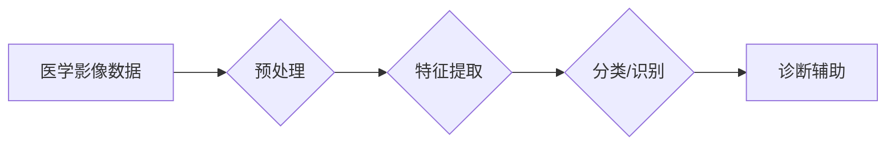

> 医学影像，人工智能，深度学习，计算机视觉，图像识别，诊断辅助，病灶检测

## 1. 背景介绍

医学影像作为现代医疗诊断的重要手段，为医生提供了直观的病灶信息，帮助他们做出更准确的诊断。然而，海量医学影像数据的分析和解读需要医生花费大量时间和精力，且存在主观性偏差。随着人工智能技术的快速发展，特别是深度学习算法的突破，AI在医学影像分析领域展现出巨大的潜力，为医疗诊断带来了革命性的变革。

## 2. 核心概念与联系

**2.1 医学影像与人工智能的融合**

医学影像包括X光片、CT扫描、MRI扫描、超声波等多种形式。人工智能，特别是深度学习算法，能够从这些复杂的图像数据中提取特征，识别病灶，并辅助医生进行诊断。

**2.2 深度学习在医学影像中的应用**

深度学习是一种模仿人类大脑神经网络结构的机器学习算法。它能够自动学习图像特征，无需人工特征工程，从而在医学影像分析中取得了显著的成果。

**2.3 核心概念架构**



## 3. 核心算法原理 & 具体操作步骤

**3.1 算法原理概述**

卷积神经网络（CNN）是深度学习中专门用于处理图像数据的网络结构。它通过卷积操作和池化操作来提取图像特征，并通过全连接层进行分类或识别。

**3.2 算法步骤详解**

1. **数据预处理:** 将医学影像数据进行尺寸调整、归一化等处理，以提高算法的训练效率和准确性。
2. **特征提取:** 使用卷积层和池化层提取图像特征，例如边缘、纹理、形状等。
3. **分类/识别:** 使用全连接层对提取的特征进行分类或识别，例如判断图像中是否存在病灶，并识别病灶的类型。
4. **模型训练:** 使用训练数据训练CNN模型，调整模型参数，使其能够准确地识别病灶。
5. **模型评估:** 使用测试数据评估模型的性能，例如准确率、召回率、F1-score等。

**3.3 算法优缺点**

**优点:**

* 自动学习图像特征，无需人工特征工程。
* 能够处理高分辨率图像数据。
* 准确率高，能够识别微小的病灶。

**缺点:**

* 训练数据量大，需要大量的标注数据。
* 计算资源消耗大，训练时间长。
* 对数据噪声敏感，需要进行有效的预处理。

**3.4 算法应用领域**

* 肿瘤检测和分类
* 心血管疾病诊断
* 骨骼疾病诊断
* 脑部疾病诊断
* 眼科疾病诊断

## 4. 数学模型和公式 & 详细讲解 & 举例说明

**4.1 数学模型构建**

CNN模型的数学基础是卷积操作和池化操作。

* **卷积操作:** 使用卷积核对图像进行滑动卷积，提取图像特征。卷积核是一个小的矩阵，其元素代表着图像像素之间的权重。

* **池化操作:** 对卷积后的特征图进行下采样，减少特征图的大小，提高模型的鲁棒性。常见的池化操作包括最大池化和平均池化。

**4.2 公式推导过程**

卷积操作的数学公式如下：

$$
y(i,j) = \sum_{m=0}^{M-1} \sum_{n=0}^{N-1} x(i+m,j+n) * w(m,n)
$$

其中：

* $y(i,j)$ 是卷积结果的像素值。
* $x(i+m,j+n)$ 是输入图像的像素值。
* $w(m,n)$ 是卷积核的权重。
* $M$ 和 $N$ 是卷积核的大小。

**4.3 案例分析与讲解**

假设我们有一个3x3的输入图像和一个3x3的卷积核，卷积操作的结果是一个2x2的特征图。

## 5. 项目实践：代码实例和详细解释说明

**5.1 开发环境搭建**

使用Python语言和深度学习框架TensorFlow或PyTorch搭建开发环境。

**5.2 源代码详细实现**

```python
import tensorflow as tf

# 定义卷积神经网络模型
model = tf.keras.models.Sequential([
    tf.keras.layers.Conv2D(32, (3, 3), activation='relu', input_shape=(256, 256, 3)),
    tf.keras.layers.MaxPooling2D((2, 2)),
    tf.keras.layers.Conv2D(64, (3, 3), activation='relu'),
    tf.keras.layers.MaxPooling2D((2, 2)),
    tf.keras.layers.Flatten(),
    tf.keras.layers.Dense(10, activation='softmax')
])

# 编译模型
model.compile(optimizer='adam',
              loss='sparse_categorical_crossentropy',
              metrics=['accuracy'])

# 训练模型
model.fit(x_train, y_train, epochs=10)

# 评估模型
loss, accuracy = model.evaluate(x_test, y_test)
print('Test loss:', loss)
print('Test accuracy:', accuracy)
```

**5.3 代码解读与分析**

代码定义了一个简单的CNN模型，包含两个卷积层、两个池化层、一个全连接层和一个softmax输出层。模型使用Adam优化器、交叉熵损失函数和准确率作为评估指标。

**5.4 运行结果展示**

训练完成后，模型能够对图像进行分类，并输出分类结果的概率分布。

## 6. 实际应用场景

**6.1 肿瘤检测**

AI算法能够从医学影像中识别肿瘤，并判断其类型和大小，为医生提供更精准的诊断依据。

**6.2 心血管疾病诊断**

AI算法能够分析心脏结构和功能，识别心血管疾病的风险因素，辅助医生进行早期诊断和治疗。

**6.3 骨骼疾病诊断**

AI算法能够识别骨骼骨折、关节炎等骨骼疾病，并评估其严重程度，为医生提供更有效的治疗方案。

**6.4 未来应用展望**

AI在医学影像分析领域的应用前景广阔，未来将更加深入地融入医疗诊断和治疗流程，为患者提供更精准、更个性化的医疗服务。

## 7. 工具和资源推荐

**7.1 学习资源推荐**

* 深度学习书籍：
    * 《深度学习》
    * 《动手学深度学习》
* 在线课程：
    * Coursera深度学习课程
    * Udacity深度学习课程

**7.2 开发工具推荐**

* 深度学习框架：
    * TensorFlow
    * PyTorch
* 图像处理库：
    * OpenCV
    * Pillow

**7.3 相关论文推荐**

* 《ImageNet Classification with Deep Convolutional Neural Networks》
* 《Deep Learning for Medical Image Analysis》

## 8. 总结：未来发展趋势与挑战

**8.1 研究成果总结**

AI在医学影像分析领域取得了显著的成果，能够辅助医生进行更精准的诊断，提高医疗效率。

**8.2 未来发展趋势**

* 模型精度提升：通过更复杂的模型架构和更大的训练数据集，进一步提高模型的诊断精度。
* 多模态融合：将不同类型的医学影像数据融合，例如CT、MRI、PET等，提高诊断的准确性和全面性。
* 个性化医疗：根据患者的个体特征，定制化医疗方案，提高治疗效果。

**8.3 面临的挑战**

* 数据隐私保护：医学影像数据包含敏感信息，需要采取有效的措施保护患者隐私。
* 模型解释性：深度学习模型的决策过程难以解释，需要开发更可解释的模型。
* 医疗伦理：AI在医疗领域的应用需要遵循伦理规范，避免出现偏差和歧视。

**8.4 研究展望**

未来，AI在医学影像分析领域将继续发展，为医疗诊断和治疗带来更多创新和突破。


## 9. 附录：常见问题与解答

**9.1 如何选择合适的深度学习模型？**

选择合适的深度学习模型需要根据具体应用场景和数据特点进行选择。常见的CNN模型包括AlexNet、VGGNet、ResNet等，可以根据任务需求和数据规模选择合适的模型。

**9.2 如何处理医学影像数据中的噪声？**

医学影像数据中存在各种噪声，例如椒盐噪声、高斯噪声等。可以使用图像滤波、去噪算法等方法进行处理，降低噪声的影响。

**9.3 如何评估深度学习模型的性能？**

常用的评估指标包括准确率、召回率、F1-score等。可以根据具体任务需求选择合适的评估指标。

作者：禅与计算机程序设计艺术 / Zen and the Art of Computer Programming 


<end_of_turn>