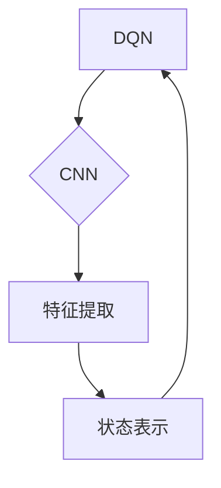

> Deep Q-Network (DQN), Convolutional Neural Network (CNN), Reinforcement Learning, Deep Learning, Game AI, Computer Vision

## 1. 背景介绍

在机器学习领域，深度学习的兴起掀起了前所未有的浪潮。其中，强化学习 (Reinforcement Learning, RL) 作为一种学习方式，通过智能体与环境的交互，学习最优策略，在解决复杂决策问题方面展现出强大的潜力。Deep Q-Network (DQN) 作为深度学习与强化学习的结合，将深度神经网络应用于 Q-learning 算法，有效地解决了传统 Q-learning 算法在高维状态空间中的学习效率问题。

然而，DQN 在处理图像等视觉信息时，其性能仍然存在局限性。传统的 DQN 算法将图像直接转换为一维向量，丢失了图像的空间结构信息，导致学习效果不佳。为了解决这个问题，本文将探讨如何利用卷积神经网络 (Convolutional Neural Network, CNN) 来提取图像特征，并将其与 DQN 结合，从而提升 DQN 在处理视觉信息任务中的性能。

## 2. 核心概念与联系

### 2.1 深度强化学习

深度强化学习 (Deep Reinforcement Learning) 是将深度学习技术应用于强化学习领域，通过深度神经网络学习智能体的策略。其核心思想是利用深度神经网络学习状态价值函数或动作价值函数，从而指导智能体做出最优决策。

### 2.2 DQN 算法

DQN 算法是深度强化学习中的一种经典算法，它将深度神经网络应用于 Q-learning 算法，学习状态-动作对的价值函数。DQN 算法的核心思想是：

* 使用深度神经网络估计状态-动作对的价值函数 Q(s, a)。
* 利用经验回放 (Experience Replay) 技术，从历史经验中随机采样数据进行训练，避免样本相关性问题。
* 使用目标网络 (Target Network) 来稳定训练过程，减少训练过程中的震荡。

### 2.3 CNN 算法

CNN 算法是一种专门用于处理图像数据的深度神经网络，其核心结构是卷积层和池化层。卷积层通过卷积核提取图像特征，池化层则对特征图进行降维，从而降低计算复杂度。CNN 算法在图像识别、物体检测等视觉任务中表现出色。

### 2.4 DQN 与 CNN 的结合

将 CNN 与 DQN 结合，可以有效地利用 CNN 提取图像特征，并将其作为 DQN 的输入，从而提升 DQN 在处理视觉信息任务中的性能。



## 3. 核心算法原理 & 具体操作步骤

### 3.1 算法原理概述

将 CNN 与 DQN 结合，可以构建一个深度强化学习模型，用于处理视觉信息任务。该模型的核心思想是：

* 使用 CNN 提取图像特征，将图像转换为一个向量表示。
* 使用 DQN 算法学习状态-动作对的价值函数，指导智能体做出最优决策。

### 3.2 算法步骤详解

1. **数据预处理:** 将图像数据预处理，例如归一化、裁剪等。
2. **CNN 特征提取:** 使用 CNN 提取图像特征，将图像转换为一个向量表示。
3. **DQN 训练:** 使用 DQN 算法训练模型，学习状态-动作对的价值函数。
4. **策略选择:** 根据学习到的价值函数，选择最优动作。
5. **环境交互:** 智能体执行动作，并观察环境的变化。
6. **经验回放:** 将环境交互信息存储到经验池中。
7. **模型更新:** 从经验池中随机采样数据，更新 DQN 模型的参数。

### 3.3 算法优缺点

**优点:**

* 可以有效地提取图像特征，提高模型的学习能力。
* 可以处理高维状态空间，适用于复杂视觉任务。

**缺点:**

* 训练过程复杂，需要大量的计算资源。
* 模型参数量大，容易过拟合。

### 3.4 算法应用领域

* 游戏 AI
* 机器人控制
* 自动驾驶
* 图像识别
* 物体检测

## 4. 数学模型和公式 & 详细讲解 & 举例说明

### 4.1 数学模型构建

DQN 算法的核心是学习状态-动作对的价值函数 Q(s, a)，该函数表示在状态 s 下执行动作 a 的期望回报。

### 4.2 公式推导过程

DQN 算法使用 Bellman 方程来更新价值函数：

$$Q(s, a) \leftarrow Q(s, a) + \alpha [r + \gamma \max_{a'} Q(s', a') - Q(s, a)]$$

其中：

* $Q(s, a)$ 是状态 s 下执行动作 a 的价值函数。
* $\alpha$ 是学习率。
* $r$ 是从状态 s 执行动作 a 后获得的奖励。
* $\gamma$ 是折扣因子，控制未来回报的权重。
* $s'$ 是执行动作 a 后进入的状态。
* $a'$ 是在状态 $s'$ 中执行的动作。

### 4.3 案例分析与讲解

假设一个智能体在玩游戏，当前状态是 s，智能体可以选择两个动作 a 和 b。执行动作 a 后，智能体获得奖励 r1，进入状态 s1；执行动作 b 后，智能体获得奖励 r2，进入状态 s2。

根据 Bellman 方程，我们可以更新智能体的价值函数：

* $Q(s, a) \leftarrow Q(s, a) + \alpha [r1 + \gamma \max_{a'} Q(s1, a') - Q(s, a)]$
* $Q(s, b) \leftarrow Q(s, b) + \alpha [r2 + \gamma \max_{a'} Q(s2, a') - Q(s, b)]$

通过不断地更新价值函数，智能体可以学习到最优策略，即在每个状态下执行哪个动作可以获得最大的回报。

## 5. 项目实践：代码实例和详细解释说明

### 5.1 开发环境搭建

* Python 3.x
* TensorFlow 或 PyTorch
* OpenAI Gym

### 5.2 源代码详细实现

```python
import tensorflow as tf
from tensorflow.keras.models import Sequential
from tensorflow.keras.layers import Conv2D, MaxPooling2D, Flatten, Dense

# 定义 CNN 模型
model = Sequential()
model.add(Conv2D(32, (3, 3), activation='relu', input_shape=(84, 84, 4)))
model.add(MaxPooling2D((2, 2)))
model.add(Conv2D(64, (3, 3), activation='relu'))
model.add(MaxPooling2D((2, 2)))
model.add(Flatten())
model.add(Dense(512, activation='relu'))
model.add(Dense(2, activation='linear'))

# 定义 DQN 算法
class DQNAgent:
    def __init__(self, state_size, action_size):
        self.state_size = state_size
        self.action_size = action_size
        self.model = model
        self.optimizer = tf.keras.optimizers.Adam(learning_rate=0.001)

    def predict(self, state):
        return self.model.predict(state)

    def train(self, states, actions, rewards, next_states, dones):
        with tf.GradientTape() as tape:
            q_values = self.model(states)
            target_q_values = rewards + self.gamma * tf.reduce_max(self.model(next_states), axis=1) * (1 - dones)
            loss = tf.keras.losses.mean_squared_error(target_q_values, q_values[tf.range(len(states)), actions])
        gradients = tape.gradient(loss, self.model.trainable_variables)
        self.optimizer.apply_gradients(zip(gradients, self.model.trainable_variables))

# ... 训练和测试代码 ...
```

### 5.3 代码解读与分析

* 代码首先定义了 CNN 模型，用于提取图像特征。
* 然后定义了 DQN 算法，包括预测、训练等方法。
* 训练过程使用经验回放技术，从经验池中随机采样数据进行训练。
* 测试过程使用训练好的模型进行预测，并评估模型性能。

### 5.4 运行结果展示

* 通过训练和测试，可以观察到模型的性能提升，例如准确率、奖励等指标。
* 可以使用可视化工具展示模型的训练过程和预测结果。

## 6. 实际应用场景

### 6.1 游戏 AI

DQN 算法可以用于训练游戏 AI，例如玩 Atari 游戏、Go 游戏等。

### 6.2 机器人控制

DQN 算法可以用于训练机器人控制系统，例如控制机器人手臂、移动机器人等。

### 6.3 自动驾驶

DQN 算法可以用于训练自动驾驶系统，例如控制车辆行驶、避障等。

### 6.4 未来应用展望

* 随着深度学习技术的不断发展，DQN 算法在更多领域得到应用。
* 结合其他强化学习算法，可以进一步提升 DQN 的性能。
* 将 DQN 应用于更复杂的任务，例如自然语言处理、推荐系统等。

## 7. 工具和资源推荐

### 7.1 学习资源推荐

* 深度强化学习书籍：
    * Deep Reinforcement Learning Hands-On
    * Reinforcement Learning: An Introduction
* 在线课程：
    * Deep Reinforcement Learning Specialization (Coursera)
    * Reinforcement Learning (Udacity)

### 7.2 开发工具推荐

* TensorFlow
* PyTorch
* OpenAI Gym

### 7.3 相关论文推荐

* Deep Q-Network (Mnih et al., 2015)
* Experience Replay in Reinforcement Learning (Lin et al., 1992)
* Dueling Network Architectures for Deep Reinforcement Learning (Wang et al., 2015)

## 8. 总结：未来发展趋势与挑战

### 8.1 研究成果总结

DQN 算法在深度强化学习领域取得了重要进展，成功应用于多个领域，例如游戏 AI、机器人控制等。

### 8.2 未来发展趋势

* 探索更有效的深度强化学习算法，例如结合其他机器学习算法，提高学习效率和泛化能力。
* 研究更强大的模型架构，例如 Transformer 网络，提高模型的表达能力和处理复杂任务的能力。
* 将深度强化学习应用于更多现实世界问题，例如医疗诊断、金融预测等。

### 8.3 面临的挑战

* 训练深度强化学习模型需要大量的计算资源和时间。
* 深度强化学习模型的解释性和可解释性仍然是一个挑战。
* 如何将深度强化学习模型应用于安全性和可靠性要求高的领域是一个重要问题。

### 8.4 研究展望

未来，深度强化学习将继续是一个重要的研究方向，随着技术的不断发展，深度强化学习将应用于更多领域，为人类社会带来更多福祉。

## 9. 附录：常见问题与解答

* **Q: DQN 算法为什么需要经验回放？**

A: 经验回放可以解决样本相关性问题，提高训练效率和稳定性。

* **Q: DQN 算法的学习率如何设置？**

A: 学习率是一个超参数，需要根据具体任务和模型进行调整。

* **Q: 如何评估 DQN 算法的性能？**

A: 可以使用奖励、准确率等指标来评估 DQN 算法的性能。


作者：禅与计算机程序设计艺术 / Zen and the Art of Computer Programming 
<end_of_turn>