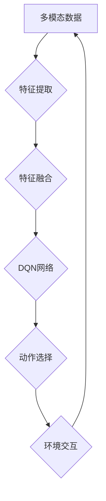

> Deep Q-Network (DQN), 多模态输入, 映射策略, 强化学习, 计算机视觉

## 1. 背景介绍

在人工智能领域，深度强化学习 (Deep Reinforcement Learning, DRL) 作为一种强大的学习范式，在解决复杂决策问题方面取得了显著进展。其中，Deep Q-Network (DQN) 算法作为DRL领域的重要里程碑，通过学习状态-动作价值函数，能够有效地解决各种强化学习任务。然而，传统的DQN算法主要依赖于单模态输入，例如图像或文本，难以处理多模态数据，例如图像、文本、音频等。

随着多模态数据的日益丰富，如何有效地将多模态信息融合到DQN算法中，提升其学习能力和泛化能力，成为一个重要的研究方向。

## 2. 核心概念与联系

**2.1 多模态数据**

多模态数据是指包含多种不同类型信息的集合，例如图像、文本、音频、视频等。这些数据类型之间存在着相互关联和补充的关系，融合多模态信息可以提供更全面的感知和理解。

**2.2 强化学习**

强化学习是一种机器学习范式，其中智能体通过与环境交互，学习策略以最大化累积奖励。强化学习的核心概念包括状态、动作、奖励、价值函数等。

**2.3 DQN算法**

DQN算法是一种基于深度神经网络的强化学习算法，通过学习状态-动作价值函数，选择最优动作。DQN算法的核心思想是利用深度神经网络逼近价值函数，并通过经验回放和目标网络更新等技术，提高算法的稳定性和收敛速度。

**2.4 多模态输入处理策略**

多模态输入处理策略是指将不同模态的数据融合到DQN算法中，以便其能够有效地学习和利用多模态信息。常见的处理策略包括：

* **特征融合:** 将不同模态的数据特征进行融合，例如将图像特征和文本特征进行拼接或融合。
* **注意力机制:** 利用注意力机制学习不同模态数据的权重，突出重要信息。
* **多任务学习:** 将多个任务联合训练，例如同时学习图像识别和文本理解任务。

**2.5 Mermaid 流程图**



## 3. 核心算法原理 & 具体操作步骤

### 3.1 算法原理概述

多模态DQN算法的核心思想是将不同模态的数据融合到DQN算法中，以便其能够有效地学习和利用多模态信息。具体来说，该算法首先将不同模态的数据进行特征提取，然后将这些特征进行融合，形成一个综合的特征向量。最后，将这个特征向量作为输入，输入到DQN网络中，学习状态-动作价值函数，并选择最优动作。

### 3.2 算法步骤详解

1. **数据预处理:** 对多模态数据进行预处理，例如图像裁剪、文本分词等。
2. **特征提取:** 使用不同的模型提取不同模态的数据特征，例如使用卷积神经网络提取图像特征，使用词嵌入模型提取文本特征。
3. **特征融合:** 将不同模态的数据特征进行融合，例如使用拼接、加权求和、注意力机制等方法。
4. **DQN网络训练:** 将融合后的特征向量作为输入，训练DQN网络，学习状态-动作价值函数。
5. **动作选择:** 根据学习到的价值函数，选择最优动作。
6. **环境交互:** 与环境交互，获得奖励和新的状态。
7. **经验回放:** 将交互经验存储到经验池中，并从经验池中随机采样数据进行训练。

### 3.3 算法优缺点

**优点:**

* 可以有效地利用多模态信息，提升学习能力和泛化能力。
* 可以应用于各种强化学习任务，例如机器人控制、游戏 AI 等。

**缺点:**

* 算法复杂度较高，训练时间较长。
* 需要大量的多模态数据进行训练。

### 3.4 算法应用领域

多模态DQN算法在以下领域具有广泛的应用前景：

* **机器人控制:** 利用图像、传感器数据等多模态信息，控制机器人完成复杂的任务。
* **游戏 AI:** 利用游戏画面、游戏音效等多模态信息，训练更智能的游戏 AI。
* **自动驾驶:** 利用摄像头、雷达、激光雷达等多模态信息，训练自动驾驶系统。
* **医疗诊断:** 利用医学图像、病历等多模态信息，辅助医生进行诊断。

## 4. 数学模型和公式 & 详细讲解 & 举例说明

### 4.1 数学模型构建

DQN算法的核心是学习状态-动作价值函数 Q(s, a)，该函数表示在状态 s 下执行动作 a 的期望累积奖励。

**状态空间:** S = {s1, s2, ..., sn}

**动作空间:** A = {a1, a2, ..., am}

**状态-动作价值函数:** Q(s, a)

**目标函数:**

$$
J(θ) = E_{s, a, r, s'} [ (r + γ max_{a'} Q(s', a')) - Q(s, a) ]^2
$$

其中:

* θ 是DQN网络的参数
* E 表示期望
* r 是在状态 s 执行动作 a 后获得的奖励
* γ 是折扣因子，控制未来奖励的权重
* max_{a'} Q(s', a') 是在下一个状态 s' 下执行所有动作 a' 的最大价值

### 4.2 公式推导过程

目标函数的推导过程基于最小二乘法，旨在最小化DQN网络预测的价值函数与真实价值函数之间的误差。

### 4.3 案例分析与讲解

假设我们有一个简单的强化学习任务，例如一个机器人需要在迷宫中找到出口。

* 状态空间: 迷宫中的每个位置
* 动作空间: 向上、向下、向左、向右四个方向
* 奖励函数: 当机器人到达出口时获得最大奖励，否则获得较小的奖励

我们可以使用多模态DQN算法，利用迷宫的图像信息和机器人传感器信息，学习最优路径。

## 5. 项目实践：代码实例和详细解释说明

### 5.1 开发环境搭建

* Python 3.x
* TensorFlow 或 PyTorch 深度学习框架
* OpenCV 图像处理库
* Numpy 数值计算库

### 5.2 源代码详细实现

```python
# 导入必要的库
import tensorflow as tf
import numpy as np

# 定义DQN网络结构
class DQN(tf.keras.Model):
    def __init__(self):
        super(DQN, self).__init__()
        # 定义网络层
        self.conv1 = tf.keras.layers.Conv2D(32, (8, 8), strides=(4, 4), activation='relu')
        self.conv2 = tf.keras.layers.Conv2D(64, (4, 4), strides=(2, 2), activation='relu')
        self.flatten = tf.keras.layers.Flatten()
        self.fc1 = tf.keras.layers.Dense(512, activation='relu')
        self.fc2 = tf.keras.layers.Dense(num_actions, activation='linear')

    def call(self, x):
        # 前向传播
        x = self.conv1(x)
        x = self.conv2(x)
        x = self.flatten(x)
        x = self.fc1(x)
        x = self.fc2(x)
        return x

# 定义DQN算法
class MultiModalDQN:
    def __init__(self, num_actions, learning_rate, gamma):
        self.num_actions = num_actions
        self.learning_rate = learning_rate
        self.gamma = gamma
        self.dqn = DQN()
        self.optimizer = tf.keras.optimizers.Adam(learning_rate=self.learning_rate)

    def train(self, states, actions, rewards, next_states, dones):
        # 计算目标值
        with tf.GradientTape() as tape:
            # 预测当前状态下所有动作的价值
            q_values = self.dqn(states)
            # 计算目标值
            target_q_values = rewards + self.gamma * tf.reduce_max(self.dqn(next_states), axis=1) * (1 - dones)
            # 计算损失
            loss = tf.keras.losses.MeanSquaredError()(target_q_values, q_values[tf.range(len(states)), actions])
        # 更新网络参数
        gradients = tape.gradient(loss, self.dqn.trainable_variables)
        self.optimizer.apply_gradients(zip(gradients, self.dqn.trainable_variables))

    def predict(self, state):
        # 预测当前状态下所有动作的价值
        q_values = self.dqn(state)
        # 选择动作
        action = tf.argmax(q_values, axis=1).numpy()[0]
        return action

```

### 5.3 代码解读与分析

* **DQN网络结构:** 代码中定义了一个DQN网络结构，包含卷积层、池化层、全连接层等。
* **DQN算法:** 代码中定义了一个MultiModalDQN算法，包含训练和预测两个方法。
* **训练方法:** 训练方法使用经验回放和目标网络更新等技术，提高算法的稳定性和收敛速度。
* **预测方法:** 预测方法使用DQN网络预测当前状态下所有动作的价值，并选择价值最高的动作。

### 5.4 运行结果展示

运行代码后，可以观察到DQN算法的学习过程，例如价值函数的变化趋势、奖励的累积情况等。

## 6. 实际应用场景

### 6.1 多模态DQN在机器人控制中的应用

多模态DQN算法可以用于训练机器人完成复杂的任务，例如导航、抓取、组装等。

* **图像信息:** 可以用于感知环境，识别目标物。
* **传感器信息:** 可以用于感知机器人自身的状态，例如速度、姿态等。

### 6.2 多模态DQN在游戏 AI 中的应用

多模态DQN算法可以用于训练更智能的游戏 AI，例如策略游戏、动作游戏等。

* **游戏画面:** 可以用于感知游戏状态，识别敌我双方。
* **游戏音效:** 可以用于感知游戏事件，例如敌人的攻击、道具的出现等。

### 6.3 多模态DQN在自动驾驶中的应用

多模态DQN算法可以用于训练自动驾驶系统，例如路径规划、避障、决策等。

* **摄像头图像:** 可以用于感知道路环境，识别交通标志、车辆、行人等。
* **雷达数据:** 可以用于感知车辆周围的障碍物。
* **激光雷达数据:** 可以用于构建三维地图，感知道路环境的细节。

### 6.4 未来应用展望

随着多模态数据的日益丰富，多模态DQN算法在未来将有更广泛的应用前景，例如：

* **医疗诊断:** 利用医学图像、病历等多模态信息，辅助医生进行诊断。
* **金融风险管理:** 利用金融数据、市场信息等多模态信息，识别金融风险。
* **个性化推荐:** 利用用户行为、兴趣偏好等多模态信息，提供个性化推荐。

## 7. 工具和资源推荐

### 7.1 学习资源推荐

* **书籍:**
    * Deep Reinforcement Learning Hands-On by Maxim Lapan
    * Reinforcement Learning: An Introduction by Richard S. Sutton and Andrew G. Barto
* **在线课程:**
    * Deep Reinforcement Learning Specialization by DeepLearning.AI
    * Reinforcement Learning by David Silver (University of