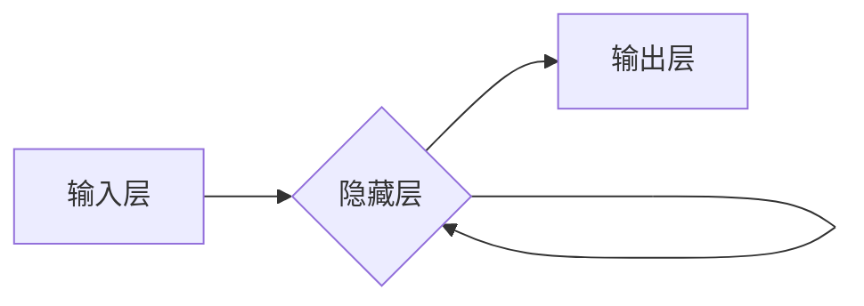

> 循环神经网络(RNN)、序列预测、自然语言处理(NLP)、时间序列分析、深度学习、长短期记忆网络(LSTM)、门控循环单元(GRU)

## 1. 背景介绍

在当今数据爆炸的时代，处理和预测序列数据已成为许多领域的关键挑战。从股票价格的波动预测到自然语言的理解和生成，序列数据无处不在。传统的机器学习方法在处理长序列数据时往往表现力不足，而深度学习的出现为序列数据分析带来了新的希望。

循环神经网络(RNN)作为深度学习中专门用于处理序列数据的网络结构，凭借其独特的记忆机制，在序列预测任务中展现出强大的能力。本文将深入探讨RNN的原理、算法、应用以及未来发展趋势，帮助读者理解RNN在序列预测领域的独特地位。

## 2. 核心概念与联系

### 2.1 序列数据

序列数据是指按照时间或顺序排列的一系列数据点，例如：

* **自然语言文本:**  单词序列
* **时间序列数据:**  股票价格、气温、流量等数据
* **音频信号:**  声音波形
* **视频序列:**  帧序列

### 2.2 循环神经网络(RNN)

RNN是一种特殊的深度神经网络结构，其核心特点是**循环连接**。循环连接允许信息在网络中循环传递，从而赋予RNN处理序列数据的能力。

**RNN的结构:**

* **输入层:**  接收序列数据中的每个元素。
* **隐藏层:**  负责处理序列信息，并根据输入和自身状态生成输出。
* **输出层:**  生成对序列的预测结果。

**RNN的循环机制:**

隐藏层的每个神经元不仅接收当前输入，还接收前一个时间步的隐藏层输出，从而形成循环连接。

**RNN的优势:**

* **处理序列数据:**  RNN能够捕获序列数据中的时间依赖关系。
* **可变长度序列:**  RNN可以处理长度不同的序列数据。

**RNN的挑战:**

* **梯度消失/爆炸问题:**  在处理长序列数据时，梯度可能会消失或爆炸，导致训练困难。

**Mermaid 流程图:**



## 3. 核心算法原理 & 具体操作步骤

### 3.1 算法原理概述

RNN的核心算法原理是通过循环连接，将序列数据中的每个元素都映射到一个隐藏状态，并根据隐藏状态生成输出。

**隐藏状态的更新公式:**

$$h_t = f(W_{xh}x_t + W_{hh}h_{t-1} + b_h)$$

其中：

* $h_t$ 是当前时间步的隐藏状态。
* $x_t$ 是当前时间步的输入。
* $W_{xh}$ 和 $W_{hh}$ 是权重矩阵。
* $b_h$ 是偏置项。
* $f$ 是激活函数。

**输出的生成公式:**

$$y_t = g(W_{hy}h_t + b_y)$$

其中：

* $y_t$ 是当前时间步的输出。
* $W_{hy}$ 是权重矩阵。
* $b_y$ 是偏置项。
* $g$ 是激活函数。

### 3.2 算法步骤详解

1. **初始化隐藏状态:**  将隐藏状态初始化为零向量。
2. **循环处理每个输入:**  对于序列中的每个输入 $x_t$，执行以下步骤:
    * 计算隐藏状态 $h_t$。
    * 计算输出 $y_t$。
3. **输出最终结果:**  根据输出序列 $y_1, y_2, ..., y_T$ 生成最终预测结果。

### 3.3 算法优缺点

**优点:**

* 处理序列数据
* 可变长度序列

**缺点:**

* 梯度消失/爆炸问题
* 计算复杂度高

### 3.4 算法应用领域

* **自然语言处理:**  文本分类、机器翻译、情感分析、文本生成
* **时间序列分析:**  股票预测、天气预报、流量预测
* **语音识别:**  语音转文本
* **图像处理:**  视频分析、动作识别

## 4. 数学模型和公式 & 详细讲解 & 举例说明

### 4.1 数学模型构建

RNN的数学模型可以表示为一个递归方程，其中隐藏状态 $h_t$ 是当前时间步的输入 $x_t$ 和前一个时间步的隐藏状态 $h_{t-1}$ 的函数。

### 4.2 公式推导过程

隐藏状态的更新公式:

$$h_t = f(W_{xh}x_t + W_{hh}h_{t-1} + b_h)$$

输出的生成公式:

$$y_t = g(W_{hy}h_t + b_y)$$

其中:

* $W_{xh}$, $W_{hh}$, $W_{hy}$ 是权重矩阵。
* $b_h$, $b_y$ 是偏置项。
* $f$, $g$ 是激活函数。

### 4.3 案例分析与讲解

假设我们有一个简单的RNN模型，用于预测下一个单词。输入序列为“The cat sat on”，输出序列为“the mat”。

在训练过程中，RNN会学习到每个单词的语义信息和上下文关系。当输入“The cat sat on”时，RNN会根据输入序列和自身的记忆状态，预测下一个单词为“the”。

## 5. 项目实践：代码实例和详细解释说明

### 5.1 开发环境搭建

* Python 3.x
* TensorFlow 或 PyTorch

### 5.2 源代码详细实现

```python
import tensorflow as tf

# 定义RNN模型
model = tf.keras.Sequential([
    tf.keras.layers.Embedding(input_dim=vocab_size, output_dim=embedding_dim),
    tf.keras.layers.LSTM(units=128),
    tf.keras.layers.Dense(units=vocab_size, activation='softmax')
])

# 编译模型
model.compile(optimizer='adam', loss='sparse_categorical_crossentropy', metrics=['accuracy'])

# 训练模型
model.fit(x_train, y_train, epochs=10)

# 预测
predictions = model.predict(x_test)
```

### 5.3 代码解读与分析

* **Embedding层:** 将单词映射到低维向量空间。
* **LSTM层:** 处理序列数据，学习时间依赖关系。
* **Dense层:** 生成输出，预测下一个单词。
* **编译模型:** 设置优化器、损失函数和评价指标。
* **训练模型:** 使用训练数据训练模型。
* **预测:** 使用训练好的模型预测新的序列数据。

### 5.4 运行结果展示

训练完成后，可以评估模型的性能，例如准确率、损失等。

## 6. 实际应用场景

### 6.1 自然语言处理

* **机器翻译:**  RNN可以用于将一种语言翻译成另一种语言。
* **文本摘要:**  RNN可以用于生成文本的简短摘要。
* **情感分析:**  RNN可以用于分析文本的情感倾向。

### 6.2 时间序列分析

* **股票预测:**  RNN可以用于预测股票价格的波动。
* **天气预报:**  RNN可以用于预测未来几天的天气情况。
* **流量预测:**  RNN可以用于预测网络流量的峰值和谷值。

### 6.3 其他应用场景

* **语音识别:**  RNN可以用于将语音信号转换为文本。
* **音乐生成:**  RNN可以用于生成新的音乐旋律。

### 6.4 未来应用展望

随着深度学习技术的不断发展，RNN在未来将有更广泛的应用场景，例如：

* **个性化推荐:**  RNN可以用于根据用户的历史行为推荐个性化的商品或服务。
* **医疗诊断:**  RNN可以用于分析患者的病历和症状，辅助医生进行诊断。
* **自动驾驶:**  RNN可以用于处理车辆周围环境的信息，辅助自动驾驶系统决策。

## 7. 工具和资源推荐

### 7.1 学习资源推荐

* **书籍:**
    * 《深度学习》
    * 《自然语言处理》
* **在线课程:**
    * Coursera: 深度学习
    * Udacity: 自然语言处理
* **博客:**
    * TensorFlow Blog
    * PyTorch Blog

### 7.2 开发工具推荐

* **TensorFlow:**  开源深度学习框架
* **PyTorch:**  开源深度学习框架
* **Keras:**  高层深度学习API

### 7.3 相关论文推荐

* **循环神经网络**
* **长短期记忆网络**
* **门控循环单元**

## 8. 总结：未来发展趋势与挑战

### 8.1 研究成果总结

RNN在序列预测任务中取得了显著的成果，并在自然语言处理、时间序列分析等领域得到了广泛应用。

### 8.2 未来发展趋势

* **更强大的RNN模型:**  研究人员将继续探索更强大的RNN模型，例如Transformer、T5等，以提高模型的性能和效率。
* **更有效的训练方法:**  研究人员将继续探索更有效的训练方法，例如迁移学习、自监督学习等，以降低模型训练的成本和时间。
* **更广泛的应用场景:**  RNN将应用于更多领域，例如医疗诊断、自动驾驶等，为人类社会带来更多价值。

### 8.3 面临的挑战

* **梯度消失/爆炸问题:**  RNN在处理长序列数据时仍然面临梯度消失/爆炸问题，这限制了模型的性能。
* **计算复杂度高:**  RNN的计算复杂度较高，训练大型RNN模型需要大量的计算资源。
* **数据依赖性:**  RNN的性能依赖于训练数据的质量和数量。

### 8.4 研究展望

未来，RNN的研究将继续朝着更强大、更高效、更广泛应用的方向发展。


## 9. 附录：常见问题与解答

**Q1: RNN和CNN的区别是什么？**

**A1:** RNN专门用于处理序列数据，而CNN专门用于处理图像数据。RNN通过循环连接学习时间依赖关系，而CNN通过卷积核学习图像特征。

**Q2: RNN的梯度消失/爆炸问题如何解决？**

**A2:** 

* 使用长短期记忆网络(LSTM)或门控循环单元(GRU)等改进的RNN结构。
* 使用梯度裁剪技术。
* 使用残差连接。

**Q3: 如何选择RNN的隐藏层单元数？**

**A3:** 隐藏层单元数的选择需要根据具体任务和数据集进行调整。一般来说，可以从较小的单元数开始，逐步增加，直到性能达到最佳。


作者：禅与计算机程序设计艺术 / Zen and the Art of Computer Programming 
<end_of_turn>