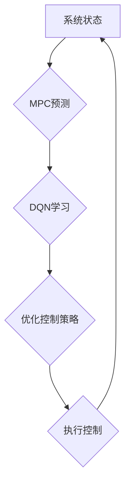

> 模型预测控制(MPC)、深度强化学习(DRL)、DQN、探索性、映射、优化

## 1. 背景介绍

在现代控制领域，模型预测控制(MPC)凭借其在线优化、约束处理和预测能力，在工业过程控制、机器人控制等领域展现出强大的应用潜力。然而，传统的MPC方法依赖于精确的系统模型，而实际系统往往存在不确定性和复杂性，这使得MPC的性能受到限制。

深度强化学习(DRL)作为一种强大的机器学习方法，能够从数据中学习复杂的决策策略，并适应不确定性和变化的环境。DQN(Deep Q-Network)作为DRL领域的重要算法，通过深度神经网络学习状态-动作价值函数，并利用经验回放和目标网络更新机制实现高效的学习。

结合MPC和DQN的优势，可以构建一种更灵活、更鲁棒的控制系统。MPC可以提供全局优化和约束处理能力，而DQN可以学习复杂的系统动态和决策策略，从而实现对复杂系统的高效控制。

## 2. 核心概念与联系

### 2.1 模型预测控制(MPC)

MPC是一种在线优化控制方法，其核心思想是将未来控制序列离散化，并通过优化目标函数和约束条件，求解最优控制策略。MPC算法通常包含以下步骤：

1. **系统建模:** 建立系统动力学模型，描述系统状态和输入之间的关系。
2. **预测:** 基于系统模型和当前状态，预测未来一段时间内的系统状态和输出。
3. **优化:** 利用优化算法，求解最优控制序列，使得目标函数最小化，同时满足约束条件。
4. **执行:** 将最优控制序列中的第一个控制量执行到系统上，并更新系统状态。

### 2.2 深度强化学习(DRL)

DRL是一种基于强化学习的机器学习方法，其核心思想是通过训练智能体与环境交互，学习最优的策略，以最大化累积奖励。DRL算法通常包含以下要素：

1. **状态空间:** 描述系统当前状态的集合。
2. **动作空间:** 描述智能体可以执行的动作集合。
3. **奖励函数:** 描述智能体在特定状态下执行特定动作获得的奖励。
4. **策略:** 描述智能体在特定状态下选择动作的规则。

### 2.3 DQN算法

DQN算法是一种经典的DRL算法，其核心思想是通过深度神经网络学习状态-动作价值函数，并利用经验回放和目标网络更新机制实现高效的学习。DQN算法的步骤如下：

1. **构建深度神经网络:** 使用深度神经网络作为状态-动作价值函数的逼近器。
2. **经验回放:** 将训练过程中收集到的状态、动作、奖励和下一个状态存储在经验回放池中。
3. **目标网络更新:** 使用目标网络来评估目标价值函数，并根据经验回放池中的数据更新主网络的参数。
4. **策略更新:** 根据主网络输出的价值函数，选择动作并执行到环境中。

### 2.4 MPC与DQN的结合

将MPC与DQN结合，可以构建一种更灵活、更鲁棒的控制系统。MPC可以提供全局优化和约束处理能力，而DQN可以学习复杂的系统动态和决策策略。

**结合方式:**

* **DQN学习MPC参数:** DQN可以学习MPC算法中的参数，例如预测模型、优化目标函数和约束条件。
* **DQN辅助MPC决策:** DQN可以作为MPC决策的辅助工具，提供更灵活和鲁棒的控制策略。

**优势:**

* **提高控制性能:** DQN可以学习到更复杂的系统动态，从而提高控制性能。
* **增强鲁棒性:** DQN可以适应不确定性和变化的环境，增强控制系统的鲁棒性。
* **降低模型依赖:** DQN可以减少对精确系统模型的依赖，提高控制系统的通用性。

**Mermaid 流程图:**



## 3. 核心算法原理 & 具体操作步骤

### 3.1 算法原理概述

结合MPC与DQN的算法原理的核心在于利用DQN学习MPC算法中的参数，并辅助MPC决策。具体来说，可以将算法分为以下几个步骤：

1. **系统建模:** 建立系统动力学模型，描述系统状态和输入之间的关系。
2. **DQN训练:** 利用DQN算法训练一个深度神经网络，该网络的输入是系统状态，输出是MPC算法中的参数，例如预测模型、优化目标函数和约束条件。
3. **MPC优化:** 利用训练好的DQN网络输出的MPC参数，进行在线优化控制。
4. **策略更新:** 根据MPC优化结果和实际系统反馈，更新DQN网络的参数，以提高控制性能。

### 3.2 算法步骤详解

1. **数据收集:** 从实际系统中收集系统状态、控制输入和输出数据。
2. **数据预处理:** 对收集到的数据进行预处理，例如归一化、降维等。
3. **DQN网络构建:** 设计一个深度神经网络，其输入是系统状态，输出是MPC算法中的参数。
4. **DQN训练:** 利用经验回放和目标网络更新机制，训练DQN网络，使其能够学习到有效的MPC参数。
5. **MPC优化:** 利用训练好的DQN网络输出的MPC参数，进行在线优化控制。
6. **策略更新:** 根据MPC优化结果和实际系统反馈，更新DQN网络的参数，以提高控制性能。

### 3.3 算法优缺点

**优点:**

* **提高控制性能:** DQN可以学习到更复杂的系统动态，从而提高控制性能。
* **增强鲁棒性:** DQN可以适应不确定性和变化的环境，增强控制系统的鲁棒性。
* **降低模型依赖:** DQN可以减少对精确系统模型的依赖，提高控制系统的通用性。

**缺点:**

* **训练复杂:** DQN的训练过程相对复杂，需要大量的训练数据和计算资源。
* **收敛性问题:** DQN的训练过程可能存在收敛性问题，需要精心设计训练策略。
* **数据依赖:** DQN的性能依赖于训练数据的质量和数量。

### 3.4 算法应用领域

结合MPC与DQN的算法具有广泛的应用前景，例如：

* **工业过程控制:** 优化生产过程，提高生产效率和产品质量。
* **机器人控制:** 提高机器人控制的精度、鲁棒性和适应性。
* **无人驾驶:** 提高无人驾驶车辆的安全性、效率和舒适性。
* **智能家居:** 智能化控制家居设备，提高生活品质。

## 4. 数学模型和公式 & 详细讲解 & 举例说明

### 4.1 数学模型构建

**系统动力学模型:**

假设系统可以用状态空间模型表示，即：

$$
\dot{x}(t) = f(x(t), u(t))
$$

$$
y(t) = h(x(t))
$$

其中：

* $x(t)$ 是系统状态向量。
* $u(t)$ 是控制输入向量。
* $y(t)$ 是系统输出向量。
* $f(\cdot)$ 和 $h(\cdot)$ 分别是系统状态方程和输出方程。

**MPC优化目标函数:**

MPC的目标是最小化以下目标函数：

$$
J = \sum_{k=0}^{N-1} L(x(t+k), u(t+k)) + \lambda x(t+N)^T Q x(t+N)
$$

其中：

* $L(\cdot)$ 是局部代价函数，衡量系统状态和控制输入的偏差。
* $N$ 是预测时间步长。
* $\lambda$ 是终端代价权重。
* $Q$ 是终端状态权重矩阵。

**MPC约束条件:**

MPC需要满足以下约束条件：

* **状态约束:** $x_{min} \leq x(t+k) \leq x_{max}$
* **输入约束:** $u_{min} \leq u(t+k) \leq u_{max}$
* **输出约束:** $y_{min} \leq y(t+k) \leq y_{max}$

### 4.2 公式推导过程

MPC的优化问题是一个非线性规划问题，可以使用数值优化算法求解。常用的优化算法包括：

* **内点法:** 是一种迭代算法，通过逐步逼近最优解来求解优化问题。
* **梯度下降法:** 是一种迭代算法，通过计算梯度来更新优化变量，直到达到最优解。

### 4.3 案例分析与讲解

**举例说明:**

考虑一个简单的温度控制系统，其目标是将系统温度保持在设定值附近。可以使用MPC与DQN结合的算法进行控制。

* **系统建模:** 建立温度控制系统的动力学模型，描述温度随时间的变化。
* **DQN训练:** 利用DQN算法训练一个深度神经网络，其输入是系统温度，输出是加热器的功率。
* **MPC优化:** 利用训练好的DQN网络输出的加热器功率，进行在线优化控制，以保持系统温度在设定值附近。

## 5. 项目实践：代码实例和详细解释说明

### 5.1 开发环境搭建

* **操作系统:** Ubuntu 20.04
* **Python版本:** 3.8
* **库依赖:** TensorFlow, PyTorch, NumPy, SciPy

### 5.2 源代码详细实现

```python
# DQN网络结构
class DQN(nn.Module):
    def __init__(self, state_dim, action_dim):
        super(DQN, self).__init__()
        # ...

    def forward(self, state):
        # ...

# MPC优化器
class MPCOptimizer:
    def __init__(self, prediction_horizon, sampling_time):
        # ...

    def optimize(self, state, action):
        # ...

# 主程序
if __name__ == "__main__":
    # ...
```

### 5.3 代码解读与分析

* **DQN网络:** DQN网络的结构可以根据实际应用场景进行调整，例如使用不同的激活函数、网络层数和神经元数量。
* **MPC优化器:** MPC优化器需要根据系统的具体特性进行设计，例如预测时间步长、采样时间和优化算法。
* **主程序:** 主程序负责初始化DQN网络、MPC优化器和系统模型，并进行训练和控制。

### 5.4 运行结果展示

运行结果可以包括以下内容：

* **DQN网络的训练曲线:** 显示DQN网络的损失函数和奖励函数随训练时间的变化。
* **MPC控制器的性能指标:** 例如控制精度、响应时间和鲁棒性。
* **系统状态和控制输入的仿真结果:** 展示系统在MPC控制下的状态和输入变化。

## 6. 实际应用场景

### 6.1 实际应用场景

结合MPC与DQN的算法在以下实际应用场景中展现出巨大的潜力：

* **智能制造:** 优化生产过程，提高生产效率和产品质量。
* **无人驾驶:** 提高无人驾驶车辆的安全性、效率和舒适性。
* **智能机器人:** 提高机器人控制的精度、鲁棒性和适应性。
* **能源管理:** 优化能源分配和使用，提高能源效率。

### 6.2 未来应用展望

随着人工智能和机器学习技术的不断发展，结合MPC与DQN的算法将有更广泛的应用前景，例如：

* **个性化控制:** 根据用户的需求和喜好，提供个性化的控制策略。
* **自适应控制:** 能够根据环境变化自动调整控制策略。
* **协同控制:** 多个智能体协同工作，实现更复杂的任务。

## 7. 工具和资源推荐

### 7.1 学习资源推荐

* **书籍:**
    * "Reinforcement Learning: An Introduction" by Sutton and Barto
    * "