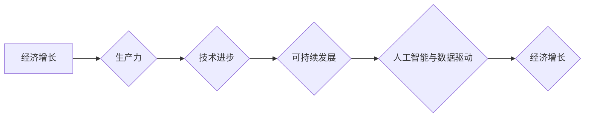

> 经济增长、技术进步、生产力、可持续发展、人工智能、数据驱动、经济模型

## 1. 背景介绍

全球经济持续增长已成为过去几十年来普遍的现象。然而，近年来，世界经济增长速度明显放缓，一些发达国家甚至面临经济停滞的风险。这种长期困境的出现，引发了人们对经济增长模式的反思，以及未来经济发展方向的探讨。

传统经济学认为，技术进步是推动经济增长的主要动力。随着科技的不断发展，生产力不断提高，最终带动经济增长。然而，近年来，尽管科技进步依然蓬勃发展，但经济增长的速度却并未像预期的那样显著提升。这表明，单纯依靠技术进步来推动经济增长已经不再有效。

## 2. 核心概念与联系

**2.1  经济增长与生产力**

经济增长是指一个国家或地区的国民生产总值（GDP）在一定时期内以一定比例增加的现象。而生产力则是指社会利用生产要素（如劳动力、资本、土地等）生产商品和服务的能力。

经济增长与生产力之间存在着密切的联系。生产力的提高是经济增长的基础，而经济增长也需要不断提高生产力。

**2.2  技术进步与生产力**

技术进步是提高生产力的重要途径。新技术可以提高生产效率，降低生产成本，创造新的产品和服务，从而推动生产力的提高。

**2.3  可持续发展与经济增长**

可持续发展是指满足当前世代需求，而不损害未来世代满足其自身需求的能力。经济增长需要考虑可持续发展，避免过度消耗资源、破坏环境，最终导致经济增长不可持续。

**2.4  人工智能与数据驱动**

人工智能（AI）和数据驱动正在深刻地改变着经济增长模式。AI可以帮助企业提高效率、降低成本、开发新产品和服务，从而推动经济增长。数据驱动则可以帮助企业更好地了解市场需求、优化运营策略，从而促进经济增长。

**Mermaid 流程图**



## 3. 核心算法原理 & 具体操作步骤

**3.1  算法原理概述**

经济增长模型通常采用数学模型来描述经济增长过程。这些模型通常基于以下几个核心假设：

* **生产函数：** 描述生产要素与产出的关系。
* **资本积累：** 企业通过投资增加资本投入，从而提高生产力。
* **技术进步：** 新技术可以提高生产效率，降低生产成本。
* **人口增长：** 人口增长可以增加劳动力供应，从而推动经济增长。

**3.2  算法步骤详解**

1. **构建生产函数：** 根据实际情况选择合适的生产函数形式，例如柯布-道格拉斯生产函数。
2. **设定参数：** 确定生产函数中的参数，例如资本的弹性、劳动的弹性等。
3. **模拟经济增长过程：** 使用数值方法模拟经济增长过程，例如欧拉法、龙格-库塔法等。
4. **分析结果：** 分析模拟结果，例如经济增长的速度、资本积累的速度、技术进步的速度等。

**3.3  算法优缺点**

* **优点：** 
    * 可以定量分析经济增长过程。
    * 可以比较不同政策对经济增长的影响。
    * 可以预测未来经济增长趋势。
* **缺点：** 
    * 模型假设过于简化，难以完全反映现实经济的复杂性。
    * 模型参数难以确定，结果存在一定的误差。

**3.4  算法应用领域**

经济增长模型广泛应用于以下领域：

* **宏观经济政策制定：** 政府可以利用经济增长模型预测不同政策对经济增长的影响，制定相应的宏观经济政策。
* **企业战略决策：** 企业可以利用经济增长模型分析市场环境，制定相应的企业战略决策。
* **学术研究：** 学者可以利用经济增长模型研究经济增长的规律，探索推动经济增长的新思路。

## 4. 数学模型和公式 & 详细讲解 & 举例说明

**4.1  数学模型构建**

一个典型的经济增长模型是索洛模型，它假设经济增长取决于资本积累、劳动力增长和技术进步。

**4.2  公式推导过程**

索洛模型的核心公式如下：

$$
y_t = A_t K_t^{\alpha} L_t^{1-\alpha}
$$

其中：

* $y_t$ 是t时期的人均GDP
* $A_t$ 是t时期的人均生产率
* $K_t$ 是t时期的人均资本
* $L_t$ 是t时期的人口
* $\alpha$ 是资本的弹性

**4.3  案例分析与讲解**

假设一个国家的人均资本增长率为2%，人口增长率为1%，技术进步率为3%。根据索洛模型，该国的经济增长率为：

$$
g = \alpha \cdot g_k + (1-\alpha) \cdot g_l + g_a
$$

其中：

* $g$ 是经济增长率
* $g_k$ 是资本增长率
* $g_l$ 是人口增长率
* $g_a$ 是技术进步率

代入数值，可得：

$$
g = 0.3 \cdot 0.02 + 0.7 \cdot 0.01 + 0.03 = 0.04
$$

因此，该国的经济增长率为4%。

## 5. 项目实践：代码实例和详细解释说明

**5.1  开发环境搭建**

可以使用Python语言和NumPy库来实现经济增长模型的模拟。

**5.2  源代码详细实现**

```python
import numpy as np

# 设定模型参数
alpha = 0.3
g_k = 0.02
g_l = 0.01
g_a = 0.03

# 模拟经济增长过程
years = 100
y = np.zeros(years)
k = np.zeros(years)

k[0] = 1
y[0] = 1

for i in range(1, years):
    k[i] = k[i-1] * (1 + g_k)
    y[i] = k[i]**alpha * (1 + g_l)**(1-alpha) * (1 + g_a)

# 打印结果
print(y)
```

**5.3  代码解读与分析**

这段代码首先设定了模型参数，例如资本的弹性、资本增长率、人口增长率和技术进步率。然后，它模拟了经济增长过程，计算了每个时期的人均GDP。最后，它打印了模拟结果。

**5.4  运行结果展示**

运行这段代码后，会得到一个包含100个元素的数组，每个元素代表一个时期的人均GDP。

## 6. 实际应用场景

经济增长模型在实际应用中具有广泛的应用场景，例如：

* **宏观经济政策制定：** 政府可以利用经济增长模型预测不同政策对经济增长的影响，制定相应的宏观经济政策。例如，政府可以通过增加投资、降低税收等政策来刺激经济增长。
* **企业战略决策：** 企业可以利用经济增长模型分析市场环境，制定相应的企业战略决策。例如，企业可以通过投资新技术、开发新产品等方式来提高竞争力，促进经济增长。
* **学术研究：** 学者可以利用经济增长模型研究经济增长的规律，探索推动经济增长的新思路。例如，学者可以研究不同国家经济增长的差异，探索推动经济增长的关键因素。

**6.4  未来应用展望**

随着人工智能和数据驱动的发展，经济增长模型将更加精准、更加智能。未来，经济增长模型将能够更好地预测经济增长趋势，为政府、企业和个人提供更精准的决策支持。

## 7. 工具和资源推荐

**7.1  学习资源推荐**

* **书籍：**
    * 《经济增长》 - 罗伯特·索洛
    * 《经济学原理》 - 诺曼·奥尔森
* **在线课程：**
    * Coursera 上的《经济学》课程
    * edX 上的《宏观经济学》课程

**7.2  开发工具推荐**

* **Python:** 
    * NumPy: 用于数值计算
    * Pandas: 用于数据分析
    * Matplotlib: 用于数据可视化

**7.3  相关论文推荐**

* **索洛模型：**
    * Solow, R. M. (1956). A contribution to the theory of economic growth. The Quarterly Journal of Economics, 70(1), 65-94.
* **人工智能与经济增长：**
    * Acemoglu, D., & Restrepo, P. (2018). Artificial intelligence, automation and work. National Bureau of Economic Research.

## 8. 总结：未来发展趋势与挑战

**8.1  研究成果总结**

经济增长模型已经取得了显著的成果，为我们理解经济增长过程提供了重要的理论框架和分析工具。

**8.2  未来发展趋势**

未来，经济增长模型将朝着以下几个方向发展：

* **更加精准：** 随着数据量的增加和人工智能技术的进步，经济增长模型将更加精准地预测经济增长趋势。
* **更加智能：** 经济增长模型将更加智能化，能够自动学习和调整模型参数，更好地适应变化的经济环境。
* **更加可解释：** 经济增长模型将更加注重可解释性，能够更好地解释模型的预测结果，帮助人们理解经济增长的机制。

**8.3  面临的挑战**

经济增长模型也面临着一些挑战：

* **模型复杂性：** 经济系统非常复杂，难以用简单的模型完全描述。
* **数据质量：** 经济增长模型依赖于高质量的数据，而现实世界的数据往往存在噪声和偏差。
* **模型验证：** 经济增长模型的验证非常困难，因为经济增长是一个长期过程，难以进行实证检验。

**8.4  研究展望**

未来，我们需要继续努力，克服这些挑战，发展更加精准、更加智能、更加可解释的经济增长模型，为推动经济增长提供更加有效的理论支持。

## 9. 附录：常见问题与解答

**9.1  Q：经济增长模型的预测结果是否准确？**

**A：** 经济增长模型的预测结果并非绝对准确，因为经济系统非常复杂，存在着许多不可预测的因素。但是，经济增长模型可以提供一个参考框架，帮助我们更好地理解经济增长趋势。

**9.2  Q：如何选择合适的经济增长模型？**

**A：** 选择合适的经济增长模型需要根据实际情况进行判断。例如，对于一个发展中国家，可以选择一个考虑人口增长和技术进步的模型；而对于一个发达国家，可以选择一个考虑资本积累和技术进步的模型。

**9.3  Q：经济增长模型的局限性是什么？**

**A：** 经济增长模型的局限性主要体现在以下几个方面：

* 模型假设过于简化，难以完全反映现实经济的复杂性。
* 模型参数难以确定，结果存在一定的误差。
* 经济增长是一个长期过程，难以进行实证检验。


作者：禅与计算机程序设计艺术 / Zen and the Art of Computer Programming 
<end_of_turn>