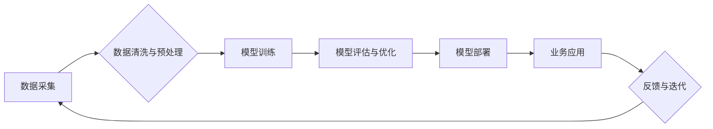

> AI应用主义,中国企业,深度学习,机器学习,数据驱动,业务价值,实践经验,创新驱动

## 1. 背景介绍

人工智能（AI）正以惊人的速度发展，深刻地改变着各行各业。从自动驾驶到医疗诊断，从个性化推荐到金融风险控制，AI技术的应用已遍及各个领域。中国企业在AI领域的应用也取得了显著进展，涌现出许多成功的案例。然而，与发达国家相比，中国企业在AI应用的深度和广度仍有提升空间。

中国企业在AI应用中面临着独特的挑战和机遇。一方面，中国拥有庞大的用户群体和海量数据资源，为AI技术的应用提供了良好的基础。另一方面，中国企业在AI技术研发和人才培养方面仍需加强，需要借鉴国际先进经验，并结合自身实际情况，探索适合中国企业的AI应用模式。

## 2. 核心概念与联系

**2.1 AI应用主义**

AI应用主义是指将人工智能技术应用于实际业务场景，以解决实际问题，创造商业价值的理念和实践。它强调AI技术的落地应用，而非单纯的技术研发。

**2.2 数据驱动**

数据是AI技术的基石。AI应用主义强调数据驱动，即利用海量数据进行训练和优化，提高AI模型的准确性和效率。

**2.3 业务价值**

AI应用主义的核心目标是创造商业价值。企业需要将AI技术应用于关键业务环节，提升效率、降低成本、创造新的商业模式。

**2.4 创新驱动**

AI技术发展迅速，需要不断创新。中国企业需要积极探索新的AI应用场景，推动AI技术的创新发展。

**2.5 流程图**



## 3. 核心算法原理 & 具体操作步骤

**3.1 算法原理概述**

深度学习是AI领域最热门的技术之一，它利用多层神经网络模拟人类大脑的学习过程，能够自动提取数据中的特征，并进行复杂的模式识别和预测。

**3.2 算法步骤详解**

1. **数据准备:** 收集、清洗和预处理数据，将其转换为深度学习模型可以理解的格式。
2. **模型构建:** 选择合适的深度学习模型架构，例如卷积神经网络（CNN）、循环神经网络（RNN）等。
3. **模型训练:** 利用训练数据训练深度学习模型，调整模型参数，使其能够准确地预测目标变量。
4. **模型评估:** 使用测试数据评估模型的性能，例如准确率、召回率、F1-score等。
5. **模型优化:** 根据评估结果，调整模型参数或架构，提高模型性能。
6. **模型部署:** 将训练好的模型部署到实际应用场景中，用于预测或决策。

**3.3 算法优缺点**

**优点:**

* 能够自动提取数据特征，无需人工特征工程。
* 能够处理海量数据，并进行复杂的模式识别。
* 性能优异，在许多领域取得了突破性进展。

**缺点:**

* 训练数据量大，需要大量的计算资源。
* 模型训练时间长，需要较长的训练周期。
* 模型解释性差，难以理解模型的决策过程。

**3.4 算法应用领域**

* **图像识别:** 人脸识别、物体检测、图像分类等。
* **自然语言处理:** 文本分类、情感分析、机器翻译等。
* **语音识别:** 语音转文本、语音助手等。
* **推荐系统:** 商品推荐、内容推荐等。
* **医疗诊断:** 病情预测、疾病诊断等。

## 4. 数学模型和公式 & 详细讲解 & 举例说明

**4.1 数学模型构建**

深度学习模型通常由多层神经网络组成，每层神经网络包含多个神经元。每个神经元接收来自上一层的输入信号，并对其进行线性变换和非线性激活函数处理，输出到下一层神经元。

**4.2 公式推导过程**

深度学习模型的训练过程是通过反向传播算法来实现的。反向传播算法利用梯度下降法来更新模型参数，使得模型的预测结果与真实值之间的误差最小化。

**4.3 案例分析与讲解**

例如，在图像分类任务中，深度学习模型会将图像输入到神经网络中，经过多层神经网络的处理，最终输出每个类别的概率。模型训练的目标是最大化正确分类的概率，最小化错误分类的概率。

**4.4 数学公式**

* **激活函数:**

$$
f(x) = \begin{cases}
  x & \text{if } x > 0 \\
  0 & \text{otherwise}
\end{cases}
$$

* **损失函数:**

$$
L(y, \hat{y}) = \frac{1}{n} \sum_{i=1}^{n} (y_i - \hat{y}_i)^2
$$

* **梯度下降算法:**

$$
\theta = \theta - \alpha \nabla L(\theta)
$$

## 5. 项目实践：代码实例和详细解释说明

**5.1 开发环境搭建**

使用Python语言和深度学习框架TensorFlow或PyTorch搭建开发环境。

**5.2 源代码详细实现**

```python
import tensorflow as tf

# 定义模型架构
model = tf.keras.models.Sequential([
  tf.keras.layers.Conv2D(32, (3, 3), activation='relu', input_shape=(28, 28, 1)),
  tf.keras.layers.MaxPooling2D((2, 2)),
  tf.keras.layers.Conv2D(64, (3, 3), activation='relu'),
  tf.keras.layers.MaxPooling2D((2, 2)),
  tf.keras.layers.Flatten(),
  tf.keras.layers.Dense(10, activation='softmax')
])

# 编译模型
model.compile(optimizer='adam',
              loss='sparse_categorical_crossentropy',
              metrics=['accuracy'])

# 训练模型
model.fit(x_train, y_train, epochs=5)

# 评估模型
loss, accuracy = model.evaluate(x_test, y_test)
print('Test loss:', loss)
print('Test accuracy:', accuracy)
```

**5.3 代码解读与分析**

这段代码定义了一个简单的卷积神经网络模型，用于手写数字识别任务。模型包含两层卷积层、两层池化层、一层全连接层和一层输出层。模型使用Adam优化器、交叉熵损失函数和准确率作为评估指标。

**5.4 运行结果展示**

训练完成后，模型可以用于预测新的手写数字图像。

## 6. 实际应用场景

**6.1 智能客服**

利用自然语言处理技术，构建智能客服系统，自动回复用户咨询，提高客户服务效率。

**6.2 营销精准化**

利用用户数据分析，进行精准营销，提高营销效果。

**6.3 欺诈检测**

利用机器学习算法，识别和预防欺诈行为。

**6.4 医疗辅助诊断**

利用深度学习模型，辅助医生进行疾病诊断，提高诊断准确率。

**6.5 未来应用展望**

AI技术将继续发展，在更多领域得到应用，例如自动驾驶、机器人、个性化教育等。

## 7. 工具和资源推荐

**7.1 学习资源推荐**

* **在线课程:** Coursera、edX、Udacity等平台提供丰富的AI课程。
* **书籍:** 《深度学习》、《机器学习实战》等书籍。
* **开源项目:** TensorFlow、PyTorch等开源深度学习框架。

**7.2 开发工具推荐**

* **Python:** 广泛应用于AI开发的编程语言。
* **TensorFlow:** Google开发的开源深度学习框架。
* **PyTorch:** Facebook开发的开源深度学习框架。

**7.3 相关论文推荐**

* **《ImageNet Classification with Deep Convolutional Neural Networks》**
* **《Attention Is All You Need》**
* **《BERT: Pre-training of Deep Bidirectional Transformers for Language Understanding》**

## 8. 总结：未来发展趋势与挑战

**8.1 研究成果总结**

近年来，AI技术取得了显著进展，在图像识别、自然语言处理、语音识别等领域取得了突破性进展。

**8.2 未来发展趋势**

* **模型规模化:** 模型规模将继续扩大，训练数据量将继续增加。
* **算法创新:** 新的AI算法将不断涌现，例如强化学习、联邦学习等。
* **边缘计算:** AI模型将部署到边缘设备，实现更低延迟和更高效率的应用。

**8.3 面临的挑战**

* **数据安全:** AI模型训练需要大量数据，数据安全问题需要得到重视。
* **算法可解释性:** AI模型的决策过程难以理解，需要提高算法的可解释性。
* **伦理问题:** AI技术应用需要考虑伦理问题，避免造成社会负面影响。

**8.4 研究展望**

未来，AI技术将继续发展，在更多领域得到应用，为人类社会带来更多福祉。

## 9. 附录：常见问题与解答

**9.1 如何选择合适的深度学习模型？**

选择合适的深度学习模型需要根据具体的应用场景和数据特点进行选择。

**9.2 如何处理数据不平衡问题？**

数据不平衡问题可以通过数据增强、权重调整等方法进行解决。

**9.3 如何评估深度学习模型的性能？**

深度学习模型的性能可以通过准确率、召回率、F1-score等指标进行评估。


作者：禅与计算机程序设计艺术 / Zen and the Art of Computer Programming 
<end_of_turn>