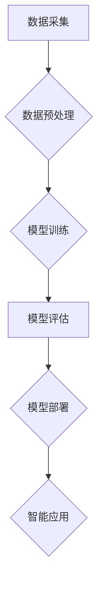

> 人工智能，机器学习，深度学习，自然语言处理，计算机视觉，行业应用，未来趋势

## 1. 背景介绍

人工智能（Artificial Intelligence，AI）作为一门跨学科研究领域，旨在创建能够像人类一样思考、学习和解决问题智能机器。近年来，随着计算能力的飞速发展和海量数据的积累，人工智能技术取得了长足进步，并开始广泛应用于各个行业，深刻地改变着人们的生活和工作方式。

### 1.1 人工智能的发展历程

人工智能的发展历程可以追溯到20世纪50年代，早期的人工智能研究主要集中在规则式人工智能，即通过预先定义的规则和知识库来实现智能行为。随着计算机科学和数学理论的发展，机器学习和深度学习等新兴人工智能技术应运而生，并取得了突破性的进展。

### 1.2 人工智能技术的主要分支

人工智能技术涵盖多个分支领域，主要包括：

* **机器学习（Machine Learning，ML）：** 允许计算机从数据中学习，并根据学习到的知识进行预测或决策。
* **深度学习（Deep Learning，DL）：** 基于多层神经网络的机器学习方法，能够学习更复杂的特征和模式。
* **自然语言处理（Natural Language Processing，NLP）：** 使计算机能够理解和处理人类语言，包括文本分析、机器翻译、语音识别等。
* **计算机视觉（Computer Vision，CV）：** 赋予计算机“看”的能力，能够识别图像、视频和物体。
* **机器人学（Robotics）：** 研究和开发能够执行复杂任务的机器人。

## 2. 核心概念与联系

人工智能的核心概念是模拟人类智能，通过算法和数据驱动模型来实现智能行为。

**Mermaid 流程图：**



## 3. 核心算法原理 & 具体操作步骤

### 3.1  算法原理概述

机器学习算法的核心原理是通过学习数据中的模式和规律，建立数学模型来预测或决策。常见的机器学习算法包括：

* **监督学习（Supervised Learning）：** 利用标记数据训练模型，例如分类和回归问题。
* **无监督学习（Unsupervised Learning）：** 从未标记数据中发现模式和结构，例如聚类和降维。
* **强化学习（Reinforcement Learning）：** 通过试错学习，在环境中获得最大奖励。

### 3.2  算法步骤详解

**以监督学习为例，其基本步骤如下：**

1. **数据收集和预处理：** 收集相关数据，并进行清洗、转换和特征工程等预处理操作。
2. **模型选择：** 根据具体问题选择合适的机器学习算法模型。
3. **模型训练：** 利用训练数据训练模型，调整模型参数以最小化预测误差。
4. **模型评估：** 利用测试数据评估模型的性能，例如准确率、召回率和F1-score等指标。
5. **模型部署：** 将训练好的模型部署到实际应用场景中，用于预测或决策。

### 3.3  算法优缺点

不同的机器学习算法具有不同的优缺点，需要根据具体问题选择合适的算法。

* **线性回归：** 简单易懂，但对非线性关系的拟合能力有限。
* **逻辑回归：** 用于分类问题，但对高维数据容易过拟合。
* **决策树：** 可解释性强，但容易产生过拟合。
* **支持向量机：** 对高维数据具有较好的泛化能力，但训练时间较长。
* **神经网络：** 能够学习复杂非线性关系，但训练数据量大，参数众多，容易过拟合。

### 3.4  算法应用领域

机器学习算法广泛应用于各个领域，例如：

* **医疗保健：** 疾病诊断、药物研发、患者风险评估。
* **金融服务：** 欺诈检测、信用评分、投资决策。
* **电商：** 商品推荐、用户画像、价格预测。
* **制造业：** 质量控制、设备故障预测、生产优化。
* **交通运输：** 自动驾驶、交通流量预测、物流优化。

## 4. 数学模型和公式 & 详细讲解 & 举例说明

### 4.1  数学模型构建

机器学习算法的核心是数学模型，通过学习数据中的模式和规律，建立数学模型来预测或决策。常见的数学模型包括线性回归模型、逻辑回归模型、决策树模型、支持向量机模型和神经网络模型等。

### 4.2  公式推导过程

以线性回归模型为例，其目标是找到一条直线，使得预测值与真实值之间的误差最小。

**线性回归模型公式：**

$$y = w_0 + w_1x_1 + w_2x_2 + ... + w_nx_n$$

其中：

* $y$ 是预测值
* $w_0, w_1, w_2, ..., w_n$ 是模型参数
* $x_1, x_2, ..., x_n$ 是输入特征

**损失函数：**

$$J(w) = \frac{1}{2}\sum_{i=1}^{m}(y_i - \hat{y}_i)^2$$

其中：

* $J(w)$ 是损失函数
* $m$ 是样本数量
* $y_i$ 是真实值
* $\hat{y}_i$ 是预测值

**梯度下降算法：**

$$w_{j} = w_{j} - \alpha \frac{\partial J(w)}{\partial w_{j}}$$

其中：

* $\alpha$ 是学习率

### 4.3  案例分析与讲解

假设我们想要预测房屋价格，输入特征包括房屋面积、房间数量、地理位置等。我们可以使用线性回归模型来建立房屋价格预测模型。

通过训练数据，模型会学习到房屋价格与输入特征之间的关系，并找到最佳的模型参数。然后，我们可以使用训练好的模型来预测新房子的价格。

## 5. 项目实践：代码实例和详细解释说明

### 5.1  开发环境搭建

* Python 3.x
* Jupyter Notebook
* scikit-learn

### 5.2  源代码详细实现

```python
from sklearn.linear_model import LinearRegression
from sklearn.model_selection import train_test_split
from sklearn.metrics import mean_squared_error

# 加载数据
data = ...

# 分割数据
X_train, X_test, y_train, y_test = train_test_split(data.drop('price', axis=1), data['price'], test_size=0.2)

# 创建线性回归模型
model = LinearRegression()

# 训练模型
model.fit(X_train, y_train)

# 预测测试数据
y_pred = model.predict(X_test)

# 计算模型性能
mse = mean_squared_error(y_test, y_pred)
print(f'Mean Squared Error: {mse}')
```

### 5.3  代码解读与分析

* 使用 `train_test_split` 函数将数据分为训练集和测试集。
* 使用 `LinearRegression` 类创建线性回归模型。
* 使用 `fit` 方法训练模型。
* 使用 `predict` 方法预测测试数据。
* 使用 `mean_squared_error` 函数计算模型性能。

### 5.4  运行结果展示

运行代码后，会输出模型的均方误差值，用于评估模型的预测精度。

## 6. 实际应用场景

### 6.1  医疗保健

* **疾病诊断：** 利用机器学习算法分析患者的医疗影像、病历和基因信息，辅助医生诊断疾病。
* **药物研发：** 通过分析大量药物数据，预测药物的疗效和安全性，加速药物研发过程。
* **患者风险评估：** 根据患者的医疗历史和生活方式，预测患者患病风险，进行个性化预防和治疗。

### 6.2  金融服务

* **欺诈检测：** 利用机器学习算法分析交易数据，识别异常交易行为，防止金融欺诈。
* **信用评分：** 根据客户的信用历史和财务状况，评估客户的信用风险，为贷款和保险提供参考。
* **投资决策：** 利用机器学习算法分析市场数据，预测股票价格和投资回报率，辅助投资决策。

### 6.3  电商

* **商品推荐：** 根据用户的购买历史和浏览记录，推荐用户可能感兴趣的商品。
* **用户画像：** 利用机器学习算法分析用户的行为数据，构建用户画像，进行精准营销。
* **价格预测：** 利用机器学习算法分析市场数据，预测商品价格走势，制定合理的定价策略。

### 6.4  未来应用展望

人工智能技术的发展将继续推动各行各业的数字化转型，未来将有更多新的应用场景出现，例如：

* **自动驾驶：** 利用人工智能技术实现车辆自动驾驶，提高交通安全和效率。
* **个性化教育：** 利用人工智能技术提供个性化的学习方案，提高教育效率。
* **智能客服：** 利用人工智能技术开发智能客服机器人，提供24小时在线服务。

## 7. 工具和资源推荐

### 7.1  学习资源推荐

* **在线课程：** Coursera、edX、Udacity 等平台提供丰富的机器学习和深度学习课程。
* **书籍：** 《深入理解机器学习》、《深度学习》等书籍是机器学习和深度学习的经典教材。
* **博客和论坛：** 机器学习和深度学习领域的博客和论坛可以获取最新的研究成果和技术分享。

### 7.2  开发工具推荐

* **Python：** 机器学习和深度学习的常用编程语言。
* **scikit-learn：** Python机器学习库，提供各种机器学习算法和工具。
* **TensorFlow：** Google开发的开源深度学习框架。
* **PyTorch：** Facebook开发的开源深度学习框架。

### 7.3  相关论文推荐

* **《ImageNet Classification with Deep Convolutional Neural Networks》**
* **《Attention Is All You Need》**
* **《Generative Adversarial Networks》**

## 8. 总结：未来发展趋势与挑战

### 8.1  研究成果总结

近年来，人工智能技术取得了长足进步，在各个领域都取得了显著的应用成果。

### 8.2  未来发展趋势

* **模型规模和复杂度提升：** 未来人工智能模型将更加庞大复杂，能够学习更复杂的知识和模式。
* **跨模态学习：** 人工智能将能够处理多种模态数据，例如文本、图像、音频和视频，实现更全面的理解和交互。
* **边缘计算和联邦学习：** 人工智能将更加注重数据隐私和安全，边缘计算和联邦学习将成为主流的部署方式。

### 8.3  面临的挑战

* **数据获取和隐私保护：** 人工智能算法依赖于大量数据，如何获取高质量数据并保护数据隐私是一个重要挑战。
* **算法可解释性和信任度：** 许多人工智能算法是黑箱模型，难以解释其决策过程，如何提高算法的可解释性和信任度是一个关键问题。
* **伦理和社会影响：** 人工智能技术的发展可能带来伦理和社会问题，例如就业替代、算法偏见等，需要认真思考和应对。

### 8.4  研究展望

未来人工智能研究将继续探索更智能、更安全、更可解释的人工智能系统，并将其应用于更多领域，为人类社会带来更多福祉。

## 9. 附录：常见问题与解答

### 9.1  什么是机器学习？

机器学习是一种人工智能技术，通过学习数据中的模式和规律，建立数学模型来预测或决策。

### 9.2  什么是深度学习？

深度学习是一种基于多层神经网络的机器学习方法，能够学习更复杂的特征和模式。

### 9.3  如何选择合适的机器学习算法？

选择合适的机器学习算法需要根据具体问题和数据特点进行选择。

### 9.4  如何评估机器学习模型