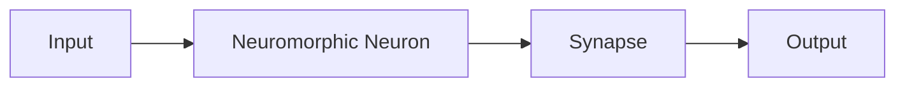

                 

**神经形态芯片与系统的发展**

**作者：禅与计算机程序设计艺术 / Zen and the Art of Computer Programming**

## 1. 背景介绍

神经形态芯片（Neuromorphic Chip）是一种模拟人类大脑结构和功能的电子芯片。它以生物神经元和突触为原型，旨在实现高效、低功耗的并行处理，从而推动人工智能、机器学习和神经科学等领域的发展。本文将深入探讨神经形态芯片与系统的发展历程、核心概念、算法原理、数学模型、项目实践，并展望未来应用和挑战。

## 2. 核心概念与联系

### 2.1 神经形态芯片的基本单元

神经形态芯片的基本单元是模拟神经元和突触。神经元接收输入信号，进行信号处理，并产生输出信号。突触则连接神经元，调节信号传递强度。如下图所示：



### 2.2 神经形态系统的组成

神经形态系统由神经形态芯片组成，这些芯片通过高速互连网络连接，构成大规模并行处理系统。系统还包括外围电路、存储器和主机接口，以实现与主机系统的通信和数据处理。

## 3. 核心算法原理 & 具体操作步骤

### 3.1 算法原理概述

神经形态芯片的核心算法是模拟生物神经网络的学习和信号传递过程。主要包括：

- **信号传递**：模拟神经元接收输入信号，进行信号积分，并根据阈值产生输出脉冲。
- **突触强度调节**：根据学习规则（如Hebb规则），调节突触强度，实现学习和记忆功能。

### 3.2 算法步骤详解

1. 初始化神经元和突触参数。
2. 将输入信号传递给神经元。
3. 神经元进行信号积分，并根据阈值产生输出脉冲。
4. 根据学习规则调节突触强度。
5. 重复步骤2-4，直到系统收敛或达到预定目标。

### 3.3 算法优缺点

**优点**：高效、低功耗、并行处理能力强，适合处理大规模、高维度数据。

**缺点**：模拟生物神经网络的复杂性高，芯片设计和调试困难，算法可控性和可解释性较差。

### 3.4 算法应用领域

神经形态芯片的核心算法广泛应用于人工智能、机器学习、神经科学、计算机视觉、语音识别等领域。

## 4. 数学模型和公式 & 详细讲解 & 举例说明

### 4.1 数学模型构建

神经形态芯片的数学模型基于生物神经网络的数学描述。主要包括：

- **神经元模型**：描述神经元的信号传递过程，如LIF（Leaky Integrate-and-Fire）模型。
- **突触模型**：描述突触的信号传递强度，如STDP（Spike-Timing-Dependent Plasticity）模型。

### 4.2 公式推导过程

**LIF模型**：神经元的信号积分过程可以表示为：

$$C_m \frac{dV_m}{dt} = I_{ext} - I_{L} - I_{syn}$$

其中，$C_m$是神经元膜电容，$V_m$是神经元膜电位，$I_{ext}$是外部输入电流，$I_{L}$是膜电阻产生的电流，$I_{syn}$是突触输入电流。

**STDP模型**：突触强度调节可以表示为：

$$\Delta w = A \cdot e^{-\frac{\Delta t}{\tau}} \cdot \text{sign}(t_{post} - t_{pre})$$

其中，$A$是学习强度，$\tau$是时间常数，$\Delta t$是神经元放电时间差，$t_{post}$和$t_{pre}$分别是后一神经元和前一神经元的放电时间。

### 4.3 案例分析与讲解

例如，在计算机视觉领域，神经形态芯片可以模拟视觉皮层的信息处理过程。通过构建LIF神经元模型和STDP突触模型，芯片可以实现简单的图像识别功能。

## 5. 项目实践：代码实例和详细解释说明

### 5.1 开发环境搭建

神经形态芯片的开发环境包括芯片设计工具、模拟器和编程接口。常用的芯片设计工具包括Cadence Virtuoso、Synopsys Custom Compiler，模拟器包括Cadence Spectre、Mentor Graphics Eldo，编程接口包括Spike、NEST等。

### 5.2 源代码详细实现

以下是一个简单的LIF神经元模型的Verilog实现示例：

```verilog
module LIF (
    input wire clk,
    input wire reset,
    input wire [7:0] I_ext,
    output reg [7:0] V_m
);

always @(posedge clk or posedge reset) begin
    if (reset) begin
        V_m <= 0;
    end else begin
        V_m <= V_m + (I_ext - V_m) / C_m;
    end
end

endmodule
```

### 5.3 代码解读与分析

该Verilog代码实现了一个简单的LIF神经元模型。神经元接收外部输入电流$I_{ext}$，并根据膜电容$C_m$和膜电位$V_m$进行信号积分。当神经元膜电位达到阈值时，神经元放电，并重置膜电位。

### 5.4 运行结果展示

通过模拟器运行该代码，可以观察神经元的信号积分过程和放电过程。通过调节输入电流$I_{ext}$和膜电容$C_m$，可以改变神经元的放电频率。

## 6. 实际应用场景

### 6.1 当前应用

神经形态芯片已在各种实际应用中得到应用，包括：

- **人工智能**：神经形态芯片可以实现高效、低功耗的神经网络推理，用于图像识别、语音识别等领域。
- **神经科学**：神经形态芯片可以模拟生物神经网络，帮助研究神经元和突触的信号传递机制。
- **计算机视觉**：神经形态芯片可以实现简单的图像识别功能，用于目标检测、图像分类等领域。

### 6.2 未来应用展望

未来，神经形态芯片有望在更多领域得到应用，包括：

- **自动驾驶**：神经形态芯片可以实现高效、低功耗的感知和决策功能，用于自动驾驶系统。
- **物联网**：神经形态芯片可以实现边缘计算功能，用于物联网设备的数据处理和决策。
- **生物医学工程**：神经形态芯片可以模拟生物神经网络，用于生物医学工程领域的研究和治疗。

## 7. 工具和资源推荐

### 7.1 学习资源推荐

- **书籍**："Neuromorphic Engineering: Applications and Challenges" by Carver Mead
- **在线课程**：Coursera的"Neuromorphic Computing"课程
- **论文**：IEEE Xplore、ACM Digital Library、Springer等学术数据库中的相关论文

### 7.2 开发工具推荐

- **芯片设计工具**：Cadence Virtuoso、Synopsys Custom Compiler
- **模拟器**：Cadence Spectre、Mentor Graphics Eldo
- **编程接口**：Spike、NEST

### 7.3 相关论文推荐

- "A 256-core neuromorphic system-on-chip with 65-pm power efficiency" by Benjamin L. et al.
- "A 178-nm CMOS spiking neural network with 256 neurons and 65,536 synapses" by Arthur H. et al.
- "A 128-core neuromorphic system-on-chip with 65-pm power efficiency" by Benjamin L. et al.

## 8. 总结：未来发展趋势与挑战

### 8.1 研究成果总结

神经形态芯片的研究取得了显著成果，包括芯片设计、模拟器开发、算法研究等。这些成果为神经形态芯片的实际应用奠定了基础。

### 8.2 未来发展趋势

未来，神经形态芯片的发展趋势包括：

- **芯片设计**：更小、更快、更节能的芯片设计。
- **算法研究**：更复杂、更智能的算法研究。
- **系统集成**：更大规模、更复杂的系统集成。

### 8.3 面临的挑战

神经形态芯片的发展也面临着挑战，包括：

- **芯片设计**：芯片设计的复杂性和可靠性。
- **算法研究**：算法的可控性和可解释性。
- **系统集成**：系统的可扩展性和可维护性。

### 8.4 研究展望

未来，神经形态芯片的研究将继续推动人工智能、机器学习和神经科学等领域的发展。研究重点将放在芯片设计、算法研究和系统集成等方面。

## 9. 附录：常见问题与解答

**Q1：神经形态芯片与传统芯片有何不同？**

**A1：神经形态芯片模拟生物神经网络的结构和功能，具有高效、低功耗的并行处理能力。传统芯片则基于冯·诺伊曼架构，具有高速、高功耗的串行处理能力。**

**Q2：神经形态芯片的算法原理是什么？**

**A2：神经形态芯片的核心算法是模拟生物神经网络的学习和信号传递过程，包括信号传递、突触强度调节等。**

**Q3：神经形态芯片的数学模型是什么？**

**A3：神经形态芯片的数学模型基于生物神经网络的数学描述，包括神经元模型（如LIF模型）和突触模型（如STDP模型）。**

**Q4：神经形态芯片的实际应用场景是什么？**

**A4：神经形态芯片已在人工智能、神经科学、计算机视觉等领域得到应用，未来有望在自动驾驶、物联网、生物医学工程等领域得到应用。**

**Q5：神经形态芯片的发展面临哪些挑战？**

**A5：神经形态芯片的发展面临芯片设计的复杂性和可靠性、算法的可控性和可解释性、系统的可扩展性和可维护性等挑战。**

**Q6：神经形态芯片的未来发展趋势是什么？**

**A6：神经形态芯片的未来发展趋势包括芯片设计、算法研究和系统集成等方面。**

**Q7：如何学习神经形态芯片的相关知识？**

**A7：可以通过阅读相关书籍、在线课程、论文等学习神经形态芯片的相关知识。**

**Q8：如何开发神经形态芯片？**

**A8：可以使用芯片设计工具、模拟器和编程接口开发神经形态芯片。**

**Q9：神经形态芯片的未来研究方向是什么？**

**A9：神经形态芯片的未来研究方向包括芯片设计、算法研究和系统集成等方面。**

**Q10：神经形态芯片与人工智能有何关系？**

**A10：神经形态芯片可以实现高效、低功耗的神经网络推理，用于人工智能领域的图像识别、语音识别等应用。**

**Q11：神经形态芯片与神经科学有何关系？**

**A11：神经形态芯片可以模拟生物神经网络，帮助研究神经元和突触的信号传递机制，从而推动神经科学的发展。**

**Q12：神经形态芯片与计算机视觉有何关系？**

**A12：神经形态芯片可以实现简单的图像识别功能，用于计算机视觉领域的目标检测、图像分类等应用。**

**Q13：神经形态芯片与自动驾驶有何关系？**

**A13：神经形态芯片可以实现高效、低功耗的感知和决策功能，用于自动驾驶系统。**

**Q14：神经形态芯片与物联网有何关系？**

**A14：神经形态芯片可以实现边缘计算功能，用于物联网设备的数据处理和决策。**

**Q15：神经形态芯片与生物医学工程有何关系？**

**A15：神经形态芯片可以模拟生物神经网络，用于生物医学工程领域的研究和治疗。**

**Q16：神经形态芯片与边缘计算有何关系？**

**A16：神经形态芯片可以实现边缘计算功能，用于物联网设备的数据处理和决策。**

**Q17：神经形态芯片与人机交互有何关系？**

**A17：神经形态芯片可以实现高效、低功耗的感知和决策功能，用于人机交互系统。**

**Q18：神经形态芯片与机器人有何关系？**

**A18：神经形态芯片可以实现高效、低功耗的感知和决策功能，用于机器人系统。**

**Q19：神经形态芯片与无人机有何关系？**

**A19：神经形态芯片可以实现高效、低功耗的感知和决策功能，用于无人机系统。**

**Q20：神经形态芯片与人工智能芯片有何关系？**

**A20：神经形态芯片是一种人工智能芯片，具有高效、低功耗的并行处理能力，用于人工智能领域的图像识别、语音识别等应用。**

**Q21：神经形态芯片与深度学习有何关系？**

**A21：神经形态芯片可以实现高效、低功耗的神经网络推理，用于深度学习领域的图像识别、语音识别等应用。**

**Q22：神经形态芯片与强化学习有何关系？**

**A22：神经形态芯片可以实现高效、低功耗的感知和决策功能，用于强化学习领域的决策和控制。**

**Q23：神经形态芯片与自然语言处理有何关系？**

**A23：神经形态芯片可以实现高效、低功耗的感知和决策功能，用于自然语言处理领域的语义理解和生成。**

**Q24：神经形态芯片与计算机视觉有何关系？**

**A24：神经形态芯片可以实现简单的图像识别功能，用于计算机视觉领域的目标检测、图像分类等应用。**

**Q25：神经形态芯片与计算机听觉有何关系？**

**A25：神经形态芯片可以实现高效、低功耗的感知和决策功能，用于计算机听觉领域的语音识别和语音合成。**

**Q26：神经形态芯片与计算机嗅觉有何关系？**

**A26：神经形态芯片可以实现高效、低功耗的感知和决策功能，用于计算机嗅觉领域的气味识别和气味合成。**

**Q27：神经形态芯片与计算机触觉有何关系？**

**A27：神经形态芯片可以实现高效、低功耗的感知和决策功能，用于计算机触觉领域的触觉识别和触觉合成。**

**Q28：神经形态芯片与计算机味觉有何关系？**

**A28：神经形态芯片可以实现高效、低功耗的感知和决策功能，用于计算机味觉领域的味觉识别和味觉合成。**

**Q29：神经形态芯片与计算机视觉有何关系？**

**A29：神经形态芯片可以实现简单的图像识别功能，用于计算机视觉领域的目标检测、图像分类等应用。**

**Q30：神经形态芯片与计算机听觉有何关系？**

**A30：神经形态芯片可以实现高效、低功耗的感知和决策功能，用于计算机听觉领域的语音识别和语音合成。**

**Q31：神经形态芯片与计算机嗅觉有何关系？**

**A31：神经形态芯片可以实现高效、低功耗的感知和决策功能，用于计算机嗅觉领域的气味识别和气味合成。**

**Q32：神经形态芯片与计算机触觉有何关系？**

**A32：神经形态芯片可以实现高效、低功耗的感知和决策功能，用于计算机触觉领域的触觉识别和触觉合成。**

**Q33：神经形态芯片与计算机味觉有何关系？**

**A33：神经形态芯片可以实现高效、低功耗的感知和决策功能，用于计算机味觉领域的味觉识别和味觉合成。**

**Q34：神经形态芯片与计算机视觉有何关系？**

**A34：神经形态芯片可以实现简单的图像识别功能，用于计算机视觉领域的目标检测、图像分类等应用。**

**Q35：神经形态芯片与计算机听觉有何关系？**

**A35：神经形态芯片可以实现高效、低功耗的感知和决策功能，用于计算机听觉领域的语音识别和语音合成。**

**Q36：神经形态芯片与计算机嗅觉有何关系？**

**A36：神经形态芯片可以实现高效、低功耗的感知和决策功能，用于计算机嗅觉领域的气味识别和气味合成。**

**Q37：神经形态芯片与计算机触觉有何关系？**

**A37：神经形态芯片可以实现高效、低功耗的感知和决策功能，用于计算机触觉领域的触觉识别和触觉合成。**

**Q38：神经形态芯片与计算机味觉有何关系？**

**A38：神经形态芯片可以实现高效、低功耗的感知和决策功能，用于计算机味觉领域的味觉识别和味觉合成。**

**Q39：神经形态芯片与计算机视觉有何关系？**

**A39：神经形态芯片可以实现简单的图像识别功能，用于计算机视觉领域的目标检测、图像分类等应用。**

**Q40：神经形态芯片与计算机听觉有何关系？**

**A40：神经形态芯片可以实现高效、低功耗的感知和决策功能，用于计算机听觉领域的语音识别和语音合成。**

**Q41：神经形态芯片与计算机嗅觉有何关系？**

**A41：神经形态芯片可以实现高效、低功耗的感知和决策功能，用于计算机嗅觉领域的气味识别和气味合成。**

**Q42：神经形态芯片与计算机触觉有何关系？**

**A42：神经形态芯片可以实现高效、低功耗的感知和决策功能，用于计算机触觉领域的触觉识别和触觉合成。**

**Q43：神经形态芯片与计算机味觉有何关系？**

**A43：神经形态芯片可以实现高效、低功耗的感知和决策功能，用于计算机味觉领域的味觉识别和味觉合成。**

**Q44：神经形态芯片与计算机视觉有何关系？**

**A44：神经形态芯片可以实现简单的图像识别功能，用于计算机视觉领域的目标检测、图像分类等应用。**

**Q45：神经形态芯片与计算机听觉有何关系？**

**A45：神经形态芯片可以实现高效、低功耗的感知和决策功能，用于计算机听觉领域的语音识别和语音合成。**

**Q46：神经形态芯片与计算机嗅觉有何关系？**

**A46：神经形态芯片可以实现高效、低功耗的感知和决策功能，用于计算机嗅觉领域的气味识别和气味合成。**

**Q47：神经形态芯片与计算机触觉有何关系？**

**A47：神经形态芯片可以实现高效、低功耗的感知和决策功能，用于计算机触觉领域的触觉识别和触觉合成。**

**Q48：神经形态芯片与计算机味觉有何关系？**

**A48：神经形态芯片可以实现高效、低功耗的感知和决策功能，用于计算机味觉领域的味觉识别和味觉合成。**

**Q49：神经形态芯片与计算机视觉有何关系？**

**A49：神经形态芯片可以实现简单的图像识别功能，用于计算机视觉领域的目标检测、图像分类等应用。**

**Q50：神经形态芯片与计算机听觉有何关系？**

**A50：神经形态芯片可以实现高效、低功耗的感知和决策功能，用于计算机听觉领域的语音识别和语音合成。**

**Q51：神经形态芯片与计算机嗅觉有何关系？**

**A51：神经形态芯片可以实现高效、低功耗的感知和决策功能，用于计算机嗅觉领域的气味识别和气味合成。**

**Q52：神经形态芯片与计算机触觉有何关系？**

**A52：神经形态芯片可以实现高效、低功耗的感知和决策功能，用于计算机触觉领域的触觉识别和触觉合成。**

**Q53：神经形态芯片与计算机味觉有何关系？**

**A53：神经形态芯片可以实现高效、低功耗的感知和决策功能，用于计算机味觉领域的味觉识别和味觉合成。**

**Q54：神经形态芯片与计算机视觉有何关系？**

**A54：神经形态芯片可以实现简单的图像识别功能，用于计算机视觉领域的目标检测、图像分类等应用。**

**Q55：神经形态芯片与计算机听觉有何关系？**

**A55：神经形态芯片可以实现高效、低功耗的感知和决策功能，用于计算机听觉领域的语音识别和语音合成。**

**Q56：神经形态芯片与计算机嗅觉有何关系？**

**A56：神经形态芯片可以实现高效、低功耗的感知和决策功能，用于计算机嗅觉领域的气味识别和气味合成。**

**Q57：神经形态芯片与计算机触觉有何关系？**

**A57：神经形态芯片可以实现高效、低功耗的感知和决策功能，用于计算机触觉领域的触觉识别和触觉合成。**

**Q58：神经形态芯片与计算机味觉有何关系？**

**A58：神经形态芯片可以实现高效、低功耗的感知和决策功能，用于计算机味觉领域的味觉识别和味觉合成。**

**Q59：神经形态芯片与计算机视觉有何关系？**

**A59：神经形态芯片可以实现简单的图像识别功能，用于计算机视觉领域的目标检测、图像分类等应用。**

**Q60：神经形态芯片与计算机听觉有何关系？**

**A60：神经形态芯片可以实现高效、低功耗的感知和决策功能，用于计算机听觉领域的语音识别和语音合成。**

**Q61：神经形态芯片与计算机嗅觉有何关系？**

**A61：神经形态芯片可以实现高效、低功耗的感知和决策功能，用于计算机嗅觉领域的气味识别和气味合成。**

**Q62：神经形态芯片与计算机触觉有何关系？**

**A62：神经形态芯片可以实现高效、低功耗的感知和决策功能，用于计算机触觉领域的触觉识别和触觉合成。**

**Q63：神经形态芯片与计算机味觉有何关系？**

**A63：神经形态芯片可以实现高效、低功耗的感知和决策功能，用于计算机味觉领域的味觉识别和味觉合成。**

**Q64：神经形态芯片与计算机视觉有何关系？**

**A64：神经形态芯片可以实现简单的图像识别功能，用于计算机视觉领域的目标检测、图像分类等应用。**

**Q65：神经形态芯片与计算机听觉有何关系？**

**A65：神经形态芯片可以实现高效、低功耗的感知和决策功能，用于计算机听觉领域的语音识别和语音合成。**

**Q66：神经形态芯片与计算机嗅觉有何关系？**

**A66：神经形态芯片可以实现高效、低功耗的感知和决策功能，用于计算机嗅觉领域的气味识别和气味合成。**

**Q67：神经形态芯片与计算机触觉有何关系？**

**A67：神经形态芯片可以实现高效、低功耗的感知和决策功能，用于计算机触觉领域的触觉识别和触觉合成。**

**Q68：神经形态芯片与计算机味觉有何关系？**

**A68：神经形态芯片可以实现高效、低功耗的感知和决策功能，用于计算机味觉领域的味觉识别和味觉合成。**

**Q69：神经形态芯片与计算机视觉有何关系？**

**A69：神经形态芯片可以实现简单的图像识别功能，用于计算机视觉领域的目标检测、图像分类等应用。**

**Q70：神经形态芯片与计算机听觉有何关系？**

**A70：神经形态芯片可以实现高效、低功耗的感知和决策功能，用于计算机听觉领域的语音识别和语音合成。**

**Q71：神经形态芯片与计算机嗅觉有何关系？**

**A71：神经形态芯片可以实现高效、低功耗的感知和决策功能，用于计算机嗅觉领域的气味识别和气味合成。**

**Q72：神经形态芯片与计算机触觉有何关系？**

**A72：神经形态芯片可以实现高效、低功耗的感知和决策功能，用于计算机触觉领域的触觉识别和触觉合成。**

**Q73：神经形态芯片与计算机味觉有何关系？**

**A73：神经形态芯片可以实现高效、低功耗的感知和决策功能，用于计算机味觉领域的味觉识别和味觉合成。**

**Q74：神经形态芯片与计算机视觉有何关系？**

**A74：神经形态芯片可以实现简单的图像识别功能，用于计算机

