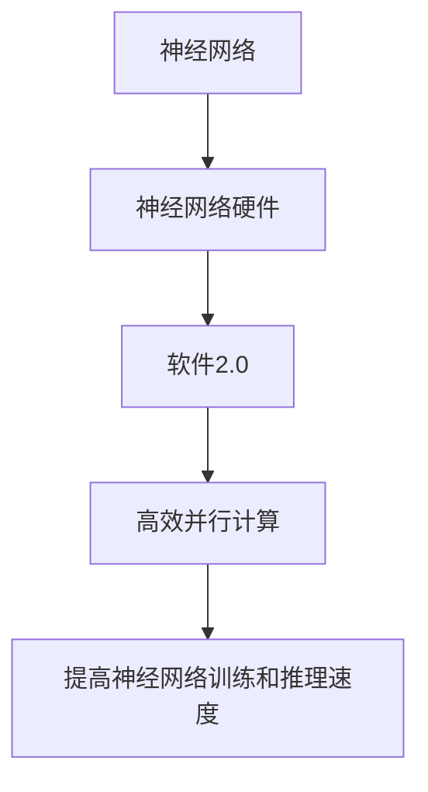

                 

**神经网络硬件:软件2.0的运行环境**

**作者：禅与计算机程序设计艺术 / Zen and the Art of Computer Programming**

## 1. 背景介绍

随着深度学习的兴起，神经网络的规模和复杂性也在不断增加。传统的CPU和GPU已经无法满足这些需求，因此，开发专门为神经网络设计的硬件变得至关重要。本文将深入探讨神经网络硬件，展示其作为软件2.0运行环境的重要性。

## 2. 核心概念与联系

### 2.1 核心概念

- **神经网络（Neural Network）**：一种模拟人类大脑神经元网络的计算模型。
- **神经网络硬件（Neural Network Hardware）**：专门为神经网络设计的硬件架构。
- **软件2.0（Software 2.0）**：一种新型软件架构，将计算任务映射到硬件上，实现高效计算。

### 2.2 核心概念联系

神经网络硬件是软件2.0的关键组成部分，它提供了一个高效的运行环境，能够满足神经网络计算的需求。软件2.0通过将计算任务映射到神经网络硬件上，实现了高效的并行计算，从而提高了神经网络的训练和推理速度。



## 3. 核心算法原理 & 具体操作步骤

### 3.1 算法原理概述

神经网络硬件通常基于以下几种架构：

- **数字电路（Digital Circuits）**：使用数字电路实现神经网络的计算，具有高精度和低功耗的优点。
- **模拟电路（Analog Circuits）**：使用模拟电路实现神经网络的计算，具有高速度和低功耗的优点。
- **混合电路（Hybrid Circuits）**：结合数字电路和模拟电路的优点，实现神经网络的计算。

### 3.2 算法步骤详解

1. **设计神经网络硬件架构**：根据神经网络的需求，设计合适的硬件架构。
2. **实现神经网络算子**：在硬件上实现神经网络的基本算子，如加法、乘法、激活函数等。
3. **优化硬件架构**：通过调整硬件参数，优化神经网络硬件的性能。
4. **集成软件2.0**：将神经网络硬件集成到软件2.0中，实现高效的并行计算。

### 3.3 算法优缺点

**优点**：

- 提高了神经网络的训练和推理速度。
- 降低了功耗，提高了能效比。
- 可以实现更大规模和更复杂的神经网络。

**缺点**：

- 设计和制造神经网络硬件的成本高昂。
- 硬件的可编程性和灵活性有限。
- 硬件的更新和迭代速度慢于软件。

### 3.4 算法应用领域

神经网络硬件广泛应用于计算机视觉、自然语言处理、机器人控制等领域。它还可以应用于边缘计算和物联网领域，实现实时的神经网络计算。

## 4. 数学模型和公式 & 详细讲解 & 举例说明

### 4.1 数学模型构建

神经网络硬件的数学模型通常基于线性代数和微积分。神经网络的计算可以表示为矩阵乘法和激活函数的组合。

### 4.2 公式推导过程

神经网络的前向传播过程可以表示为：

$$y = f(wx + b)$$

其中，$x$是输入向量，$w$是权重矩阵，$b$是偏置向量，$f$是激活函数，$y$是输出向量。

### 4.3 案例分析与讲解

例如，在一个全连接神经网络中，输入向量$x$的维度为$n$，输出向量$y$的维度为$m$，则权重矩阵$w$的维度为$n \times m$，偏置向量$b$的维度为$m \times 1$。神经网络硬件需要实现矩阵乘法和加法运算，以及激活函数的计算。

## 5. 项目实践：代码实例和详细解释说明

### 5.1 开发环境搭建

开发神经网络硬件需要以下环境：

- 硬件设计工具（如Verilog、VHDL、SystemC等）
- 电路仿真工具（如ModelSim、 QuestaSim等）
- FPGA开发板（如Xilinx Zynq UltraScale+ MPSoC等）
- 编程语言（如C、C++等）

### 5.2 源代码详细实现

以下是一个简单的神经网络硬件的Verilog实现示例：

```verilog
module neural_network_hw (
    input wire clk,
    input wire reset,
    input wire [N-1:0] x,
    output reg [M-1:0] y
);

    // 权重矩阵和偏置向量
    reg [N-1:0] w [0:M-1];
    reg [M-1:0] b;

    // 缓冲器
    reg [N-1:0] buf_x;

    always @(posedge clk or posedge reset) begin
        if (reset) begin
            y <= 0;
            buf_x <= 0;
        end else begin
            buf_x <= x;
            y <= f(w * buf_x + b);
        end
    end

    // 激活函数
    function logic [M-1:0] f(input logic [N-1:0] u);
        // 实现激活函数的逻辑
    endfunction

endmodule
```

### 5.3 代码解读与分析

该Verilog代码实现了一个简单的神经网络硬件模块。输入向量$x$的维度为$N$，输出向量$y$的维度为$M$。权重矩阵$w$和偏置向量$b$存储在寄存器中。在时钟信号的上升沿，模块计算输出向量$y$的值，并将输入向量$x$存储在缓冲器中。激活函数$f$的实现取决于具体的神经网络任务。

### 5.4 运行结果展示

在FPGA开发板上运行该神经网络硬件模块，可以测试其性能和功耗。通过调整权重矩阵$w$和偏置向量$b$的值，可以训练神经网络，实现各种任务。

## 6. 实际应用场景

### 6.1 当前应用

神经网络硬件已经广泛应用于各种领域，如自动驾驶、人脸识别、语音识别等。例如，Google的TPU（Tensor Processing Unit）就是一种神经网络硬件，用于加速TensorFlow的计算。

### 6.2 未来应用展望

未来，神经网络硬件将继续发展，以满足更大规模和更复杂的神经网络计算需求。量子神经网络硬件、神经网络边缘计算硬件等新型硬件将会出现，实现更先进的神经网络计算。

## 7. 工具和资源推荐

### 7.1 学习资源推荐

- 书籍：《神经网络与深度学习》作者：Goodfellow, Bengio, Courville
- 课程：Stanford University的CS231n：Convolutional Neural Networks for Visual Recognition
- 在线资源：fast.ai的Practical Deep Learning for Coders

### 7.2 开发工具推荐

- 硬件设计工具：Xilinx Vivado、Intel Quartus Prime
- 电路仿真工具：Mentor Graphics ModelSim、Cadence QuestaSim
- 编程语言：C、C++、SystemC

### 7.3 相关论文推荐

- [Eyeriss: An Energy-Efficient Reconfigurable Accelerator for Deep Convolutional Neural Networks](https://arxiv.org/abs/1505.07482)
- [TPU: A Custom ASIC for TensorFlow](https://arxiv.org/abs/1704.04760)
- [A 650GOPS Tensor Core for Deep Learning Acceleration](https://arxiv.org/abs/1803.03635)

## 8. 总结：未来发展趋势与挑战

### 8.1 研究成果总结

神经网络硬件已经取得了显著的研究成果，实现了更高效的神经网络计算。然而，仍然存在许多挑战需要解决。

### 8.2 未来发展趋势

未来，神经网络硬件将继续发展，以满足更大规模和更复杂的神经网络计算需求。量子神经网络硬件、神经网络边缘计算硬件等新型硬件将会出现，实现更先进的神经网络计算。

### 8.3 面临的挑战

- **功耗**：神经网络硬件的功耗是一个关键挑战，需要开发更低功耗的硬件架构。
- **可编程性**：神经网络硬件的可编程性有限，需要开发更灵活的硬件架构。
- **成本**：神经网络硬件的制造成本高昂，需要开发更廉价的硬件解决方案。

### 8.4 研究展望

未来的研究将集中在以下几个方向：

- **新型神经网络硬件架构**：开发新型神经网络硬件架构，满足更大规模和更复杂的神经网络计算需求。
- **神经网络硬件软件协同优化**：开发软件2.0技术，实现神经网络硬件和软件的协同优化。
- **神经网络硬件安全**：开发神经网络硬件的安全机制，防止神经网络模型被攻击和篡改。

## 9. 附录：常见问题与解答

**Q1：神经网络硬件与GPU有何不同？**

**A1：神经网络硬件是专门为神经网络设计的硬件架构，具有更高的并行度和更低的功耗。GPU是通用的图形处理单元，可以用于加速神经网络计算，但其性能和能效比不如神经网络硬件。**

**Q2：神经网络硬件的制造成本高昂，如何降低成本？**

**A2：开发更廉价的神经网络硬件解决方案，如使用更便宜的制造工艺，或开发更小型的神经网络硬件模块。此外，开发软件2.0技术，实现神经网络硬件和软件的协同优化，也可以降低成本。**

**Q3：神经网络硬件的可编程性有限，如何提高可编程性？**

**A3：开发更灵活的神经网络硬件架构，如使用可重构的硬件模块，或开发更高级的编程接口。此外，开发软件2.0技术，实现神经网络硬件和软件的协同优化，也可以提高可编程性。**

**Q4：神经网络硬件的功耗是一个关键挑战，如何降低功耗？**

**A4：开发更低功耗的神经网络硬件架构，如使用低功耗的制造工艺，或开发更智能的功耗管理机制。此外，开发软件2.0技术，实现神经网络硬件和软件的协同优化，也可以降低功耗。**

**Q5：神经网络硬件的安全是一个关键问题，如何保证安全？**

**A5：开发神经网络硬件的安全机制，如使用加密技术保护神经网络模型，或开发神经网络模型的篡改检测机制。此外，开发软件2.0技术，实现神经网络硬件和软件的协同优化，也可以提高安全性。**

## 结束语

神经网络硬件是软件2.0的关键组成部分，它提供了一个高效的运行环境，能够满足神经网络计算的需求。未来，神经网络硬件将继续发展，以满足更大规模和更复杂的神经网络计算需求。然而，仍然存在许多挑战需要解决，如功耗、可编程性、成本等。通过开发新型神经网络硬件架构，神经网络硬件软件协同优化，神经网络硬件安全等技术，我们可以解决这些挑战，实现更先进的神经网络计算。

**作者：禅与计算机程序设计艺术 / Zen and the Art of Computer Programming**

