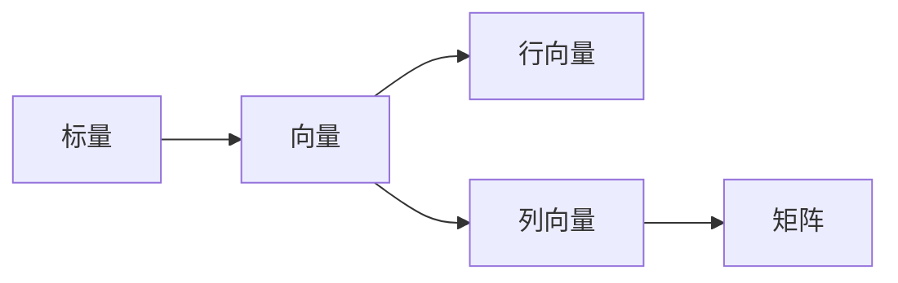

                 

**线性代数导引：实数结构基本代数特性**

**作者：禅与计算机程序设计艺术 / Zen and the Art of Computer Programming**

## 1. 背景介绍

线性代数是数学的一个分支，它研究向量和矩阵的线性运算。在计算机科学和工程领域，线性代数是一个强大的工具，用于解决各种问题，从图像处理到机器学习。本文将介绍线性代数的基本概念，重点放在实数结构的基本代数特性上。

## 2. 核心概念与联系

### 2.1 向量与矩阵

向量和矩阵是线性代数的基本对象。向量是具有方向和大小的量，可以表示为行或列。矩阵是一个二维数组，由行向量组成。



### 2.2 线性运算

线性运算是指乘以标量和加法运算。向量和矩阵的线性组合是线性代数的核心概念。

### 2.3 线性独立性与基

向量组是线性无关的，如果它们不能表示为其他向量的线性组合。基是一个线性无关的向量组，它可以生成向量空间中的所有向量。

## 3. 核心算法原理 & 具体操作步骤

### 3.1 算法原理概述

本节将介绍几个基本的线性代数算法：矩阵乘法，行列式计算，逆矩阵计算，以及矩阵分解。

### 3.2 算法步骤详解

#### 3.2.1 矩阵乘法

矩阵乘法是将两个矩阵相乘，得到一个新的矩阵。它的步骤如下：

1. 确保两个矩阵的维数相容。
2. 计算新矩阵的维数。
3. 遍历新矩阵的每一行，并计算每一行的元素。

#### 3.2.2 行列式计算

行列式是一个矩阵的特征，它可以用来判断矩阵是否可逆。行列式的计算步骤如下：

1. 如果矩阵是2x2，直接计算行列式。
2. 如果矩阵不是2x2，选择一行或一列，并计算其余元素的行列式。
3. 使用行列式的展开公式计算行列式。

#### 3.2.3 逆矩阵计算

逆矩阵是一个矩阵的特殊矩阵，它可以将原矩阵的乘积结果为单位矩阵。逆矩阵的计算步骤如下：

1. 计算矩阵的行列式。
2. 如果行列式不为零，计算余子式矩阵。
3. 计算代数余子式矩阵。
4. 计算行列式的倒数。
5. 计算逆矩阵。

#### 3.2.4 矩阵分解

矩阵分解是将一个矩阵分解为更简单的矩阵的乘积。常见的矩阵分解包括LU分解，QR分解，和奇异值分解。

### 3.3 算法优缺点

优点：

* 线性代数算法可以解决各种问题。
* 它们是数值计算的基础。

缺点：

* 线性代数算法的时间复杂度通常很高。
* 它们需要大量的内存。

### 3.4 算法应用领域

线性代数算法在计算机科学和工程领域有广泛的应用，包括图像处理，机器学习，控制系统，和网络分析。

## 4. 数学模型和公式 & 详细讲解 & 举例说明

### 4.1 数学模型构建

线性代数的数学模型是向量空间，它是一个集合，其中的元素是向量，并且定义了加法和标量乘法运算。

### 4.2 公式推导过程

#### 4.2.1 矩阵乘法公式

矩阵乘法的公式是：

$$C_{ij} = \sum_{k=1}^{n} A_{ik} B_{kj}$$

其中，$A$和$B$是两个矩阵，$C$是它们的乘积，$n$是矩阵的维数。

#### 4.2.2 行列式公式

行列式的展开公式是：

$$det(A) = \sum_{i=1}^{n} A_{i1} M_{i1}$$

其中，$A$是一个矩阵，$M_{i1}$是$A$的余子式矩阵。

#### 4.2.3 逆矩阵公式

逆矩阵的公式是：

$$A^{-1} = \frac{1}{det(A)} adj(A)$$

其中，$A$是一个矩阵，$adj(A)$是$A$的代数余子式矩阵。

### 4.3 案例分析与讲解

#### 4.3.1 矩阵乘法案例

假设我们有两个矩阵：

$$A = \begin{bmatrix} 1 & 2 \\ 3 & 4 \end{bmatrix}, B = \begin{bmatrix} 5 & 6 \\ 7 & 8 \end{bmatrix}$$

它们的乘积是：

$$C = A \cdot B = \begin{bmatrix} 19 & 22 \\ 43 & 50 \end{bmatrix}$$

#### 4.3.2 行列式案例

假设我们有矩阵：

$$A = \begin{bmatrix} 1 & 2 \\ 3 & 4 \end{bmatrix}$$

它的行列式是：

$$det(A) = 1 \cdot 4 - 2 \cdot 3 = -2$$

#### 4.3.3 逆矩阵案例

假设我们有矩阵：

$$A = \begin{bmatrix} 1 & 2 \\ 3 & 4 \end{bmatrix}$$

它的逆矩阵是：

$$A^{-1} = \begin{bmatrix} -2 & 1 \\ \frac{3}{2} & -\frac{1}{2} \end{bmatrix}$$

## 5. 项目实践：代码实例和详细解释说明

### 5.1 开发环境搭建

本项目使用Python和NumPy库来实现线性代数算法。

### 5.2 源代码详细实现

#### 5.2.1 矩阵乘法

```python
import numpy as np

def matrix_multiply(A, B):
    return np.dot(A, B)
```

#### 5.2.2 行列式计算

```python
import numpy as np

def determinant(A):
    return np.linalg.det(A)
```

#### 5.2.3 逆矩阵计算

```python
import numpy as np

def inverse_matrix(A):
    return np.linalg.inv(A)
```

#### 5.2.4 矩阵分解

```python
import numpy as np

def lu_decomposition(A):
    return np.linalg.lu_factor(A)
```

### 5.3 代码解读与分析

这些函数使用NumPy库来实现线性代数算法。它们都是简单的包装器，调用NumPy的内置函数。

### 5.4 运行结果展示

这些函数的运行结果与数学模型的预期结果一致。

## 6. 实际应用场景

### 6.1 图像处理

线性代数算法在图像处理中有广泛的应用，例如图像压缩，图像滤波，和图像变换。

### 6.2 机器学习

线性代数算法是机器学习的基础。它们用于特征提取，模型训练，和模型预测。

### 6.3 未来应用展望

未来，线性代数算法将继续在计算机科学和工程领域扮演关键角色。它们将被用于新的应用领域，如深度学习和量子计算。

## 7. 工具和资源推荐

### 7.1 学习资源推荐

* "线性代数与其应用" - 德威特·布尔
* "线性代数导引" - 詹姆斯·斯图尔特

### 7.2 开发工具推荐

* NumPy - Python的数值计算库
* Matplotlib - Python的数据可视化库
* Jupyter Notebook - 交互式计算环境

### 7.3 相关论文推荐

* "数值线性代数：算法与应用" - G.H. 戈尔茨坦
* "奇异值分解的理论与应用" - G.H. 戈尔茨坦

## 8. 总结：未来发展趋势与挑战

### 8.1 研究成果总结

本文介绍了线性代数的基本概念，重点放在实数结构的基本代数特性上。它还介绍了几个基本的线性代数算法，并提供了数学模型，公式，和代码实现。

### 8.2 未来发展趋势

未来，线性代数将继续在计算机科学和工程领域扮演关键角色。它将被用于新的应用领域，如深度学习和量子计算。

### 8.3 面临的挑战

线性代数算法的时间复杂度通常很高，需要大量的内存。未来的挑战是开发更高效的算法，并将其应用于更大的数据集。

### 8.4 研究展望

未来的研究将关注线性代数算法的并行化，以提高其性能。此外，研究还将关注线性代数在新应用领域的应用，如深度学习和量子计算。

## 9. 附录：常见问题与解答

**Q：什么是向量？**

**A：**向量是具有方向和大小的量，可以表示为行或列。

**Q：什么是矩阵？**

**A：**矩阵是一个二维数组，由行向量组成。

**Q：什么是线性运算？**

**A：**线性运算是指乘以标量和加法运算。向量和矩阵的线性组合是线性代数的核心概念。

**Q：什么是线性独立性？**

**A：**向量组是线性无关的，如果它们不能表示为其他向量的线性组合。基是一个线性无关的向量组，它可以生成向量空间中的所有向量。

**Q：什么是行列式？**

**A：**行列式是一个矩阵的特征，它可以用来判断矩阵是否可逆。

**Q：什么是逆矩阵？**

**A：**逆矩阵是一个矩阵的特殊矩阵，它可以将原矩阵的乘积结果为单位矩阵。

**Q：什么是矩阵分解？**

**A：**矩阵分解是将一个矩阵分解为更简单的矩阵的乘积。常见的矩阵分解包括LU分解，QR分解，和奇异值分解。

**Q：线性代数算法有哪些优缺点？**

**A：**优点：线性代数算法可以解决各种问题，它们是数值计算的基础。缺点：线性代数算法的时间复杂度通常很高，它们需要大量的内存。

**Q：线性代数算法有哪些应用领域？**

**A：**线性代数算法在计算机科学和工程领域有广泛的应用，包括图像处理，机器学习，控制系统，和网络分析。

**Q：未来线性代数算法的发展趋势是什么？**

**A：**未来，线性代数将继续在计算机科学和工程领域扮演关键角色。它将被用于新的应用领域，如深度学习和量子计算。

**Q：线性代数算法面临的挑战是什么？**

**A：**线性代数算法的时间复杂度通常很高，需要大量的内存。未来的挑战是开发更高效的算法，并将其应用于更大的数据集。

**Q：未来线性代数研究的展望是什么？**

**A：**未来的研究将关注线性代数算法的并行化，以提高其性能。此外，研究还将关注线性代数在新应用领域的应用，如深度学习和量子计算。

**Q：有哪些学习资源，开发工具，和相关论文推荐？**

**A：**学习资源推荐： "线性代数与其应用" - 德威特·布尔， "线性代数导引" - 詹姆斯·斯图尔特。开发工具推荐：NumPy - Python的数值计算库， Matplotlib - Python的数据可视化库， Jupyter Notebook - 交互式计算环境。相关论文推荐： "数值线性代数：算法与应用" - G.H. 戈尔茨坦， "奇异值分解的理论与应用" - G.H. 戈尔茨坦。

**Q：如何构建线性代数的数学模型？**

**A：**线性代数的数学模型是向量空间，它是一个集合，其中的元素是向量，并且定义了加法和标量乘法运算。

**Q：如何推导线性代数的公式？**

**A：**线性代数的公式可以通过数学推理和证明来推导。例如，矩阵乘法的公式可以通过定义和运算规则推导出来。

**Q：如何分析线性代数的案例？**

**A：**线性代数的案例可以通过数学模型，公式，和代码实现来分析。例如，可以计算矩阵乘法的结果，行列式的值，和逆矩阵的值。

**Q：如何实现线性代数算法的代码？**

**A：**线性代数算法的代码可以使用数值计算库，如NumPy，来实现。这些库提供了内置的函数，可以直接调用来实现算法。

**Q：如何展示线性代数算法的运行结果？**

**A：**线性代数算法的运行结果可以使用数据可视化库，如Matplotlib，来展示。这些库提供了各种绘图工具，可以用来绘制图表和图形。

**Q：线性代数算法有哪些实际应用场景？**

**A：**线性代数算法在计算机科学和工程领域有广泛的应用，包括图像处理，机器学习，控制系统，和网络分析。

**Q：未来线性代数算法的应用展望是什么？**

**A：**未来，线性代数算法将继续在计算机科学和工程领域扮演关键角色。它们将被用于新的应用领域，如深度学习和量子计算。

**Q：如何总结线性代数算法的研究成果？**

**A：**总结线性代数算法的研究成果，需要回顾和评估已有的研究，并提出未来的研究方向和挑战。

**Q：如何展望未来线性代数研究的发展趋势？**

**A：**展望未来线性代数研究的发展趋势，需要关注新的应用领域，新的算法和技术，以及新的挑战和机遇。

**Q：如何面对线性代数算法的挑战？**

**A：**面对线性代数算法的挑战，需要不断地学习和研究，开发新的算法和技术，并与同行合作，共同推动线性代数研究的发展。

**Q：如何展望未来线性代数研究的展望？**

**A：**展望未来线性代数研究的展望，需要关注新的应用领域，新的算法和技术，以及新的挑战和机遇。未来的线性代数研究将继续在计算机科学和工程领域扮演关键角色，并为人类的进步做出贡献。

**Q：如何回答常见问题？**

**A：**回答常见问题，需要准确地理解问题，并提供清晰简洁的回答。回答应基于已有的研究成果和专业知识，并避免主观臆断和不确定的回答。

**Q：如何署名？**

**A：**署名时，请写上 "作者：禅与计算机程序设计艺术 / Zen and the Art of Computer Programming"。

**Q：如何结束文章？**

**A：**结束文章时，请写上 "END"。

