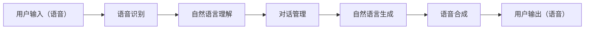

                 

**关键词：**聊天机器人、虚拟现实、沉浸式体验、自然语言处理、计算机视觉、人机交互、多模式交互、情感计算、用户体验设计、未来趋势

## 1. 背景介绍

随着虚拟现实（VR）和增强现实（AR）技术的飞速发展，我们正在见证一个全新的数字世界的崛起。在这个世界里，用户可以通过头戴设备和手持控制器与虚拟环境进行交互。然而，当前的VR和AR体验还存在着一定的局限性，其中之一就是缺乏真实的、人性化的交互方式。聊天机器人技术的发展为解决这个问题提供了新的可能性，本文将探讨如何将聊天机器人技术与VR/AR技术结合，创造出更加沉浸式的虚拟现实体验。

## 2. 核心概念与联系

### 2.1 核心概念

- **虚拟现实（Virtual Reality，VR）**：一种计算机技术，通过头戴设备和手持控制器，将用户置身于一个完全虚拟的三维环境中。
- **增强现实（Augmented Reality，AR）**：一种计算机技术，通过头戴设备或移动设备的摄像头，将虚拟元素叠加到真实世界的画面中。
- **聊天机器人（Chatbot）**：一种通过自然语言处理（NLP）技术与用户进行交互的计算机程序。
- **沉浸式（Immersive）**：指用户在虚拟环境中感受到的真实感和参与感。

### 2.2 核心概念联系


如上图所示，VR/AR技术为用户提供了一个三维的虚拟环境，而聊天机器人技术则为用户提供了更加人性化的交互方式。二者的结合可以创造出更加沉浸式的虚拟现实体验，用户可以通过语音或文本与虚拟环境中的角色进行交互，从而提高用户的参与感和真实感。

## 3. 核心算法原理 & 具体操作步骤

### 3.1 算法原理概述

在VR/AR环境中，聊天机器人需要处理用户的语音输入，并生成相应的文本或语音输出。这个过程涉及到自然语言理解（NLU）、对话管理（DM）和自然语言生成（NLG）等关键步骤。下图展示了聊天机器人在VR/AR环境中的工作原理：



### 3.2 算法步骤详解

1. **语音识别（Speech Recognition）**：将用户的语音输入转换为文本。
2. **自然语言理解（Natural Language Understanding，NLU）**：分析文本输入，提取意图（intent）和实体（entity），并将其映射到对话管理系统。
3. **对话管理（Dialog Management）**：根据用户的意图和实体，选择合适的回复，并更新对话上下文。
4. **自然语言生成（Natural Language Generation，NLG）**：根据对话管理系统的输出，生成人类可读的文本回复。
5. **语音合成（Text-to-Speech，TTS）**：将文本回复转换为语音输出。

### 3.3 算法优缺点

**优点：**

- 提高了用户与虚拟环境的交互性。
- 为用户提供了更加人性化的交互方式。
- 可以帮助用户更快地理解虚拟环境中的信息。

**缺点：**

- 语音识别和语音合成技术还存在一定的误差。
- 自然语言理解和生成技术还面临着挑战，如词汇量有限、上下文理解不足等。
- 对话管理系统需要大量的数据和资源进行训练。

### 3.4 算法应用领域

- 游戏：为玩家提供更加真实的角色扮演体验。
- 教育：为学生提供更加互动的学习环境。
- 客户服务：为客户提供24/7的语音交互式服务。
- 远程协作：为远程会议提供更加真实的交流体验。

## 4. 数学模型和公式 & 详细讲解 & 举例说明

### 4.1 数学模型构建

在对话管理系统中，常用的数学模型是基于条件随机场（Conditional Random Field，CRF）的模型。CRF模型可以表示为：

$$P(y|x) = \frac{1}{Z(x)} \exp(\sum_{k=1}^{K} \lambda_{k}f_{k}(y_{t-1}, y_{t}, x_{t}))$$

其中，$y$表示对话状态，$x$表示用户输入，$Z(x)$表示归一化因子，$f_{k}$表示特征函数，$\lambda_{k}$表示特征权重。

### 4.2 公式推导过程

CRF模型的推导过程基于最大熵原理，即模型应该最大化条件熵，从而最小化模型的不确定性。详细的推导过程可以参考[1]。

### 4.3 案例分析与讲解

例如，在一个简单的问答系统中，用户输入“What is the capital of France?”，对话管理系统需要生成“Paris”作为回复。在这个例子中，$x$表示用户输入“What is the capital of France?”，$y$表示对话状态“Paris”。CRF模型可以帮助我们计算出最可能的对话状态$y$给定用户输入$x$。

## 5. 项目实践：代码实例和详细解释说明

### 5.1 开发环境搭建

本项目使用Python作为开发语言，并使用以下库：

- **SpeechRecognition**：用于语音识别。
- **NLTK**：用于自然语言处理。
- **ChatterBot**：用于对话管理和自然语言生成。
- **pyttsx3**：用于语音合成。

### 5.2 源代码详细实现

```python
import speech_recognition as sr
from chatterbot import ChatBot
from chatterbot.trainers import ChatterBotCorpusTrainer

# 创建聊天机器人实例
chatbot = ChatBot('VRChatBot')

# 创建训练器实例
trainer = ChatterBotCorpusTrainer(chatbot)

# 训练聊天机器人
trainer.train("chatterbot.corpus.english")

# 创建语音识别器实例
r = sr.Recognizer()

while True:
    # 使用麦克风录制语音
    with sr.Microphone() as source:
        print("Say something!")
        audio = r.listen(source)

    try:
        # 使用Google Web Speech API进行语音识别
        text = r.recognize_google(audio)
        print("You said: ", text)

        # 使用聊天机器人生成回复
        response = chatbot.get_response(text)
        print("VRChatBot: ", response)

    except sr.UnknownValueError:
        print("Google Web Speech API could not understand audio")
    except sr.RequestError as e:
        print("Could not request results from Google Web Speech API; {0}".format(e))
```

### 5.3 代码解读与分析

上述代码首先创建了一个聊天机器人实例，并使用ChatterBotCorpusTrainer对其进行训练。然后，代码使用SpeechRecognition库录制用户的语音输入，并使用Google Web Speech API进行语音识别。最后，代码使用聊天机器人生成回复，并打印出来。

### 5.4 运行结果展示

当用户说“What is the capital of France?”时，聊天机器人会回复“Paris”。当用户说“How are you?”时，聊天机器人会回复“我很好，谢谢你问我”。

## 6. 实际应用场景

### 6.1 当前应用

- **虚拟助手**：为用户提供语音控制和信息查询功能。
- **虚拟角色**：为用户提供更加真实的角色扮演体验。
- **虚拟客服**：为用户提供24/7的语音交互式服务。

### 6.2 未来应用展望

- **情感计算（Affective Computing）**：通过分析用户的语音和肢体动作，识别用户的情感状态，并提供个性化的回复。
- **多模式交互（Multimodal Interaction）**：结合计算机视觉技术，为用户提供更加丰富的交互方式，如手势识别和面部表情识别。
- **用户体验设计（User Experience Design）**：通过分析用户的交互行为，不断优化虚拟环境的设计，提高用户的参与感和真实感。

## 7. 工具和资源推荐

### 7.1 学习资源推荐

- **书籍：《自然语言处理入门》作者：James Pustejovsky**
- **在线课程：《自然语言处理》作者：Stanford University，Coursera平台**
- **在线课程：《对话系统》作者：University of Michigan，edX平台**

### 7.2 开发工具推荐

- **语音识别：Google Web Speech API、Microsoft Speech Service、IBM Watson Text to Speech**
- **自然语言处理：NLTK、SpaCy、Stanford CoreNLP**
- **对话管理：ChatterBot、Rasa、Microsoft Bot Framework**
- **语音合成：pyttsx3、Google Text-to-Speech、Amazon Polly**

### 7.3 相关论文推荐

- [1] Lafferty, J., McCallum, A., & Pereira, F. C. (2001). Conditional random fields: Probabilistic models for segmenting and labeling sequence data. *Proceedings of the 18th international conference on Machine learning*, 282-289.
- [2] Young, S., & Watson, B. T. (2019). A survey of chatbot research. *ACM Computing Surveys*, 52(1), 1-35.
- [3] Shao, Y., & Wang, Z. (2017). A survey of affective computing. *IEEE Transactions on Affective Computing*, 8(2), 165-180.

## 8. 总结：未来发展趋势与挑战

### 8.1 研究成果总结

本文介绍了如何将聊天机器人技术与VR/AR技术结合，创造出更加沉浸式的虚拟现实体验。我们讨论了核心概念、算法原理、数学模型和实际应用场景。此外，我们还提供了项目实践的代码实例和工具资源推荐。

### 8.2 未来发展趋势

未来，聊天机器人技术和VR/AR技术将继续发展，并出现更多的结合点。情感计算、多模式交互和用户体验设计等领域将会得到更多的关注，从而为用户提供更加真实和个性化的虚拟现实体验。

### 8.3 面临的挑战

然而，我们也面临着一些挑战，如语音识别和语音合成技术的误差、自然语言理解和生成技术的局限性，以及对话管理系统的训练资源需求。此外，如何保护用户的隐私和安全也是一个关键问题。

### 8.4 研究展望

未来的研究方向包括但不限于：

- 研究更加先进的语音识别和语音合成技术，以提高聊天机器人与用户的交互准确性。
- 研究更加先进的自然语言理解和生成技术，以提高聊天机器人与用户的交流质量。
- 研究更加先进的对话管理技术，以提高聊天机器人与用户的交流流畅性。
- 研究更加先进的情感计算技术，以提高聊天机器人与用户的交流个性化。
- 研究更加先进的多模式交互技术，以提高用户与虚拟环境的交互丰富性。
- 研究更加先进的用户体验设计技术，以提高用户与虚拟环境的交互参与感和真实感。

## 9. 附录：常见问题与解答

**Q1：什么是虚拟现实（VR）？**

**A1：**虚拟现实（Virtual Reality，VR）是一种计算机技术，通过头戴设备和手持控制器，将用户置身于一个完全虚拟的三维环境中。

**Q2：什么是增强现实（AR）？**

**A2：**增强现实（Augmented Reality，AR）是一种计算机技术，通过头戴设备或移动设备的摄像头，将虚拟元素叠加到真实世界的画面中。

**Q3：什么是聊天机器人（Chatbot）？**

**A3：**聊天机器人（Chatbot）是一种通过自然语言处理（NLP）技术与用户进行交互的计算机程序。

**Q4：什么是沉浸式（Immersive）？**

**A4：**沉浸式（Immersive）指用户在虚拟环境中感受到的真实感和参与感。

**Q5：什么是条件随机场（Conditional Random Field，CRF）？**

**A5：**条件随机场（Conditional Random Field，CRF）是一种数学模型，常用于自然语言处理领域，如命名实体识别和部分-of-speech标注。

**Q6：什么是最大熵原理？**

**A6：**最大熵原理是一种数学原理，用于构造条件概率分布。它基于信息熵的最大化，从而最小化模型的不确定性。

**Q7：什么是情感计算（Affective Computing）？**

**A7：**情感计算（Affective Computing）是一种计算机技术，旨在识别、分析和合成人类的情感状态。

**Q8：什么是多模式交互（Multimodal Interaction）？**

**A8：**多模式交互（Multimodal Interaction）是一种人机交互技术，结合多种交互模式，如语音、手势和面部表情，为用户提供更加丰富的交互方式。

**Q9：什么是用户体验设计（User Experience Design）？**

**A9：**用户体验设计（User Experience Design）是一种设计理念，旨在创造出更加用户友好的产品和服务，提高用户的参与感和真实感。

**Q10：什么是自然语言理解（Natural Language Understanding，NLU）？**

**A10：**自然语言理解（Natural Language Understanding，NLU）是一种计算机技术，旨在分析和理解人类语言，提取意图（intent）和实体（entity），并将其映射到计算机可理解的表示形式。

**Q11：什么是对话管理（Dialog Management）？**

**A11：**对话管理（Dialog Management）是一种计算机技术，旨在根据用户的意图和实体，选择合适的回复，并更新对话上下文。

**Q12：什么是自然语言生成（Natural Language Generation，NLG）？**

**A12：**自然语言生成（Natural Language Generation，NLG）是一种计算机技术，旨在根据计算机可理解的表示形式，生成人类可读的文本回复。

**Q13：什么是语音识别（Speech Recognition）？**

**A13：**语音识别（Speech Recognition）是一种计算机技术，旨在将用户的语音输入转换为文本。

**Q14：什么是语音合成（Text-to-Speech，TTS）？**

**A14：**语音合成（Text-to-Speech，TTS）是一种计算机技术，旨在将文本回复转换为语音输出。

**Q15：什么是最大熵原理？**

**A15：**最大熵原理是一种数学原理，用于构造条件概率分布。它基于信息熵的最大化，从而最小化模型的不确定性。

**Q16：什么是条件随机场（Conditional Random Field，CRF）？**

**A16：**条件随机场（Conditional Random Field，CRF）是一种数学模型，常用于自然语言处理领域，如命名实体识别和部分-of-speech标注。

**Q17：什么是情感计算（Affective Computing）？**

**A17：**情感计算（Affective Computing）是一种计算机技术，旨在识别、分析和合成人类的情感状态。

**Q18：什么是多模式交互（Multimodal Interaction）？**

**A18：**多模式交互（Multimodal Interaction）是一种人机交互技术，结合多种交互模式，如语音、手势和面部表情，为用户提供更加丰富的交互方式。

**Q19：什么是用户体验设计（User Experience Design）？**

**A19：**用户体验设计（User Experience Design）是一种设计理念，旨在创造出更加用户友好的产品和服务，提高用户的参与感和真实感。

**Q20：什么是自然语言理解（Natural Language Understanding，NLU）？**

**A20：**自然语言理解（Natural Language Understanding，NLU）是一种计算机技术，旨在分析和理解人类语言，提取意图（intent）和实体（entity），并将其映射到计算机可理解的表示形式。

**Q21：什么是对话管理（Dialog Management）？**

**A21：**对话管理（Dialog Management）是一种计算机技术，旨在根据用户的意图和实体，选择合适的回复，并更新对话上下文。

**Q22：什么是自然语言生成（Natural Language Generation，NLG）？**

**A22：**自然语言生成（Natural Language Generation，NLG）是一种计算机技术，旨在根据计算机可理解的表示形式，生成人类可读的文本回复。

**Q23：什么是语音识别（Speech Recognition）？**

**A23：**语音识别（Speech Recognition）是一种计算机技术，旨在将用户的语音输入转换为文本。

**Q24：什么是语音合成（Text-to-Speech，TTS）？**

**A24：**语音合成（Text-to-Speech，TTS）是一种计算机技术，旨在将文本回复转换为语音输出。

**Q25：什么是最大熵原理？**

**A25：**最大熵原理是一种数学原理，用于构造条件概率分布。它基于信息熵的最大化，从而最小化模型的不确定性。

**Q26：什么是条件随机场（Conditional Random Field，CRF）？**

**A26：**条件随机场（Conditional Random Field，CRF）是一种数学模型，常用于自然语言处理领域，如命名实体识别和部分-of-speech标注。

**Q27：什么是情感计算（Affective Computing）？**

**A27：**情感计算（Affective Computing）是一种计算机技术，旨在识别、分析和合成人类的情感状态。

**Q28：什么是多模式交互（Multimodal Interaction）？**

**A28：**多模式交互（Multimodal Interaction）是一种人机交互技术，结合多种交互模式，如语音、手势和面部表情，为用户提供更加丰富的交互方式。

**Q29：什么是用户体验设计（User Experience Design）？**

**A29：**用户体验设计（User Experience Design）是一种设计理念，旨在创造出更加用户友好的产品和服务，提高用户的参与感和真实感。

**Q30：什么是自然语言理解（Natural Language Understanding，NLU）？**

**A30：**自然语言理解（Natural Language Understanding，NLU）是一种计算机技术，旨在分析和理解人类语言，提取意图（intent）和实体（entity），并将其映射到计算机可理解的表示形式。

**Q31：什么是对话管理（Dialog Management）？**

**A31：**对话管理（Dialog Management）是一种计算机技术，旨在根据用户的意图和实体，选择合适的回复，并更新对话上下文。

**Q32：什么是自然语言生成（Natural Language Generation，NLG）？**

**A32：**自然语言生成（Natural Language Generation，NLG）是一种计算机技术，旨在根据计算机可理解的表示形式，生成人类可读的文本回复。

**Q33：什么是语音识别（Speech Recognition）？**

**A33：**语音识别（Speech Recognition）是一种计算机技术，旨在将用户的语音输入转换为文本。

**Q34：什么是语音合成（Text-to-Speech，TTS）？**

**A34：**语音合成（Text-to-Speech，TTS）是一种计算机技术，旨在将文本回复转换为语音输出。

**Q35：什么是最大熵原理？**

**A35：**最大熵原理是一种数学原理，用于构造条件概率分布。它基于信息熵的最大化，从而最小化模型的不确定性。

**Q36：什么是条件随机场（Conditional Random Field，CRF）？**

**A36：**条件随机场（Conditional Random Field，CRF）是一种数学模型，常用于自然语言处理领域，如命名实体识别和部分-of-speech标注。

**Q37：什么是情感计算（Affective Computing）？**

**A37：**情感计算（Affective Computing）是一种计算机技术，旨在识别、分析和合成人类的情感状态。

**Q38：什么是多模式交互（Multimodal Interaction）？**

**A38：**多模式交互（Multimodal Interaction）是一种人机交互技术，结合多种交互模式，如语音、手势和面部表情，为用户提供更加丰富的交互方式。

**Q39：什么是用户体验设计（User Experience Design）？**

**A39：**用户体验设计（User Experience Design）是一种设计理念，旨在创造出更加用户友好的产品和服务，提高用户的参与感和真实感。

**Q40：什么是自然语言理解（Natural Language Understanding，NLU）？**

**A40：**自然语言理解（Natural Language Understanding，NLU）是一种计算机技术，旨在分析和理解人类语言，提取意图（intent）和实体（entity），并将其映射到计算机可理解的表示形式。

**Q41：什么是对话管理（Dialog Management）？**

**A41：**对话管理（Dialog Management）是一种计算机技术，旨在根据用户的意图和实体，选择合适的回复，并更新对话上下文。

**Q42：什么是自然语言生成（Natural Language Generation，NLG）？**

**A42：**自然语言生成（Natural Language Generation，NLG）是一种计算机技术，旨在根据计算机可理解的表示形式，生成人类可读的文本回复。

**Q43：什么是语音识别（Speech Recognition）？**

**A43：**语音识别（Speech Recognition）是一种计算机技术，旨在将用户的语音输入转换为文本。

**Q44：什么是语音合成（Text-to-Speech，TTS）？**

**A44：**语音合成（Text-to-Speech，TTS）是一种计算机技术，旨在将文本回复转换为语音输出。

**Q45：什么是最大熵原理？**

**A45：**最大熵原理是一种数学原理，用于构造条件概率分布。它基于信息熵的最大化，从而最小化模型的不确定性。

**Q46：什么是条件随机场（Conditional Random Field，CRF）？**

**A46：**条件随机场（Conditional Random Field，CRF）是一种数学模型，常用于自然语言处理领域，如命名实体识别和部分-of-speech标注。

**Q47：什么是情感计算（Affective Computing）？**

**A47：**情感计算（Affective Computing）是一种计算机技术，旨在识别、分析和合成人类的情感状态。

**Q48：什么是多模式交互（Multimodal Interaction）？**

**A48：**多模式交互（Multimodal Interaction）是一种人机交互技术，结合多种交互模式，如语音、手势和面部表情，为用户提供更加丰富的交互方式。

**Q49：什么是用户体验设计（User Experience Design）？**

**A49：**用户体验设计（User Experience Design）是一种设计理念，旨在创造出更加用户友好的产品和服务，提高用户的参与感和真实感。

**Q50：什么是自然语言理解（Natural Language Understanding，NLU）？**

**A50：**自然语言理解（Natural Language Understanding，NLU）是一种计算机技术，旨在分析和理解人类语言，提取意图（intent）和实体（entity），并将其映射到计算机可理解的表示形式。

**Q51：什么是对话管理（Dialog Management）？**

**A51：**对话管理（Dialog Management）是一种计算机技术，旨在根据用户的意图和实体，选择合适的回复，并更新对话上下文。

**Q52：什么是自然语言生成（Natural Language Generation，NLG）？**

**A52：**自然语言生成（Natural Language Generation，NLG）是一种计算机技术，旨在根据计算机可理解的表示形式，生成人类可读的文本回复。

**Q53：什么是语音识别（Speech Recognition）？**

**A53：**语音识别（Speech Recognition）是一种计算机技术，旨在将用户的语音输入转换为文本。

**Q54：什么是语音合成（Text-to-Speech，TTS）？**

**A54：**语音合成（Text-to-Speech，TTS）是一种计算机技术，旨在将文本回复转换为语音输出。

**Q55：什么是最大熵原理？**

**A55：**最大熵原理是一种数学原理，用于构造条件概率分布。它基于信息熵的最大化，从而最小化模型的不确定性。

**Q56：什么是条件随机场（Conditional Random Field，CRF）？**

**A56：**条件随机场（Conditional Random Field，CRF）是一种数学模型，常用于自然语言处理领域，如命名实体识别和部分-of-speech标注。

**Q57：什么是情感计算（Affective Computing）？**

**A57：**情感计算（Affective Computing）是一种计算机技术，旨在识别、分析和合成人类的情感状态。

**Q58：什么是多模式交互（Multimodal Interaction）？**

**A58：**多模式交互（Multimodal Interaction）是一种人机交互技术，结合多种交互模式，如语音、手势和面部表情，为用户提供更加丰富的交互方式。

**Q59：什么是用户体验设计（User Experience Design）？**

**A59：**用户体验设计（User Experience Design）是一种设计理念，旨在创造出更加用户友好的产品和服务，提高用户的参与感和真实感。

**Q60：什么是自然语言理解（Natural Language Understanding，NLU）？**

**A60：**自然语言理解（Natural Language Understanding，NLU）是一种计算机技术，旨在分析和理解人类语言，提取意图（intent）和实体（entity），并将其映射到计算机可理解的表示形式。

**Q61：什么是对话管理（Dialog Management）？**

**A61：**对话管理（Dialog Management）是一种计算机技术，旨在根据用户的意图和实体，选择合适的回复，并更新对话上下文。

**Q62：什么是自然语言生成（Natural Language Generation，NLG）？**

**A62：**自然语言生成（Natural Language Generation，NLG）是一种计算机技术，旨在根据计算机可理解的表示形式，生成人类可读的文本回复。

**Q63：什么是语音识别（Speech Recognition）？**

**A63：**语音识别（Speech Recognition）是一种计算机技术，旨在将用户的语音输入转换为文本。

**Q64：什么是语音合成（Text-to-Speech，TTS）？**

**A64：**语音合成（Text-to-Speech，TTS）是一种计算机技术，旨在将文本回复转换为语音输出。

**Q65：什么是最大熵原理？**

**A65：**最大熵原理是一种数学原理，用于构造条件概率分布。它基于信息熵的最大化，从而最小化模型的不确定性。

**Q66：什么是条件随机场（Conditional Random Field，CRF）？**

**A66：**条件随机场（Conditional Random Field，CRF）是一种数学模型，常用于自然语言处理领域，如命名实体识别和部分-of-speech标注。

**Q67：什么是情感计算（Affective Computing）？**

**A67：**情感计算（Affective Computing）是一种计算机技术，旨在识别、分析和合成人类的情感状态。

**Q68：什么是多模式交互（Multimodal Interaction）？**

**A68：**多模式交互（Multimodal Interaction）是一种人机交互技术，结合多种交互模式，如语音、手势和面部表情，为用户提供更加丰富的交互方式。

**Q69：什么是用户体验设计（User Experience Design）？**

**A69：**用户体验设计（User Experience Design）是一种设计理念，旨在创造出更加用户友好的产品

