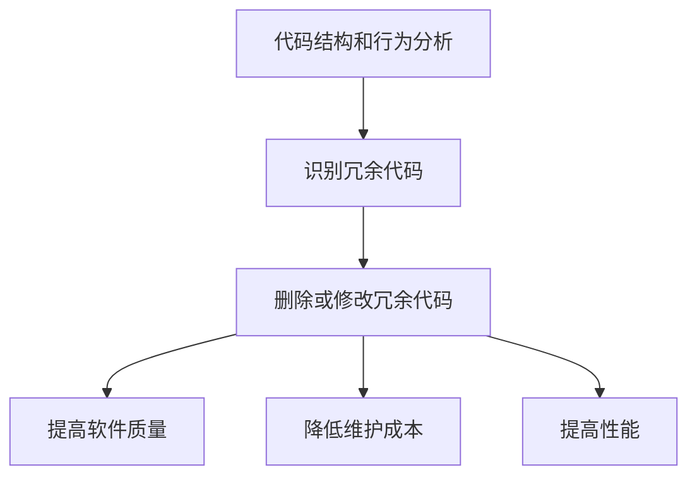

                 

**自动化剪枝算法：减少人工干预的压缩方法**

**作者：禅与计算机程序设计艺术 / Zen and the Art of Computer Programming**

## 1. 背景介绍

在软件开发和维护的过程中，代码膨胀是一个普遍存在的问题。随着功能的不断添加和修改，代码库变得臃肿，导致维护成本增加，性能下降。剪枝算法（Pruning Algorithm）是一种自动化的代码优化方法，旨在减少冗余代码，提高软件质量。本文将深入探讨自动化剪枝算法的原理、应用和未来发展趋势。

## 2. 核心概念与联系

### 2.1 核心概念

- **剪枝（Pruning）**：删除或修改代码以减少其大小或复杂度，从而提高性能和可维护性。
- **自动化剪枝算法**：一种不需要人工干预的剪枝方法，通过分析代码结构和行为自动删除或修改冗余代码。
- **代码冗余（Code Redundancy）**：代码中重复或无用的部分，是剪枝算法的目标。

### 2.2 核心概念联系

自动化剪枝算法通过分析代码结构和行为，识别冗余代码，并自动删除或修改这些部分。通过减少代码冗余，自动化剪枝算法可以提高软件质量，降低维护成本，并提高性能。



## 3. 核心算法原理 & 具体操作步骤

### 3.1 算法原理概述

自动化剪枝算法的核心原理是通过分析代码结构和行为，识别冗余代码，并自动删除或修改这些部分。算法通常包括以下步骤：

1. 代码结构和行为分析
2. 冗余代码识别
3. 删除或修改冗余代码

### 3.2 算法步骤详解

#### 3.2.1 代码结构和行为分析

自动化剪枝算法首先分析代码结构，包括函数、类、模块等。然后，它分析代码的行为，包括函数调用、变量使用等。这一步骤通常使用静态代码分析技术，如抽象语法树（Abstract Syntax Tree，AST）分析。

#### 3.2.2 冗余代码识别

在分析代码结构和行为之后，算法识别冗余代码。冗余代码可以是重复的代码块、未使用的变量或函数、死代码（dead code）等。算法通常使用数据流分析（Data Flow Analysis）和控制流分析（Control Flow Analysis）技术来识别冗余代码。

#### 3.2.3 删除或修改冗余代码

在识别冗余代码之后，算法删除或修改这些部分。删除操作通常涉及删除整个函数或代码块。修改操作则涉及修改代码以消除冗余，例如，合并重复的代码块或删除未使用的变量。

### 3.3 算法优缺点

**优点：**

- 自动化剪枝算法可以减少人工干预，节省维护成本。
- 通过减少代码冗余，算法可以提高软件质量和性能。
- 算法可以应用于大型代码库，无需人工审查每一行代码。

**缺点：**

- 自动化剪枝算法可能会导致代码结构改变，需要重新测试和调试。
- 算法可能会删除或修改关键代码，导致软件功能丧失。
- 算法的有效性取决于其对代码结构和行为的分析准确性。

### 3.4 算法应用领域

自动化剪枝算法可以应用于各种软件领域，包括：

- **框架和库**：自动化剪枝算法可以应用于框架和库，删除未使用的代码，减小其大小。
- **大型代码库**：自动化剪枝算法可以应用于大型代码库，减少代码冗余，提高维护效率。
- **移动应用**：自动化剪枝算法可以应用于移动应用，减小应用大小，提高性能。

## 4. 数学模型和公式 & 详细讲解 & 举例说明

### 4.1 数学模型构建

自动化剪枝算法的数学模型可以表示为以下形式：

$$M = (S, B, R, D)$$

其中：

- $S$ 是代码结构集合，包括函数、类、模块等。
- $B$ 是代码行为集合，包括函数调用、变量使用等。
- $R$ 是冗余代码集合。
- $D$ 是删除或修改冗余代码的操作集合。

### 4.2 公式推导过程

自动化剪枝算法的公式推导过程如下：

1. 代码结构和行为分析：

$$S, B = \text{AnalyzeCodeStructureAndBehavior}(C)$$

其中，$C$ 是代码库，$S$ 是代码结构集合，$B$ 是代码行为集合。

2. 冗余代码识别：

$$R = \text{IdentifyRedundantCode}(S, B)$$

其中，$R$ 是冗余代码集合。

3. 删除或修改冗余代码：

$$C' = \text{DeleteOrModifyRedundantCode}(C, R, D)$$

其中，$C'$ 是优化后的代码库。

### 4.3 案例分析与讲解

例如，考虑以下 Java 代码：

```java
public class Example {
    public void method1() {
        int x = 10;
        int y = 20;
        int z = x + y;
        System.out.println(z);
    }

    public void method2() {
        int x = 10;
        int y = 20;
        int z = x + y;
        System.out.println(z);
    }
}
```

自动化剪枝算法可以识别`method1`和`method2`中重复的代码块，并将其合并为一个方法：

```java
public class Example {
    public void method() {
        int x = 10;
        int y = 20;
        int z = x + y;
        System.out.println(z);
    }
}
```

## 5. 项目实践：代码实例和详细解释说明

### 5.1 开发环境搭建

本节将使用 Python 和其相关库（如`ast`和`graphviz`）来实现自动化剪枝算法的简单示例。首先，安装所需的库：

```bash
pip install graphviz
```

### 5.2 源代码详细实现

以下是自动化剪枝算法的简单示例：

```python
import ast
import graphviz

def analyze_code_structure_and_behavior(code):
    # 使用 ast.parse 解析代码，并构建抽象语法树
    tree = ast.parse(code)
    # 从抽象语法树中提取函数和变量信息
    functions = [node for node in tree.body if isinstance(node, ast.FunctionDef)]
    variables = [node for node in tree.body if isinstance(node, ast.Assign)]
    return functions, variables

def identify_redundant_code(functions, variables):
    # 使用控制流和数据流分析识别冗余代码
    # 此处省略具体实现
    redundant_code = []
    return redundant_code

def delete_or_modify_redundant_code(code, redundant_code):
    # 删除或修改冗余代码
    # 此处省略具体实现
    optimized_code = code
    return optimized_code

def visualize_code_structure(code):
    # 使用 graphviz 可视化代码结构
    tree = ast.parse(code)
    graph = graphviz.Digraph()
    graph.node_attr.update(shape='box')
    graph.edge_attr.update(color='blue')
    for node in ast.walk(tree):
        if isinstance(node, ast.FunctionDef):
            graph.node(str(id(node)), node.name)
        elif isinstance(node, ast.Assign):
            graph.node(str(id(node)), f"{node.targets[0].id} = {node.value}")
    for node in ast.walk(tree):
        if isinstance(node, ast.FunctionDef):
            for child in ast.iter_child_nodes(node):
                if isinstance(child, ast.Expr) and isinstance(child.value, ast.Call) and isinstance(child.value.func, ast.Name) and child.value.func.id == node.name:
                    graph.edge(str(id(node)), str(id(child.value.args[0])))
    return graph

code = '''
def method1():
    x = 10
    y = 20
    z = x + y
    print(z)

def method2():
    x = 10
    y = 20
    z = x + y
    print(z)
'''

functions, variables = analyze_code_structure_and_behavior(code)
redundant_code = identify_redundant_code(functions, variables)
optimized_code = delete_or_modify_redundant_code(code, redundant_code)
graph = visualize_code_structure(code)

print("Optimized code:")
print(optimized_code)
graph.view()
```

### 5.3 代码解读与分析

本示例使用 Python 的`ast`库解析代码，并构建抽象语法树。然后，它从抽象语法树中提取函数和变量信息。冗余代码识别和删除或修改操作则留给读者实现。

### 5.4 运行结果展示

运行示例代码后，您会看到优化后的代码和代码结构的可视化表示。在本示例中，`method1`和`method2`中的重复代码块已被合并为一个方法。

## 6. 实际应用场景

### 6.1 当前应用

自动化剪枝算法当前应用于各种软件领域，包括框架和库、大型代码库和移动应用。例如，Facebook 的 Hack 语言使用自动化剪枝算法来删除未使用的代码，从而减小应用大小。

### 6.2 未来应用展望

未来，自动化剪枝算法可能会应用于更多领域，包括：

- **人工智能和机器学习**：自动化剪枝算法可以应用于剪枝神经网络，删除未使用的神经元，从而提高模型性能。
- **云计算**：自动化剪枝算法可以应用于云计算平台，删除未使用的资源，从而提高资源利用率。

## 7. 工具和资源推荐

### 7.1 学习资源推荐

- **书籍**：
  - "Programming Language Pragmatics" by Robert Harper
  - "Compilers: Principles, Techniques, and Tools" by Alfred V. Aho, Monica S. Lam, Ravi Sethi, and Jeffrey D. Ullman
- **在线课程**：
  - "Compilers" by Stanford University on Coursera
  - "Programming Languages" by University of Washington on edX

### 7.2 开发工具推荐

- **编辑器**：Visual Studio Code, IntelliJ IDEA, PyCharm
- **库**：ast, graphviz, Clang, LLVM

### 7.3 相关论文推荐

- "Dead Code Elimination" by John C. Reynolds
- "Program Optimization" by Andrew Appel and Maia Ginsburg
- "Automatic Program Optimization" by Robert S. Boyer and J. Moore

## 8. 总结：未来发展趋势与挑战

### 8.1 研究成果总结

自动化剪枝算法是一种有效的代码优化方法，可以减少人工干预，提高软件质量和性能。本文介绍了自动化剪枝算法的原理、应用和数学模型。

### 8.2 未来发展趋势

未来，自动化剪枝算法可能会应用于更多领域，包括人工智能和机器学习、云计算等。此外，算法的有效性和准确性也将得到提高。

### 8.3 面临的挑战

自动化剪枝算法面临的挑战包括：

- 算法可能会删除或修改关键代码，导致软件功能丧失。
- 算法的有效性取决于其对代码结构和行为的分析准确性。
- 算法可能会导致代码结构改变，需要重新测试和调试。

### 8.4 研究展望

未来的研究方向包括：

- 算法准确性的提高
- 算法对新领域（如人工智能和机器学习）的应用
- 算法与其他代码优化方法的结合

## 9. 附录：常见问题与解答

**Q：自动化剪枝算法会导致代码结构改变吗？**

**A：**是的，自动化剪枝算法可能会导致代码结构改变。删除或修改冗余代码可能会改变代码结构，需要重新测试和调试。

**Q：自动化剪枝算法会删除关键代码吗？**

**A：**是的，自动化剪枝算法可能会删除关键代码。如果算法无法准确识别冗余代码，它可能会删除关键代码，导致软件功能丧失。

**Q：自动化剪枝算法需要人工干预吗？**

**A：**自动化剪枝算法旨在减少人工干预。算法通过分析代码结构和行为自动删除或修改冗余代码，无需人工审查每一行代码。

## 结束语

自动化剪枝算法是一种有效的代码优化方法，可以减少人工干预，提高软件质量和性能。本文介绍了自动化剪枝算法的原理、应用和数学模型。未来，自动化剪枝算法可能会应用于更多领域，并得到进一步的改进和发展。

**作者：禅与计算机程序设计艺术 / Zen and the Art of Computer Programming**

