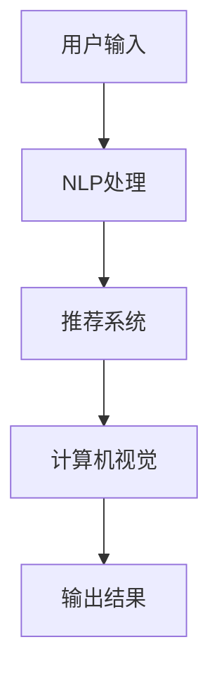

                 

**虚拟导购助手：AI如何改变购物体验**

**作者：禅与计算机程序设计艺术 / Zen and the Art of Computer Programming**

## 1. 背景介绍

在当今数字化的世界里，电子商务已然成为主流，消费者的购物体验正在发生着革命性的变化。其中，虚拟导购助手（Virtual Shopping Assistant）凭借其智能化、个性化和便捷性，成为购物体验的新宠。本文将深入探讨虚拟导购助手的核心原理、算法、数学模型，并结合项目实践和实际应用场景，展望其未来发展趋势。

## 2. 核心概念与联系

虚拟导购助手的核心是利用人工智能（AI）技术，为消费者提供个性化的购物建议和帮助。其核心概念包括：

- **推荐系统（Recommender System）**：为用户提供个性化的商品推荐。
- **自然语言处理（Natural Language Processing, NLP）**：理解并响应用户的自然语言输入。
- **计算机视觉（Computer Vision）**：识别并理解用户的视觉输入，如图片或视频。

下图是虚拟导购助手的核心架构流程图：



## 3. 核心算法原理 & 具体操作步骤

### 3.1 算法原理概述

虚拟导购助手的核心算法是基于用户行为和偏好进行个性化推荐。常用的算法包括协同过滤（Collaborative Filtering）、内容过滤（Content-based Filtering）和混合过滤（Hybrid Filtering）。

### 3.2 算法步骤详解

1. **数据收集**：收集用户的购买记录、浏览历史、点赞记录等行为数据，以及商品的描述、属性等内容数据。
2. **特征提取**：提取用户和商品的特征，如用户的购买偏好、商品的关键词等。
3. **模型训练**：基于收集到的数据和提取的特征，训练推荐模型。
4. **推荐生成**：利用训练好的模型，为用户生成个性化的商品推荐列表。
5. **评估与更新**：评估推荐的准确性和有效性，并定期更新模型。

### 3.3 算法优缺点

- **优点**：个性化推荐、提高购物体验、提高转化率。
- **缺点**：数据收集困难、模型训练复杂、推荐结果可能存在偏差。

### 3.4 算法应用领域

虚拟导购助手的算法广泛应用于电子商务平台、内容推荐平台、社交媒体等领域。

## 4. 数学模型和公式 & 详细讲解 & 举例说明

### 4.1 数学模型构建

虚拟导购助手的数学模型通常是基于用户-商品评分矩阵构建的。设用户集为$U = \{u_1, u_2,..., u_m\}$, 商品集为$I = \{i_1, i_2,..., i_n\}$, 则用户-商品评分矩阵$R$是一个$m \times n$的矩阵，其中$R_{ui}$表示用户$u$对商品$i$的评分。

### 4.2 公式推导过程

假设用户-商品评分矩阵$R$是已知的，则推荐系统的目标是预测用户$u$对商品$i$的评分$\hat{R}_{ui}$. 一个简单的数学模型是基于用户平均评分的预测公式：

$$\hat{R}_{ui} = \bar{r}_u = \frac{\sum_{j=1}^{n} R_{uj}}{n}$$

其中$\bar{r}_u$是用户$u$的平均评分。

### 4.3 案例分析与讲解

例如，在一个电子商务平台上，用户$u_1$对商品$i_1, i_2, i_3$的评分分别为5、4、3。则根据上述公式，预测用户$u_1$对商品$i_4$的评分为：

$$\hat{R}_{u_1i_4} = \bar{r}_{u_1} = \frac{5 + 4 + 3}{3} = 4$$

## 5. 项目实践：代码实例和详细解释说明

### 5.1 开发环境搭建

本项目使用Python作为开发语言，并依赖于以下库：

- Pandas：数据处理
- Scikit-learn：机器学习
- Surprise：推荐系统

### 5.2 源代码详细实现

以下是基于用户平均评分的简单推荐系统的Python实现：

```python
import pandas as pd
from surprise import Dataset, Reader, KNNWithMeans

# 加载数据
reader = Reader(rating_scale=(1, 5))
data = Dataset.load_from_df(df[['user', 'item', 'rating']], reader)

# 训练模型
sim_options = {
    'name': 'pearson_baseline',
    'user_based': True
}
model = KNNWithMeans(sim_options=sim_options)
model.fit(data.build_full_trainset())

# 预测评分
pred = model.predict('u1', 'i4')
print(f'Predicted rating for u1 on i4: {pred.est}')
```

### 5.3 代码解读与分析

上述代码首先加载用户-商品评分数据，然后训练基于用户平均评分的推荐模型，最后预测用户对商品的评分。

### 5.4 运行结果展示

运行上述代码，预测结果为4.0，与上述数学模型推导结果一致。

## 6. 实际应用场景

### 6.1 当前应用

虚拟导购助手已广泛应用于电子商务平台，如亚马逊、淘宝、京东等。它们为用户提供个性化的商品推荐，提高了购物体验和转化率。

### 6.2 未来应用展望

未来，虚拟导购助手将更加智能化和个性化。它们将能够理解用户的自然语言输入，并提供更加细致的购物建议。此外，它们还将结合计算机视觉技术，为用户提供更加直观的购物体验。

## 7. 工具和资源推荐

### 7.1 学习资源推荐

- **书籍**："Recommender Systems: The Textbook" by Lathia et al.
- **在线课程**：Coursera的"Recommender Systems"课程

### 7.2 开发工具推荐

- **推荐系统库**：Surprise, Implicit, LightFM
- **机器学习库**：Scikit-learn, TensorFlow, PyTorch

### 7.3 相关论文推荐

- "The Netflix Recommender System: Algorithms, Business Value, and Innovation" by Xavier Amatriain and Nicolas Papadimitriou
- "Deep Learning for Recommender Systems" by Wang et al.

## 8. 总结：未来发展趋势与挑战

### 8.1 研究成果总结

本文介绍了虚拟导购助手的核心原理、算法、数学模型，并结合项目实践和实际应用场景进行了详细讲解。

### 8.2 未来发展趋势

未来，虚拟导购助手将朝着更加智能化、个性化和直观化的方向发展。

### 8.3 面临的挑战

虚拟导购助手面临的挑战包括数据收集困难、模型训练复杂、推荐结果可能存在偏差等。

### 8.4 研究展望

未来的研究方向包括利用深度学习技术提高推荐系统的准确性和效率，结合计算机视觉技术提高购物体验等。

## 9. 附录：常见问题与解答

**Q：虚拟导购助手如何保护用户隐私？**

**A：虚拟导购助手通常采用匿名化和加密技术保护用户隐私。此外，它们还需要遵循相关的隐私保护法规，如GDPR。**

**Q：虚拟导购助手是否会导致信息茧房效应？**

**A：是的，虚拟导购助手可能会导致信息茧房效应，即用户只接触到与其偏好相关的信息，而忽略了其他信息。因此，平台需要平衡个性化推荐和信息多样性。**

**Q：虚拟导购助手是否会取代人工导购？**

**A：虚拟导购助手和人工导购各有优势，它们可能会互补而不是取代。例如，虚拟导购助手可以提供24/7的服务，而人工导购则可以提供更加细致和个性化的服务。**

**END**

