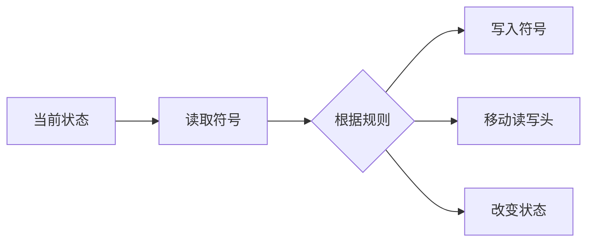

                 

计算机科学、图灵机、算法、复杂性理论、计算极限

## 1. 背景介绍

在计算机科学的发展史上，图灵机是一个具有里程碑意义的概念。它是由阿兰·图灵于1936年提出的一种抽象机器，用于研究计算的本质和极限。自从图灵机被提出以来，它已经成为计算机科学的基础之一，并为我们理解计算的本质提供了深刻的见解。本章将深入探讨图灵机的原理，并研究计算的极限。

## 2. 核心概念与联系

### 2.1 图灵机原理

图灵机是一种抽象机器，它由一条无限长的带子组成，带子上有格子，每个格子可以写入或读取一个符号。图灵机还有一个读写头，可以在带子上移动，读取或写入符号。图灵机根据当前状态和读取的符号执行一系列规则，这些规则定义了图灵机的行为。



### 2.2 图灵机与计算

图灵机的关键特性是它可以模拟任何计算过程。任何可以被计算的函数都可以由图灵机计算。这意味着图灵机可以解决任何数学问题，前提是给它足够多的时间和资源。这种能力使图灵机成为计算机科学的基础之一。

## 3. 核心算法原理 & 具体操作步骤

### 3.1 图灵机算法原理概述

图灵机的算法原理是基于状态转换的。它根据当前状态和读取的符号执行一系列规则。这些规则定义了图灵机的行为，包括写入符号、移动读写头和改变状态。

### 3.2 图灵机算法步骤详解

图灵机的算法步骤如下：

1. 图灵机从初始状态开始，读取带子上当前格子的符号。
2. 根据当前状态和读取的符号，图灵机执行一系列规则。这些规则定义了图灵机的行为，包括写入符号、移动读写头和改变状态。
3. 图灵机重复步骤1和2，直到它停止或达到目标状态。

### 3.3 图灵机算法优缺点

图灵机的优点是它可以模拟任何计算过程。任何可以被计算的函数都可以由图灵机计算。它的缺点是它的计算速度很慢，因为它需要一个一个格子地读取和处理带子上的符号。

### 3.4 图灵机算法应用领域

图灵机的应用领域包括计算机科学、数学、逻辑和哲学。它为我们理解计算的本质提供了深刻的见解，并帮助我们设计更有效的算法和计算机系统。

## 4. 数学模型和公式 & 详细讲解 & 举例说明

### 4.1 数学模型构建

图灵机的数学模型可以表示为一个四元组 $(Q, \Sigma, \delta, q_0)$, 其中：

- $Q$ 是状态集合，
- $\Sigma$ 是符号集合，
- $\delta: Q \times \Sigma \rightarrow Q \times \Sigma \times \{L, R\}$ 是状态转换函数，
- $q_0 \in Q$ 是初始状态。

### 4.2 公式推导过程

图灵机的行为可以用以下公式描述：

$$M = (Q, \Sigma, \delta, q_0)$$

其中：

- $Q$ 是状态集合，
- $\Sigma$ 是符号集合，
- $\delta: Q \times \Sigma \rightarrow Q \times \Sigma \times \{L, R\}$ 是状态转换函数，
- $q_0 \in Q$ 是初始状态。

### 4.3 案例分析与讲解

例如，考虑以下图灵机 $(Q, \Sigma, \delta, q_0)$, 其中：

- $Q = \{q_0, q_1\}$，
- $\Sigma = \{0, 1\}$，
- $\delta(q_0, 0) = (q_1, 1, R)$，
- $\delta(q_0, 1) = (q_0, 1, L)$，
- $\delta(q_1, 0) = (q_1, 0, R)$，
- $\delta(q_1, 1) = (q_0, 1, L)$，
- $q_0$ 是初始状态。

这个图灵机接受任何以 0 开头的二进制字符串，并将其转换为以 1 开头的二进制字符串。

## 5. 项目实践：代码实例和详细解释说明

### 5.1 开发环境搭建

为了实现图灵机，我们需要一个编程环境。我们可以使用 Python 来实现图灵机的算法。

### 5.2 源代码详细实现

以下是一个简单的 Python 实现：

```python
class TuringMachine:
    def __init__(self, Q, Sigma, delta, q0):
        self.Q = Q
        self.Sigma = Sigma
        self.delta = delta
        self.q0 = q0
        self.tape = ['_'] * len(Sigma)
        self.head = 0
        self.state = q0

    def run(self):
        while self.state not in self.final_states:
            symbol = self.tape[self.head]
            self.state, self.tape[self.head], direction = self.delta(self.state, symbol)
            if direction == 'L':
                self.head -= 1
            elif direction == 'R':
                self.head += 1
```

### 5.3 代码解读与分析

这个 Python 类表示一个图灵机。它有四个属性：状态集合 $Q$, 符号集合 $\Sigma$, 状态转换函数 $\delta$, 初始状态 $q_0$. 它还有一个带子 `tape` 和一个读写头 `head`, 用于模拟图灵机的行为。`run()` 方法模拟图灵机的运行过程。

### 5.4 运行结果展示

当我们运行这个图灵机时，它会根据状态转换函数 $\delta$ 执行一系列规则，直到它停止或达到目标状态。运行结果取决于初始状态和带子上的符号。

## 6. 实际应用场景

### 6.1 当前应用

图灵机在计算机科学、数学、逻辑和哲学等领域有广泛的应用。它为我们理解计算的本质提供了深刻的见解，并帮助我们设计更有效的算法和计算机系统。

### 6.2 未来应用展望

随着计算机技术的发展，图灵机的应用领域将会不断扩展。它可能会应用于量子计算、神经网络和人工智能等前沿领域。

## 7. 工具和资源推荐

### 7.1 学习资源推荐

- "计算机程序的构造和解释" (The Construction of Computers and the Construction of Programs) - 图灵的经典著作
- "计算机科学导论" (Introduction to Computer Science) - 由 MIT 提供的在线课程

### 7.2 开发工具推荐

- Python - 一个强大的编程语言，可以用于实现图灵机的算法
- Wolfram Mathematica - 一种计算机软件，可以用于数学计算和图形绘制

### 7.3 相关论文推荐

- "On Computable Numbers, with an Application to the Entscheidungsproblem" - 图灵的原始论文
- "The Church-Turing Thesis" - 由 Stephen Cole Kleene 所著，讨论了图灵机与计算的关系

## 8. 总结：未来发展趋势与挑战

### 8.1 研究成果总结

图灵机是计算机科学的基础之一，它为我们理解计算的本质提供了深刻的见解。它已经应用于计算机科学、数学、逻辑和哲学等领域，并帮助我们设计更有效的算法和计算机系统。

### 8.2 未来发展趋势

随着计算机技术的发展，图灵机的应用领域将会不断扩展。它可能会应用于量子计算、神经网络和人工智能等前沿领域。

### 8.3 面临的挑战

图灵机的计算速度很慢，因为它需要一个一个格子地读取和处理带子上的符号。如何提高图灵机的计算速度是一个挑战。

### 8.4 研究展望

未来的研究将会集中在图灵机的扩展和变体上。例如，量子图灵机和神经图灵机等新型图灵机正在被研究，以探索它们的计算能力和应用领域。

## 9. 附录：常见问题与解答

### 9.1 什么是图灵机？

图灵机是一种抽象机器，它由一条无限长的带子组成，带子上有格子，每个格子可以写入或读取一个符号。图灵机还有一个读写头，可以在带子上移动，读取或写入符号。图灵机根据当前状态和读取的符号执行一系列规则，这些规则定义了图灵机的行为。

### 9.2 图灵机可以解决任何数学问题吗？

是的，图灵机可以解决任何数学问题，前提是给它足够多的时间和资源。任何可以被计算的函数都可以由图灵机计算。

### 9.3 图灵机的计算速度慢是因为什么？

图灵机的计算速度慢是因为它需要一个一个格子地读取和处理带子上的符号。如何提高图灵机的计算速度是一个挑战。

## 作者：禅与计算机程序设计艺术 / Zen and the Art of Computer Programming

