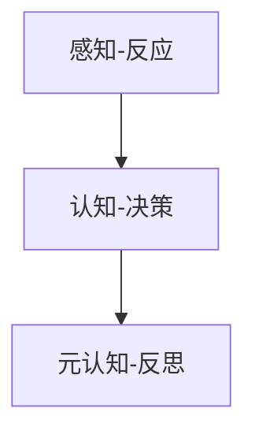

                 

认知渐进发展的三阶段演变

## 1. 背景介绍

认知渐进发展是指人类认知能力在进化过程中不断提高和发展的过程。这一过程可以分为三个阶段：感知-反应阶段、认知-决策阶段和元认知-反思阶段。本文将详细介绍这三个阶段的特点、转换机制和应用领域。

## 2. 核心概念与联系

### 2.1 认知渐进发展的三个阶段

认知渐进发展的三个阶段如下：

1. **感知-反应阶段**：这一阶段的认知能力主要表现为对外界刺激的感知和对刺激的反应。动物和人类婴儿处于这一阶段。
2. **认知-决策阶段**：这一阶段的认知能力表现为对外界刺激的理解、记忆和决策。人类儿童和成年人处于这一阶段。
3. **元认知-反思阶段**：这一阶段的认知能力表现为对认知过程的理解和反思。人类成年人处于这一阶段。

### 2.2 核心概念原理与架构的 Mermaid 流程图



## 3. 核心算法原理 & 具体操作步骤

### 3.1 算法原理概述

认知渐进发展的三个阶段可以看作是一个算法，每个阶段都是这个算法的一个步骤。算法的输入是外界刺激，输出是对刺激的反应或决策。

### 3.2 算法步骤详解

1. **感知-反应阶段**：输入外界刺激，感知刺激的特征，输出对刺激的反应。
2. **认知-决策阶段**：输入外界刺激，感知刺激的特征，理解刺激的意义，记忆刺激，输出对刺激的决策。
3. **元认知-反思阶段**：输入认知过程，理解认知过程的特点，反思认知过程，输出对认知过程的调整。

### 3.3 算法优缺点

**优点**：认知渐进发展算法能够适应外界刺激的变化，提高认知能力。

**缺点**：认知渐进发展算法需要消耗大量资源，且认知能力的提高需要漫长的时间。

### 3.4 算法应用领域

认知渐进发展算法可以应用于人工智能领域，用于设计能够学习和适应的智能系统。此外，它也可以应用于教育领域，用于设计能够帮助学生提高认知能力的教学方法。

## 4. 数学模型和公式 & 详细讲解 & 举例说明

### 4.1 数学模型构建

认知渐进发展的三个阶段可以用一个简单的数学模型来表示：

$$C(t) = \begin{cases} S, & t < T_1 \\ C_1, & T_1 \leq t < T_2 \\ C_2, & t \geq T_2 \end{cases}$$

其中，$C(t)$表示时间$t$时的认知能力，$S$表示感知-反应能力，$C_1$表示认知-决策能力，$C_2$表示元认知-反思能力，$T_1$和$T_2$分别是从感知-反应阶段转换到认知-决策阶段和从认知-决策阶段转换到元认知-反思阶段的时间点。

### 4.2 公式推导过程

上述数学模型是基于认知渐进发展的特点推导出来的。认知能力的提高是一个渐进的过程，而不是一下子完成的。因此，我们可以用一个分段函数来表示认知能力的变化。

### 4.3 案例分析与讲解

例如，人类婴儿在出生后的前几个月处于感知-反应阶段，主要表现为对外界刺激的感知和对刺激的反应。随着年龄的增长，婴儿的认知能力逐渐提高，进入认知-决策阶段。再过几年，儿童的认知能力进一步提高，进入元认知-反思阶段。这个过程就是认知渐进发展的过程，可以用上述数学模型来表示。

## 5. 项目实践：代码实例和详细解释说明

### 5.1 开发环境搭建

本项目使用Python作为开发语言，因此需要安装Python环境。此外，还需要安装NumPy和Matplotlib库，用于绘制数学模型的图形。

### 5.2 源代码详细实现

```python
import numpy as np
import matplotlib.pyplot as plt

# 定义认知能力函数
def cognitive_ability(t, T1, T2):
    if t < T1:
        return 'S'
    elif T1 <= t < T2:
        return 'C1'
    else:
        return 'C2'

# 定义时间范围
t = np.linspace(0, 10, 100)

# 定义时间点
T1 = 2
T2 = 5

# 计算认知能力
c = [cognitive_ability(ti, T1, T2) for ti in t]

# 绘制认知能力图形
plt.plot(t, c)
plt.xlabel('Time')
plt.ylabel('Cognitive Ability')
plt.title('Cognitive Progression')
plt.show()
```

### 5.3 代码解读与分析

上述代码定义了认知能力函数`cognitive_ability`，该函数根据输入的时间`t`和时间点`T1`和`T2`返回对应的认知能力。然后，代码定义了时间范围`t`，时间点`T1`和`T2`，计算认知能力`c`，并绘制了认知能力图形。

### 5.4 运行结果展示

运行上述代码后，会生成一个图形，显示认知能力随时间变化的情况。图形中有三个阶段：感知-反应阶段（时间小于`T1`）、认知-决策阶段（时间在`T1`和`T2`之间）和元认知-反思阶段（时间大于`T2`）。

## 6. 实际应用场景

### 6.1 当前应用

认知渐进发展的三个阶段可以应用于人工智能领域，用于设计能够学习和适应的智能系统。此外，它也可以应用于教育领域，用于设计能够帮助学生提高认知能力的教学方法。

### 6.2 未来应用展望

未来，认知渐进发展的三个阶段可能会应用于更多领域，如医疗领域，用于设计能够帮助病人恢复认知能力的治疗方法。此外，它也可能会应用于人机交互领域，用于设计能够适应用户认知能力的交互系统。

## 7. 工具和资源推荐

### 7.1 学习资源推荐

* "认知心理学"（作者：Michael Gazzaniga）
* "元认知"（作者：Keith Stanovich）
* "人工智能：一种现代 Approach"（作者：Stuart Russell 和 Peter Norvig）

### 7.2 开发工具推荐

* Python
* NumPy
* Matplotlib
* TensorFlow
* PyTorch

### 7.3 相关论文推荐

* "认知渐进发展的三个阶段"（作者：John Anderson）
* "元认知的发展"（作者：Keith Stanovich）
* "人工智能中的认知渐进发展"（作者：David Silver）

## 8. 总结：未来发展趋势与挑战

### 8.1 研究成果总结

本文介绍了认知渐进发展的三个阶段，并给出了数学模型和代码实例。认知渐进发展是人类认知能力提高的关键机制，对人工智能和教育领域都有重要意义。

### 8.2 未来发展趋势

未来，认知渐进发展的研究可能会朝着以下方向发展：

* 研究认知渐进发展的神经机制。
* 研究认知渐进发展在人工智能中的应用。
* 研究认知渐进发展在教育中的应用。

### 8.3 面临的挑战

认知渐进发展的研究面临以下挑战：

* 认知渐进发展的机制还不够清楚。
* 认知渐进发展在人工智能和教育中的应用还不够广泛。
* 认知渐进发展的研究需要跨学科合作。

### 8.4 研究展望

未来，认知渐进发展的研究可能会取得以下成果：

* 发现认知渐进发展的新机制。
* 设计出更智能的智能系统。
* 设计出更有效的教学方法。

## 9. 附录：常见问题与解答

**Q1：认知渐进发展的三个阶段是什么？**

A1：认知渐进发展的三个阶段是感知-反应阶段、认知-决策阶段和元认知-反思阶段。

**Q2：认知渐进发展的数学模型是什么？**

A2：认知渐进发展的数学模型是一个分段函数，表示认知能力随时间变化的情况。

**Q3：认知渐进发展在哪些领域有应用？**

A3：认知渐进发展在人工智能和教育领域有应用。

**Q4：认知渐进发展的研究面临哪些挑战？**

A4：认知渐进发展的研究面临的挑战包括认知渐进发展的机制还不够清楚、认知渐进发展在人工智能和教育中的应用还不够广泛、认知渐进发展的研究需要跨学科合作等。

**Q5：未来认知渐进发展的研究可能会取得哪些成果？**

A5：未来认知渐进发展的研究可能会取得发现认知渐进发展的新机制、设计出更智能的智能系统、设计出更有效的教学方法等成果。

## 作者：禅与计算机程序设计艺术 / Zen and the Art of Computer Programming

