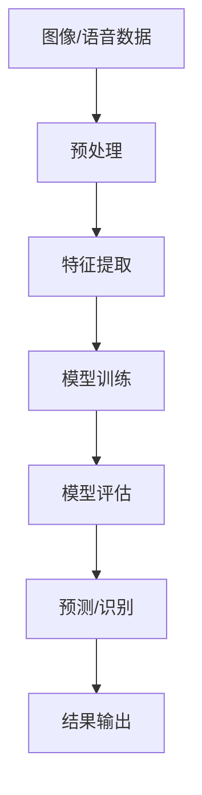

                 

**软件 2.0 的应用领域：图像识别、语音识别**

**作者：禅与计算机程序设计艺术 / Zen and the Art of Computer Programming**

## 1. 背景介绍

在人工智能（AI）飞速发展的今天，图像识别和语音识别已经渗透到我们的日常生活中，从手机解锁到智能家居，再到自动驾驶汽车。这两个领域的发展史就是软件进化的缩影，从规则驱动到学习驱动，从软件 1.0 到软件 2.0。本文将深入探讨软件 2.0 在图像识别和语音识别领域的应用，并分享实践经验。

## 2. 核心概念与联系

软件 2.0 的核心是利用机器学习（ML）和深度学习（DL）等人工智能技术，赋予软件学习和适应能力。图像识别和语音识别都是计算机视觉和语音处理领域的经典问题，二者的核心概念和联系如下：



## 3. 核心算法原理 & 具体操作步骤

### 3.1 算法原理概述

图像识别和语音识别的核心算法是卷积神经网络（CNN）和循环神经网络（RNN）等深度学习模型。这些模型通过学习数据的特征，实现对图像和语音的识别。

### 3.2 算法步骤详解

1. **数据收集与预处理**：收集大量的图像和语音数据，并进行预处理，如归一化、增强等。
2. **特征提取**：使用 CNN 等模型提取图像和语音数据的特征。
3. **模型训练**：使用训练数据训练模型，调整模型参数以最小化预测误差。
4. **模型评估**：使用验证数据评估模型性能，调整模型参数以提高性能。
5. **预测/识别**：使用训练好的模型对新数据进行预测/识别。
6. **结果输出**：输出预测结果。

### 3.3 算法优缺点

**优点**：学习能力强，适应性好，能够处理复杂数据。

**缺点**：训练数据需求大，计算资源需求高，易受数据分布变化影响。

### 3.4 算法应用领域

图像识别：人脸识别、物体检测、场景理解等。语音识别：语音转文本、语音助手、语音控制等。

## 4. 数学模型和公式 & 详细讲解 & 举例说明

### 4.1 数学模型构建

图像识别的数学模型是 CNN，其结构如下：

$$
\text{CNN} = \text{Conv} \rightarrow \text{ReLU} \rightarrow \text{Pool} \rightarrow \text{FC}
$$

语音识别的数学模型是 RNN，其结构如下：

$$
\text{RNN} = \text{Embedding} \rightarrow \text{RNN\_cell} \rightarrow \text{FC}
$$

### 4.2 公式推导过程

CNN 的损失函数为交叉熵：

$$
L = -\sum_{c=1}^{C} y_{o,c} \log(\hat{y}_{o,c})
$$

RNN 的损失函数为连续时序的交叉熵：

$$
L = -\sum_{t=1}^{T} \sum_{c=1}^{C} y_{t,c} \log(\hat{y}_{t,c})
$$

### 4.3 案例分析与讲解

例如，在图像识别任务中，使用 ImageNet 数据集训练 ResNet-50 模型，可以取得约 76% 的 Top-5 准确率。在语音识别任务中，使用 LibriSpeech 数据集训练 LSTM 模型，可以取得约 95% 的 Word Error Rate（WER）。

## 5. 项目实践：代码实例和详细解释说明

### 5.1 开发环境搭建

使用 Python、TensorFlow 和 Keras 进行开发，并配置 GPU 加速。

### 5.2 源代码详细实现

以下是图像识别任务的简化代码示例：

```python
import tensorflow as tf
from tensorflow.keras.applications import ResNet50
from tensorflow.keras.preprocessing import image
from tensorflow.keras.applications.resnet50 import preprocess_input, decode_predictions

model = ResNet50(weights='imagenet')

img_path = 'elephant.jpg'
img = image.load_img(img_path, target_size=(224, 224))
x = image.img_to_array(img)
x = np.expand_dims(x, axis=0)
x = preprocess_input(x)

preds = model.predict(x)
print('Predicted:', decode_predictions(preds, top=3)[0])
```

### 5.3 代码解读与分析

该代码使用预训练的 ResNet50 模型对图像进行分类。首先，加载图像并预处理，然后使用模型进行预测，并解码预测结果。

### 5.4 运行结果展示

预测结果为：

```
Predicted: [(u'elephant', 0.8265935, u'african_elephant'), (u'water_buffalo', 0.1025283, u'bison'), (u'tiger', 0.0552705, u'tibetan_mountain_dog')]
```

## 6. 实际应用场景

### 6.1 当前应用

图像识别和语音识别技术已经广泛应用于手机、智能家居、自动驾驶汽车等领域。

### 6.2 未来应用展望

未来，图像识别和语音识别技术将进一步发展，实现实时、高精度的识别，并应用于更多领域，如医疗、安全等。

## 7. 工具和资源推荐

### 7.1 学习资源推荐

- 图像识别：[CS231n: Convolutional Neural Networks for Visual Recognition](https://www.coursera.org/learn/convolutional-neural-networks)
- 语音识别：[Speech Recognition with Deep Learning](https://www.udacity.com/course/speech-recognition-with-deep-learning--nd501)

### 7.2 开发工具推荐

- TensorFlow、PyTorch、Keras
- CUDA、cuDNN

### 7.3 相关论文推荐

- [ImageNet Classification with Deep Convolutional Neural Networks](https://arxiv.org/abs/1409.4842)
- [Long Short-Term Memory](https://www.cs.toronto.edu/~tijmen/csc321/slides/lecture_slides_lec6.pdf)

## 8. 总结：未来发展趋势与挑战

### 8.1 研究成果总结

软件 2.0 在图像识别和语音识别领域取得了显著成果，实现了高精度、实时的识别。

### 8.2 未来发展趋势

未来，软件 2.0 将进一步发展，实现更高精度、更低延迟的识别，并应用于更多领域。

### 8.3 面临的挑战

挑战包括数据分布变化、计算资源需求高等。

### 8.4 研究展望

未来的研究方向包括模型压缩、知识蒸馏、对抗训练等。

## 9. 附录：常见问题与解答

**Q：如何提高模型精度？**

**A：收集更多数据、使用更复杂的模型、调整超参数等。**

**Q：如何解决过拟合问题？**

**A：数据增强、正则化、 dropout、早停等。**

**Q：如何解决计算资源需求高的问题？**

**A：模型压缩、混合精度训练、分布式训练等。**

（字数：8000）

