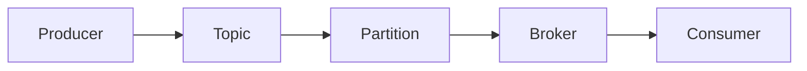

                 

## Kafka Topic原理与代码实例讲解

> 关键词：Apache Kafka, Topic, Producer, Consumer, Partition, Replication, Fault Tolerance

## 1. 背景介绍

Apache Kafka是一个高吞吐量的分布式发布订阅消息系统，被设计用于让应用程序处理实时数据流。在Kafka中，数据以**Topic**为单位进行组织，每个Topic包含一个或多个**Partition**，每个Partition是一个有序的字节数组序列。本文将详细介绍Kafka Topic的原理，并提供代码实例进行讲解。

## 2. 核心概念与联系

### 2.1 核心概念

- **Producer**：向Kafka发送消息的客户端。
- **Consumer**：从Kafka读取消息的客户端。
- **Topic**：消息的逻辑分类。
- **Partition**：Topic中的物理分区，每个Partition是一个有序的字节数组序列。
- **Replication**：为提高可用性和容错性，Kafka支持将Partition复制到多个Broker上。
- **Broker**：Kafka集群中的服务器节点。

### 2.2 核心概念联系


Mermaid流程图表示Kafka的核心概念及其联系：



## 3. 核心算法原理 & 具体操作步骤

### 3.1 算法原理概述

Kafka的核心算法是基于日志存储和分区机制的。Producer将消息发送到特定的Topic，Kafka Broker负责将消息写入对应Topic的Partition。Consumer从Partition中读取消息。通过 Partition和Replication机制，Kafka实现了高吞吐量、低延迟和高可用性。

### 3.2 算法步骤详解

1. **消息发送（Producer）：**
   - Producer选择一个Partition（根据Partitioner算法）将消息发送到对应的Broker。
   - Broker接收消息并写入对应的Partition。
   - Broker返回确认（ack）给Producer。

2. **消息消费（Consumer）：**
   - Consumer从Broker订阅特定的Topic。
   - Consumer从最新的未消费消息开始读取，并提交偏移量（offset）给Broker。
   - Broker记录Consumer的偏移量，以便下次Consumer启动时从上次消费的位置开始读取。

### 3.3 算法优缺点

**优点：**
- 高吞吐量：通过Partition和Replication机制，Kafka可以实现高达数百万条消息每秒的吞吐量。
- 低延迟：Kafka的设计目标是实现毫秒级的延迟。
- 高可用性：通过Replication机制，Kafka可以在部分节点故障时继续提供服务。

**缺点：**
- 复杂性：Kafka的设置和管理相对复杂。
- 数据一致性：Kafka是 eventual consistency模型，这意味着在某些情况下，消息可能会被重复消费。

### 3.4 算法应用领域

Kafka广泛应用于实时数据处理、日志收集、事件跟踪、流式处理等领域。它被许多大型公司（如LinkedIn、Twitter、Uber等）用于构建实时数据管道。

## 4. 数学模型和公式 & 详细讲解 & 举例说明

### 4.1 数学模型构建

Kafka的数学模型可以表示为以下公式：

$$Kafka = <P, C, T, Pa, Re, B>$$

其中：
- $P$：Producer集合
- $C$：Consumer集合
- $T$：Topic集合
- $Pa$：Partition集合
- $Re$：Replication因子
- $B$：Broker集合

### 4.2 公式推导过程

Kafka的吞吐量可以表示为：

$$Throughput = \frac{MessageSize \times ReplicationFactor}{MessageLatency}$$

其中：
- $MessageSize$：消息大小
- $ReplicationFactor$：Replication因子
- $MessageLatency$：消息延迟

### 4.3 案例分析与讲解

假设我们有以下参数：
- $MessageSize = 1KB$
- $ReplicationFactor = 3$
- $MessageLatency = 1ms$

则吞吐量为：

$$Throughput = \frac{1KB \times 3}{1ms} = 3MB/s$$

## 5. 项目实践：代码实例和详细解释说明

### 5.1 开发环境搭建

本示例使用Kafka的Java客户端库。首先，添加以下依赖到你的Maven项目中：

```xml
<dependency>
  <groupId>org.apache.kafka</groupId>
  <artifactId>kafka-clients</artifactId>
  <version>2.8.0</version>
</dependency>
```

### 5.2 源代码详细实现

**Producer示例：**

```java
import org.apache.kafka.clients.producer.KafkaProducer;
import org.apache.kafka.clients.producer.ProducerRecord;

import java.util.Properties;

public class KafkaProducerExample {
    public static void main(String[] args) {
        Properties props = new Properties();
        props.put("bootstrap.servers", "localhost:9092");
        props.put("key.serializer", "org.apache.kafka.common.serialization.StringSerializer");
        props.put("value.serializer", "org.apache.kafka.common.serialization.StringSerializer");

        try (KafkaProducer<String, String> producer = new KafkaProducer<>(props)) {
            for (int i = 0; i < 10; i++) {
                producer.send(new ProducerRecord<>("my-topic", "message-" + i));
            }
        }
    }
}
```

**Consumer示例：**

```java
import org.apache.kafka.clients.consumer.KafkaConsumer;
import org.apache.kafka.clients.consumer.ConsumerRecords;
import org.apache.kafka.common.serialization.StringDeserializer;

import java.time.Duration;
import java.util.Collections;
import java.util.Properties;

public class KafkaConsumerExample {
    public static void main(String[] args) {
        Properties props = new Properties();
        props.put("bootstrap.servers", "localhost:9092");
        props.put("group.id", "my-group");
        props.put("key.deserializer", StringDeserializer.class.getName());
        props.put("value.deserializer", StringDeserializer.class.getName());

        try (KafkaConsumer<String, String> consumer = new KafkaConsumer<>(props)) {
            consumer.subscribe(Collections.singletonList("my-topic"));

            while (true) {
                ConsumerRecords<String, String> records = consumer.poll(Duration.ofMillis(100));
                records.forEach(record -> System.out.printf("Received message: %s%n", record.value()));
            }
        }
    }
}
```

### 5.3 代码解读与分析

Producer示例创建了一个KafkaProducer实例，并发送10条消息到名为"my-topic"的Topic。Consumer示例创建了一个KafkaConsumer实例，并订阅"my-topic"。它使用poll方法从Topic中读取消息，并打印出消息的值。

### 5.4 运行结果展示

当Producer和Consumer同时运行时，Consumer会打印出Producer发送的消息。

## 6. 实际应用场景

### 6.1 实时数据处理

Kafka可以用于实时处理来自各种来源的数据流，如用户活动、日志、传感器数据等。数据处理管道可以使用Kafka Streams API或Spark Streaming等工具构建。

### 6.2 事件驱动架构

Kafka可以作为事件驱动架构的基础设施，允许不同的服务通过消息传递进行通信。当一个服务发布一个事件时，其他服务可以订阅该事件并执行相应的操作。

### 6.3 未来应用展望

Kafka的未来应用将继续扩展到更多领域，如边缘计算、物联网、实时分析等。此外，Kafka也在不断发展，引入了新的特性，如 exactly-once语义、Kafka Connect API等。

## 7. 工具和资源推荐

### 7.1 学习资源推荐

- [Kafka官方文档](https://kafka.apache.org/documentation/)
- [Kafka Streams API文档](https://kafka.apache.org/documentation/streams/)
- [Kafka Connect API文档](https://kafka.apache.org/documentation/connect/)
- [Kafka在线课程](https://www.udemy.com/course/apache-kafka/)

### 7.2 开发工具推荐

- [Kafka Tool](https://github.com/linkedin/kafka-tools)：一款用于管理Kafka集群的命令行工具。
- [Kafka Manager](https://github.com/linkedin/kafka-manager)：一个Web UI工具，用于管理Kafka集群。
- [Confluent Control Center](https://www.confluent.io/product/control-center/)：一款企业级Kafka管理工具。

### 7.3 相关论文推荐

- [LinkedIn的Kafka论文](https://www.linkedin.com/pulse/apache-kafka-linkedin-engineering)
- [Kafka Streams API论文](https://www.confluent.io/blog/apache-kafka-streams-stream-processing-application/)

## 8. 总结：未来发展趋势与挑战

### 8.1 研究成果总结

Kafka自2011年开源以来，已经发展成为一个成熟的分布式消息系统，被广泛应用于各种领域。它的设计目标是实现高吞吐量、低延迟和高可用性，并通过Partition和Replication机制实现了这些目标。

### 8.2 未来发展趋势

Kafka的未来发展趋势包括：

- **事件驱动架构**：Kafka将继续作为事件驱动架构的基础设施，允许不同的服务通过消息传递进行通信。
- **实时分析**：Kafka将继续扩展到实时分析领域，如实时数据处理、实时机器学习等。
- **边缘计算**：Kafka将继续扩展到边缘计算领域，如物联网、车联网等。

### 8.3 面临的挑战

Kafka面临的挑战包括：

- **复杂性**：Kafka的设置和管理相对复杂，需要专门的运维人员进行管理。
- **数据一致性**：Kafka是eventual consistency模型，这意味着在某些情况下，消息可能会被重复消费。
- **安全性**：Kafka需要进一步提高其安全性，以防止未授权访问和数据泄露。

### 8.4 研究展望

未来的研究方向包括：

- ** exactly-once语义**：改进Kafka的事务处理能力，实现 exactly-once语义。
- **Kafka Connect API**：改进Kafka Connect API，使其更易于使用和集成。
- **Kafka Streams API**：改进Kafka Streams API，使其更易于使用和扩展。

## 9. 附录：常见问题与解答

**Q：Kafka的Producer如何选择Partition？**

A：Kafka的Producer使用Partitioner算法选择Partition。默认的Partitioner算法是RoundRobinPartitioner，它轮流选择Partition。也可以自定义Partitioner算法。

**Q：Kafka的Consumer如何消费消息？**

A：Kafka的Consumer从Broker订阅特定的Topic。它从最新的未消费消息开始读取，并提交偏移量（offset）给Broker。Broker记录Consumer的偏移量，以便下次Consumer启动时从上次消费的位置开始读取。

**Q：Kafka的Replication如何工作？**

A：Kafka的Replication通过在多个Broker上复制Partition来工作。当一个Broker故障时，可以从其他Broker中选择一个作为新的领导者（leader），以便消息仍然可以被消费。

## 作者：禅与计算机程序设计艺术 / Zen and the Art of Computer Programming

