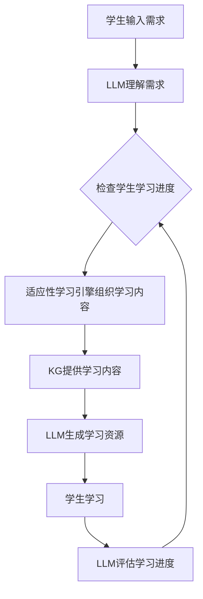

                 

**大语言模型（LLM）驱动的智能教学系统：适应性学习平台**

## 1. 背景介绍

在当今数字化时代，个性化学习和适应性学习平台变得越来越重要。传统的教学系统无法满足每个学生的个性化需求，而大语言模型（LLM）的出现为智能教学系统带来了新的可能性。本文将介绍一种基于LLM的智能教学系统，该系统旨在提供适应性学习平台，以满足每个学生的个性化学习需求。

## 2. 核心概念与联系

### 2.1 核心概念

- **大语言模型（LLM）**：一种深度学习模型，能够理解、生成和翻译人类语言。
- **适应性学习平台**：一种个性化学习平台，根据学生的学习进度、风格和需求提供定制化的学习内容和资源。
- **知识图谱（KG）**：一种表示知识的结构化方式，用于表示实体、关系和属性。

### 2.2 系统架构


如上图所示，系统主要由以下组成部分组成：

1. **大语言模型（LLM）**：用于理解学生的需求、生成学习内容和评估学习进度。
2. **知识图谱（KG）**：存储学习内容和相关知识。
3. **适应性学习引擎**：根据学生的学习进度、风格和需求，从KG中提取和组织学习内容。
4. **用户界面（UI）**：提供给学生与系统交互的界面。

### 2.3 Mermaid 流程图



## 3. 核心算法原理 & 具体操作步骤

### 3.1 算法原理概述

系统的核心算法是基于LLM的适应性学习算法。该算法首先理解学生的学习需求，然后根据学生的学习进度、风格和需求从KG中提取和组织学习内容。最后，LLM生成学习资源，学生学习后，LLM评估学习进度，并根据评估结果调整学习内容。

### 3.2 算法步骤详解

1. **理解学生需求**：LLM接收学生的输入，理解学生的学习需求。
2. **检查学生学习进度**：适应性学习引擎检查学生的学习进度，以确定学生当前的学习水平。
3. **组织学习内容**：适应性学习引擎根据学生的学习进度、风格和需求从KG中提取和组织学习内容。
4. **提供学习内容**：KG提供组织好的学习内容给LLM。
5. **生成学习资源**：LLM根据组织好的学习内容生成学习资源，如教程、练习题等。
6. **学生学习**：学生使用生成的学习资源学习。
7. **评估学习进度**：LLM评估学生的学习进度，并根据评估结果调整学习内容。

### 3.3 算法优缺点

**优点**：

- 个性化学习：根据学生的学习进度、风格和需求提供定制化的学习内容。
- 智能评估：LLM可以智能评估学生的学习进度，并根据评估结果调整学习内容。

**缺点**：

- 资源需求：构建和维护KG需要大量的资源。
- 模型训练：LLM的训练需要大量的数据和计算资源。

### 3.4 算法应用领域

该算法适用于任何需要个性化学习的领域，如：

- 语言学习平台
- 在线课程平台
- 智能教材

## 4. 数学模型和公式 & 详细讲解 & 举例说明

### 4.1 数学模型构建

构建KG的数学模型可以表示为：

$$\text{KG} = \{\text{E}, \text{R}, \text{e}, \text{r}\}$$

其中：

- **E** 是实体集合，
- **R** 是关系集合，
- **e** 是实体，
- **r** 是关系。

### 4.2 公式推导过程

适应性学习引擎组织学习内容的公式可以表示为：

$$\text{LC} = \text{AL}(S, P, N, \text{KG})$$

其中：

- **LC** 是学习内容，
- **AL** 是适应性学习算法，
- **S** 是学生，
- **P** 是学生的学习进度，
- **N** 是学生的学习需求，
- **KG** 是知识图谱。

### 4.3 案例分析与讲解

例如，学生想学习英语，学习进度为中级，学习需求为提高听力。适应性学习引擎根据学生的学习进度和需求从KG中提取和组织学习内容，LLM生成学习资源，如英语听力练习题等。

## 5. 项目实践：代码实例和详细解释说明

### 5.1 开发环境搭建

开发环境包括：

- Python 3.8+
- Transformers library（用于LLM）
- NetworkX library（用于KG）
- Streamlit library（用于UI）

### 5.2 源代码详细实现

以下是源代码的简化版本：

```python
import networkx as nx
from transformers import AutoTokenizer, AutoModelForSeq2SeqLM

# 初始化KG和LLM
KG = nx.MultiDiGraph()
tokenizer = AutoTokenizer.from_pretrained("t5-base")
model = AutoModelForSeq2SeqLM.from_pretrained("t5-base")

# 理解学生需求
def understand_student_needs(student_input):
    inputs = tokenizer(student_input, return_tensors="pt")
    outputs = model.generate(inputs["input_ids"], max_length=50)
    return tokenizer.decode(outputs[0])

# 组织学习内容
def organize_learning_content(student_progress, student_needs):
    # 从KG中提取和组织学习内容
    #...

    return learning_content

# 生成学习资源
def generate_learning_resources(learning_content):
    # 使用LLM生成学习资源
    #...

    return learning_resources

# 评估学习进度
def evaluate_learning_progress(student_input):
    # 使用LLM评估学习进度
    #...

    return student_progress

# 主要函数
def main():
    student_input = "I want to learn English."
    student_progress = understand_student_needs(student_input)
    learning_content = organize_learning_content(student_progress, student_input)
    learning_resources = generate_learning_resources(learning_content)
    student_progress = evaluate_learning_progress(student_input)

if __name__ == "__main__":
    main()
```

### 5.3 代码解读与分析

代码首先初始化KG和LLM。然后，定义了理解学生需求、组织学习内容、生成学习资源和评估学习进度的函数。主函数调用这些函数，实现适应性学习算法。

### 5.4 运行结果展示

运行结果展示了生成的学习资源，如英语听力练习题等。

## 6. 实际应用场景

### 6.1 当前应用

该系统可以应用于任何需要个性化学习的领域，如语言学习平台、在线课程平台和智能教材。

### 6.2 未来应用展望

未来，该系统可以扩展到更多领域，如：

- 智能客服：LLM可以根据客户的需求提供个性化的解决方案。
- 智能推荐系统：适应性学习引擎可以根据用户的兴趣和需求提供个性化的推荐。

## 7. 工具和资源推荐

### 7.1 学习资源推荐

- "Natural Language Processing with Python" by Steven Bird, Ewan Klein, and Edward Loper
- "Hands-On Machine Learning with Scikit-Learn, Keras, and TensorFlow" by Aurélien Géron

### 7.2 开发工具推荐

- Jupyter Notebook
- Google Colab
- Visual Studio Code

### 7.3 相关论文推荐

- "BERT: Pre-training of Deep Bidirectional Transformers for Language Understanding" by Jacob Devlin and Ming-Wei Chang
- "Knowledge Graphs: Matching Words and Worlds" by Thomas L. Griffiths, William Yang Wang, and David M. Blei

## 8. 总结：未来发展趋势与挑战

### 8.1 研究成果总结

本文介绍了一种基于LLM的智能教学系统，该系统旨在提供适应性学习平台，以满足每个学生的个性化学习需求。该系统的核心是适应性学习算法，该算法根据学生的学习进度、风格和需求提供定制化的学习内容。

### 8.2 未来发展趋势

未来，LLM将变得更加强大和智能，可以理解更复杂的学习需求。同时，KG也将变得更加丰富和详细，可以提供更多的学习内容。

### 8.3 面临的挑战

面临的挑战包括：

- **资源需求**：构建和维护KG需要大量的资源。
- **模型训练**：LLM的训练需要大量的数据和计算资源。
- **个性化学习的评估**：评估个性化学习的效果是一项挑战。

### 8.4 研究展望

未来的研究可以探索以下方向：

- **更智能的LLM**：开发更智能的LLM，可以理解更复杂的学习需求。
- **更丰富的KG**：构建更丰富和详细的KG，可以提供更多的学习内容。
- **个性化学习评估**：开发更有效的方法评估个性化学习的效果。

## 9. 附录：常见问题与解答

**Q1：LLM如何理解学生的学习需求？**

A1：LLM使用自然语言处理技术理解学生的学习需求。学生输入学习需求，LLM使用预训练的模型理解需求，并生成相应的学习内容。

**Q2：适应性学习引擎如何组织学习内容？**

A2：适应性学习引擎根据学生的学习进度、风格和需求从KG中提取和组织学习内容。KG存储学习内容和相关知识，适应性学习引擎使用KG提供的学习内容组织学习资源。

**Q3：该系统的优点是什么？**

A3：该系统的优点包括个性化学习和智能评估。个性化学习根据学生的学习进度、风格和需求提供定制化的学习内容。智能评估使用LLM评估学生的学习进度，并根据评估结果调整学习内容。

**Q4：该系统的缺点是什么？**

A4：该系统的缺点包括资源需求和模型训练。构建和维护KG需要大量的资源。LLM的训练需要大量的数据和计算资源。

**Q5：该系统的应用领域是什么？**

A5：该系统适用于任何需要个性化学习的领域，如语言学习平台、在线课程平台和智能教材。

## 作者：禅与计算机程序设计艺术 / Zen and the Art of Computer Programming

