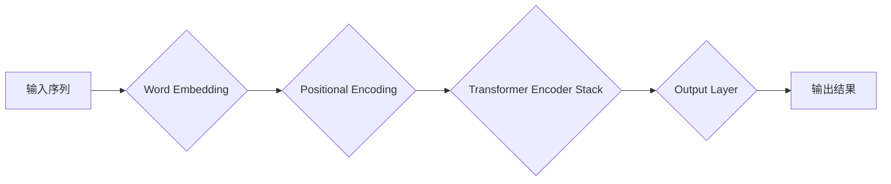

> BERT, 预训练, 微调, 自然语言处理, 大模型, Transformer, 语言模型

## 1. 背景介绍

近年来，深度学习在自然语言处理 (NLP) 领域取得了显著进展，其中大规模预训练语言模型 (Large-scale Pre-trained Language Models, LPLMs) 扮演着越来越重要的角色。这些模型通过在海量文本数据上进行预训练，学习了丰富的语言表示和语法结构，为下游任务提供了强大的基础。BERT (Bidirectional Encoder Representations from Transformers) 是其中最具代表性的模型之一，其强大的性能和灵活的微调机制，推动了 NLP 领域的发展。

传统的 NLP 模型通常需要针对特定任务进行专门训练，这需要大量的标注数据和计算资源。而预训练模型则可以先在通用文本数据上进行预训练，然后针对特定任务进行微调，大大降低了数据和计算成本。BERT 便是基于这种预训练微调思想的模型，它通过双向编码机制和 Transformer 架构，学习了更深层的语言表示，在各种 NLP 任务中都取得了优异的性能。

## 2. 核心概念与联系

### 2.1 BERT 模型架构

BERT 模型基于 Transformer 架构，它是一种新型的序列建模网络，能够有效捕捉长距离依赖关系。BERT 模型的核心是双向编码器 (Bidirectional Encoder)，它通过将输入序列中的每个词语都编码成上下文相关的向量表示，并利用这些向量表示进行下游任务的预测。

**BERT 模型架构流程图:**



### 2.2 预训练任务

BERT 模型通过两种预训练任务进行训练：

* **Masked Language Modeling (MLM):** 在输入序列中随机屏蔽一部分词语，然后让模型预测屏蔽词语的词义。
* **Next Sentence Prediction (NSP):** 给定两个句子，判断它们是否连续。

这两个预训练任务能够帮助 BERT 模型学习到丰富的语言表示和语法结构。

### 2.3 微调机制

BERT 模型的微调机制非常灵活，可以针对不同的下游任务进行微调。微调过程通常包括以下步骤：

1. 使用预训练好的 BERT 模型作为基础模型。
2. 在下游任务的特定数据集上进行微调训练。
3. 调整模型的输出层，使其能够输出下游任务所需的预测结果。

## 3. 核心算法原理 & 具体操作步骤

### 3.1 算法原理概述

BERT 模型的核心算法是 Transformer 架构，它是一种新型的序列建模网络，能够有效捕捉长距离依赖关系。Transformer 架构的核心组件是注意力机制 (Attention Mechanism) 和多头注意力 (Multi-Head Attention)。

* **注意力机制:** 允许模型关注输入序列中与当前词语相关的部分，从而更好地理解上下文信息。
* **多头注意力:** 使用多个注意力头，分别关注不同的方面，从而学习到更丰富的语义表示。

BERT 模型通过堆叠多个 Transformer Encoder 块，将输入序列编码成上下文相关的向量表示。

### 3.2 算法步骤详解

1. **输入处理:** 将输入序列转换为词语向量表示，并添加位置编码，以便模型能够区分词语的顺序。
2. **Transformer Encoder:** 将词语向量输入到 Transformer Encoder 中，通过多头注意力和前馈神经网络进行编码，生成上下文相关的词语表示。
3. **输出层:** 将编码后的词语表示输入到输出层，进行分类或预测。

### 3.3 算法优缺点

**优点:**

* 能够有效捕捉长距离依赖关系。
* 训练效率高，能够在大型数据集上进行训练。
* 微调机制灵活，适用于各种下游任务。

**缺点:**

* 计算资源需求高，训练成本较高。
* 模型参数量大，部署成本较高。

### 3.4 算法应用领域

BERT 模型在各种 NLP 任务中都取得了优异的性能，例如：

* **文本分类:** 情感分析、主题分类、垃圾邮件过滤等。
* **问答系统:** 构建能够回答用户问题的问答系统。
* **机器翻译:** 将一种语言翻译成另一种语言。
* **文本摘要:** 生成文本的简短摘要。

## 4. 数学模型和公式 & 详细讲解 & 举例说明

### 4.1 数学模型构建

BERT 模型的数学模型构建基于 Transformer 架构，其核心是注意力机制和多头注意力。

**注意力机制公式:**

$$
Attention(Q, K, V) = softmax(\frac{QK^T}{\sqrt{d_k}})V
$$

其中：

* $Q$：查询矩阵
* $K$：键矩阵
* $V$：值矩阵
* $d_k$：键向量的维度

**多头注意力公式:**

$$
MultiHead(Q, K, V) = Concat(head_1, head_2, ..., head_h)W^O
$$

其中：

* $head_i$：第 $i$ 个注意力头的输出
* $h$：注意力头的数量
* $W^O$：最终输出层的权重矩阵

### 4.2 公式推导过程

注意力机制的公式通过计算查询向量与键向量的点积，然后使用 softmax 函数进行归一化，得到每个键向量的权重。最后，将这些权重与值向量相乘，得到最终的注意力输出。

多头注意力机制通过使用多个注意力头，分别关注不同的方面，从而学习到更丰富的语义表示。每个注意力头的输出通过拼接和线性变换，得到最终的多头注意力输出。

### 4.3 案例分析与讲解

假设我们有一个句子 "The cat sat on the mat"，我们想要使用 BERT 模型来理解这个句子的语义。

1. 首先，BERT 模型会将每个词语转换为词语向量表示。
2. 然后，BERT 模型会使用注意力机制和多头注意力机制，来捕捉每个词语与其他词语之间的关系。
3. 最后，BERT 模型会将编码后的词语表示输入到输出层，进行分类或预测。

例如，我们可以使用 BERT 模型来判断 "cat" 和 "mat" 之间的关系。通过注意力机制，BERT 模型会发现 "cat" 和 "mat" 之间存在着 "on" 这个词语的连接，从而理解 "cat" 坐在 "mat" 上。

## 5. 项目实践：代码实例和详细解释说明

### 5.1 开发环境搭建

BERT 模型的开发环境搭建需要以下软件：

* Python 3.6+
* TensorFlow 或 PyTorch
* CUDA 和 cuDNN (如果使用 GPU)

### 5.2 源代码详细实现

BERT 模型的源代码可以从 Hugging Face 库中获取。

```python
from transformers import BertTokenizer, BertModel

# 加载预训练模型和词典
tokenizer = BertTokenizer.from_pretrained('bert-base-uncased')
model = BertModel.from_pretrained('bert-base-uncased')

# 对文本进行编码
input_text = "The cat sat on the mat."
encoded_input = tokenizer(input_text, return_tensors='pt')

# 将编码后的文本输入到模型中
output = model(**encoded_input)

# 获取模型输出
last_hidden_state = output.last_hidden_state
```

### 5.3 代码解读与分析

这段代码首先加载了预训练好的 BERT 模型和词典。然后，对输入文本进行编码，并将编码后的文本输入到模型中。最后，获取模型输出，其中 `last_hidden_state` 包含了每个词语的上下文相关的向量表示。

### 5.4 运行结果展示

BERT 模型的输出结果是一个包含每个词语上下文相关的向量表示的张量。这些向量表示可以用于各种下游任务，例如文本分类、问答系统等。

## 6. 实际应用场景

BERT 模型在各种实际应用场景中都取得了成功，例如：

* **搜索引擎:** 使用 BERT 模型来理解用户搜索意图，提高搜索结果的准确率。
* **聊天机器人:** 使用 BERT 模型来训练聊天机器人，使其能够更好地理解用户对话内容。
* **文本摘要:** 使用 BERT 模型来生成文本的简短摘要，例如新闻文章的摘要。

### 6.4 未来应用展望

BERT 模型的未来应用前景广阔，例如：

* **多模态理解:** 将 BERT 模型与其他模态数据 (例如图像、音频) 结合，实现多模态理解。
* **个性化推荐:** 使用 BERT 模型来理解用户的兴趣偏好，提供个性化推荐。
* **代码生成:** 使用 BERT 模型来生成代码，提高软件开发效率。

## 7. 工具和资源推荐

### 7.1 学习资源推荐

* **BERT 官方论文:** https://arxiv.org/abs/1810.04805
* **Hugging Face BERT 库:** https://huggingface.co/transformers/model_doc/bert.html
* **Stanford NLP Group:** https://nlp.stanford.edu/

### 7.2 开发工具推荐

* **TensorFlow:** https://www.tensorflow.org/
* **PyTorch:** https://pytorch.org/
* **Jupyter Notebook:** https://jupyter.org/

### 7.3 相关论文推荐

* **XLNet:** https://arxiv.org/abs/1906.08237
* **RoBERTa:** https://arxiv.org/abs/1907.11692
* **GPT-3:** https://openai.com/blog/gpt-3/

## 8. 总结：未来发展趋势与挑战

### 8.1 研究成果总结

BERT 模型的出现，标志着预训练语言模型在 NLP 领域取得了重大突破。BERT 模型的强大性能和灵活的微调机制，推动了 NLP 领域的发展，为各种下游任务提供了强大的基础。

### 8.2 未来发展趋势

未来，预训练语言模型的发展趋势包括：

* **更大的模型规模:** 训练更大的模型，学习更丰富的语言表示。
* **更广泛的数据来源:** 使用更多类型的文本数据进行预训练，例如代码、对话、新闻等。
* **更强大的计算能力:** 利用更强大的计算资源，训练更复杂的模型。
* **多模态理解:** 将预训练语言模型与其他模态数据 (例如图像、音频) 结合，实现多模态理解。

### 8.3 面临的挑战

预训练语言模型也面临着一些挑战，例如：

* **数据偏差:** 预训练模型可能受到训练数据中的偏差影响，导致模型输出存在偏见。
* **可解释性:** 预训练模型的内部机制复杂，难以解释模型的决策过程。
* **安全问题:** 预训练模型可能被用于生成恶意内容，例如虚假新闻、仇恨言论等。

### 8.4 研究展望

未来，研究人员将继续探索预训练语言模型的潜力，解决其面临的挑战，并将其应用于更多领域。预训练语言模型有望成为人工智能领域的重要发展方向，推动人工智能技术的发展和应用。

## 9. 附录：常见问题与解答

**Q1: BERT 模型的训练数据是什么？**

A1: BERT 模型的训练数据来自 Google 开放的 BooksCorpus 和 Wikipedia 数据集。

**Q2: BERT 模型的微调方法是什么？**

A2: BERT 模型的微调方法通常包括以下步骤：

1. 使用预训练好的 BERT 模型作为基础模型。
2. 在下游任务的特定数据集上进行微调训练。
3. 调整模型的输出层，使其能够输出下游任务所需的预测结果。

**Q3: BERT 模型的应用场景有哪些？**

A3: BERT 模型在各种 NLP 任务中都取得了优异的性能，例如：

* 文本分类
* 问答系统
* 机器翻译
* 文本摘要

**Q4: 如何使用 BERT 模型进行文本分类？**

A4: 使用 BERT 模型进行文本分类，需要将预训练好的 BERT 模型微调到文本分类任务上。

**Q