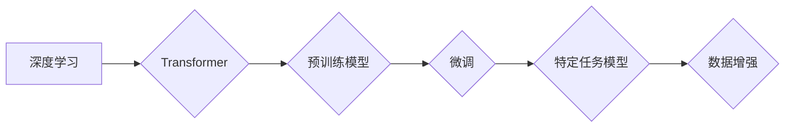

> 大模型、深度学习、Transformer、微调、自然语言处理、计算机视觉

## 1. 背景介绍

近年来，深度学习技术取得了飞速发展，尤其是在自然语言处理（NLP）和计算机视觉（CV）领域取得了突破性进展。这些进展离不开大模型的出现。大模型是指参数量巨大、训练数据海量、能够处理复杂任务的深度学习模型。

大模型的优势在于：

* **强大的泛化能力:** 大模型在海量数据上训练，能够学习到更丰富的知识和模式，从而在未见过的任务上表现出色。
* **多任务学习能力:** 大模型可以同时学习多个任务，提高资源利用率和模型效率。
* **可微调性:** 大模型可以针对特定任务进行微调，快速提升性能。

然而，大模型的训练和部署也面临着诸多挑战：

* **高昂的训练成本:** 大模型需要大量的计算资源和时间进行训练，成本非常高昂。
* **模型规模庞大:** 大模型的参数量巨大，部署和推理需要强大的硬件支持。
* **数据获取和标注困难:** 大模型的训练需要海量高质量数据，数据获取和标注成本高。

## 2. 核心概念与联系

大模型的开发和微调涉及到多个核心概念和技术，包括：

* **深度学习:** 深度学习是一种机器学习的子领域，利用多层神经网络学习数据特征。
* **Transformer:** Transformer是一种新型的深度学习架构，能够有效处理序列数据，在NLP领域取得了突破性进展。
* **微调:** 微调是指在预训练模型的基础上，针对特定任务进行参数调整，提高模型性能。
* **数据增强:** 数据增强是指通过对现有数据进行各种变换，增加训练数据的多样性，提高模型鲁棒性。

**核心概念与联系流程图:**



## 3. 核心算法原理 & 具体操作步骤

### 3.1  算法原理概述

Transformer是一种基于注意力机制的深度学习架构，能够有效处理序列数据，例如文本和音频。其核心特点是：

* **自注意力机制:** 自注意力机制能够捕捉序列中不同元素之间的关系，学习到更丰富的语义信息。
* **多头注意力:** 多头注意力机制使用多个注意力头，可以学习到不同层次的语义信息。
* **位置编码:** 位置编码机制能够将序列中的位置信息编码到模型中，保证模型能够理解序列的顺序关系。

### 3.2  算法步骤详解

Transformer的训练过程主要包括以下步骤：

1. **输入嵌入:** 将输入序列中的每个元素转换为向量表示。
2. **位置编码:** 将位置信息编码到向量表示中。
3. **多头注意力:** 使用多个注意力头计算序列中不同元素之间的关系。
4. **前馈网络:** 对注意力输出进行非线性变换。
5. **残差连接:** 将前馈网络的输出与输入相加，防止梯度消失。
6. **输出层:** 将最终的隐藏状态转换为输出序列。

### 3.3  算法优缺点

**优点:**

* **强大的序列建模能力:** Transformer能够有效捕捉序列中长距离依赖关系。
* **并行训练效率高:** Transformer的注意力机制可以并行计算，训练效率高。

**缺点:**

* **计算复杂度高:** Transformer的注意力机制计算量大，训练成本高。
* **参数量大:** Transformer的参数量巨大，部署和推理需要强大的硬件支持。

### 3.4  算法应用领域

Transformer在NLP和CV领域都有广泛的应用，例如：

* **自然语言理解:** 文本分类、情感分析、问答系统等。
* **机器翻译:** 自动翻译文本。
* **文本生成:** 自动写作、对话系统等。
* **图像识别:** 物体检测、图像分类等。

## 4. 数学模型和公式 & 详细讲解 & 举例说明

### 4.1  数学模型构建

Transformer的数学模型主要包括以下部分：

* **嵌入层:** 将输入序列中的每个元素转换为向量表示。
* **多头注意力层:** 计算序列中不同元素之间的关系。
* **前馈网络层:** 对注意力输出进行非线性变换。
* **位置编码层:** 将位置信息编码到向量表示中。

### 4.2  公式推导过程

Transformer的注意力机制公式如下：

$$
Attention(Q, K, V) = softmax(\frac{QK^T}{\sqrt{d_k}})V
$$

其中：

* $Q$：查询矩阵
* $K$：键矩阵
* $V$：值矩阵
* $d_k$：键向量的维度
* $softmax$：softmax函数

### 4.3  案例分析与讲解

假设我们有一个句子“我爱学习编程”，将其转换为向量表示，然后使用注意力机制计算每个词与其他词之间的关系。

通过注意力机制，我们可以发现“学习”和“编程”之间的关系比较密切，因为它们共同构成了一个主题。

## 5. 项目实践：代码实例和详细解释说明

### 5.1  开发环境搭建

* **操作系统:** Linux
* **编程语言:** Python
* **深度学习框架:** TensorFlow 或 PyTorch
* **硬件:** GPU

### 5.2  源代码详细实现

```python
import tensorflow as tf

# 定义Transformer模型
class Transformer(tf.keras.Model):
    def __init__(self, vocab_size, embedding_dim, num_heads, num_layers):
        super(Transformer, self).__init__()
        self.embedding = tf.keras.layers.Embedding(vocab_size, embedding_dim)
        self.transformer_layers = tf.keras.layers.StackedRNNCells([
            tf.keras.layers.MultiHeadAttention(num_heads=num_heads, key_dim=embedding_dim)
            for _ in range(num_layers)
        ])

    def call(self, inputs):
        # 嵌入层
        embedded = self.embedding(inputs)
        # Transformer层
        output = self.transformer_layers(embedded)
        return output

# 实例化模型
model = Transformer(vocab_size=10000, embedding_dim=128, num_heads=8, num_layers=6)

# 编译模型
model.compile(optimizer='adam', loss='mse')

# 训练模型
model.fit(x_train, y_train, epochs=10)
```

### 5.3  代码解读与分析

* **嵌入层:** 将输入序列中的每个词转换为向量表示。
* **Transformer层:** 使用多头注意力机制和前馈网络，学习序列中不同词之间的关系。
* **训练过程:** 使用训练数据训练模型，优化模型参数。

### 5.4  运行结果展示

训练完成后，可以使用测试数据评估模型性能。

## 6. 实际应用场景

### 6.1  自然语言处理

* **机器翻译:** Transformer模型可以用于自动翻译文本，例如Google Translate。
* **文本摘要:** Transformer模型可以用于自动生成文本摘要，例如新闻摘要、会议记录摘要。
* **对话系统:** Transformer模型可以用于构建对话系统，例如聊天机器人、虚拟助手。

### 6.2  计算机视觉

* **图像识别:** Transformer模型可以用于识别图像中的物体、场景和人物。
* **图像生成:** Transformer模型可以用于生成图像，例如艺术作品、产品设计。
* **视频分析:** Transformer模型可以用于分析视频内容，例如动作识别、事件检测。

### 6.4  未来应用展望

大模型在未来将应用于更多领域，例如：

* **医疗保健:** 辅助诊断、预测疾病风险。
* **金融科技:** 风险评估、欺诈检测。
* **教育:** 个性化学习、智能辅导。

## 7. 工具和资源推荐

### 7.1  学习资源推荐

* **书籍:**
    * 《深度学习》
    * 《Transformer模型详解》
* **在线课程:**
    * Coursera: 深度学习
    * Udacity: 自然语言处理

### 7.2  开发工具推荐

* **深度学习框架:** TensorFlow, PyTorch
* **编程语言:** Python
* **云计算平台:** AWS, Google Cloud, Azure

### 7.3  相关论文推荐

* 《Attention Is All You Need》
* 《BERT: Pre-training of Deep Bidirectional Transformers for Language Understanding》
* 《GPT-3: Language Models are Few-Shot Learners》

## 8. 总结：未来发展趋势与挑战

### 8.1  研究成果总结

近年来，大模型在NLP和CV领域取得了突破性进展，展现出强大的应用潜力。

### 8.2  未来发展趋势

* **模型规模继续扩大:** 模型参数量将继续增加，提升模型能力。
* **多模态学习:** 将文本、图像、音频等多种模态数据融合，构建更强大的模型。
* **可解释性研究:** 研究大模型的决策过程，提高模型可解释性。

### 8.3  面临的挑战

* **训练成本高昂:** 大模型的训练需要大量的计算资源和时间。
* **数据获取和标注困难:** 大模型的训练需要海量高质量数据。
* **模型安全性与可控性:** 大模型可能存在偏见、误导和攻击风险。

### 8.4  研究展望

未来，大模型研究将继续朝着更强大、更安全、更可解释的方向发展。


## 9. 附录：常见问题与解答

**Q1: 如何选择合适的深度学习框架？**

**A1:** TensorFlow和PyTorch是两个主流的深度学习框架，各有优缺点。TensorFlow更适合于生产环境，PyTorch更适合于研究和开发。

**Q2: 如何进行大模型的微调？**

**A2:** 微调是指在预训练模型的基础上，针对特定任务进行参数调整。可以通过调整学习率、训练集大小等参数来进行微调。

**Q3: 如何解决大模型的训练成本问题？**

**A3:** 可以使用云计算平台进行训练，利用GPU加速训练速度。还可以使用模型压缩和量化技术，降低模型参数量和计算复杂度。


作者：禅与计算机程序设计艺术 / Zen and the Art of Computer Programming 
<end_of_turn>