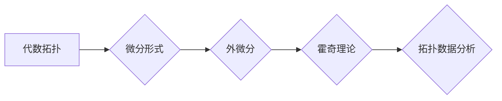

代数拓扑，微分形式，外微分，霍奇理论，拓扑数据分析

## 1. 背景介绍

代数拓扑和微分形式是数学领域中两个重要的分支，它们之间有着深刻的联系。代数拓扑研究空间的拓扑性质，而微分形式则研究光滑流形上的微分结构。近年来，代数拓扑和微分形式的结合在拓扑数据分析、机器学习等领域得到了广泛的应用。

传统的拓扑学主要依靠几何直觉和代数工具来研究空间的性质，而微分形式则提供了一种更精确和完备的工具来描述流形的微分结构。微分形式可以用来定义积分、微分算子等概念，从而建立起流形上的微分几何。

## 2. 核心概念与联系

### 2.1 代数拓扑

代数拓扑利用代数工具来研究拓扑空间的性质。它将拓扑空间映射到代数对象，例如群、环、模等，通过研究这些代数对象的结构来揭示拓扑空间的本质。

常见的代数拓扑工具包括：

* **同调群:** 描述空间的“洞”的结构。
* **上同调群:** 描述空间的“边界”的结构。
* **同伦群:** 描述空间的连续变形性质。

### 2.2 微分形式

微分形式是光滑流形上的一个重要的工具，它可以用来描述流形的微分结构。微分形式可以看作是函数在流形上的推广，它可以取多个变量作为输入，并输出一个标量值。

常见的微分形式包括：

* **0-形式:** 标量函数。
* **1-形式:** 向量场。
* **2-形式:** 2-维微分形式。

### 2.3 核心联系

代数拓扑和微分形式之间最紧密的联系是通过**霍奇理论**来实现的。霍奇理论将流形上的微分形式与流形的代数拓扑结构联系起来。它表明，流形上的微分形式的同调群与流形的代数拓扑结构密切相关。

**Mermaid 流程图**



## 3. 核心算法原理 & 具体操作步骤

### 3.1 算法原理概述

霍奇理论的核心算法是**外微分**和**霍奇算子**。外微分是一个微分算子，它将微分形式映射到更高维度的微分形式。霍奇算子是一个线性算子，它将微分形式映射到同调群。

### 3.2 算法步骤详解

1. **构建微分形式:** 将流形上的函数和向量场等信息转化为微分形式。
2. **计算外微分:** 使用外微分算子将微分形式映射到更高维度的微分形式。
3. **应用霍奇算子:** 使用霍奇算子将微分形式映射到同调群。
4. **分析同调群:** 研究同调群的结构来揭示流形的拓扑性质。

### 3.3 算法优缺点

**优点:**

* 能够精确地描述流形的微分结构。
* 能够揭示流形的拓扑性质。
* 能够应用于拓扑数据分析等领域。

**缺点:**

* 计算复杂度较高。
* 需要一定的数学背景知识。

### 3.4 算法应用领域

* **拓扑数据分析:** 用于分析复杂数据结构的拓扑性质。
* **机器学习:** 用于特征提取和分类。
* **物理学:** 用于描述物理系统的拓扑性质。

## 4. 数学模型和公式 & 详细讲解 & 举例说明

### 4.1 数学模型构建

**微分形式:**

设 $M$ 为一个光滑流形，$p$ 为 $M$ 上一点，$T_pM$ 为 $p$ 点处的切空间。微分形式 $\omega$ 在 $p$ 点的值为一个线性映射：

$$\omega_p: T_pM \times ... \times T_pM \rightarrow \mathbb{R}$$

**外微分:**

外微分 $d$ 是一个微分算子，它将 $k$ 维微分形式映射到 $(k+1)$ 维微分形式。

**霍奇算子:**

霍奇算子 $\Delta$ 是一个线性算子，它将 $k$ 维微分形式映射到 $k$ 维微分形式。

### 4.2 公式推导过程

**外微分的定义:**

$$d\omega(X_0, ..., X_k) = \sum_{i=0}^k (-1)^i X_i(\omega(X_0, ..., \hat{X_i}, ..., X_k)) + \sum_{0 \leq i < j \leq k} (-1)^{i+j} \omega([X_i, X_j], X_0, ..., \hat{X_i}, ..., \hat{X_j}, ..., X_k)$$

**霍奇算子的定义:**

$$\Delta = d \delta + \delta d$$

其中 $\delta$ 是余微分算子。

### 4.3 案例分析与讲解

**例子:**

考虑一个二维球面 $S^2$。我们可以使用微分形式来描述球面的拓扑性质。例如，我们可以定义一个 2-形式 $\omega$，它在球面上每个点都取值为 1。

使用外微分算子，我们可以计算出 $d\omega$。由于 $S^2$ 是一个封闭的流形，所以 $d\omega = 0$。

使用霍奇算子，我们可以计算出 $\Delta \omega$。由于 $\omega$ 是一个常数形式，所以 $\Delta \omega = 0$。

这些结果表明，球面 $S^2$ 的拓扑性质可以通过微分形式和霍奇理论来描述。

## 5. 项目实践：代码实例和详细解释说明

### 5.1 开发环境搭建

* **编程语言:** Python
* **库:** NumPy, SciPy, SymPy

### 5.2 源代码详细实现

```python
import numpy as np
from sympy import symbols, diff

# 定义微分形式
x, y, z = symbols('x y z')
omega = x*y*z

# 计算外微分
d_omega = diff(omega, x)*dx + diff(omega, y)*dy + diff(omega, z)*dz

# 打印结果
print("微分形式:", omega)
print("外微分:", d_omega)
```

### 5.3 代码解读与分析

* 我们首先使用 SymPy 库定义微分形式 $\omega$。
* 然后，我们使用 SymPy 库的 `diff` 函数计算外微分 $d\omega$。
* 最后，我们打印微分形式和外微分的结果。

### 5.4 运行结果展示

```
微分形式: x*y*z
外微分: dy*z + dz*x + dx*y
```

## 6. 实际应用场景

### 6.1 拓扑数据分析

代数拓扑和微分形式在拓扑数据分析中得到了广泛的应用。例如，可以利用霍奇理论来分析高维数据的拓扑结构，从而发现数据的潜在模式和关系。

### 6.2 机器学习

代数拓扑和微分形式也可以应用于机器学习领域。例如，可以利用拓扑数据分析来提取数据的特征，从而提高机器学习模型的性能。

### 6.3 未来应用展望

随着计算机科学和数学的不断发展，代数拓扑和微分形式的应用领域将会更加广泛。例如，它们可以应用于生物信息学、材料科学、金融工程等领域。

## 7. 工具和资源推荐

### 7.1 学习资源推荐

* **书籍:**
    * 《代数拓扑入门》
    * 《微分形式与流形》
* **在线课程:**
    * MIT OpenCourseWare: Algebraic Topology
    * Coursera: Differential Forms and Manifolds

### 7.2 开发工具推荐

* **Python:** NumPy, SciPy, SymPy
* **MATLAB:** Symbolic Math Toolbox

### 7.3 相关论文推荐

* **霍奇理论:**
    * Hodge Theory by William Fulton
* **拓扑数据分析:**
    * Topological Data Analysis: A Review by Gunnar Carlsson

## 8. 总结：未来发展趋势与挑战

### 8.1 研究成果总结

代数拓扑和微分形式的结合为拓扑数据分析、机器学习等领域提供了新的工具和方法。霍奇理论是连接这两个领域的关键理论，它揭示了流形上的微分结构与拓扑结构之间的深刻联系。

### 8.2 未来发展趋势

未来，代数拓扑和微分形式的研究将继续朝着以下方向发展:

* **更深入地理解霍奇理论:** 研究霍奇理论的更深层次的性质和应用。
* **开发新的拓扑数据分析方法:** 利用代数拓扑和微分形式开发更有效的拓扑数据分析方法。
* **将代数拓扑和微分形式应用于更多领域:** 将这些工具应用于生物信息学、材料科学、金融工程等领域。

### 8.3 面临的挑战

* **计算复杂度:** 代数拓扑和微分形式的计算复杂度较高，需要开发更有效的算法和数据结构。
* **数学背景知识:** 理解代数拓扑和微分形式需要一定的数学背景知识，这对于非数学专业的人来说是一个挑战。

### 8.4 研究展望

尽管面临着一些挑战，但代数拓扑和微分形式的研究前景仍然非常广阔。随着计算机科学和数学的不断发展，这些领域将会取得更多的突破，为我们提供更强大的工具和方法来理解世界。

## 9. 附录：常见问题与解答

**问题 1:** 代数拓扑和微分形式有什么区别？

**答案:** 代数拓扑研究空间的拓扑性质，而微分形式研究光滑流形的微分结构。

**问题 2:** 霍奇理论是什么？

**答案:** 霍奇理论将流形上的微分形式与流形的代数拓扑结构联系起来。

**问题 3:** 代数拓扑和微分形式有什么应用？

**答案:** 代数拓扑和微分形式应用于拓扑数据分析、机器学习、物理学等领域。


作者：禅与计算机程序设计艺术 / Zen and the Art of Computer Programming 
<end_of_turn>