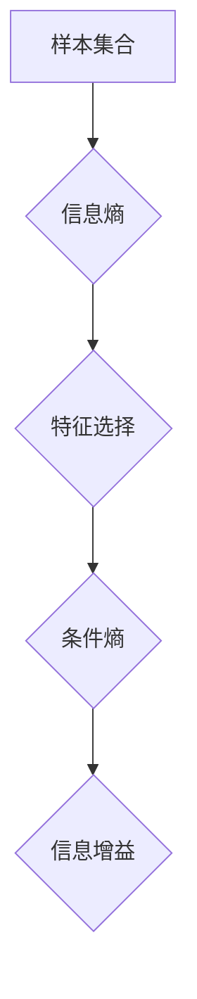

> 信息增益、决策树、ID3算法、熵、条件熵、特征选择、机器学习

## 1. 背景介绍

在机器学习领域，决策树算法凭借其易于理解、解释和实现的特点，成为了分类和回归任务中广泛应用的算法之一。决策树的构建过程的核心在于如何选择最优的特征进行划分，以最大程度地将数据分割成更纯净的类别。信息增益（Information Gain）作为一种重要的特征选择指标，在决策树算法中扮演着至关重要的角色。

信息增益的概念源于信息论，它衡量了通过选择某个特征进行划分，能够减少关于样本所属类别的不确定性。简单来说，信息增益越大，表示该特征在划分数据时越有效，能够带来越大的信息增益。

## 2. 核心概念与联系

### 2.1 信息熵（Entropy）

信息熵是衡量数据不确定性的指标，其值越大，表示数据的不确定性越大。在决策树算法中，信息熵通常用于衡量样本集合中不同类别的分布情况。

**公式：**

$$
H(S) = - \sum_{i=1}^{n} p_i \log_2 p_i
$$

其中：

* $S$ 表示样本集合
* $p_i$ 表示类别 $i$ 在样本集合 $S$ 中的比例

### 2.2 条件熵（Conditional Entropy）

条件熵是衡量在已知特征条件下，样本集合中不同类别的分布情况的不确定性。

**公式：**

$$
H(S|A) = \sum_{j=1}^{m} p_j H(S_{j})
$$

其中：

* $S$ 表示样本集合
* $A$ 表示特征
* $S_j$ 表示特征 $A$ 取值为 $j$ 的样本子集
* $p_j$ 表示特征 $A$ 取值为 $j$ 的概率

### 2.3 信息增益（Information Gain）

信息增益是衡量特征选择带来的信息减少量，即通过选择特征 $A$ 进行划分，能够减少关于样本所属类别的不确定性。

**公式：**

$$
Gain(S, A) = H(S) - H(S|A)
$$

其中：

* $S$ 表示样本集合
* $A$ 表示特征

**Mermaid 流程图：**



## 3. 核心算法原理 & 具体操作步骤

### 3.1 算法原理概述

ID3算法（Iterative Dichotomiser 3）是一种基于信息增益的决策树学习算法。其核心思想是选择信息增益最大的特征作为划分特征，递归地构建决策树。

### 3.2 算法步骤详解

1. **构建根节点：** 将所有样本作为根节点的训练数据。
2. **选择最优特征：** 计算每个特征的信息增益，选择信息增益最大的特征作为根节点的划分特征。
3. **构建子节点：** 根据选择的划分特征，将样本集合划分为多个子集，每个子集对应一个子节点。
4. **递归构建子树：** 对每个子节点重复步骤 2 和 3，直到满足停止条件。
5. **停止条件：** 常见的停止条件包括：
    * 所有样本属于同一类别。
    * 特征集为空。
    * 最大深度达到。

### 3.3 算法优缺点

**优点：**

* 易于理解和实现。
* 能够处理连续和离散特征。
* 能够生成可解释的决策树。

**缺点：**

* 容易过拟合。
* 对特征值数量敏感。
* 无法处理缺失值。

### 3.4 算法应用领域

ID3算法广泛应用于各种机器学习任务，例如：

* **分类：** 识别邮件是否为垃圾邮件、预测客户是否会购买产品等。
* **回归：** 预测房价、股票价格等。
* **数据挖掘：** 发现数据中的模式和趋势。

## 4. 数学模型和公式 & 详细讲解 & 举例说明

### 4.1 数学模型构建

信息增益模型可以表示为：

$$
Gain(S, A) = H(S) - \sum_{j=1}^{m} p_j H(S_j)
$$

其中：

* $S$ 表示样本集合
* $A$ 表示特征
* $p_j$ 表示特征 $A$ 取值为 $j$ 的概率
* $H(S_j)$ 表示特征 $A$ 取值为 $j$ 的样本子集 $S_j$ 的信息熵

### 4.2 公式推导过程

信息增益的推导过程如下：

1. **信息熵：** 信息熵 $H(S)$ 表示样本集合 $S$ 的不确定性。
2. **条件熵：** 条件熵 $H(S|A)$ 表示在已知特征 $A$ 的条件下，样本集合 $S$ 的不确定性。
3. **信息增益：** 信息增益 $Gain(S, A)$ 表示通过选择特征 $A$ 进行划分，能够减少关于样本所属类别的不确定性。

### 4.3 案例分析与讲解

假设我们有一个样本集合 $S$，包含以下数据：

| 样本 | 类别 |
|---|---|
| 1 | A |
| 2 | B |
| 3 | A |
| 4 | B |
| 5 | A |

我们选择特征 $A$ 进行划分，得到以下子集：

* $S_1$：样本 1, 3, 5，类别 A
* $S_2$：样本 2, 4，类别 B

计算信息熵和条件熵：

* $H(S) = - (3/5) \log_2 (3/5) - (2/5) \log_2 (2/5) = 0.971$
* $H(S|A) = (3/5) \log_2 (3/5) + (2/5) \log_2 (2/5) = 0.971$

因此，信息增益为：

* $Gain(S, A) = H(S) - H(S|A) = 0.971 - 0.971 = 0$

## 5. 项目实践：代码实例和详细解释说明

### 5.1 开发环境搭建

* Python 3.x
* scikit-learn 库

### 5.2 源代码详细实现

```python
from sklearn.tree import DecisionTreeClassifier
from sklearn.datasets import load_iris
from sklearn.model_selection import train_test_split

# 加载 iris 数据集
iris = load_iris()
X = iris.data
y = iris.target

# 将数据划分为训练集和测试集
X_train, X_test, y_train, y_test = train_test_split(X, y, test_size=0.2, random_state=42)

# 创建决策树模型
clf = DecisionTreeClassifier()

# 训练模型
clf.fit(X_train, y_train)

# 预测测试集结果
y_pred = clf.predict(X_test)

# 评估模型性能
from sklearn.metrics import accuracy_score
print(f"准确率: {accuracy_score(y_test, y_pred)}")
```

### 5.3 代码解读与分析

* **加载数据：** 使用 `load_iris()` 函数加载 iris 数据集。
* **数据划分：** 使用 `train_test_split()` 函数将数据划分为训练集和测试集。
* **创建模型：** 使用 `DecisionTreeClassifier()` 创建决策树模型。
* **训练模型：** 使用 `fit()` 方法训练模型。
* **预测结果：** 使用 `predict()` 方法预测测试集结果。
* **评估性能：** 使用 `accuracy_score()` 函数评估模型性能。

### 5.4 运行结果展示

运行代码后，会输出模型的准确率。

## 6. 实际应用场景

信息增益算法广泛应用于各种机器学习场景，例如：

* **文本分类：** 根据邮件内容判断是否为垃圾邮件。
* **图像识别：** 根据图像特征识别物体类别。
* **推荐系统：** 根据用户行为推荐感兴趣的商品。

### 6.4 未来应用展望

随着机器学习技术的不断发展，信息增益算法将在更多领域得到应用，例如：

* **医疗诊断：** 根据患者症状预测疾病类型。
* **金融风险评估：** 根据客户信息评估贷款风险。
* **智能家居：** 根据用户行为自动调节家居环境。

## 7. 工具和资源推荐

### 7.1 学习资源推荐

* **书籍：**
    * 《机器学习》 - 周志华
    * 《Python机器学习实战》 - 塞缪尔·阿布拉姆斯
* **在线课程：**
    * Coursera: Machine Learning
    * edX: Introduction to Artificial Intelligence

### 7.2 开发工具推荐

* **Python:** 
* **scikit-learn:** 机器学习库
* **TensorFlow:** 深度学习库
* **PyTorch:** 深度学习库

### 7.3 相关论文推荐

* **ID3 Algorithm:** Quinlan, J. R. (1986). Induction of decision trees. Machine learning, 1(1), 81-106.
* **Information Gain:** Shannon, C. E. (1948). A mathematical theory of communication. The Bell System Technical Journal, 27(3), 379-423.

## 8. 总结：未来发展趋势与挑战

### 8.1 研究成果总结

信息增益算法作为一种经典的特征选择方法，在决策树算法中发挥着重要作用。它能够有效地选择最优特征，提高决策树的学习效率和预测精度。

### 8.2 未来发展趋势

未来，信息增益算法的研究将朝着以下方向发展：

* **结合深度学习：** 将信息增益算法与深度学习模型结合，提高特征选择效率和准确性。
* **处理高维数据：** 研究针对高维数据的有效信息增益算法，提高算法的效率和鲁棒性。
* **考虑数据不确定性：** 研究考虑数据不确定性的信息增益算法，提高算法的泛化能力。

### 8.3 面临的挑战

信息增益算法也面临着一些挑战：

* **过拟合：** 信息增益算法容易过拟合训练数据，导致模型泛化能力差。
* **特征选择复杂度：** 当特征数量很多时，计算信息增益的复杂度会很高。
* **处理缺失值：** 信息增益算法难以处理缺失值。

### 8.4 研究展望

未来，我们将继续研究信息增益算法，探索其在机器学习中的更多应用，并解决其面临的挑战。


## 9. 附录：常见问题与解答

**1. 信息增益和基尼系数的区别是什么？**

信息增益和基尼系数都是特征选择指标，但它们衡量特征重要性的方式不同。信息增益衡量特征能够减少样本集合的不确定性，而基尼系数衡量特征能够划分样本集合的纯度。

**2. 如何处理缺失值？**

对于缺失值，可以采用以下几种方法：

* 删除包含缺失值的样本。
* 使用众数或均值填充缺失值。
* 使用其他缺失值处理方法，例如K-Nearest Neighbors (KNN) 算法。

**3. 如何避免过拟合？**

为了避免过拟合，可以采用以下几种方法：

* 使用交叉验证技术评估模型性能。
* 使用正则化技术惩罚模型复杂