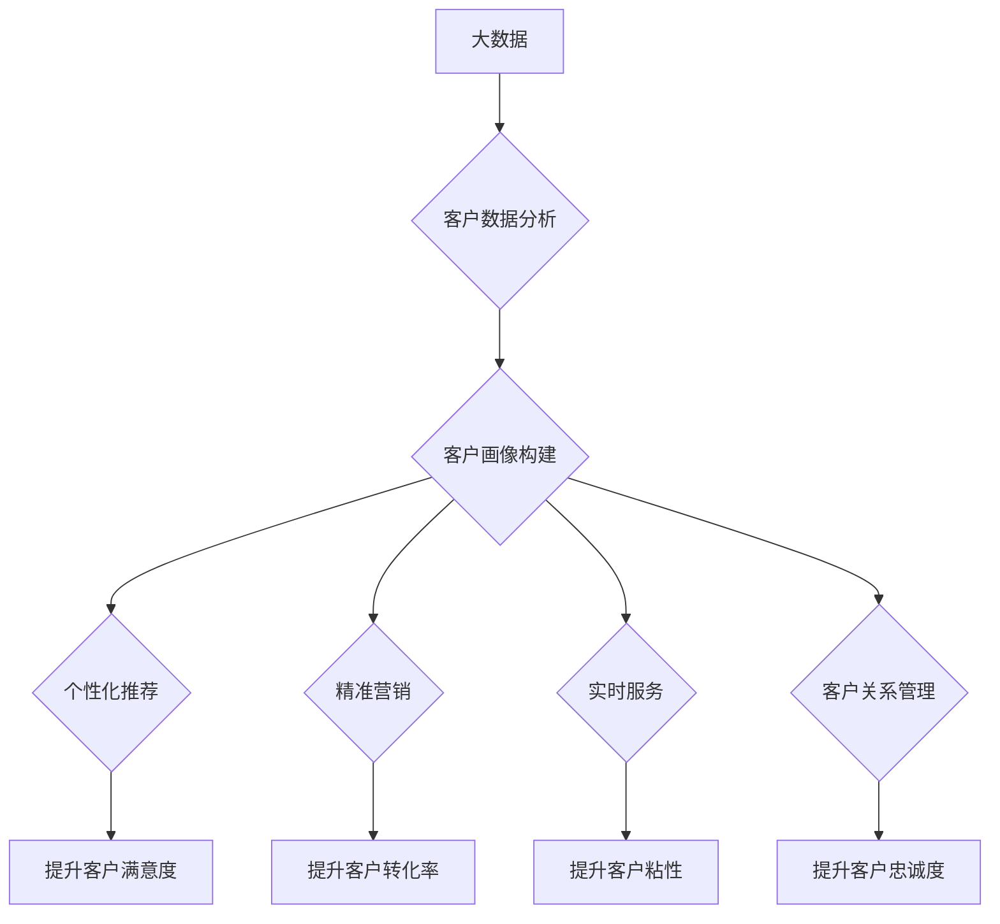

> 大数据，客户体验，信息差，商业模式，人工智能，机器学习，个性化推荐，精准营销

## 1. 背景介绍

在当今数字化时代，客户体验已成为企业竞争的核心要素。消费者拥有了更多的选择权和信息获取渠道，对产品和服务的期望也越来越高。企业需要不断提升客户体验，才能在激烈的市场竞争中脱颖而出。

信息差一直是商业模式的基础，而大数据技术的出现，则进一步缩小了信息差，为企业提供了更精准、更全面的客户洞察。通过大数据分析，企业可以深入了解客户的需求、行为和偏好，从而提供更个性化、更符合客户期望的体验。

## 2. 核心概念与联系

**2.1 大数据**

大数据是指海量、高速、多样化的数据，其特点是：

* **海量**: 数据量巨大，难以用传统方法处理。
* **高速**: 数据产生和更新速度快，需要实时处理。
* **多样化**: 数据类型多种多样，包括结构化数据、非结构化数据和半结构化数据。

**2.2 客户体验**

客户体验是指客户在与企业互动过程中所感受到的整体感受，包括产品、服务、品牌、沟通等各个方面。良好的客户体验可以提升客户满意度、忠诚度和购买意愿。

**2.3 信息差**

信息差是指企业和客户之间信息不对称的情况，企业掌握更多关于产品、服务和市场的信息，而客户则相对缺乏信息。

**2.4 大数据与客户体验的关系**

大数据可以帮助企业缩小信息差，通过分析客户数据，企业可以更深入地了解客户的需求和偏好，从而提供更个性化、更符合客户期望的体验。

**2.5 大数据如何打造卓越客户体验**

* **个性化推荐**: 根据客户的购买历史、浏览记录和兴趣爱好，推荐个性化的产品和服务。
* **精准营销**: 通过分析客户数据，精准地定位目标客户群体，进行精准的营销推广。
* **实时服务**: 利用大数据分析，预测客户需求，提供及时有效的服务。
* **客户关系管理**: 通过大数据分析，建立客户画像，了解客户的价值和需求，制定个性化的客户关系管理策略。

**Mermaid 流程图**



## 3. 核心算法原理 & 具体操作步骤

**3.1 算法原理概述**

在利用大数据打造卓越客户体验的过程中，许多算法发挥着关键作用。其中，一些常用的算法包括：

* **协同过滤**: 基于用户行为数据，推荐与用户兴趣相似的其他用户或商品。
* **内容过滤**: 基于商品或内容的特征，推荐与用户兴趣相似的商品或内容。
* **聚类分析**: 将用户或商品进行分组，识别用户群体的特征和需求。
* **关联规则挖掘**: 发现用户购买行为之间的关联关系，例如“购买A商品的用户也喜欢购买B商品”。

**3.2 算法步骤详解**

以协同过滤算法为例，其具体步骤如下：

1. **数据收集**: 收集用户行为数据，例如用户对商品的评分、购买记录、浏览记录等。
2. **数据预处理**: 对数据进行清洗、转换和格式化，例如处理缺失值、去除重复数据等。
3. **用户相似度计算**: 计算用户之间的相似度，例如使用余弦相似度或皮尔逊相关系数。
4. **推荐生成**: 根据用户与其他用户的相似度，推荐与相似用户喜欢的商品或内容。

**3.3 算法优缺点**

* **优点**: 能够提供个性化推荐，提升用户体验。
* **缺点**: 需要大量的用户行为数据，容易出现冷启动问题，即对于新用户或新商品难以进行推荐。

**3.4 算法应用领域**

协同过滤算法广泛应用于电商推荐、音乐推荐、电影推荐等领域。

## 4. 数学模型和公式 & 详细讲解 & 举例说明

**4.1 数学模型构建**

协同过滤算法的核心是计算用户之间的相似度。常用的相似度度量方法包括余弦相似度和皮尔逊相关系数。

**4.2 公式推导过程**

* **余弦相似度**:

$$
\text{相似度} = \frac{\mathbf{u} \cdot \mathbf{v}}{\|\mathbf{u}\| \|\mathbf{v}\|}
$$

其中，$\mathbf{u}$ 和 $\mathbf{v}$ 是两个用户的向量表示，$\cdot$ 表示点积，$\|\mathbf{u}\|$ 和 $\|\mathbf{v}\|$ 分别表示两个向量的模长。

* **皮尔逊相关系数**:

$$
\text{相似度} = \frac{\sum_{i=1}^{n}(u_i - \bar{u})(v_i - \bar{v})}{\sqrt{\sum_{i=1}^{n}(u_i - \bar{u})^2} \sqrt{\sum_{i=1}^{n}(v_i - \bar{v})^2}}
$$

其中，$u_i$ 和 $v_i$ 分别是两个用户对第 $i$ 个商品的评分，$\bar{u}$ 和 $\bar{v}$ 分别是两个用户的平均评分。

**4.3 案例分析与讲解**

假设有两个用户A和B，他们对三款商品的评分如下：

| 商品 | 用户A | 用户B |
|---|---|---|
| 商品1 | 5 | 4 |
| 商品2 | 3 | 5 |
| 商品3 | 4 | 3 |

我们可以使用余弦相似度或皮尔逊相关系数计算用户A和B之间的相似度。

## 5. 项目实践：代码实例和详细解释说明

**5.1 开发环境搭建**

* 操作系统：Linux/macOS/Windows
* Python 版本：3.6+
* 依赖库：pandas, numpy, scikit-learn

**5.2 源代码详细实现**

```python
import pandas as pd
from sklearn.metrics.pairwise import cosine_similarity

# 加载用户评分数据
data = pd.read_csv('user_ratings.csv')

# 计算用户之间的余弦相似度
user_similarity = cosine_similarity(data.T)

# 打印用户相似度矩阵
print(user_similarity)

# 根据用户相似度推荐商品
def recommend_items(user_id, top_n=5):
    # 获取用户相似用户
    similar_users = user_similarity[user_id].argsort()[:-top_n-1:-1]

    # 获取相似用户喜欢的商品
    recommended_items = data.iloc[similar_users].mean().sort_values(ascending=False).index

    return recommended_items

# 获取用户ID
user_id = 1

# 推荐商品
recommended_items = recommend_items(user_id)

# 打印推荐结果
print(f'推荐给用户 {user_id} 的商品：{recommended_items}')
```

**5.3 代码解读与分析**

* 代码首先加载用户评分数据，并使用scikit-learn库中的cosine_similarity函数计算用户之间的余弦相似度。
* 然后，定义了一个recommend_items函数，该函数根据用户ID和推荐数量，返回用户可能喜欢的商品。
* 函数首先获取用户相似用户的ID，然后获取相似用户喜欢的商品，并根据商品评分的平均值排序，返回前top_n个商品。

**5.4 运行结果展示**

运行代码后，会输出用户1可能喜欢的商品列表。

## 6. 实际应用场景

**6.1 电商推荐**

电商平台可以利用大数据分析用户购买历史、浏览记录和兴趣爱好，推荐个性化的商品，提升用户体验和转化率。

**6.2 内容推荐**

新闻网站、视频平台和社交媒体平台可以利用大数据分析用户阅读、观看和分享行为，推荐个性化的内容，提升用户粘性和参与度。

**6.3 个性化营销**

企业可以利用大数据分析客户数据，精准地定位目标客户群体，进行个性化的营销推广，提升营销效果。

**6.4 客户关系管理**

企业可以利用大数据分析客户数据，建立客户画像，了解客户的价值和需求，制定个性化的客户关系管理策略，提升客户忠诚度。

**6.5 未来应用展望**

随着大数据技术的不断发展，其在打造卓越客户体验方面的应用场景将更加广泛。例如，未来可能出现基于人工智能的个性化服务，能够根据用户的实时需求提供更加精准、更加智能化的服务。

## 7. 工具和资源推荐

**7.1 学习资源推荐**

* **书籍**:
    * 《大数据时代》
    * 《数据挖掘实战》
    * 《机器学习》
* **在线课程**:
    * Coursera: 数据科学
    * edX: 大数据分析
    * Udacity: 机器学习工程师

**7.2 开发工具推荐**

* **数据处理**: pandas, numpy
* **机器学习**: scikit-learn, TensorFlow, PyTorch
* **数据可视化**: matplotlib, seaborn

**7.3 相关论文推荐**

* 《协同过滤算法综述》
* 《基于大数据的客户体验管理》
* 《人工智能在客户体验中的应用》

## 8. 总结：未来发展趋势与挑战

**8.1 研究成果总结**

大数据技术为打造卓越客户体验提供了强大的工具和手段。通过分析客户数据，企业可以更深入地了解客户需求，提供更个性化、更符合客户期望的体验。

**8.2 未来发展趋势**

* **人工智能的应用**: 人工智能技术将进一步提升大数据分析的智能化水平，能够自动识别客户需求，提供更精准的推荐和服务。
* **数据安全和隐私保护**: 随着大数据应用的普及，数据安全和隐私保护问题日益突出，需要制定更加完善的法律法规和技术措施。
* **跨领域融合**: 大数据技术将与其他领域技术融合，例如物联网、云计算等，为客户体验创造更加丰富的场景和体验。

**8.3 面临的挑战**

* **数据质量**: 大数据分析的准确性依赖于数据质量，需要不断完善数据采集、清洗和处理流程。
* **算法复杂度**: 一些大数据分析算法非常复杂，需要强大的计算能力和专业人才进行开发和维护。
* **伦理问题**: 大数据分析可能会涉及到客户隐私和个人信息，需要谨慎处理，避免出现伦理问题。

**8.4 研究展望**

未来，大数据技术将继续推动客户体验的创新和发展，为企业创造新的商业价值。研究者需要不断探索新的算法和技术，解决大数据分析面临的挑战，并确保大数据技术应用的伦理性和可持续性。

## 9. 附录：常见问题与解答

**9.1 如何处理缺失数据？**

缺失数据可以通过以下方法处理：

* 删除含有缺失数据的样本
* 使用平均值、中位数或众数填充缺失值
* 使用机器学习算法进行缺失值预测

**9.2 如何评估推荐算法的性能？**

推荐算法的性能可以通过以下指标评估：

* 准确率
* 召回率
* F1-score
* NDCG

**9.3 如何保证数据安全和隐私保护？**

数据安全和隐私保护可以通过以下措施保障：

* 加密数据传输和存储
* 采用匿名化技术处理敏感数据
* 制定数据使用协议，明确数据使用范围和权限
* 遵守相关法律法规


作者：禅与计算机程序设计艺术 / Zen and the Art of Computer Programming 
<end_of_turn>