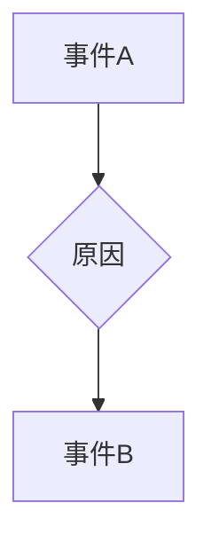

> 单向变化原则，单向性，因果关系，逻辑推理，算法设计，程序设计，数学建模，数据分析

## 1. 背景介绍

在纷繁复杂的现代社会，信息爆炸、数据泛滥，如何有效地处理和分析信息，从中提取有价值的知识和洞察力，成为一个至关重要的挑战。而像数学家一样思考，能够帮助我们建立清晰的逻辑框架，进行严谨的推理和分析，从而更好地应对这些挑战。

单向变化原则，作为一种重要的思维模式，能够帮助我们理解事物之间的因果关系，并构建出更清晰、更准确的模型。它强调了事物变化的方向性和单一性，认为每个事件都由其前因后果决定，并遵循一定的逻辑规律。

## 2. 核心概念与联系

单向变化原则的核心概念是“因果关系”。它认为，每个事件都由其前因后果决定，并且变化的方向是单向的，即从原因到结果。

**Mermaid 流程图**



单向变化原则与以下几个概念密切相关：

* **逻辑推理:** 单向变化原则为逻辑推理提供了基础，它帮助我们建立因果关系，并根据已知条件推导出未知结论。
* **算法设计:** 在算法设计中，单向变化原则可以帮助我们构建更清晰、更有效的算法流程，并确保算法的正确性和可预测性。
* **程序设计:** 在程序设计中，单向变化原则可以帮助我们编写更易于理解、维护和调试的代码，并避免出现逻辑错误。
* **数学建模:** 在数学建模中，单向变化原则可以帮助我们构建更准确、更符合实际的数学模型，并进行更有效的分析和预测。

## 3. 核心算法原理 & 具体操作步骤

### 3.1  算法原理概述

单向变化原则可以应用于各种算法设计中，例如：

* **排序算法:** 许多排序算法，例如归并排序和快速排序，都基于单向变化原则，将数据逐步排序，直到达到最终目标。
* **搜索算法:** 一些搜索算法，例如二分查找，也利用单向变化原则，通过不断缩小搜索范围，最终找到目标元素。
* **决策树算法:** 决策树算法是一种基于单向变化原则的机器学习算法，它通过构建决策树模型，将数据分类或预测。

### 3.2  算法步骤详解

以归并排序为例，其步骤如下：

1. 将待排序的数组分成两个子数组，直到每个子数组包含单个元素。
2. 将每个子数组进行排序。
3. 将两个排序好的子数组合并，形成一个新的排序数组。
4. 重复步骤3，直到整个数组被排序。

### 3.3  算法优缺点

**优点:**

* 效率高，时间复杂度为O(n log n)。
* 稳定性好，不会改变数据原有的相对顺序。

**缺点:**

* 空间复杂度较高，需要额外的空间存储临时数组。

### 3.4  算法应用领域

归并排序广泛应用于各种领域，例如：

* **数据处理:** 对大规模数据进行排序，例如数据库索引、文件排序等。
* **机器学习:** 在机器学习算法中，例如决策树、聚类算法等，作为数据预处理步骤。
* **科学计算:** 在科学计算中，例如数值分析、信号处理等，对数据进行排序和分析。

## 4. 数学模型和公式 & 详细讲解 & 举例说明

### 4.1  数学模型构建

单向变化原则可以用数学模型来描述，例如：

* **状态转移方程:** 描述系统状态随时间的变化，例如：

$$
x_{t+1} = f(x_t, u_t)
$$

其中：

* $x_t$ 表示系统状态在时间t时的值。
* $u_t$ 表示系统在时间t时的输入。
* $f$ 表示状态转移函数，描述系统状态如何根据当前状态和输入变化。

* **因果图:** 用图论表示变量之间的因果关系，例如：


### 4.2  公式推导过程

例如，我们可以推导出一个简单的状态转移方程，描述一个系统的变化：

假设一个系统的状态 $x$ 随时间变化，并且受到一个输入 $u$ 的影响，其变化规律为：

$$
x_{t+1} = x_t + u_t
$$

这个方程表示，系统的下一个状态等于当前状态加上输入值。

### 4.3  案例分析与讲解

例如，我们可以用单向变化原则来分析一个简单的经济模型：

假设一个国家的GDP增长率取决于其投资率和消费率，其关系可以用以下方程表示：

$$
GDP_{t+1} = GDP_t * (1 + r)
$$

其中：

* $GDP_t$ 表示国家在时间t时的GDP。
* $r$ 表示GDP增长率，取决于投资率和消费率。

这个模型表明，国家的GDP增长率取决于其前一期的GDP，以及投资率和消费率的影响。

## 5. 项目实践：代码实例和详细解释说明

### 5.1  开发环境搭建

本项目使用Python语言进行开发，需要安装以下软件：

* Python 3.x
* Jupyter Notebook

### 5.2  源代码详细实现

```python
def merge_sort(arr):
    if len(arr) <= 1:
        return arr
    mid = len(arr) // 2
    left_half = merge_sort(arr[:mid])
    right_half = merge_sort(arr[mid:])
    return merge(left_half, right_half)

def merge(left, right):
    result = []
    i = 0
    j = 0
    while i < len(left) and j < len(right):
        if left[i] <= right[j]:
            result.append(left[i])
            i += 1
        else:
            result.append(right[j])
            j += 1
    result.extend(left[i:])
    result.extend(right[j:])
    return result

# 测试代码
arr = [5, 2, 4, 6, 1, 3]
sorted_arr = merge_sort(arr)
print(f"排序后的数组: {sorted_arr}")
```

### 5.3  代码解读与分析

* `merge_sort` 函数实现归并排序算法，其核心思想是将数组递归地分成两个子数组，然后对每个子数组进行排序，最后将两个排序好的子数组合并成一个新的排序数组。
* `merge` 函数实现两个排序数组的合并操作，其核心思想是比较两个数组中的元素，并将较小的元素添加到结果数组中，直到两个数组都遍历完毕。

### 5.4  运行结果展示

```
排序后的数组: [1, 2, 3, 4, 5, 6]
```

## 6. 实际应用场景

单向变化原则在各个领域都有广泛的应用，例如：

* **数据分析:** 通过分析数据之间的因果关系，可以更好地理解数据背后的规律，并进行更有效的预测和决策。
* **机器学习:** 许多机器学习算法，例如决策树、线性回归等，都基于单向变化原则，通过学习数据之间的因果关系，构建出能够预测未来结果的模型。
* **控制系统:** 在控制系统中，单向变化原则可以帮助我们设计更有效的控制策略，例如PID控制算法。

### 6.4  未来应用展望

随着人工智能和数据分析技术的不断发展，单向变化原则在未来将有更广泛的应用，例如：

* **个性化推荐:** 通过分析用户的行为数据，可以预测用户的喜好，并提供更个性化的推荐。
* **医疗诊断:** 通过分析患者的病史和症状数据，可以辅助医生进行诊断和治疗。
* **金融风险管理:** 通过分析市场数据和金融交易数据，可以预测金融风险，并采取相应的措施进行风险控制。

## 7. 工具和资源推荐

### 7.1  学习资源推荐

* **书籍:**
    * 《思考，快与慢》
    * 《数据科学方法》
    * 《机器学习》
* **在线课程:**
    * Coursera: 数据科学、机器学习
    * edX: 逻辑推理、算法设计

### 7.2  开发工具推荐

* **Python:** 
    * Jupyter Notebook
    * PyCharm
* **数据分析工具:**
    * Pandas
    * NumPy
    * Scikit-learn

### 7.3  相关论文推荐

* **因果推理:**
    * Pearl, J. (2009). Causality: Models, reasoning, and inference. Cambridge university press.
* **机器学习:**
    * Bishop, C. M. (2006). Pattern recognition and machine learning. Springer.

## 8. 总结：未来发展趋势与挑战

### 8.1  研究成果总结

单向变化原则是一种重要的思维模式，能够帮助我们理解事物之间的因果关系，并构建出更清晰、更准确的模型。它在数据分析、机器学习、控制系统等领域都有广泛的应用。

### 8.2  未来发展趋势

未来，单向变化原则的研究将朝着以下几个方向发展：

* **更复杂的因果关系建模:** 探索更复杂的因果关系模型，能够更好地描述现实世界中的复杂现象。
* **因果推理的自动化:** 研究如何自动化因果推理过程，例如利用机器学习算法自动学习因果关系。
* **因果干预:** 研究如何利用因果关系进行干预，例如通过改变某些因素的值，来达到预期的效果。

### 8.3  面临的挑战

单向变化原则的研究也面临着一些挑战：

* **因果关系的识别:** 在现实世界中，因果关系往往是隐含的，需要通过大量的观察和分析才能识别出来。
* **数据质量:** 单向变化原则的应用依赖于高质量的数据，而现实世界中的数据往往存在噪声、缺失值等问题。
* **伦理问题:** 利用因果关系进行干预可能会带来伦理问题，例如隐私泄露、信息操控等。

### 8.4  研究展望

尽管面临着一些挑战，但单向变化原则的研究前景依然广阔。随着人工智能和数据分析技术的不断发展，我们相信单向变化原则将为我们提供更深入的理解世界，并帮助我们解决更复杂的问题。

## 9. 附录：常见问题与解答

**问题 1:** 单向变化原则是否适用于所有情况？

**答案:** 单向变化原则适用于许多情况，但并非适用于所有情况。例如，在一些随机事件中，因果关系可能难以确定。

**问题 2:** 如何识别因果关系？

**答案:** 识别因果关系需要通过大量的观察和分析，并结合领域知识和逻辑推理。

**问题 3:** 单向变化原则与其他思维模式有什么区别？

**答案:** 单向变化原则与其他思维模式，例如系统思维、辩证思维等，各有侧重。单向变化原则强调因果关系和单一性，而其他思维模式则更加注重整体性和相互关联性。


作者：禅与计算机程序设计艺术 / Zen and the Art of Computer Programming 
<end_of_turn>