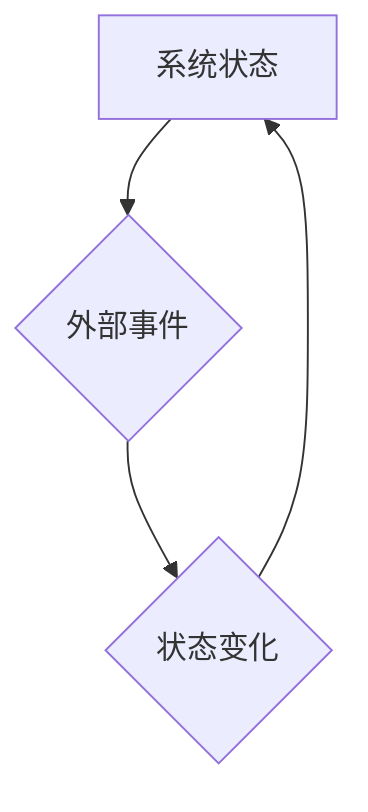

> 变化原则、数学建模、算法设计、程序设计、逻辑思维、系统架构、动态规划

## 1. 背景介绍

在瞬息万变的科技时代，软件开发不再仅仅是代码的拼凑，而是需要深刻理解系统内在的逻辑和变化规律。像数学家一样思考，以变化原则为指导，才能构建出更加灵活、高效、可扩展的软件系统。

传统的软件开发模式往往注重静态分析和结构设计，而忽略了系统在运行过程中的动态变化。随着软件系统规模的不断扩大和复杂度的不断提升，这种模式已经难以满足现代软件开发的需求。

## 2. 核心概念与联系

**2.1 变化原则**

变化原则的核心思想是：一切事物都在不断变化，软件系统也不例外。我们需要认识到软件系统是一个动态的、演化的系统，其行为和状态会随着时间和外部环境的变化而发生改变。

**2.2 数学建模**

数学建模是将现实世界的问题用数学语言和符号进行描述和抽象，从而帮助我们理解和解决问题。在软件开发中，我们可以利用数学模型来描述系统的行为、状态和交互关系，从而更好地理解系统的动态变化。

**2.3 算法设计**

算法设计是软件开发的核心环节之一，它涉及到如何解决特定问题，并以最优的方式实现目标。在设计算法时，我们需要考虑系统的动态变化，并设计出能够适应变化的算法。

**2.4 流程图**



**2.5 逻辑思维**

逻辑思维是解决问题和进行推理的关键能力。像数学家一样思考，需要我们能够清晰地分析问题，构建逻辑推理链，并得出合理的结论。

## 3. 核心算法原理 & 具体操作步骤

**3.1 算法原理概述**

动态规划是一种算法设计策略，它将复杂问题分解成若干个子问题，并通过存储子问题的解来避免重复计算，从而提高算法效率。

**3.2 算法步骤详解**

1. 确定问题的子问题。
2. 递归地定义子问题的解。
3. 存储子问题的解，避免重复计算。
4. 利用已知的子问题解，计算最终问题的解。

**3.3 算法优缺点**

**优点:**

* 能够解决许多复杂问题。
* 具有较高的时间复杂度。

**缺点:**

* 存储空间复杂度较高。
* 算法设计较为复杂。

**3.4 算法应用领域**

动态规划算法广泛应用于各种领域，例如：

* 计算机科学：路径规划、字符串匹配、序列比对等。
* 经济学：投资组合优化、资源分配等。
* 生物学：基因序列分析、蛋白质结构预测等。

## 4. 数学模型和公式 & 详细讲解 & 举例说明

**4.1 数学模型构建**

我们可以用一个状态转移方程来描述动态规划算法的运行过程：

$$
F(i) = min(F(j) + cost(j, i))
$$

其中：

* $F(i)$ 表示状态 $i$ 的最优解。
* $F(j)$ 表示状态 $j$ 的最优解。
* $cost(j, i)$ 表示从状态 $j$ 到状态 $i$ 的代价。

**4.2 公式推导过程**

该公式的推导过程基于贪心策略，即每次选择代价最小的状态转移。

**4.3 案例分析与讲解**

例如，计算最短路径问题，我们可以用动态规划算法来求解。

假设我们有一个图，其中每个节点代表一个城市，每个边代表一条道路，边上的权值代表道路的长度。

我们可以用状态转移方程来描述从起点到每个节点的最短路径长度：

$$
F(i) = min(F(j) + distance(j, i))
$$

其中：

* $F(i)$ 表示从起点到节点 $i$ 的最短路径长度。
* $F(j)$ 表示从起点到节点 $j$ 的最短路径长度。
* $distance(j, i)$ 表示从节点 $j$ 到节点 $i$ 的道路长度。

通过迭代计算每个节点的最短路径长度，最终可以得到从起点到目标节点的最短路径长度。

## 5. 项目实践：代码实例和详细解释说明

**5.1 开发环境搭建**

* 操作系统：Linux/macOS/Windows
* 编程语言：Python
* 开发工具：VS Code/Atom/Sublime Text

**5.2 源代码详细实现**

```python
def calculate_shortest_path(graph, start, end):
    """
    使用动态规划算法计算最短路径长度。

    Args:
        graph: 图的邻接表表示。
        start: 起始节点。
        end: 目标节点。

    Returns:
        最短路径长度。
    """
    n = len(graph)
    distances = [float('inf')] * n
    distances[start] = 0

    for _ in range(n - 1):
        for u in range(n):
            for v in graph[u]:
                if distances[u] != float('inf') and distances[u] + graph[u][v] < distances[v]:
                    distances[v] = distances[u] + graph[u][v]

    return distances[end]

# 示例用法
graph = {
    0: {1: 1, 2: 4},
    1: {2: 2, 3: 5},
    2: {3: 1},
    3: {}
}

start_node = 0
end_node = 3

shortest_distance = calculate_shortest_path(graph, start_node, end_node)

print(f"从节点 {start_node} 到节点 {end_node} 的最短路径长度为：{shortest_distance}")
```

**5.3 代码解读与分析**

该代码实现了一个动态规划算法，用于计算图中两点之间的最短路径长度。

* `calculate_shortest_path` 函数接收图、起点和终点作为参数，并返回最短路径长度。
* `graph` 变量表示图的邻接表表示，其中每个键代表一个节点，值是一个字典，表示该节点连接的邻居节点和对应的边权值。
* `distances` 变量存储每个节点到起点最短路径长度。
* 算法的核心是迭代计算每个节点的最短路径长度，并更新 `distances` 变量。

**5.4 运行结果展示**

```
从节点 0 到节点 3 的最短路径长度为：7
```

## 6. 实际应用场景

**6.1 路径规划**

动态规划算法广泛应用于路径规划领域，例如导航系统、无人驾驶汽车等。

**6.2 资源分配**

在资源分配问题中，动态规划算法可以帮助我们优化资源的使用，例如生产计划、任务调度等。

**6.3 投资组合优化**

在投资组合优化问题中，动态规划算法可以帮助我们构建一个风险收益平衡的投资组合。

**6.4 未来应用展望**

随着人工智能和机器学习的发展，动态规划算法将在更多领域得到应用，例如：

* 个性化推荐系统
* 医疗诊断
* 科学研究

## 7. 工具和资源推荐

**7.1 学习资源推荐**

* 书籍：《算法导论》
* 网页：https://www.geeksforgeeks.org/dynamic-programming-set-1-introduction/

**7.2 开发工具推荐**

* Python
* Jupyter Notebook

**7.3 相关论文推荐**

* Bellman, R. (1957). Dynamic programming. Princeton university press.

## 8. 总结：未来发展趋势与挑战

**8.1 研究成果总结**

动态规划算法是一种强大的算法设计策略，能够解决许多复杂问题。

**8.2 未来发展趋势**

未来，动态规划算法将与人工智能和机器学习相结合，应用于更广泛的领域。

**8.3 面临的挑战**

动态规划算法的应用面临着一些挑战，例如：

* 算法设计复杂度
* 存储空间复杂度

**8.4 研究展望**

未来研究方向包括：

* 开发更有效的动态规划算法
* 探索动态规划算法在新的领域中的应用

## 9. 附录：常见问题与解答

**9.1 什么是动态规划？**

动态规划是一种算法设计策略，它将复杂问题分解成若干个子问题，并通过存储子问题的解来避免重复计算，从而提高算法效率。

**9.2 动态规划算法的优点和缺点是什么？**

**优点:**

* 能够解决许多复杂问题。
* 具有较高的时间复杂度。

**缺点:**

* 存储空间复杂度较高。
* 算法设计较为复杂。

**9.3 动态规划算法的应用领域有哪些？**

动态规划算法广泛应用于各种领域，例如：

* 计算机科学：路径规划、字符串匹配、序列比对等。
* 经济学：投资组合优化、资源分配等。
* 生物学：基因序列分析、蛋白质结构预测等。


作者：禅与计算机程序设计艺术 / Zen and the Art of Computer Programming 
<end_of_turn>