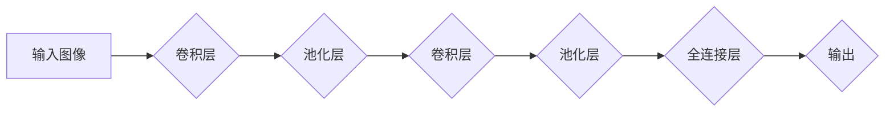

> 卷积神经网络 (CNN)
> 深度学习
> 图像识别
> 特征提取
> 滤波器

## 1. 背景介绍

卷积神经网络 (Convolutional Neural Network, CNN) 是一种专门设计用于处理图像和视频数据的深度学习模型。它以其强大的图像识别、分类和物体检测能力而闻名，在计算机视觉领域取得了突破性的进展。

传统的深度学习模型在处理图像数据时存在一些局限性，例如：

* **参数量过大：** 对于高分辨率图像，传统神经网络需要大量的参数来表示图像特征，导致模型训练复杂且容易过拟合。
* **缺乏空间不变性：** 传统的全连接神经网络无法有效地捕捉图像中的局部特征，对图像的旋转、缩放和平移等变换敏感。

卷积神经网络通过引入卷积操作和池化操作，有效地解决了这些问题。卷积操作可以提取图像中的局部特征，而池化操作可以降低模型的复杂度并提高其对图像变换的鲁棒性。

## 2. 核心概念与联系

卷积神经网络的核心概念包括：

* **卷积层 (Convolutional Layer)：** 使用卷积核 (Filter) 对图像进行卷积运算，提取图像的局部特征。
* **池化层 (Pooling Layer)：** 对卷积层的输出进行下采样，降低模型的复杂度并提高其对图像变换的鲁棒性。
* **全连接层 (Fully Connected Layer)：** 将卷积层和池化层的输出连接起来，进行最终的分类或回归任务。

**核心概念架构流程图：**



## 3. 核心算法原理 & 具体操作步骤

### 3.1  算法原理概述

卷积神经网络的核心算法是卷积操作和池化操作。

* **卷积操作：** 卷积操作使用一个称为卷积核 (Filter) 的小矩阵，在图像上滑动，并计算每个位置的卷积结果。卷积核可以学习到图像中的特征，例如边缘、纹理等。
* **池化操作：** 池化操作对卷积层的输出进行下采样，例如最大池化操作只保留每个区域的最大值，平均池化操作则计算每个区域的平均值。池化操作可以降低模型的复杂度并提高其对图像变换的鲁棒性。

### 3.2  算法步骤详解

1. **输入图像预处理：** 将输入图像调整到合适的尺寸，并进行归一化处理。
2. **卷积层：** 使用多个卷积核对图像进行卷积运算，提取图像的特征。每个卷积核对应一个特征图。
3. **池化层：** 对卷积层的输出进行池化操作，降低模型的复杂度。
4. **重复步骤 2 和 3：** 可以堆叠多个卷积层和池化层，以提取更深层次的特征。
5. **全连接层：** 将卷积层和池化层的输出连接起来，进行最终的分类或回归任务。

### 3.3  算法优缺点

**优点：**

* **强大的图像识别能力：** CNN 可以有效地提取图像中的特征，并进行分类或识别。
* **空间不变性：** CNN 对图像的旋转、缩放和平移等变换具有鲁棒性。
* **参数共享：** 卷积核在图像上滑动时共享参数，可以有效地减少模型参数量。

**缺点：**

* **训练时间长：** CNN 的训练时间相对较长，需要大量的计算资源。
* **数据依赖性强：** CNN 的性能取决于训练数据的质量和数量。

### 3.4  算法应用领域

CNN 在图像识别、物体检测、图像分类、人脸识别、医疗图像分析等领域都有广泛的应用。

## 4. 数学模型和公式 & 详细讲解 & 举例说明

### 4.1  数学模型构建

卷积神经网络的数学模型可以表示为一个多层神经网络，其中每一层都包含卷积层、池化层和全连接层。

* **卷积层：** 卷积层的输出可以表示为输入图像与卷积核的卷积运算结果。
* **池化层：** 池化层的输出可以表示为卷积层的输出经过池化操作的结果。
* **全连接层：** 全连接层的输出可以表示为池化层的输出经过全连接运算的结果。

### 4.2  公式推导过程

卷积操作的数学公式如下：

$$
y(i,j) = \sum_{m=0}^{M-1} \sum_{n=0}^{N-1} x(i+m,j+n) * w(m,n)
$$

其中：

* $y(i,j)$ 是卷积层的输出值。
* $x(i+m,j+n)$ 是输入图像的像素值。
* $w(m,n)$ 是卷积核的权值。
* $M$ 和 $N$ 是卷积核的大小。

### 4.3  案例分析与讲解

假设输入图像大小为 5x5，卷积核大小为 3x3，则卷积操作的结果是一个 3x3 的特征图。

## 5. 项目实践：代码实例和详细解释说明

### 5.1  开发环境搭建

* Python 3.x
* TensorFlow 或 PyTorch

### 5.2  源代码详细实现

```python
import tensorflow as tf

# 定义卷积神经网络模型
model = tf.keras.models.Sequential([
    tf.keras.layers.Conv2D(32, (3, 3), activation='relu', input_shape=(28, 28, 1)),
    tf.keras.layers.MaxPooling2D((2, 2)),
    tf.keras.layers.Conv2D(64, (3, 3), activation='relu'),
    tf.keras.layers.MaxPooling2D((2, 2)),
    tf.keras.layers.Flatten(),
    tf.keras.layers.Dense(10, activation='softmax')
])

# 编译模型
model.compile(optimizer='adam',
              loss='sparse_categorical_crossentropy',
              metrics=['accuracy'])

# 训练模型
model.fit(x_train, y_train, epochs=10)

# 评估模型
loss, accuracy = model.evaluate(x_test, y_test)
print('Test loss:', loss)
print('Test accuracy:', accuracy)
```

### 5.3  代码解读与分析

* **Conv2D层：** 用于进行卷积操作，提取图像特征。
* **MaxPooling2D层：** 用于进行池化操作，降低模型的复杂度。
* **Flatten层：** 用于将多维数据转换为一维数据。
* **Dense层：** 用于进行全连接操作，进行最终的分类或回归任务。

### 5.4  运行结果展示

训练完成后，可以评估模型的性能，例如准确率。

## 6. 实际应用场景

CNN 在图像识别、物体检测、图像分类、人脸识别、医疗图像分析等领域都有广泛的应用。

### 6.1  图像识别

CNN 可以用于识别图像中的物体，例如人、动物、车辆等。

### 6.2  物体检测

CNN 可以用于检测图像中物体的位置和类别。

### 6.3  图像分类

CNN 可以用于将图像分类到不同的类别，例如风景、人物、建筑等。

### 6.4  未来应用展望

CNN 的应用前景广阔，未来可能在以下领域得到更广泛的应用：

* **自动驾驶：** CNN 可以用于识别道路上的物体，帮助自动驾驶汽车安全行驶。
* **医疗诊断：** CNN 可以用于分析医学图像，辅助医生进行诊断。
* **机器人视觉：** CNN 可以用于帮助机器人理解周围环境，进行导航和操作。

## 7. 工具和资源推荐

### 7.1  学习资源推荐

* **书籍：**
    * Deep Learning by Ian Goodfellow, Yoshua Bengio, and Aaron Courville
    * Convolutional Neural Networks for Visual Recognition by Krizhevsky, Sutskever, and Hinton
* **在线课程：**
    * Coursera: Deep Learning Specialization
    * Udacity: Deep Learning Nanodegree

### 7.2  开发工具推荐

* **TensorFlow:** https://www.tensorflow.org/
* **PyTorch:** https://pytorch.org/

### 7.3  相关论文推荐

* AlexNet: ImageNet Classification with Deep Convolutional Neural Networks
* VGGNet: Very Deep Convolutional Networks for Large-Scale Image Recognition
* ResNet: Deep Residual Learning for Image Recognition

## 8. 总结：未来发展趋势与挑战

### 8.1  研究成果总结

卷积神经网络在图像识别领域取得了显著的进展，其性能不断提升，应用范围不断扩展。

### 8.2  未来发展趋势

* **更深层次的网络结构：** 研究更深层次的卷积神经网络，以提取更丰富的特征。
* **新的激活函数：** 开发新的激活函数，以提高模型的表达能力。
* **自监督学习：** 利用自监督学习方法，训练更强大的卷积神经网络。

### 8.3  面临的挑战

* **数据效率：** 卷积神经网络对训练数据的依赖性强，如何提高数据效率是一个重要的挑战。
* **可解释性：** 卷积神经网络的决策过程难以解释，如何提高模型的可解释性是一个重要的研究方向。
* **计算资源：** 训练大型卷积神经网络需要大量的计算资源，如何降低训练成本是一个重要的挑战。

### 8.4  研究展望

未来，卷积神经网络的研究将继续朝着更深层次、更有效、更可解释的方向发展，并在更多领域得到应用。

## 9. 附录：常见问题与解答

* **什么是卷积核？** 卷积核是一个小的矩阵，用于提取图像中的特征。
* **什么是池化操作？** 池化操作对卷积层的输出进行下采样，降低模型的复杂度。
* **如何选择卷积核的大小？** 卷积核的大小取决于图像的特征和模型的复杂度。
* **如何训练卷积神经网络？** 可以使用梯度下降算法训练卷积神经网络。


作者：禅与计算机程序设计艺术 / Zen and the Art of Computer Programming 
<end_of_turn>