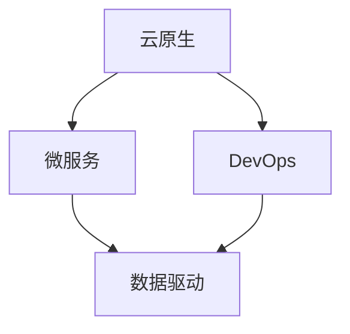

                 

**软件 2.0 的未来愿景：创造更美好的世界**

> 关键词：软件 2.0, 可持续性, 智能系统, 云原生, 微服务, DevOps, 数据驱动

## 1. 背景介绍

在信息技术飞速发展的今天，软件已经渗透到我们生活的方方面面，从智能手机到自动驾驶汽车，从在线金融到物联网，软件正在重塑我们的世界。然而，当前的软件开发模式面临着诸多挑战，包括开发效率低下、可维护性差、缺乏灵活性等。为了应对这些挑战，我们需要一种新的软件开发范式，一种能够创造更美好世界的软件 2.0。

## 2. 核心概念与联系

软件 2.0 的核心概念包括云原生、微服务、DevOps、数据驱动等。这些概念并不是孤立存在的，而是通过一系列关联关系构成了一个整体。下面是这些概念的 Mermaid 流程图：



- **云原生（Cloud Native）**：云原生是一种基于云平台构建、运行和管理应用的方法。它利用云平台的可扩展性和弹性，提供了更高的资源利用率和更低的成本。

- **微服务（Microservices）**：微服务是一种构建应用的方法，它将应用分解为一组小型、松耦合的服务。每个服务都有自己的数据库，可以独立部署和扩展。

- **DevOps**：DevOps 是一种软件开发方法，它将软件开发、测试和部署的各个阶段集成在一起，以提高软件交付的速度和质量。

- **数据驱动（Data-Driven）**：数据驱动是一种基于数据的决策方法。它利用数据分析和机器学习技术，从数据中提取见解，指导软件开发和运维。

## 3. 核心算法原理 & 具体操作步骤

### 3.1 算法原理概述

软件 2.0 的核心算法是一个反馈控制系统，它不断地收集数据，分析数据，并根据分析结果调整软件的行为。这个系统的目标是不断地优化软件的性能、可用性和可靠性。

### 3.2 算法步骤详解

1. **数据收集**：收集软件运行时的数据，包括性能指标、用户行为数据等。

2. **数据分析**：使用机器学习算法分析数据，预测软件的行为，发现潜在的问题。

3. **决策制定**：根据数据分析结果，制定决策，调整软件的行为。

4. **执行**：执行决策，调整软件的配置或代码。

5. **评估**：评估决策的效果，如果效果不佳，则回到数据收集步骤。

### 3.3 算法优缺点

**优点**：

- 自动化决策，提高了软件运维的效率。
- 及时发现和解决软件问题，提高了软件的可用性和可靠性。
- 通过数据驱动，提高了软件开发的质量。

**缺点**：

- 依赖于数据的质量和准确性。
- 可能会导致过度依赖于算法，忽略了人为因素。

### 3.4 算法应用领域

软件 2.0 的核心算法可以应用于各种软件领域，包括但不限于：

- 网络服务：自动调整服务器配置，优化网络流量。
- 在线金融：实时监控交易，防止欺诈行为。
- 物联网：远程监控设备，及时发现和解决故障。

## 4. 数学模型和公式 & 详细讲解 & 举例说明

### 4.1 数学模型构建

软件 2.0 的数学模型是一个动态系统，它描述了软件的状态、输入和输出。状态包括软件的配置、代码等。输入包括用户请求、环境变化等。输出包括软件的响应、日志等。

数学模型可以表示为以下形式：

$$S(t+1) = f(S(t), I(t))$$

其中，$S(t)$表示软件在时刻$t$的状态，$I(t)$表示时刻$t$的输入，$f$表示状态转移函数。

### 4.2 公式推导过程

状态转移函数$f$可以通过机器学习算法从数据中学习得到。具体过程如下：

1. 将软件的状态表示为特征向量$x$。
2. 将输入表示为特征向量$u$。
3. 使用回归算法，如线性回归或神经网络，学习状态转移函数$f(x, u)$。

### 4.3 案例分析与讲解

例如，在一个网络服务中，状态$S$包括服务器的配置、当前请求数等。输入$I$包括新的请求到达、环境温度等。状态转移函数$f$可以学习到，当请求数过多时，增加服务器数量；当环境温度过高时，降低服务器功率。

## 5. 项目实践：代码实例和详细解释说明

### 5.1 开发环境搭建

软件 2.0 的开发环境包括云平台、容器化平台、CI/CD平台等。下面是一个使用 Kubernetes、Jenkins 和 Prometheus 的开发环境的示例：

- **Kubernetes**：用于容器化和服务编排。
- **Jenkins**：用于自动化构建和部署。
- **Prometheus**：用于监控和数据收集。

### 5.2 源代码详细实现

以下是一个使用 Python 实现的简单数据收集和分析系统的示例：

```python
import prometheus_client

# 定义指标
REQUESTS = prometheus_client.Gauge('requests', 'Number of requests')

# 数据收集
def collect_data():
    # 从数据源收集数据
    data = get_data_from_source()
    # 更新指标
    REQUESTS.set(data['requests'])

# 数据分析
def analyze_data():
    # 从 Prometheus 收集数据
    data = prometheus_client.fetcher.fetcher.fetch_metric_families('http://localhost:9090')
    # 分析数据
    analysis = analyze_data_from_metric(data)
    # 返回分析结果
    return analysis

# 决策制定和执行
def make_decision(analysis):
    # 根据分析结果制定决策
    decision = make_decision_from_analysis(analysis)
    # 执行决策
    execute_decision(decision)
```

### 5.3 代码解读与分析

- `collect_data`函数用于收集数据。它从数据源收集数据，并更新 Prometheus 指标。
- `analyze_data`函数用于分析数据。它从 Prometheus 收集数据，并使用机器学习算法分析数据。
- `make_decision`函数用于决策制定和执行。它根据分析结果制定决策，并执行决策。

### 5.4 运行结果展示

运行结果展示可以通过 Prometheus 的 Grafana 面板实现。下面是一个示例面板：


## 6. 实际应用场景

### 6.1 当前应用

软件 2.0 的概念已经开始在一些领域得到应用，包括：

- **网络服务**：例如，Netflix使用微服务和DevOps构建了自己的网络服务平台。
- **在线金融**：例如，Ant Group使用云原生和数据驱动构建了自己的在线金融平台。
- **物联网**：例如，Amazon Web Services使用云原生和数据驱动构建了自己的物联网平台。

### 6.2 未来应用展望

未来，软件 2.0 将会应用于更多领域，包括：

- **自动驾驶**：软件 2.0 可以用于实时监控和调整自动驾驶系统。
- **智能城市**：软件 2.0 可以用于监控和优化城市基础设施。
- **太空探索**：软件 2.0 可以用于监控和维护太空探测器。

## 7. 工具和资源推荐

### 7.1 学习资源推荐

- **书籍**：《云原生应用架构》和《DevOps手册》是两本推荐的书籍。
- **在线课程**： Coursera 和 Udemy 上有许多云原生和DevOps的在线课程。

### 7.2 开发工具推荐

- **云平台**：AWS、Google Cloud Platform 和 Microsoft Azure 是三大主流云平台。
- **容器化平台**：Docker 和 Kubernetes 是两个流行的容器化平台。
- **CI/CD平台**：Jenkins 和 GitLab CI/CD 是两个流行的CI/CD平台。

### 7.3 相关论文推荐

- **云原生**：[Cloud-Native Computing Foundation](https://www.cncf.io/) 网站上有大量的相关论文。
- **DevOps**：[DevOps Research and Assessment](https://itrevolution.com/research/) 网站上有大量的相关论文。
- **数据驱动**：[KDnuggets](https://www.kdnuggets.com/) 网站上有大量的相关论文。

## 8. 总结：未来发展趋势与挑战

### 8.1 研究成果总结

软件 2.0 的研究成果包括云原生、微服务、DevOps、数据驱动等概念，以及基于这些概念的算法和工具。

### 8.2 未来发展趋势

未来，软件 2.0 的发展趋势包括：

- **边缘计算**：边缘计算可以将数据处理从云端移动到边缘设备，降低延迟，提高效率。
- **AI/MLOps**：AI/MLOps 是将机器学习集成到软件开发和运维中的方法。
- **多云和混合云**：多云和混合云是一种将云资源分布在多个云平台上的方法。

### 8.3 面临的挑战

软件 2.0 面临的挑战包括：

- **安全**：云原生和微服务增加了攻击面，安全成为一个严重的问题。
- **可靠性**：云原生和微服务增加了系统的复杂性，可靠性成为一个严重的问题。
- **成本**：云原生和微服务增加了资源消耗，成本成为一个严重的问题。

### 8.4 研究展望

未来的研究方向包括：

- **自适应系统**：自适应系统可以根据环境变化自动调整软件的行为。
- **自动化运维**：自动化运维可以通过机器学习和人工智能技术实现。
- **可解释的 AI/ML**：可解释的 AI/ML 可以帮助开发人员理解机器学习模型的决策过程。

## 9. 附录：常见问题与解答

**Q1：软件 2.0 和传统软件有什么区别？**

A1：软件 2.0 通过云原生、微服务、DevOps、数据驱动等概念，实现了软件的自动化、智能化和数据驱动化。传统软件则是通过手动配置和人工决策实现的。

**Q2：软件 2.0 适合什么样的应用？**

A2：软件 2.0 适合需要高可用、高可靠、高弹性的应用，例如网络服务、在线金融、物联网等。

**Q3：软件 2.0 的未来发展方向是什么？**

A3：软件 2.0 的未来发展方向包括边缘计算、AI/MLOps、多云和混合云等。

## 作者：禅与计算机程序设计艺术 / Zen and the Art of Computer Programming

