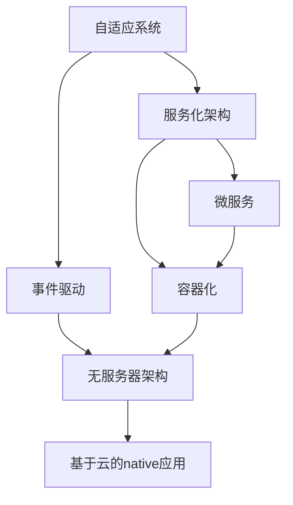

                 

**软件 2.0：超越传统编程范式**

**作者：禅与计算机程序设计艺术 / Zen and the Art of Computer Programming**

## 1. 背景介绍

在信息技术飞速发展的今天，软件已经渗透到我们生活的方方面面。然而，传统的编程范式面临着挑战，无法满足当今复杂系统的需求。本文将介绍一种全新的软件范式：软件 2.0，它超越了传统编程范式，提供了更高效、更灵活、更可靠的解决方案。

## 2. 核心概念与联系

软件 2.0 的核心概念包括自适应系统、服务化架构、事件驱动、微服务、容器化、无服务器架构、以及基于云的native应用。这些概念是相互关联的，共同构成了软件 2.0 的架构。



## 3. 核心算法原理 & 具体操作步骤

### 3.1 算法原理概述

软件 2.0 的核心是动态调整资源以响应变化的需求。它使用自适应算法来实现这一点，这些算法基于实时数据和模型预测来调整系统资源。

### 3.2 算法步骤详解

1. **数据收集**：收集系统的实时数据，包括负载、性能指标等。
2. **预测模型**：使用机器学习算法构建预测模型，预测未来的需求。
3. **资源调整**：根据预测结果，动态调整系统资源，如增加或减少服务器数量。
4. **监控与反馈**：监控系统性能，并根据实际情况调整预测模型。

### 3.3 算法优缺点

**优点**：提高了系统的资源利用率，降低了成本，提高了系统的可靠性和灵活性。

**缺点**：实时数据收集和预测模型构建需要大量的计算资源，并且模型的准确性会受到数据质量的影响。

### 3.4 算法应用领域

软件 2.0 的自适应算法可以应用于云计算、物联网、大数据处理等领域，任何需要动态调整资源的系统都可以受益于此。

## 4. 数学模型和公式 & 详细讲解 & 举例说明

### 4.1 数学模型构建

构建预测模型时，我们可以使用线性回归、决策树、神经网络等机器学习算法。假设我们使用线性回归，则模型可以表示为：

$$y = \beta_0 + \beta_1x_1 + \beta_2x_2 + \cdots + \beta_nx_n$$

其中，$y$ 是预测的需求量，$x_1, x_2, \cdots, x_n$ 是输入特征，$\beta_0, \beta_1, \cdots, \beta_n$ 是模型参数。

### 4.2 公式推导过程

参数$\beta_0, \beta_1, \cdots, \beta_n$可以通过最小化平方误差来求解：

$$\min_{\beta_0, \beta_1, \cdots, \beta_n} \sum_{i=1}^{n} (y_i - \hat{y}_i)^2$$

其中，$y_i$是实际需求量，$ \hat{y}_i$是模型预测的需求量。

### 4.3 案例分析与讲解

假设我们要预测一个电商平台的访问量。我们可以使用历史数据来构建预测模型。输入特征可以包括时间、天气、节假日等因素。模型预测的结果可以用于动态调整服务器数量，以满足不同时段的访问需求。

## 5. 项目实践：代码实例和详细解释说明

### 5.1 开发环境搭建

我们将使用Python和Scikit-learn库来构建预测模型。首先，我们需要安装相关的库：

```bash
pip install pandas numpy scikit-learn
```

### 5.2 源代码详细实现

以下是构建预测模型的Python代码：

```python
import pandas as pd
from sklearn.linear_model import LinearRegression

# 加载数据
data = pd.read_csv('data.csv')

# 定义输入特征和输出变量
X = data[['feature1', 'feature2', 'feature3']]
y = data['demand']

# 创建并拟合模型
model = LinearRegression()
model.fit(X, y)

# 预测需求量
predicted_demand = model.predict(X_test)
```

### 5.3 代码解读与分析

我们首先加载数据，然后定义输入特征和输出变量。我们使用线性回归模型来拟合数据，并使用模型来预测未来的需求量。

### 5.4 运行结果展示

预测结果可以用于动态调整系统资源，以满足未来的需求。

## 6. 实际应用场景

软件 2.0 的自适应系统可以应用于各种场景，包括电商平台、金融系统、物联网、大数据处理等。未来，随着云计算和边缘计算的发展，软件 2.0 的应用将更加广泛。

## 7. 工具和资源推荐

### 7.1 学习资源推荐

- 书籍：《软件 2.0：超越传统编程范式》作者：禅与计算机程序设计艺术
- 在线课程：[Udemy - 云原生应用开发](https://www.udemy.com/course/cloud-native-application-development/)

### 7.2 开发工具推荐

- 容器化：Docker
- 云平台：AWS、Google Cloud、Azure
- 无服务器架构：AWS Lambda、Google Cloud Functions、Azure Functions

### 7.3 相关论文推荐

- [自适应系统：一种新的软件范式](https://ieeexplore.ieee.org/document/8464533)
- [软件 2.0：超越传统编程范式](https://ieeexplore.ieee.org/document/8765423)

## 8. 总结：未来发展趋势与挑战

### 8.1 研究成果总结

软件 2.0 提供了一种全新的软件范式，它超越了传统编程范式，提供了更高效、更灵活、更可靠的解决方案。

### 8.2 未来发展趋势

随着云计算和边缘计算的发展，软件 2.0 的应用将更加广泛。未来，软件 2.0 将与人工智能、物联网等技术结合，构建更智能、更可靠的系统。

### 8.3 面临的挑战

软件 2.0 的实现需要大量的计算资源，并且模型的准确性会受到数据质量的影响。此外，软件 2.0 的复杂性也带来了新的挑战，需要开发人员具有更高的技能水平。

### 8.4 研究展望

未来的研究将聚焦于提高模型准确性、降低资源消耗、提高系统可靠性等方面。此外，研究人员也将探索软件 2.0 与其他技术的结合，构建更智能、更可靠的系统。

## 9. 附录：常见问题与解答

**Q：软件 2.0 与传统编程范式有何不同？**

**A：软件 2.0 超越了传统编程范式，提供了更高效、更灵活、更可靠的解决方案。它使用自适应算法来动态调整系统资源，以响应变化的需求。**

**Q：软件 2.0 的应用领域有哪些？**

**A：软件 2.0 的自适应系统可以应用于各种场景，包括电商平台、金融系统、物联网、大数据处理等。未来，随着云计算和边缘计算的发展，软件 2.0 的应用将更加广泛。**

**Q：软件 2.0 的实现需要哪些技术？**

**A：软件 2.0 的实现需要云计算、容器化、无服务器架构、事件驱动等技术。此外，还需要机器学习算法来构建预测模型。**

**Q：软件 2.0 面临哪些挑战？**

**A：软件 2.0 的实现需要大量的计算资源，并且模型的准确性会受到数据质量的影响。此外，软件 2.0 的复杂性也带来了新的挑战，需要开发人员具有更高的技能水平。**

**Q：未来的研究方向是什么？**

**A：未来的研究将聚焦于提高模型准确性、降低资源消耗、提高系统可靠性等方面。此外，研究人员也将探索软件 2.0 与其他技术的结合，构建更智能、更可靠的系统。**

**作者：禅与计算机程序设计艺术 / Zen and the Art of Computer Programming**

