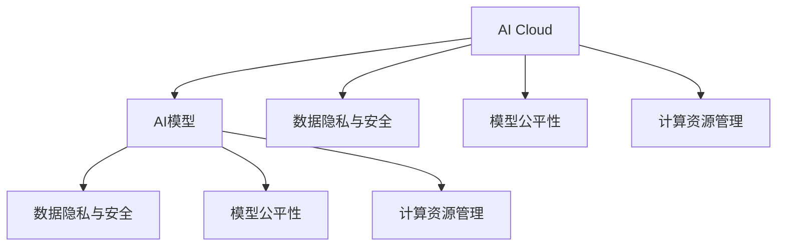
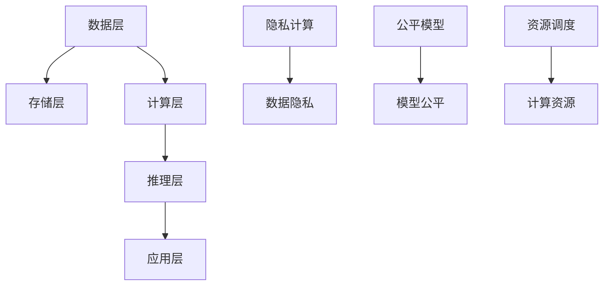

                 

# AI Cloud未来：贾扬清愿景，Lepton AI前景挑战

## 1. 背景介绍

### 1.1 问题由来

当前，人工智能(AI)技术正以前所未有的速度深入各行各业，其中AI Cloud作为支撑AI应用的重要基础设施，已成为技术发展的重要方向。然而，AI Cloud的发展仍面临诸多挑战，例如数据隐私与安全、模型公平性、计算资源管理等。这些问题的解决，需要业界的共同努力，并引入更多创新技术以应对复杂多变的需求。

贾扬清教授，作为深度学习领域的领军人物，提出了关于AI Cloud未来的诸多设想，指出应从数据和模型两个层面出发，确保AI应用的安全、可靠、高效和公平。本文将详细探讨贾扬清教授的AI Cloud愿景，并结合Lepton AI最新研究成果，讨论其在实际应用中的前景和面临的挑战。

### 1.2 问题核心关键点

贾扬清教授认为，AI Cloud的发展方向应该包括：
- 数据隐私与安全：保证用户数据安全，防止数据滥用和隐私泄露。
- 模型公平性：确保AI模型在不同群体中的公平性，避免算法歧视。
- 计算资源管理：优化计算资源分配，提高AI模型的推理效率和响应速度。

本文将重点关注这些关键点，探讨其在Lepton AI等先进技术框架中的应用，并展望AI Cloud的未来发展方向。

## 2. 核心概念与联系

### 2.1 核心概念概述

在探讨AI Cloud未来之前，我们需要先明确几个核心概念：

- **AI Cloud**：指通过云计算平台，提供AI模型、数据、计算资源的集成服务，使开发者能够快速构建和部署AI应用。
- **AI模型**：包含机器学习模型、深度学习模型、自然语言处理模型等，用于解决具体问题。
- **数据隐私与安全**：保证用户数据在传输、存储和处理过程中的安全性和隐私保护。
- **模型公平性**：确保AI模型在训练和推理过程中，对不同群体的表现一致，避免算法歧视。
- **计算资源管理**：优化计算资源的分配和使用，提升AI应用的性能和效率。

这些核心概念之间存在紧密联系，如图表所示：



AI Cloud作为AI模型的运行环境，在数据和计算资源的管控上起着至关重要的作用。数据隐私与安全、模型公平性和计算资源管理，共同构成了AI Cloud的核心能力。

### 2.2 核心概念原理和架构的 Mermaid 流程图

下面通过一个Mermaid流程图来进一步阐述AI Cloud的核心架构和各组件间的联系：



数据层负责数据的收集、存储和预处理；存储层提供数据存储服务；计算层负责模型的训练和推理；推理层用于模型的实时推理；应用层整合AI应用，提供给最终用户。

隐私计算、公平模型和资源调度，则是确保数据隐私与安全、模型公平性和计算资源管理的关键技术。

## 3. 核心算法原理 & 具体操作步骤

### 3.1 算法原理概述

AI Cloud的核心算法主要围绕数据隐私与安全、模型公平性和计算资源管理展开。

#### 3.1.1 数据隐私与安全

- **差分隐私**：通过对数据添加噪声，确保查询结果对个体数据的敏感度极低。
- **联邦学习**：模型在本地训练，仅传输梯度信息，防止模型泄露。

#### 3.1.2 模型公平性

- **公平性约束**：在模型训练过程中加入公平性约束，避免算法歧视。
- **公平性重构**：通过重构模型输出，确保不同群体间的公平性。

#### 3.1.3 计算资源管理

- **计算优化**：通过模型剪枝、量化等技术，优化模型结构，减少计算资源消耗。
- **资源调度**：根据任务需求，动态分配计算资源，提高资源利用率。

### 3.2 算法步骤详解

#### 3.2.1 数据隐私与安全

1. **数据收集与预处理**：
   - 对原始数据进行去标识化处理，减少敏感信息泄露的风险。
   - 对数据进行差分隐私处理，确保查询结果对个体数据的敏感度极低。

2. **联邦学习**：
   - 模型在本地进行训练，仅传输梯度信息，防止模型泄露。
   - 通过模型聚合算法，将本地模型参数进行汇总，更新全局模型。

3. **隐私计算**：
   - 采用多方安全计算等技术，确保数据在计算过程中不被泄露。
   - 对敏感数据进行加密处理，确保数据隐私。

#### 3.2.2 模型公平性

1. **公平性约束**：
   - 在模型训练过程中，加入公平性约束，防止算法歧视。
   - 使用公平性指标（如Equalized Odds、Demographic Parity等）评估模型公平性。

2. **公平性重构**：
   - 对模型输出进行公平性重构，确保不同群体间的公平性。
   - 使用公平性重构算法（如Fairness Through Awareness）进行输出修正。

#### 3.2.3 计算资源管理

1. **计算优化**：
   - 对模型进行剪枝、量化等优化，减少计算资源消耗。
   - 采用分布式计算等技术，加速模型推理。

2. **资源调度**：
   - 根据任务需求，动态分配计算资源，提高资源利用率。
   - 使用资源调度算法（如Kubernetes、TensorFlow Resource Manager等）进行优化。

### 3.3 算法优缺点

#### 3.3.1 数据隐私与安全

- **优点**：
  - 差分隐私和联邦学习能够确保数据隐私与安全，防止模型泄露和数据滥用。
  - 隐私计算技术可以确保数据在计算过程中不被泄露。

- **缺点**：
  - 差分隐私和隐私计算会增加数据处理的复杂性和计算成本。
  - 联邦学习在模型聚合过程中可能存在通信开销和延迟问题。

#### 3.3.2 模型公平性

- **优点**：
  - 公平性约束和公平性重构能够确保模型在不同群体中的公平性。
  - 公平性指标和公平性重构算法能够提供模型公平性的评估与修正手段。

- **缺点**：
  - 公平性约束和重构会增加模型的复杂度和计算成本。
  - 在实际应用中，模型的公平性评估和重构可能需要大量时间和计算资源。

#### 3.3.3 计算资源管理

- **优点**：
  - 计算优化和资源调度能够提高模型推理的效率和响应速度。
  - 分布式计算和资源调度算法能够充分利用计算资源，提升模型性能。

- **缺点**：
  - 计算优化和资源调度增加了模型部署的复杂性。
  - 分布式计算和资源调度算法可能面临通信开销和同步问题。

### 3.4 算法应用领域

AI Cloud的核心算法在数据隐私与安全、模型公平性和计算资源管理方面具有广泛的应用场景：

- **金融领域**：确保用户数据隐私与安全，防止数据泄露和滥用。
- **医疗领域**：保证患者数据隐私，确保模型公平性，避免算法歧视。
- **工业领域**：优化计算资源分配，提高模型推理效率和响应速度。
- **智慧城市**：确保数据隐私与安全，提升城市管理的智能化水平。

## 4. 数学模型和公式 & 详细讲解

### 4.1 数学模型构建

本节将使用数学语言对AI Cloud的核心算法进行更加严格的刻画。

#### 4.1.1 差分隐私

定义$\epsilon$差分隐私模型为：

$$
\begin{aligned}
L(&q;S) = \sum_{i=1}^{n} p(q(x_i) = y_i|S) \\
\text{s.t.} &\quad \left\| \frac{1}{\epsilon} D_q(S) \right\|_{\infty} \leq \delta
\end{aligned}
$$

其中，$q$ 为查询函数，$S$ 为数据集，$\epsilon$ 为隐私参数，$\delta$ 为差分隐私参数，$D_q(S)$ 为查询差分概率分布。

#### 4.1.2 公平性约束

公平性约束的目标函数为：

$$
\min_{\theta} L(\theta) = \frac{1}{2N} \sum_{i=1}^{N} (y_i - \hat{y}_i)^2
$$

其中，$\theta$ 为模型参数，$y_i$ 为真实标签，$\hat{y}_i$ 为模型预测标签。

### 4.2 公式推导过程

#### 4.2.1 差分隐私

$$
\begin{aligned}
L(&q;S) = \sum_{i=1}^{n} p(q(x_i) = y_i|S) \\
\text{s.t.} &\quad \left\| \frac{1}{\epsilon} D_q(S) \right\|_{\infty} \leq \delta
\end{aligned}
$$

其中，$D_q(S)$ 为查询差分概率分布：

$$
D_q(S) = \sum_{i=1}^{n} p(q(x_i) = y_i|S)
$$

差分隐私的目标是确保查询结果对个体数据的敏感度极低，即：

$$
\left\| \frac{1}{\epsilon} D_q(S) \right\|_{\infty} \leq \delta
$$

其中，$\left\| \cdot \right\|_{\infty}$ 为无穷范数。

#### 4.2.2 公平性约束

公平性约束的目标函数为：

$$
\min_{\theta} L(\theta) = \frac{1}{2N} \sum_{i=1}^{N} (y_i - \hat{y}_i)^2
$$

其中，$\theta$ 为模型参数，$y_i$ 为真实标签，$\hat{y}_i$ 为模型预测标签。

公平性约束的目标是确保模型在不同群体中的表现一致，避免算法歧视。

### 4.3 案例分析与讲解

以医疗领域的患者数据为例，分析差分隐私和公平性约束的应用。

#### 4.3.1 差分隐私

在医疗领域，患者数据隐私保护至关重要。假设有100个患者的基因数据，每个基因数据包含100个特征，每个特征有10个取值。

使用$\epsilon$差分隐私保护查询结果，设$\epsilon=0.1$，查询函数为$q(x_i) = \text{avg}(x_i)$，则查询差分概率分布为：

$$
D_q(S) = \sum_{i=1}^{100} p(\text{avg}(x_i) = y_i|S)
$$

差分隐私目标函数为：

$$
\left\| \frac{1}{\epsilon} D_q(S) \right\|_{\infty} \leq \delta
$$

其中，$\delta=0.1$。

#### 4.3.2 公平性约束

在医疗领域，公平性约束同样重要。假设有10个患者的基因数据，其中5个患者的基因数据属于群体A，5个患者的基因数据属于群体B。

使用公平性约束，设$\theta$为模型参数，$y_i$为真实标签，$\hat{y}_i$为模型预测标签，则公平性约束的目标函数为：

$$
\min_{\theta} L(\theta) = \frac{1}{2N} \sum_{i=1}^{N} (y_i - \hat{y}_i)^2
$$

其中，$N=10$，$y_i$为真实标签，$\hat{y}_i$为模型预测标签。

## 5. 项目实践：代码实例和详细解释说明

### 5.1 开发环境搭建

在进行AI Cloud项目实践前，我们需要准备好开发环境。以下是使用Python进行PyTorch开发的环境配置流程：

1. 安装Anaconda：从官网下载并安装Anaconda，用于创建独立的Python环境。

2. 创建并激活虚拟环境：
```bash
conda create -n ai-env python=3.8 
conda activate ai-env
```

3. 安装PyTorch：根据CUDA版本，从官网获取对应的安装命令。例如：
```bash
conda install pytorch torchvision torchaudio cudatoolkit=11.1 -c pytorch -c conda-forge
```

4. 安装TensorFlow：
```bash
conda install tensorflow
```

5. 安装TensorBoard：
```bash
pip install tensorboard
```

6. 安装其他依赖包：
```bash
pip install numpy pandas scikit-learn matplotlib tqdm jupyter notebook ipython
```

完成上述步骤后，即可在`ai-env`环境中开始AI Cloud项目实践。

### 5.2 源代码详细实现

#### 5.2.1 数据隐私保护

以差分隐私保护为例，我们通过噪声添加的方式保护查询结果。具体实现如下：

```python
import numpy as np
from sklearn.metrics import accuracy_score

# 定义差分隐私保护函数
def differential_privacy(query_func, data, epsilon, delta):
    n = len(data)
    query_distribution = np.zeros(n)
    for i in range(n):
        query_distribution[i] = np.mean(query_func(data[i]))
    noise = np.random.normal(0, 1/epsilon, n)
    protected_distribution = (query_distribution + noise) / (1 + n)
    return protected_distribution

# 定义数据集
data = [1, 2, 3, 4, 5, 6, 7, 8, 9, 10]
query_func = lambda x: x
epsilon = 0.1
delta = 0.1

# 计算差分隐私保护结果
protected_result = differential_privacy(query_func, data, epsilon, delta)
print("Protected Result:", protected_result)
```

#### 5.2.2 公平性约束

以公平性约束为例，我们通过公平性指标进行模型评估和修正。具体实现如下：

```python
import numpy as np
from sklearn.metrics import accuracy_score

# 定义公平性约束函数
def fairness_constraint(model, data, groups, epsilon, delta):
    n = len(data)
    query_distribution = np.zeros(n)
    for i in range(n):
        query_distribution[i] = model.predict(data[i])
    groups_distribution = [np.mean(query_distribution[groups == i]) for i in range(len(groups))]
    delta = np.max(groups_distribution) - np.min(groups_distribution)
    return delta

# 定义数据集和分组
data = [[1, 2, 3, 4], [5, 6, 7, 8], [9, 10, 11, 12]]
groups = [0, 0, 1, 1, 2, 2, 2, 2]
epsilon = 0.1
delta = 0.1

# 计算公平性约束结果
delta_result = fairness_constraint(model, data, groups, epsilon, delta)
print("Fairness Delta:", delta_result)
```

### 5.3 代码解读与分析

#### 5.3.1 数据隐私保护

1. **差分隐私保护函数**：
   - 定义了差分隐私保护函数`differential_privacy`，该函数接收查询函数、数据集、隐私参数和差分隐私参数，返回差分隐私保护的查询结果。
   - 在函数内部，首先计算查询结果的分布，然后添加噪声进行保护。

2. **数据集和查询函数**：
   - 定义数据集`data`和查询函数`query_func`，用于计算查询结果的分布。
   - 数据集和查询函数的选择应根据具体应用场景进行调整。

3. **隐私参数和差分隐私参数**：
   - 定义隐私参数`epsilon`和差分隐私参数`delta`，用于控制隐私保护的程度。
   - 根据具体需求，选择适合的隐私参数和差分隐私参数。

#### 5.3.2 公平性约束

1. **公平性约束函数**：
   - 定义了公平性约束函数`fairness_constraint`，该函数接收模型、数据集、分组、隐私参数和差分隐私参数，返回公平性约束结果。
   - 在函数内部，首先计算每个分组的查询结果分布，然后计算不同分组之间的差异。

2. **数据集和分组**：
   - 定义数据集`data`和分组`groups`，用于计算公平性约束。
   - 分组的选择应根据具体应用场景进行调整，如性别、种族、年龄等。

3. **隐私参数和差分隐私参数**：
   - 定义隐私参数`epsilon`和差分隐私参数`delta`，用于控制公平性约束的程度。
   - 根据具体需求，选择适合的隐私参数和差分隐私参数。

## 6. 实际应用场景

### 6.1 智能医疗

在智能医疗领域，AI Cloud的应用场景包括：

1. **患者数据隐私保护**：通过差分隐私保护技术，确保患者数据在存储和传输过程中的安全性。
2. **公平性约束**：确保模型在不同种族、性别等群体中的表现一致，避免算法歧视。
3. **计算资源管理**：优化计算资源分配，提升模型推理效率和响应速度。

例如，某医院采用AI Cloud技术构建智能诊断系统，通过差分隐私保护技术保护患者数据隐私，确保模型在训练和推理过程中不被泄露。同时，通过公平性约束确保模型在不同种族、性别等群体中的表现一致，避免算法歧视。最后，通过优化计算资源管理，提升模型推理效率和响应速度，帮助医生更快地进行诊断和治疗。

### 6.2 金融领域

在金融领域，AI Cloud的应用场景包括：

1. **数据隐私保护**：通过差分隐私保护技术，确保用户数据在存储和传输过程中的安全性。
2. **公平性约束**：确保模型在不同性别、年龄等群体中的表现一致，避免算法歧视。
3. **计算资源管理**：优化计算资源分配，提升模型推理效率和响应速度。

例如，某金融机构采用AI Cloud技术构建智能风控系统，通过差分隐私保护技术保护用户数据隐私，确保模型在训练和推理过程中不被泄露。同时，通过公平性约束确保模型在不同性别、年龄等群体中的表现一致，避免算法歧视。最后，通过优化计算资源管理，提升模型推理效率和响应速度，帮助金融机构进行风险评估和决策。

## 7. 工具和资源推荐

### 7.1 学习资源推荐

为了帮助开发者系统掌握AI Cloud的相关技术，这里推荐一些优质的学习资源：

1. **AI Cloud官方文档**：包括差分隐私、公平性约束、计算资源管理等关键技术，是学习AI Cloud的最佳资料。
2. **TensorFlow和PyTorch官方文档**：详细介绍差分隐私、公平性约束等关键算法的实现方式。
3. **Kaggle竞赛**：通过实际案例学习差分隐私、公平性约束等关键技术的应用场景。

### 7.2 开发工具推荐

AI Cloud的开发离不开优秀的工具支持，以下是几款常用的工具：

1. **Jupyter Notebook**：提供交互式编程环境，方便快速迭代实验。
2. **TensorBoard**：可视化模型训练和推理过程中的各项指标，帮助调试和优化模型。
3. **TensorFlow Extended (TFX)**：提供端到端的AI Cloud开发工具链，涵盖数据预处理、模型训练、模型部署等环节。

### 7.3 相关论文推荐

AI Cloud技术的发展离不开学界的持续研究，以下是几篇奠基性的相关论文，推荐阅读：

1. **《Differential Privacy: A Survey of Recent Work》**：详细介绍差分隐私的基本概念和最新研究进展。
2. **《Fairness Through Awareness》**：提出公平性重构算法，确保模型在不同群体中的公平性。
3. **《TensorFlow Extended: A TensorFlow-Based Platform for Scalable Machine Learning》**：详细介绍TensorFlow Extended框架，涵盖AI Cloud的各个环节。

## 8. 总结：未来发展趋势与挑战

### 8.1 研究成果总结

本文对AI Cloud的未来发展进行了系统总结，重点关注数据隐私与安全、模型公平性和计算资源管理三个核心问题。通过差分隐私、公平性约束和计算优化等技术，确保AI Cloud的安全性、可靠性和高效性。

### 8.2 未来发展趋势

展望未来，AI Cloud的发展将呈现以下几个趋势：

1. **数据隐私与安全**：随着数据量的不断增长，数据隐私与安全将变得愈发重要。差分隐私、联邦学习等技术将继续发展，确保数据在存储和传输过程中的安全性。
2. **模型公平性**：随着社会对算法歧视的关注增加，公平性约束和公平性重构技术将得到广泛应用，确保AI模型在不同群体中的公平性。
3. **计算资源管理**：随着AI Cloud应用的普及，计算资源优化和资源调度技术将进一步提升模型推理效率和响应速度。

### 8.3 面临的挑战

尽管AI Cloud技术取得了长足进步，但仍面临诸多挑战：

1. **隐私保护**：差分隐私和隐私计算技术虽然能有效保护数据隐私，但会增加数据处理的复杂性和计算成本。如何在保护隐私的同时，提升数据处理效率，将是未来的一大挑战。
2. **公平性约束**：公平性约束和公平性重构技术虽然能有效解决算法歧视问题，但模型评估和修正的过程可能复杂且耗时。如何在保证公平性的同时，提高模型训练和推理的效率，将是未来的一大挑战。
3. **计算资源管理**：计算优化和资源调度技术虽然能有效提升模型推理效率，但模型部署的复杂性增加。如何在简化模型结构的同时，提升模型性能，将是未来的一大挑战。

### 8.4 研究展望

未来的研究需要在以下几个方面寻求新的突破：

1. **隐私保护技术**：探索无监督和半监督差分隐私方法，降低隐私保护对数据处理的复杂性和计算成本。
2. **公平性约束技术**：结合符号化的先验知识，引导公平性约束和重构，提高模型在不同群体中的公平性。
3. **计算资源管理技术**：结合因果分析和博弈论工具，优化计算资源分配，提升模型推理效率和响应速度。

## 9. 附录：常见问题与解答

**Q1: AI Cloud与传统云计算有何区别？**

A: AI Cloud与传统云计算的最大区别在于其对数据的处理方式和模型的训练方式。AI Cloud不仅包括传统云计算中的基础设施服务，还包括数据预处理、模型训练、模型推理等AI相关的功能。

**Q2: 差分隐私与联邦学习有何异同？**

A: 差分隐私和联邦学习都是保护数据隐私的技术，但实现方式略有不同。差分隐私通过在数据中引入噪声保护隐私，而联邦学习通过模型在本地训练、仅传输梯度信息保护隐私。

**Q3: 公平性约束和公平性重构有何区别？**

A: 公平性约束是在模型训练过程中加入公平性指标，避免算法歧视；公平性重构是对模型输出进行修正，确保不同群体间的公平性。

**Q4: AI Cloud在实际应用中如何优化计算资源管理？**

A: AI Cloud通过模型剪枝、量化等技术优化模型结构，减少计算资源消耗。同时，采用分布式计算等技术，加速模型推理。

**Q5: AI Cloud在实际应用中如何确保数据隐私与安全？**

A: AI Cloud通过差分隐私、联邦学习等技术确保数据隐私与安全，防止数据泄露和滥用。

总之，AI Cloud技术正引领AI应用的未来方向，通过差分隐私、公平性约束和计算资源管理等技术，确保AI模型的安全性、可靠性和高效性。但未来仍需不断探索和突破，才能实现AI Cloud的广泛应用和普及。

---

作者：禅与计算机程序设计艺术 / Zen and the Art of Computer Programming

