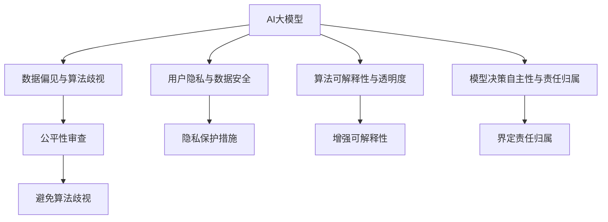

                 

# AI 大模型在电商推荐中的伦理考虑：避免算法歧视与偏见

## 1. 背景介绍

在电商领域，AI大模型作为一种先进的算法手段，已广泛应用于商品推荐、广告投放、用户画像建模等环节，极大地提升了电商运营效率和用户体验。然而，AI推荐算法在提升效率的同时，也暴露出一些潜在的伦理问题，特别是算法歧视和偏见问题，严重威胁到用户的隐私权和公平权。为实现技术的良性发展，亟需系统性地理解和应对这些挑战。

### 1.1 问题由来

AI大模型往往基于历史数据进行训练，数据中潜藏的偏见和歧视信息会被模型学习并放大，导致推荐结果的不公平。例如，在某些性别、年龄、地区等维度上，用户被推荐商品的概率差异显著。此外，由于算法的不透明性和复杂性，用户难以理解算法的决策逻辑，也难以对推荐结果进行有效的质疑和申诉。这些现象反映出电商推荐系统中存在的伦理风险，亟需进行系统化的改进。

### 1.2 问题核心关键点

- **数据偏见与算法歧视**：数据集中存在的偏见和歧视被模型学习并放大，导致推荐结果不公平。
- **用户隐私与数据安全**：用户数据被滥用，隐私权和数据安全受到威胁。
- **算法可解释性与透明度**：推荐算法决策过程复杂，用户难以理解，增加公平性审查难度。
- **模型决策自主性与责任归属**：算法自主决策能力强，但决策错误的责任归属不明确，增加法律和道德风险。

## 2. 核心概念与联系

### 2.1 核心概念概述

为更好地理解电商推荐系统中的伦理问题，本节将介绍几个关键概念：

- **AI大模型**：指基于深度学习技术，在巨量数据上预训练得到的大规模模型，具有强大的学习和泛化能力，常用于电商推荐等应用。
- **数据偏见**：指在数据集和训练过程中存在的历史性、结构性、概念性偏见，可能导致模型学习到的推荐策略不公平。
- **算法歧视**：指由于算法缺陷，导致模型对不同用户群体（如性别、年龄、地区等）产生差异化的推荐结果。
- **隐私保护**：指在数据收集、存储、处理和共享过程中，保护用户隐私权益，避免数据泄露和滥用。
- **可解释性**：指算法决策过程可被理解和解释，以增强用户信任和系统透明度。
- **公平性审查**：指对算法决策进行公平性审查，保证不同用户群体的权益。
- **责任归属**：指在模型决策错误时，如何界定责任归属，避免滥用。

这些核心概念之间的逻辑关系可以通过以下Mermaid流程图来展示：



这个流程图展示了大模型推荐系统中的核心概念及其之间的关系：

1. AI大模型通过数据训练得到推荐结果，可能存在数据偏见和算法歧视。
2. 用户隐私和数据安全是大模型应用中需要重点保护的内容。
3. 算法决策过程需具备可解释性，以增强透明度和用户信任。
4. 在决策错误时，需明确责任归属，避免滥用。
5. 通过公平性审查等手段，避免算法歧视。

## 3. 核心算法原理 & 具体操作步骤

### 3.1 算法原理概述

电商推荐系统的核心算法原理基于协同过滤、内容推荐、混合推荐等多种模型，通过对用户行为数据的分析，预测用户可能感兴趣的商品。但大模型的引入，使得推荐系统的算法原理更为复杂，涉及深度学习、强化学习、图神经网络等多个领域。

大模型的基本原理是通过大量数据预训练，学习到商品的特征表示，再将用户特征与商品特征进行匹配，预测用户对商品的兴趣度。在训练过程中，数据偏见和模型偏差的传递可能导致推荐结果不公平。例如，某些特征（如性别、年龄等）在数据集中出现频率较低，模型在训练过程中难以学习到其对商品兴趣的影响，进而导致推荐结果偏向于高频特征，形成歧视。

### 3.2 算法步骤详解

电商推荐系统的算法步骤主要包括以下几个环节：

**Step 1: 数据收集与预处理**
- 收集电商平台的用户行为数据，包括浏览、点击、购买等行为。
- 清洗和归一化数据，处理缺失值和异常值，确保数据质量和一致性。
- 划分训练集、验证集和测试集，保证数据分割的合理性和随机性。

**Step 2: 数据建模与训练**
- 选择适合电商推荐的模型，如协同过滤、内容推荐、混合推荐等。
- 对数据集进行特征工程，提取用户和商品的重要特征。
- 在大模型上进行预训练，学习商品的特征表示。
- 将用户特征与商品特征进行匹配，使用损失函数（如交叉熵、均方误差等）进行模型训练。

**Step 3: 模型评估与优化**
- 在验证集上评估模型的推荐效果，使用指标如准确率、召回率、F1值等。
- 根据评估结果调整模型参数，优化模型性能。
- 引入正则化、对抗训练等技术，防止过拟合和鲁棒性提升。

**Step 4: 推荐结果生成**
- 使用训练好的模型，对新用户和商品进行推荐。
- 将推荐结果展示给用户，更新用户行为数据。
- 定期更新模型参数，适应新数据的变化。

**Step 5: 伦理审查与改进**
- 对推荐结果进行公平性审查，确保不同用户群体获得公平的推荐。
- 引入隐私保护措施，如差分隐私、数据匿名化等。
- 增强算法可解释性，让用户理解推荐决策过程。
- 明确责任归属，建立责任认定机制。

### 3.3 算法优缺点

电商推荐系统中的大模型推荐算法具有以下优点：

1. **精度高**：大模型能从海量数据中学习到复杂的特征关系，提高推荐精度。
2. **灵活性强**：能够处理多维度的用户行为数据，适用于多种推荐场景。
3. **自适应性**：能实时更新模型参数，适应新数据和新用户的变化。

但同时，该算法也存在以下缺点：

1. **数据依赖性强**：推荐结果依赖于训练数据的分布，数据偏见可能传递到推荐结果中。
2. **透明度低**：推荐过程复杂，用户难以理解决策依据。
3. **公平性问题**：存在算法歧视，不同用户群体获得不公平的推荐。
4. **隐私风险高**：用户行为数据可能被滥用，侵犯用户隐私。
5. **责任归属难**：模型自主决策能力强，责任归属不明确。

### 3.4 算法应用领域

电商推荐系统中的大模型算法已广泛应用于：

- **商品推荐**：根据用户行为，推荐用户可能感兴趣的商品。
- **广告投放**：根据用户特征，精准投放广告，提高广告效果。
- **用户画像建模**：构建用户行为特征，进行个性化推荐和广告优化。
- **新商品预测**：预测新商品的市场潜力，优化商品推荐策略。
- **用户流失预警**：预测用户流失风险，进行客户挽留。

## 4. 数学模型和公式 & 详细讲解 & 举例说明

### 4.1 数学模型构建

电商推荐系统中的大模型推荐算法主要基于协同过滤、内容推荐、混合推荐等模型。以下以协同过滤模型为例，给出推荐模型的数学模型构建过程。

设用户集合为 $U$，商品集合为 $I$，用户对商品的评分矩阵为 $R \in \mathbb{R}^{m \times n}$，其中 $m$ 为用户数量，$n$ 为商品数量。协同过滤模型的目标是预测用户 $u$ 对商品 $i$ 的评分 $r_{ui}$。

设用户 $u$ 的隐特征向量为 $z_u \in \mathbb{R}^k$，商品 $i$ 的隐特征向量为 $z_i \in \mathbb{R}^k$，其中 $k$ 为特征维度。协同过滤模型的目标函数为：

$$
\min_{z_u, z_i} \frac{1}{2N} \sum_{(u,i) \in R} (r_{ui} - \langle z_u, z_i \rangle)^2 + \lambda (\|z_u\|_2^2 + \|z_i\|_2^2)
$$

其中，$\langle z_u, z_i \rangle$ 表示用户和商品的相似度，$\lambda$ 为正则化系数。

### 4.2 公式推导过程

协同过滤模型的核心在于计算用户和商品的相似度，预测用户对商品的评分。设用户 $u$ 对商品 $i$ 的评分向量为 $\mathbf{r}_u$，则相似度计算公式为：

$$
\langle z_u, z_i \rangle = \mathbf{r}_u \cdot z_i
$$

其中 $\mathbf{r}_u$ 为用户的隐特征向量，$z_i$ 为商品的隐特征向量。

推荐模型在训练时，通过最小化目标函数，学习用户和商品的隐特征向量 $z_u$ 和 $z_i$。在测试时，使用训练好的模型，计算用户和商品的相似度，预测用户对商品的评分。

### 4.3 案例分析与讲解

以某电商平台的商品推荐系统为例，设用户 $u$ 对商品 $i$ 的评分矩阵 $R$ 为：

$$
R = \begin{bmatrix}
   1 & 0 & 2 & 0 \\
   0 & 2 & 1 & 0 \\
   3 & 0 & 0 & 1 \\
   0 & 2 & 3 & 1
\end{bmatrix}
$$

假设用户隐特征向量 $z_u = [0.5, 0.5, 0.0, 0.0]^T$，商品隐特征向量 $z_i = [0.5, 0.0, 0.5, 0.0]^T$，正则化系数 $\lambda = 0.1$，目标函数为：

$$
\min_{z_u, z_i} \frac{1}{2 \times 4} \left[ (1 - 0.5)^2 + (0 - 0)^2 + (2 - 0.5)^2 + (0 - 0)^2 + (0 - 0)^2 + (2 - 0.5)^2 + (1 - 0.5)^2 + (0 - 0)^2 + (3 - 0.5)^2 + (0 - 0)^2 + (0 - 0)^2 + (1 - 0.5)^2 + (2 - 0.5)^2 + (3 - 0.5)^2 + (1 - 0.5)^2 \right] + 0.1 (\|z_u\|_2^2 + \|z_i\|_2^2)
$$

通过计算，得到用户和商品的相似度 $\langle z_u, z_i \rangle = 1.0$，预测用户 $u$ 对商品 $i$ 的评分为 $r_{ui} = 1.0$。

## 5. 项目实践：代码实例和详细解释说明

### 5.1 开发环境搭建

在进行电商推荐系统开发前，我们需要准备好开发环境。以下是使用Python进行PyTorch开发的环境配置流程：

1. 安装Anaconda：从官网下载并安装Anaconda，用于创建独立的Python环境。

2. 创建并激活虚拟环境：
```bash
conda create -n pytorch-env python=3.8 
conda activate pytorch-env
```

3. 安装PyTorch：根据CUDA版本，从官网获取对应的安装命令。例如：
```bash
conda install pytorch torchvision torchaudio cudatoolkit=11.1 -c pytorch -c conda-forge
```

4. 安装TensorBoard：
```bash
pip install tensorboard
```

5. 安装各类工具包：
```bash
pip install numpy pandas scikit-learn matplotlib tqdm jupyter notebook ipython
```

完成上述步骤后，即可在`pytorch-env`环境中开始电商推荐系统的开发。

### 5.2 源代码详细实现

下面以协同过滤模型为例，给出使用PyTorch实现电商推荐系统的代码实现。

首先，定义协同过滤模型类：

```python
import torch
import torch.nn as nn
import torch.nn.functional as F

class CollaborativeFilteringModel(nn.Module):
    def __init__(self, num_users, num_items, embedding_size, lambda_param=0.1):
        super(CollaborativeFilteringModel, self).__init__()
        self.num_users = num_users
        self.num_items = num_items
        self.embedding_size = embedding_size
        
        self.user_embeddings = nn.Embedding(num_users, embedding_size)
        self.item_embeddings = nn.Embedding(num_items, embedding_size)
        self.fc = nn.Linear(embedding_size * 2, 1)
        
        self.mse_loss = nn.MSELoss()
        
    def forward(self, user_ids, item_ids):
        user_embeddings = self.user_embeddings(user_ids)
        item_embeddings = self.item_embeddings(item_ids)
        
        similarity = torch.matmul(user_embeddings, item_embeddings.t())
        predictions = self.fc(similarity)
        
        return predictions
```

然后，定义训练和评估函数：

```python
from torch.utils.data import DataLoader
from tqdm import tqdm
from sklearn.metrics import mean_squared_error

def train_epoch(model, optimizer, data_loader):
    model.train()
    epoch_loss = 0
    for batch in tqdm(data_loader, desc='Training'):
        user_ids = batch['user_ids']
        item_ids = batch['item_ids']
        labels = batch['labels']
        
        optimizer.zero_grad()
        predictions = model(user_ids, item_ids)
        loss = model.mse_loss(predictions, labels)
        epoch_loss += loss.item()
        loss.backward()
        optimizer.step()
    
    return epoch_loss / len(data_loader)

def evaluate(model, data_loader):
    model.eval()
    mse = 0
    for batch in tqdm(data_loader, desc='Evaluating'):
        user_ids = batch['user_ids']
        item_ids = batch['item_ids']
        labels = batch['labels']
        
        predictions = model(user_ids, item_ids)
        mse += mean_squared_error(predictions, labels)
    
    return mse / len(data_loader)
```

最后，启动训练流程并在测试集上评估：

```python
epochs = 5
batch_size = 64

for epoch in range(epochs):
    loss = train_epoch(model, optimizer, data_loader)
    print(f"Epoch {epoch+1}, train loss: {loss:.3f}")
    
    print(f"Epoch {epoch+1}, test MSE: {evaluate(model, test_data_loader):.3f}")
```

以上就是使用PyTorch实现电商推荐系统协同过滤模型的完整代码实现。可以看到，代码主要分为模型定义、训练函数和评估函数三部分，逻辑清晰，易于理解。

### 5.3 代码解读与分析

让我们再详细解读一下关键代码的实现细节：

**CollaborativeFilteringModel类**：
- `__init__`方法：初始化模型参数，包括用户和商品的隐特征向量维度。
- `forward`方法：计算用户和商品的相似度，输出预测评分。

**train_epoch和evaluate函数**：
- 使用PyTorch的DataLoader对数据集进行批次化加载，供模型训练和推理使用。
- 训练函数`train_epoch`：对数据以批为单位进行迭代，在每个批次上前向传播计算损失并反向传播更新模型参数。
- 评估函数`evaluate`：与训练类似，不同点在于不更新模型参数，在每个batch结束后计算评估指标（MSE）。

**训练流程**：
- 定义总的epoch数和batch size，开始循环迭代
- 每个epoch内，在训练集上训练，输出平均loss
- 在测试集上评估，输出测试MSE
- 所有epoch结束后，对模型进行评估，输出最终测试结果

可以看到，PyTorch使得电商推荐系统的实现变得简洁高效。开发者可以将更多精力放在模型改进、数据处理等高层逻辑上，而不必过多关注底层的实现细节。

当然，工业级的系统实现还需考虑更多因素，如模型的保存和部署、超参数的自动搜索、更灵活的任务适配层等。但核心的推荐范式基本与此类似。

## 6. 实际应用场景

### 6.1 智能客服系统

智能客服系统通过AI推荐算法，根据用户输入的咨询内容，自动推荐相关知识库和答案模板，提升客服处理效率和用户满意度。在大模型推荐算法的基础上，系统还能不断学习新的知识库，进行持续优化。

### 6.2 个性化推荐

电商推荐系统通过大模型推荐算法，根据用户的历史行为和兴趣，动态调整推荐策略，提供个性化的商品推荐。推荐算法在大模型的支持下，能实时更新模型参数，适应新数据和新用户的变化。

### 6.3 内容推荐

新闻、视频、音乐等平台通过大模型推荐算法，根据用户的行为数据，推荐其感兴趣的内容。算法不仅能进行精准推荐，还能进行内容生成和优化，提升用户体验。

### 6.4 广告投放

广告投放系统通过大模型推荐算法，根据用户的兴趣和行为，进行精准广告投放，提升广告效果和投资回报率。推荐算法在大模型的支持下，能进行实时调整，优化广告策略。

## 7. 工具和资源推荐

### 7.1 学习资源推荐

为了帮助开发者系统掌握电商推荐系统中的伦理问题，这里推荐一些优质的学习资源：

1. 《推荐系统原理与实践》：系统介绍推荐系统的原理、算法和应用，包括电商推荐系统中的算法偏见和公平性问题。
2. KDD Cup 2021推荐系统竞赛：国内顶级推荐系统竞赛，涵盖多种推荐算法，展示电商推荐系统的实际应用。
3. Deep Learning for Recommender Systems：深度学习应用于推荐系统的经典教材，涵盖多种推荐算法和优化策略。
4. RecSys会议论文：国际推荐系统会议论文集，展示最新研究成果和应用实践。

通过对这些资源的学习实践，相信你一定能够快速掌握电商推荐系统中的伦理问题，并用于解决实际的电商推荐系统问题。

### 7.2 开发工具推荐

高效的开发离不开优秀的工具支持。以下是几款用于电商推荐系统开发的常用工具：

1. PyTorch：基于Python的开源深度学习框架，灵活动态的计算图，适合快速迭代研究。大多数电商推荐系统算法都有PyTorch版本的实现。
2. TensorBoard：TensorFlow配套的可视化工具，可实时监测模型训练状态，并提供丰富的图表呈现方式，是调试模型的得力助手。
3. Weights & Biases：模型训练的实验跟踪工具，可以记录和可视化模型训练过程中的各项指标，方便对比和调优。
4. Scikit-learn：Python科学计算库，提供丰富的机器学习算法和工具，适用于电商推荐系统中的数据处理和模型评估。
5. Jupyter Notebook：交互式编程环境，支持代码编写、数据可视化、模型调试等，方便快速迭代实验。

合理利用这些工具，可以显著提升电商推荐系统的开发效率，加快创新迭代的步伐。

### 7.3 相关论文推荐

电商推荐系统中的伦理问题涉及多个领域，相关论文推荐如下：

1. Mitigating Bias in Collaborative Filtering Recommendation Systems：探讨协同过滤算法中的数据偏见和算法歧视问题，提出多种缓解策略。
2. Algorithmic Fairness in Recommendation Systems：讨论推荐系统中的公平性问题，提出基于数据集平衡和模型改进的公平性优化方法。
3. The Role of Algorithm Transparency and Trust in Online Recommendation Systems：研究推荐算法透明度和用户信任之间的关系，提出增强透明度的方案。
4. Privacy-Preserving Recommender Systems：探讨推荐系统中的隐私保护问题，提出差分隐私、数据匿名化等隐私保护策略。
5. Fairness in Recommendation Systems: Survey and Future Directions：综述推荐系统中的公平性问题，提出多种公平性审查和改进方法。

这些论文代表了大模型推荐系统中的伦理问题的发展脉络。通过学习这些前沿成果，可以帮助研究者把握学科前进方向，激发更多的创新灵感。

## 8. 总结：未来发展趋势与挑战

### 8.1 总结

本文对电商推荐系统中的大模型推荐算法进行了全面系统的介绍。首先阐述了电商推荐系统的背景和伦理问题，明确了推荐算法中存在的公平性、隐私性、透明性等挑战。其次，从原理到实践，详细讲解了电商推荐系统的数学模型和算法实现，给出了推荐系统的代码实例。同时，本文还广泛探讨了推荐系统在智能客服、个性化推荐、内容推荐等多个领域的应用前景，展示了大模型推荐算法的强大潜力。此外，本文精选了推荐系统中的伦理问题，并推荐了相关的学习资源和工具。

通过本文的系统梳理，可以看到，大模型推荐算法在提升电商运营效率的同时，也带来了伦理挑战。如何在提升推荐精度的同时，避免算法偏见和歧视，保障用户隐私和公平性，增强算法透明度，这些问题亟需得到解决。只有积极应对并寻求突破，才能实现技术的良性发展。

### 8.2 未来发展趋势

展望未来，电商推荐系统中的大模型推荐算法将呈现以下几个发展趋势：

1. **数据驱动与模型协同**：利用大规模数据和深度模型，提升推荐系统的精度和泛化能力。
2. **算法偏见与公平性优化**：引入公平性审查和优化方法，确保推荐结果的公平性。
3. **隐私保护与透明性增强**：采用差分隐私、数据匿名化等隐私保护策略，增强推荐算法的透明性和可解释性。
4. **多模态推荐融合**：融合视觉、语音、文本等多种模态数据，提升推荐系统的综合能力。
5. **实时化与自适应优化**：实时更新推荐算法，适应新数据和新用户的变化。
6. **智能客服与自动化处理**：结合智能客服系统，实现自动化推荐和用户交互。

以上趋势凸显了大模型推荐算法的广阔前景。这些方向的探索发展，必将进一步提升电商推荐系统的性能和应用范围，为电商运营带来新的突破。

### 8.3 面临的挑战

尽管电商推荐系统中的大模型推荐算法已经取得了瞩目成就，但在迈向更加智能化、普适化应用的过程中，仍面临诸多挑战：

1. **数据偏见与算法歧视**：数据集中存在的偏见和歧视可能被模型学习并放大，导致推荐结果不公平。
2. **隐私风险高**：用户行为数据可能被滥用，侵犯用户隐私。
3. **算法透明度低**：推荐过程复杂，用户难以理解决策依据。
4. **责任归属难**：模型自主决策能力强，责任归属不明确。
5. **实时化与自适应优化**：实时更新推荐算法，适应新数据和新用户的变化，面临计算和存储的挑战。

正视电商推荐系统中的这些挑战，积极应对并寻求突破，将是大模型推荐算法走向成熟的必由之路。相信随着学界和产业界的共同努力，这些挑战终将一一被克服，大模型推荐算法必将在电商运营中发挥更大的作用。

### 8.4 研究展望

面对电商推荐系统中的伦理挑战，未来的研究需要在以下几个方面寻求新的突破：

1. **数据预处理与偏见消除**：引入数据清洗和偏见检测技术，消除数据集中的偏见，提高推荐系统的公平性。
2. **隐私保护与透明性增强**：采用差分隐私、数据匿名化等隐私保护策略，增强推荐算法的透明性和可解释性。
3. **多模态数据融合**：融合视觉、语音、文本等多种模态数据，提升推荐系统的综合能力。
4. **智能客服与自动化处理**：结合智能客服系统，实现自动化推荐和用户交互。
5. **算法偏见与公平性优化**：引入公平性审查和优化方法，确保推荐结果的公平性。
6. **责任归属与风险管理**：建立责任认定机制，明确模型决策错误时的责任归属，保障用户权益。

这些研究方向的探索，必将引领电商推荐系统中的大模型推荐算法迈向更高的台阶，为电商运营带来新的突破。面向未来，电商推荐系统中的大模型推荐算法还需要与其他人工智能技术进行更深入的融合，如知识表示、因果推理、强化学习等，多路径协同发力，共同推动电商推荐系统的进步。只有勇于创新、敢于突破，才能不断拓展推荐算法的边界，让智能技术更好地造福电商运营。

## 9. 附录：常见问题与解答

**Q1：电商推荐系统中的数据偏见如何消除？**

A: 电商推荐系统中的数据偏见可以通过以下方法消除：
1. 数据清洗：去除数据中的缺失值、异常值和噪声，确保数据质量。
2. 数据增强：通过数据增强技术，如数据扩充、回译等方式，增加数据的多样性，减少数据偏见。
3. 模型优化：使用公平性审查和优化方法，如模型正则化、对抗训练等，减少模型对偏见的学习。
4. 数据采样：采用重新采样技术，如过采样、欠采样等，平衡数据集中的类别分布。

**Q2：电商推荐系统中的算法歧视如何避免？**

A: 电商推荐系统中的算法歧视可以通过以下方法避免：
1. 公平性审查：引入公平性审查机制，定期检查推荐结果的公平性，发现偏差及时调整模型。
2. 偏见消除：在数据预处理阶段，使用偏见检测技术，消除数据集中的偏见，提高推荐系统的公平性。
3. 算法优化：采用公平性优化算法，如基于数据集平衡和模型改进的方法，减少推荐结果的差异。
4. 多维度建模：引入多维度特征，如性别、年龄、地区等，进行综合建模，减少特征之间的歧视。

**Q3：电商推荐系统中的用户隐私如何保护？**

A: 电商推荐系统中的用户隐私可以通过以下方法保护：
1. 差分隐私：采用差分隐私技术，在数据收集和处理过程中，增加数据扰动，防止用户隐私泄露。
2. 数据匿名化：对用户行为数据进行匿名化处理，确保数据无法被关联到具体个人。
3. 数据加密：对用户数据进行加密存储和传输，防止数据泄露和滥用。
4. 访问控制：建立严格的访问控制机制，确保只有授权人员才能访问用户数据。

**Q4：电商推荐系统中的算法透明度如何提升？**

A: 电商推荐系统中的算法透明度可以通过以下方法提升：
1. 模型可视化：使用模型可视化工具，展示推荐模型的决策过程和特征重要性。
2. 可解释性模型：采用可解释性模型，如决策树、线性回归等，增强推荐算法的透明性。
3. 用户反馈机制：建立用户反馈机制，收集用户对推荐结果的评价，及时调整推荐策略。
4. 算法文档：编写详细的算法文档，描述推荐算法的实现过程和决策依据。

**Q5：电商推荐系统中的责任归属如何界定？**

A: 电商推荐系统中的责任归属可以通过以下方法界定：
1. 责任认定机制：建立明确的责任认定机制，界定模型决策错误时的责任归属。
2. 用户知情权：明确告知用户推荐算法的决策依据和风险，增强用户知情权。
3. 法律保障：通过法律手段，明确推荐算法的责任和义务，保护用户权益。
4. 责任保险：引入责任保险机制，分担模型决策错误的经济损失。

这些方法可以帮助电商推荐系统中的大模型推荐算法更好地应对伦理挑战，保障用户权益，实现技术良性发展。

---

作者：禅与计算机程序设计艺术 / Zen and the Art of Computer Programming

