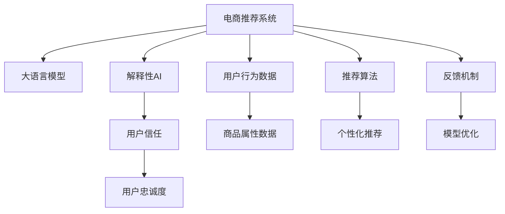

                 

# AI 大模型在电商推荐中的解释性AI 探索：增加用户的信任和忠诚度

> 关键词：电商推荐,大语言模型,解释性AI,用户信任,用户忠诚度,可解释性,电商营销

## 1. 背景介绍

### 1.1 问题由来

随着电子商务的兴起，在线购物平台越来越重视个性化推荐系统的建设。通过推荐系统，电商企业能够为每个用户推荐最相关的商品，从而提升用户购物体验，增加销售额。传统的推荐系统往往依赖于基于规则、协同过滤等方法，但这些方法往往难以捕捉用户的长期兴趣变化，且无法解释推荐决策过程，导致用户对推荐结果的信任度较低。

近年来，基于大语言模型的推荐系统逐渐进入人们的视野。相较于传统方法，大模型在捕捉用户复杂兴趣和行为方面具有明显优势。然而，大模型模型的决策过程常常被视为"黑盒"，难以解释其推荐依据。这不仅降低了用户对推荐结果的信任，还可能导致用户在感到不满时选择离开，对电商平台的长期发展产生不利影响。

为提升电商平台的竞争力和用户粘性，解释性AI（Explainable AI, XAI）技术成为电商推荐系统的关键需求。通过解释性AI，电商企业不仅能够向用户透明展示推荐依据，还能借助用户反馈进一步优化模型，逐步建立起用户信任和忠诚度。

### 1.2 问题核心关键点

- 电商推荐系统：通过分析用户行为和历史记录，为每个用户推荐最相关的商品。
- 大语言模型：使用Transformer、BERT等预训练语言模型，从海量的电商文本数据中学习用户兴趣和行为模式。
- 解释性AI：提供推荐的理由和依据，使推荐过程透明、可信，提升用户满意度和信任感。
- 用户信任：用户对推荐系统的信任度是电商平台长期发展的基础。
- 用户忠诚度：高用户忠诚度能带来稳定的流量和收入。

## 2. 核心概念与联系

### 2.1 核心概念概述

为更好地理解基于大语言模型的电商推荐系统，本节将介绍几个密切相关的核心概念：

- 电商推荐系统（E-commerce Recommendation System, ERs）：通过分析用户历史行为和交易数据，为每个用户推荐最相关的商品或服务。
- 大语言模型（Large Language Model, LLM）：如BERT、GPT-3等大规模预训练语言模型，能够从文本数据中学习到丰富的语义和知识。
- 解释性AI（Explainable AI, XAI）：通过提供推荐的理由和依据，增强用户对推荐结果的信任和理解。
- 用户信任（User Trust）：指用户对推荐系统的信任度，是电商推荐系统的基础。
- 用户忠诚度（User Loyalty）：指用户对平台的长期依赖和重复购买行为。

这些核心概念之间的逻辑关系可以通过以下Mermaid流程图来展示：



这个流程图展示了大语言模型在电商推荐系统中的作用和影响：

1. 电商推荐系统通过用户行为数据和商品属性数据，使用推荐算法为用户推荐商品。
2. 大语言模型从电商文本数据中学习用户兴趣和行为模式，优化推荐模型。
3. 解释性AI提供推荐依据，增强用户信任和理解。
4. 用户信任和忠诚度提升，带来持续的流量和收入。

## 3. 核心算法原理 & 具体操作步骤
### 3.1 算法原理概述

基于大语言模型的电商推荐系统，本质上是一个有监督学习的过程。其核心思想是：利用电商文本数据对大语言模型进行预训练，学习用户兴趣和行为模式。然后，使用少量标注数据对模型进行微调，使其能够根据用户行为预测推荐结果，并解释推荐依据，提升用户信任和忠诚度。

形式化地，假设电商推荐系统的训练集为 $D=\{(x_i,y_i)\}_{i=1}^N$，其中 $x_i$ 为电商文本数据，$y_i$ 为对应的推荐结果。微调的目标是找到新的模型参数 $\hat{\theta}$，使得：

$$
\hat{\theta}=\mathop{\arg\min}_{\theta} \mathcal{L}(M_{\theta},D)
$$

其中 $\mathcal{L}$ 为针对推荐任务设计的损失函数，用于衡量模型预测输出与真实标签之间的差异。常见的损失函数包括交叉熵损失、均方误差损失等。

通过梯度下降等优化算法，微调过程不断更新模型参数 $\theta$，最小化损失函数 $\mathcal{L}$，使得模型输出逼近真实标签。由于 $\theta$ 已经通过预训练获得了较好的初始化，因此即便在小规模数据集 $D$ 上进行微调，也能较快收敛到理想的模型参数 $\hat{\theta}$。

### 3.2 算法步骤详解

基于大语言模型的电商推荐系统通常包括以下几个关键步骤：

**Step 1: 准备电商文本数据**
- 收集电商平台的交易数据、用户行为数据等，清洗并标注为适合模型输入的格式。
- 将电商文本数据作为模型的输入，推荐结果作为监督信号，构成微调的训练数据集。

**Step 2: 选择合适的预训练语言模型**
- 根据电商领域的特点，选择合适的预训练语言模型，如BERT、GPT-3等，作为微调的基础模型。
- 加载预训练语言模型，设置冻结部分层以避免过拟合。

**Step 3: 定义任务适配层**
- 根据推荐任务的特点，设计合适的任务适配层，如全连接层、注意力机制等，用于连接预训练模型和推荐结果。
- 定义损失函数和优化器，配置微调过程中的超参数。

**Step 4: 执行梯度训练**
- 将训练集数据分批次输入模型，前向传播计算损失函数。
- 反向传播计算参数梯度，根据设定的优化算法和学习率更新模型参数。
- 周期性在验证集上评估模型性能，根据性能指标决定是否触发 Early Stopping。
- 重复上述步骤直到满足预设的迭代轮数或 Early Stopping 条件。

**Step 5: 测试和部署**
- 在测试集上评估微调后模型 $M_{\hat{\theta}}$ 的性能，对比微调前后的精度提升。
- 使用微调后的模型对新样本进行推理预测，集成到实际的应用系统中。
- 持续收集新的数据，定期重新微调模型，以适应数据分布的变化。

以上是基于大语言模型的电商推荐系统的微调流程。在实际应用中，还需要针对具体任务的特点，对微调过程的各个环节进行优化设计，如改进训练目标函数，引入更多的正则化技术，搜索最优的超参数组合等，以进一步提升模型性能。

### 3.3 算法优缺点

基于大语言模型的电商推荐系统具有以下优点：
1. 高效捕捉用户兴趣。大模型能够从海量的电商文本数据中学习用户复杂兴趣和行为模式，提供个性化推荐。
2. 具备解释性。通过解释性AI，推荐过程透明、可信，提升用户信任感。
3. 用户粘性提升。高用户信任度和高忠诚度能带来持续的流量和收入，增加电商平台的竞争力。

同时，该方法也存在一定的局限性：
1. 数据依赖性强。电商文本数据的质量和量级直接影响推荐效果，难以保证数据的全面性和代表性。
2. 模型复杂度高。大模型的参数量较大，训练和推理消耗的资源较多，需要高性能设备支持。
3. 可解释性有待提升。尽管解释性AI已有所改进，但仍难以彻底消除大模型的"黑盒"特性。
4. 用户隐私问题。电商推荐系统需处理大量用户数据，存在隐私保护和数据安全的风险。

尽管存在这些局限性，但就目前而言，基于大语言模型的电商推荐系统仍是大规模推荐任务的主流范式。未来相关研究的重点在于如何进一步降低模型复杂度，优化推荐效果，提升用户信任和忠诚度。

### 3.4 算法应用领域

基于大语言模型的电商推荐系统已经在各大电商平台上广泛应用，覆盖了从商品推荐、个性化展示到广告投放等多个领域。具体应用场景包括：

- 商品推荐：根据用户浏览和购买历史，推荐相关商品。
- 个性化展示：将相关商品按用户兴趣排序，提升点击率。
- 广告投放：根据用户兴趣和行为特征，投放个性化广告。
- 搜索优化：优化搜索结果排序，提升用户体验。
- 热销商品挖掘：挖掘并推荐当前最热门商品，抓住销售机遇。

除了上述这些经典应用外，大语言模型在电商推荐领域还被创新性地应用到更多场景中，如库存优化、定价策略、客户细分等，为电商平台的运营决策提供有力支持。

## 4. 数学模型和公式 & 详细讲解  
### 4.1 数学模型构建

本节将使用数学语言对基于大语言模型的电商推荐系统进行更加严格的刻画。

假设电商推荐系统使用大语言模型 $M_{\theta}$，输入为电商文本数据 $x_i$，输出为推荐结果 $y_i$。定义模型 $M_{\theta}$ 在输入 $x_i$ 上的预测结果为 $\hat{y}_i=M_{\theta}(x_i)$。则电商推荐系统的经验风险为：

$$
\mathcal{L}(\theta) = \frac{1}{N} \sum_{i=1}^N \ell(\hat{y}_i,y_i)
$$

其中 $\ell(\hat{y}_i,y_i)$ 为损失函数，用于衡量模型预测输出与真实标签之间的差异。常见的损失函数包括交叉熵损失、均方误差损失等。

### 4.2 公式推导过程

以下我们以交叉熵损失函数为例，推导其在电商推荐系统中的应用。

假设模型 $M_{\theta}$ 在输入 $x_i$ 上的输出为 $\hat{y}_i=M_{\theta}(x_i)$，真实标签 $y_i \in \{0,1\}$。则交叉熵损失函数定义为：

$$
\ell(\hat{y}_i,y_i) = -[y_i\log \hat{y}_i + (1-y_i)\log (1-\hat{y}_i)]
$$

将其代入经验风险公式，得：

$$
\mathcal{L}(\theta) = -\frac{1}{N}\sum_{i=1}^N [y_i\log M_{\theta}(x_i)+(1-y_i)\log(1-M_{\theta}(x_i))]
$$

在得到损失函数的梯度后，即可带入参数更新公式，完成模型的迭代优化。重复上述过程直至收敛，最终得到适应电商推荐任务的最优模型参数 $\theta^*$。

## 5. 项目实践：代码实例和详细解释说明
### 5.1 开发环境搭建

在进行电商推荐系统开发前，我们需要准备好开发环境。以下是使用Python进行PyTorch开发的环境配置流程：

1. 安装Anaconda：从官网下载并安装Anaconda，用于创建独立的Python环境。

2. 创建并激活虚拟环境：
```bash
conda create -n pytorch-env python=3.8 
conda activate pytorch-env
```

3. 安装PyTorch：根据CUDA版本，从官网获取对应的安装命令。例如：
```bash
conda install pytorch torchvision torchaudio cudatoolkit=11.1 -c pytorch -c conda-forge
```

4. 安装相关库：
```bash
pip install numpy pandas scikit-learn torch transformers
```

完成上述步骤后，即可在`pytorch-env`环境中开始电商推荐系统的开发。

### 5.2 源代码详细实现

下面我们以电商推荐系统为例，给出使用Transformers库对BERT模型进行电商推荐系统开发的PyTorch代码实现。

首先，定义电商推荐任务的数据处理函数：

```python
from transformers import BertTokenizer
from torch.utils.data import Dataset, DataLoader
import torch

class E-commerceDataset(Dataset):
    def __init__(self, texts, labels):
        self.texts = texts
        self.labels = labels
        self.tokenizer = BertTokenizer.from_pretrained('bert-base-cased')

    def __len__(self):
        return len(self.texts)

    def __getitem__(self, item):
        text = self.texts[item]
        label = self.labels[item]
        encoding = self.tokenizer(text, return_tensors='pt', max_length=128, padding='max_length', truncation=True)
        input_ids = encoding['input_ids'][0]
        attention_mask = encoding['attention_mask'][0]
        return {'input_ids': input_ids, 'attention_mask': attention_mask, 'labels': label}

# 创建dataset
tokenizer = BertTokenizer.from_pretrained('bert-base-cased')
train_dataset = E-commerceDataset(train_texts, train_labels)
dev_dataset = E-commerceDataset(dev_texts, dev_labels)
test_dataset = E-commerceDataset(test_texts, test_labels)
```

然后，定义模型和优化器：

```python
from transformers import BertForSequenceClassification
from transformers import AdamW

model = BertForSequenceClassification.from_pretrained('bert-base-cased', num_labels=2)

optimizer = AdamW(model.parameters(), lr=2e-5)
```

接着，定义训练和评估函数：

```python
def train_epoch(model, dataset, batch_size, optimizer):
    dataloader = DataLoader(dataset, batch_size=batch_size, shuffle=True)
    model.train()
    epoch_loss = 0
    for batch in dataloader:
        input_ids = batch['input_ids'].to(device)
        attention_mask = batch['attention_mask'].to(device)
        labels = batch['labels'].to(device)
        model.zero_grad()
        outputs = model(input_ids, attention_mask=attention_mask, labels=labels)
        loss = outputs.loss
        epoch_loss += loss.item()
        loss.backward()
        optimizer.step()
    return epoch_loss / len(dataloader)

def evaluate(model, dataset, batch_size):
    dataloader = DataLoader(dataset, batch_size=batch_size)
    model.eval()
    preds, labels = [], []
    with torch.no_grad():
        for batch in dataloader:
            input_ids = batch['input_ids'].to(device)
            attention_mask = batch['attention_mask'].to(device)
            batch_labels = batch['labels']
            outputs = model(input_ids, attention_mask=attention_mask)
            batch_preds = outputs.logits.argmax(dim=1).to('cpu').tolist()
            batch_labels = batch_labels.to('cpu').tolist()
            for pred, label in zip(batch_preds, batch_labels):
                preds.append(pred)
                labels.append(label)
                
    print(classification_report(labels, preds))
```

最后，启动训练流程并在测试集上评估：

```python
epochs = 5
batch_size = 16

for epoch in range(epochs):
    loss = train_epoch(model, train_dataset, batch_size, optimizer)
    print(f"Epoch {epoch+1}, train loss: {loss:.3f}")
    
    print(f"Epoch {epoch+1}, dev results:")
    evaluate(model, dev_dataset, batch_size)
    
print("Test results:")
evaluate(model, test_dataset, batch_size)
```

以上就是使用PyTorch对BERT进行电商推荐系统微调的完整代码实现。可以看到，得益于Transformers库的强大封装，我们可以用相对简洁的代码完成BERT模型的加载和电商推荐系统的微调。

### 5.3 代码解读与分析

让我们再详细解读一下关键代码的实现细节：

**E-commerceDataset类**：
- `__init__`方法：初始化电商文本数据和标签。
- `__len__`方法：返回数据集的样本数量。
- `__getitem__`方法：对单个样本进行处理，将电商文本数据编码为token ids，将标签转换为数字，并进行定长padding。

**训练和评估函数**：
- 使用PyTorch的DataLoader对数据集进行批次化加载，供模型训练和推理使用。
- 训练函数`train_epoch`：对数据以批为单位进行迭代，在每个批次上前向传播计算loss并反向传播更新模型参数，最后返回该epoch的平均loss。
- 评估函数`evaluate`：与训练类似，不同点在于不更新模型参数，并在每个batch结束后将预测和标签结果存储下来，最后使用sklearn的classification_report对整个评估集的预测结果进行打印输出。

**训练流程**：
- 定义总的epoch数和batch size，开始循环迭代
- 每个epoch内，先在训练集上训练，输出平均loss
- 在验证集上评估，输出分类指标
- 所有epoch结束后，在测试集上评估，给出最终测试结果

可以看到，PyTorch配合Transformers库使得BERT微调的代码实现变得简洁高效。开发者可以将更多精力放在数据处理、模型改进等高层逻辑上，而不必过多关注底层的实现细节。

当然，工业级的系统实现还需考虑更多因素，如模型的保存和部署、超参数的自动搜索、更灵活的任务适配层等。但核心的微调范式基本与此类似。

## 6. 实际应用场景
### 6.1 电商推荐系统

电商推荐系统基于大语言模型的电商推荐，通过分析用户历史行为和交易数据，为用户推荐最相关的商品。微调后的模型不仅能够高效捕捉用户复杂兴趣和行为模式，还具备良好的解释性。

在技术实现上，可以收集电商平台的用户浏览、点击、购买等行为数据，提取和商品属性相关联的电商文本数据。将电商文本数据作为模型输入，用户的后续行为作为监督信号，在微调过程中，模型学习到用户兴趣和行为模式，生成推荐结果，并在用户反馈中不断优化推荐策略，提升推荐效果和用户满意度。

### 6.2 广告投放

通过电商推荐系统的微调，广告主能够更精准地投放个性化广告，提升广告点击率和转化率。微调后的模型不仅能理解用户兴趣，还能根据用户行为预测其对广告的反应，帮助广告主优化广告投放策略，减少无效流量和浪费。

在实际操作中，广告主可以使用微调后的模型预测不同广告对用户点击率和购买意愿的影响，选择效果最佳的广告进行投放。同时，通过A/B测试等方法，不断优化广告创意和投放策略，实现广告投放的最优化。

### 6.3 个性化展示

基于大语言模型的电商推荐系统，能够根据用户兴趣和行为，生成个性化的商品展示方案，提升用户体验。在用户浏览商品页面时，系统会根据用户的兴趣和浏览历史，实时推荐相关的商品，提高用户的点击率和转化率。

通过微调后的模型，电商平台能够对用户浏览历史进行深入分析，精准推荐用户可能感兴趣的商品，增强用户粘性。同时，通过对不同用户的展示方案进行个性化设计，提升用户的购物体验。

### 6.4 未来应用展望

随着大语言模型和微调方法的不断发展，基于大语言模型的电商推荐系统也将呈现更多的应用前景，为电商平台的运营带来更多可能性：

1. 推荐算法升级：引入更多的推荐算法，如协同过滤、矩阵分解、深度学习等，提升推荐效果和用户满意度。
2. 多模态融合：引入视觉、语音等多模态数据，提升推荐系统的感知能力和决策依据。
3. 实时推荐：引入实时推荐技术，根据用户即时行为动态调整推荐结果，提升用户体验。
4. 风险预警：引入用户行为分析，预警异常购买行为，保障平台安全。
5. 跨平台推荐：实现跨平台推荐，将用户兴趣和行为信息整合，提升推荐效果。

基于大语言模型的电商推荐系统将助力电商平台实现个性化推荐、精准营销、提升用户体验等多方面目标，为电商平台的长期发展提供有力支持。

## 7. 工具和资源推荐
### 7.1 学习资源推荐

为了帮助开发者系统掌握大语言模型微调的理论基础和实践技巧，这里推荐一些优质的学习资源：

1. 《Transformers: From PMLR 30》系列博文：由大模型技术专家撰写，深入浅出地介绍了Transformer原理、BERT模型、微调技术等前沿话题。

2. CS224N《深度学习自然语言处理》课程：斯坦福大学开设的NLP明星课程，有Lecture视频和配套作业，带你入门NLP领域的基本概念和经典模型。

3. 《Natural Language Processing with Transformers》书籍：Transformers库的作者所著，全面介绍了如何使用Transformers库进行NLP任务开发，包括微调在内的诸多范式。

4. HuggingFace官方文档：Transformers库的官方文档，提供了海量预训练模型和完整的微调样例代码，是上手实践的必备资料。

5. Kaggle电商推荐竞赛：参加Kaggle电商推荐竞赛，实战练习，积累经验，提升技能。

通过对这些资源的学习实践，相信你一定能够快速掌握大语言模型微调的精髓，并用于解决实际的NLP问题。

### 7.2 开发工具推荐

高效的开发离不开优秀的工具支持。以下是几款用于大语言模型微调开发的常用工具：

1. PyTorch：基于Python的开源深度学习框架，灵活动态的计算图，适合快速迭代研究。大部分预训练语言模型都有PyTorch版本的实现。

2. TensorFlow：由Google主导开发的开源深度学习框架，生产部署方便，适合大规模工程应用。同样有丰富的预训练语言模型资源。

3. Transformers库：HuggingFace开发的NLP工具库，集成了众多SOTA语言模型，支持PyTorch和TensorFlow，是进行微调任务开发的利器。

4. Weights & Biases：模型训练的实验跟踪工具，可以记录和可视化模型训练过程中的各项指标，方便对比和调优。与主流深度学习框架无缝集成。

5. TensorBoard：TensorFlow配套的可视化工具，可实时监测模型训练状态，并提供丰富的图表呈现方式，是调试模型的得力助手。

6. Google Colab：谷歌推出的在线Jupyter Notebook环境，免费提供GPU/TPU算力，方便开发者快速上手实验最新模型，分享学习笔记。

合理利用这些工具，可以显著提升大语言模型微调任务的开发效率，加快创新迭代的步伐。

### 7.3 相关论文推荐

大语言模型和微调技术的发展源于学界的持续研究。以下是几篇奠基性的相关论文，推荐阅读：

1. Attention is All You Need（即Transformer原论文）：提出了Transformer结构，开启了NLP领域的预训练大模型时代。

2. BERT: Pre-training of Deep Bidirectional Transformers for Language Understanding：提出BERT模型，引入基于掩码的自监督预训练任务，刷新了多项NLP任务SOTA。

3. Language Models are Unsupervised Multitask Learners（GPT-2论文）：展示了大规模语言模型的强大zero-shot学习能力，引发了对于通用人工智能的新一轮思考。

4. Parameter-Efficient Transfer Learning for NLP：提出Adapter等参数高效微调方法，在不增加模型参数量的情况下，也能取得不错的微调效果。

5. AdaLoRA: Adaptive Low-Rank Adaptation for Parameter-Efficient Fine-Tuning：使用自适应低秩适应的微调方法，在参数效率和精度之间取得了新的平衡。

这些论文代表了大语言模型微调技术的发展脉络。通过学习这些前沿成果，可以帮助研究者把握学科前进方向，激发更多的创新灵感。

## 8. 总结：未来发展趋势与挑战

### 8.1 总结

本文对基于大语言模型的电商推荐系统进行了全面系统的介绍。首先阐述了电商推荐系统和大语言模型的背景和意义，明确了电商推荐系统中微调的重要性。其次，从原理到实践，详细讲解了基于大语言模型的电商推荐系统的微调过程，给出了微调任务开发的完整代码实例。同时，本文还广泛探讨了微调方法在电商推荐系统中的应用前景，展示了微调范式的巨大潜力。此外，本文精选了微调技术的各类学习资源，力求为读者提供全方位的技术指引。

通过本文的系统梳理，可以看到，基于大语言模型的电商推荐系统是大规模推荐任务的主流范式，极大地提升了电商平台的用户满意度和忠诚度。未来，随着大语言模型和微调方法的不断演进，电商推荐系统也将迎来更多的应用场景和挑战。

### 8.2 未来发展趋势

展望未来，大语言模型微调技术将呈现以下几个发展趋势：

1. 推荐算法多样化。引入更多的推荐算法，如协同过滤、矩阵分解、深度学习等，提升推荐效果和用户满意度。
2. 多模态融合。引入视觉、语音等多模态数据，提升推荐系统的感知能力和决策依据。
3. 实时推荐。引入实时推荐技术，根据用户即时行为动态调整推荐结果，提升用户体验。
4. 风险预警。引入用户行为分析，预警异常购买行为，保障平台安全。
5. 跨平台推荐。实现跨平台推荐，将用户兴趣和行为信息整合，提升推荐效果。

以上趋势凸显了大语言模型微调技术的广阔前景。这些方向的探索发展，必将进一步提升电商推荐系统的性能和应用范围，为电商平台的长期发展提供有力支持。

### 8.3 面临的挑战

尽管大语言模型微调技术已经取得了瞩目成就，但在迈向更加智能化、普适化应用的过程中，它仍面临着诸多挑战：

1. 数据依赖性强。电商文本数据的质量和量级直接影响推荐效果，难以保证数据的全面性和代表性。
2. 模型复杂度高。大模型的参数量较大，训练和推理消耗的资源较多，需要高性能设备支持。
3. 可解释性有待提升。尽管解释性AI已有所改进，但仍难以彻底消除大模型的"黑盒"特性。
4. 用户隐私问题。电商推荐系统需处理大量用户数据，存在隐私保护和数据安全的风险。

尽管存在这些局限性，但就目前而言，基于大语言模型的电商推荐系统仍是大规模推荐任务的主流范式。未来相关研究的重点在于如何进一步降低模型复杂度，优化推荐效果，提升用户信任和忠诚度。

### 8.4 研究展望

面对大语言模型微调所面临的种种挑战，未来的研究需要在以下几个方面寻求新的突破：

1. 探索无监督和半监督微调方法。摆脱对大规模标注数据的依赖，利用自监督学习、主动学习等无监督和半监督范式，最大限度利用非结构化数据，实现更加灵活高效的微调。
2. 研究参数高效和计算高效的微调范式。开发更加参数高效的微调方法，在固定大部分预训练参数的同时，只更新极少量的任务相关参数。同时优化微调模型的计算图，减少前向传播和反向传播的资源消耗，实现更加轻量级、实时性的部署。
3. 融合因果和对比学习范式。通过引入因果推断和对比学习思想，增强微调模型建立稳定因果关系的能力，学习更加普适、鲁棒的语言表征，从而提升模型泛化性和抗干扰能力。
4. 引入更多先验知识。将符号化的先验知识，如知识图谱、逻辑规则等，与神经网络模型进行巧妙融合，引导微调过程学习更准确、合理的语言模型。同时加强不同模态数据的整合，实现视觉、语音等多模态信息与文本信息的协同建模。
5. 结合因果分析和博弈论工具。将因果分析方法引入微调模型，识别出模型决策的关键特征，增强输出解释的因果性和逻辑性。借助博弈论工具刻画人机交互过程，主动探索并规避模型的脆弱点，提高系统稳定性。
6. 纳入伦理道德约束。在模型训练目标中引入伦理导向的评估指标，过滤和惩罚有偏见、有害的输出倾向。同时加强人工干预和审核，建立模型行为的监管机制，确保输出符合人类价值观和伦理道德。

这些研究方向的探索，必将引领大语言模型微调技术迈向更高的台阶，为构建安全、可靠、可解释、可控的智能系统铺平道路。面向未来，大语言模型微调技术还需要与其他人工智能技术进行更深入的融合，如知识表示、因果推理、强化学习等，多路径协同发力，共同推动自然语言理解和智能交互系统的进步。只有勇于创新、敢于突破，才能不断拓展语言模型的边界，让智能技术更好地造福人类社会。

## 9. 附录：常见问题与解答

**Q1：电商推荐系统如何处理用户隐私？**

A: 电商推荐系统在处理用户隐私时，应遵循严格的隐私保护原则和法规要求，如GDPR、CCPA等。具体措施包括：

1. 数据匿名化：对用户数据进行去标识化处理，避免直接暴露用户身份信息。
2. 用户同意：在收集用户数据时，应获得用户的明确同意，并提供数据使用的透明度。
3. 数据加密：对存储和传输的用户数据进行加密，防止数据泄露。
4. 数据访问控制：限制对用户数据的访问权限，确保数据安全。
5. 合规审查：定期进行合规审查，确保数据处理符合法规要求。

通过以上措施，电商推荐系统能够在提供个性化推荐的同时，保护用户隐私和数据安全。

**Q2：电商推荐系统如何优化推荐效果？**

A: 电商推荐系统可以通过以下方法优化推荐效果：

1. 引入更多用户行为数据：收集用户浏览、购买、评价等更多行为数据，全面了解用户兴趣和偏好。
2. 优化用户画像：使用聚类、关联规则挖掘等技术，构建更全面、准确的用户画像。
3. 引入商品属性数据：收集商品的属性信息，如价格、品牌、功能等，提升推荐的精准度。
4. 引入上下文信息：考虑用户所处的上下文环境，如地理位置、时间、季节等，提供更个性化的推荐。
5. 引入实时反馈机制：根据用户即时行为动态调整推荐结果，提升用户体验。
6. 引入多模态数据：引入视觉、语音等多模态数据，提升推荐系统的感知能力和决策依据。
7. 引入用户反馈机制：收集用户对推荐结果的反馈，不断优化推荐算法和策略。

通过以上方法，电商推荐系统能够更好地捕捉用户兴趣和行为，提供更精准、个性化的推荐，提升用户满意度和忠诚度。

**Q3：电商推荐系统如何避免过拟合？**

A: 电商推荐系统可以通过以下方法避免过拟合：

1. 数据增强：通过回译、近义替换等方式扩充训练集，提升模型的泛化能力。
2. 正则化：使用L2正则、Dropout、Early Stopping等技术，防止模型过度适应训练数据。
3. 参数高效微调：使用参数高效微调技术，如Adapter、LoRA等，在固定大部分预训练参数的同时，只更新极少量的任务相关参数。
4. 多模型集成：训练多个微调模型，取平均输出，抑制过拟合。
5. 在线学习：引入在线学习技术，不断更新模型参数，适应数据分布的变化。
6. 对抗训练：引入对抗样本，提高模型鲁棒性，防止过拟合。

通过以上方法，电商推荐系统能够在保证推荐效果的同时，避免模型过拟合，提升模型的泛化能力和可靠性。

**Q4：电商推荐系统如何提高用户信任？**

A: 电商推荐系统可以通过以下方法提高用户信任：

1. 透明度：提供推荐依据和决策过程的透明解释，使用户了解推荐的来源和依据。
2. 准确性：确保推荐结果的准确性和可靠性，提升用户对推荐系统的信任度。
3. 可靠性：通过不断的优化和迭代，提升推荐系统的稳定性和鲁棒性，减少误导性输出。
4. 交互性：提供用户与推荐系统的交互反馈，根据用户反馈调整推荐策略，提升用户体验。
5. 多样性：避免推荐单一商品，提供多样化的商品选择，增强用户的购物体验。
6. 定制化：根据用户的兴趣和行为，提供个性化的推荐方案，满足用户需求。

通过以上方法，电商推荐系统能够提高用户的信任度和满意度，增强用户粘性和忠诚度。

**Q5：电商推荐系统如何提高用户忠诚度？**

A: 电商推荐系统可以通过以下方法提高用户忠诚度：

1. 个性化推荐：根据用户的兴趣和行为，提供个性化的商品推荐，提升用户体验。
2. 多渠道整合：将电商平台、社交媒体、移动应用等多渠道用户行为数据整合，提升推荐效果。
3. 长期互动：通过持续的互动和推荐，增强用户对平台的依赖和忠诚度。
4. 积分奖励：设计积分奖励机制，激励用户多次购买和互动。
5. 推荐多样性：提供多样化的推荐商品，满足不同用户的不同需求。
6. 反馈机制：收集用户对推荐结果的反馈，不断优化推荐策略，提升推荐效果。

通过以上方法，电商推荐系统能够提供个性化的推荐服务，增强用户粘性和忠诚度，提升平台的竞争力和市场份额。

---

作者：禅与计算机程序设计艺术 / Zen and the Art of Computer Programming

