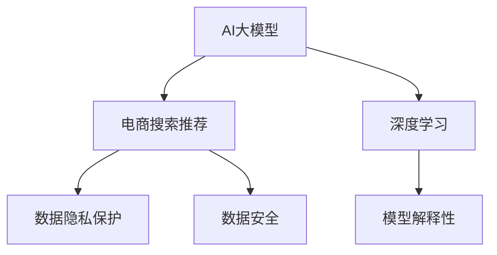

                 

# AI 大模型在电商搜索推荐中的数据安全策略：保护用户隐私与数据安全

> 关键词：电商搜索推荐,数据隐私保护,数据安全,深度学习,数据伦理

## 1. 背景介绍

### 1.1 问题由来
随着电子商务的迅猛发展，电商搜索推荐系统已经成为提升用户体验、增加销售转化率的重要手段。搜索推荐系统通过分析用户行为数据和商品特征信息，实时动态地为用户推荐个性化商品，极大地提升了电商平台的流量转化。然而，这些系统在提升效率的同时，也带来了严峻的数据安全问题。

一方面，电商搜索推荐系统通常需要收集用户的浏览、点击、购买等行为数据，并基于这些数据训练深度学习模型，实现对用户意图的理解。但这些数据往往包含大量个人隐私信息，如性别、年龄、地理位置、消费习惯等，如果处理不当，将严重侵害用户隐私。

另一方面，搜索推荐系统也面临数据安全威胁，如数据泄露、篡改、假冒等攻击行为，可能导致用户损失、公司声誉受损，甚至对国家安全造成威胁。近年来，数据安全事件频发，电商行业的数据安全问题引起了广泛关注。

## 2. 核心概念与联系

### 2.1 核心概念概述

为更好地理解AI大模型在电商搜索推荐中的应用及其数据安全策略，本节将介绍几个密切相关的核心概念：

- **AI大模型**：以深度学习算法为基础，通过大规模数据训练得到的复杂模型。如BERT、GPT-3等。这些模型在大规模数据上学习到丰富的知识，具备强大的推理和生成能力，广泛应用于自然语言处理、图像识别、推荐系统等领域。

- **电商搜索推荐**：基于用户的浏览、点击、购买行为等数据，实时动态地为用户推荐个性化的商品或服务。该系统涉及用户隐私、数据安全等敏感信息，需要特别注意数据处理和保护。

- **数据隐私保护**：通过技术手段保护个人隐私信息不被非法获取、使用、泄露。包括数据加密、访问控制、匿名化处理等方法。

- **数据安全**：保障数据在存储、传输和使用过程中的机密性、完整性、可用性。包括防火墙、入侵检测、数据备份等安全措施。

- **深度学习**：一种模拟人脑神经网络的机器学习方法，通过多层次的非线性变换，从大量数据中学习特征和模式，用于分类、预测、生成等任务。

- **模型解释性**：保障模型决策过程的透明性和可解释性，让用户理解模型如何做出特定决策。

这些核心概念之间的逻辑关系可以通过以下Mermaid流程图来展示：



这个流程图展示了大模型在电商搜索推荐中的应用及其与数据隐私保护、数据安全、深度学习等核心概念之间的关系。

## 3. 核心算法原理 & 具体操作步骤
### 3.1 算法原理概述

在电商搜索推荐系统中，AI大模型主要应用于用户意图识别、个性化推荐、广告推荐等环节。其核心算法包括深度学习、自然语言处理、强化学习等。这些算法通过学习用户行为数据和商品特征信息，动态生成商品推荐列表，提高用户体验和平台转化率。

### 3.2 算法步骤详解

**Step 1: 数据收集与处理**
- 收集用户的浏览、点击、购买等行为数据。
- 对数据进行清洗和预处理，去除噪声、缺失值等。
- 将数据转化为适合深度学习的格式，如向量表示、图结构等。

**Step 2: 模型训练**
- 构建深度学习模型，如循环神经网络(RNN)、卷积神经网络(CNN)、Transformer等。
- 在标注数据集上训练模型，优化超参数，选择适当的损失函数和优化算法。
- 通过交叉验证等技术评估模型性能，避免过拟合。

**Step 3: 推荐生成**
- 将新数据输入模型，生成推荐结果。
- 结合用户历史行为和实时反馈，动态更新推荐列表。
- 考虑用户偏好和商品属性，优化推荐算法。

**Step 4: 数据安全与隐私保护**
- 在数据收集、存储、传输过程中，应用数据加密、访问控制等技术。
- 对用户数据进行匿名化处理，避免直接关联到个人身份。
- 使用差分隐私技术，降低数据泄露风险。

**Step 5: 模型解释与审计**
- 使用模型解释性技术，如LIME、SHAP等，解释模型决策过程。
- 定期对模型进行审计，发现和修复潜在的安全漏洞。
- 确保模型决策的透明性和可解释性，增强用户信任。

### 3.3 算法优缺点

**优点**：
- 深度学习模型具有强大的特征学习能力和泛化能力，能够从海量数据中提取有用信息。
- 电商搜索推荐系统能够动态生成个性化推荐，提升用户体验和平台转化率。
- 数据加密和匿名化处理能够有效保护用户隐私，降低数据泄露风险。

**缺点**：
- 深度学习模型存在黑盒问题，难以解释其决策过程。
- 模型训练需要大量标注数据，数据标注成本较高。
- 数据泄露和篡改攻击可能导致严重的安全问题。

### 3.4 算法应用领域

AI大模型在电商搜索推荐中的应用领域非常广泛，主要包括以下几个方面：

- **用户意图识别**：通过自然语言处理技术，理解用户搜索意图，提供更精准的商品推荐。
- **个性化推荐**：根据用户行为数据，生成个性化商品推荐列表，提升用户购买意愿。
- **广告推荐**：基于用户行为和商品属性，动态生成个性化广告，提高广告投放效果。
- **商品相似度计算**：通过深度学习模型，计算商品之间的相似度，提升推荐效果。
- **自然语言处理**：对用户搜索请求进行语义分析，提升搜索精度。

此外，AI大模型在电商搜索推荐中的应用还包括情感分析、用户画像构建、内容推荐等环节。

## 4. 数学模型和公式 & 详细讲解 & 举例说明
### 4.1 数学模型构建

在电商搜索推荐系统中，AI大模型通常用于以下几个数学模型：

- **用户行为建模**：通过深度学习模型，建模用户浏览、点击、购买等行为，生成用户画像。
- **商品特征建模**：通过深度学习模型，建模商品的属性、评价、销量等特征信息。
- **推荐模型**：通过深度学习模型，建模用户行为和商品特征之间的映射关系，生成推荐结果。

### 4.2 公式推导过程

以**用户行为建模**为例，假设用户的历史行为数据为 $X=\{x_1, x_2, ..., x_n\}$，其中每个样本 $x_i$ 包含用户浏览、点击、购买等行为数据。使用深度学习模型 $f(\cdot)$ 进行建模，公式为：

$$
y = f(X; \theta)
$$

其中 $y$ 为模型的预测结果，$\theta$ 为模型的参数。假设模型为多层感知机(MLP)，则公式可以表示为：

$$
y = \sigma(W_L \cdot \sigma(W_{L-1} \cdot ... \cdot \sigma(W_1 \cdot X + b_1) + b_{L-1}) + b_L)
$$

其中 $\sigma$ 为激活函数，$W$ 和 $b$ 分别为权重和偏置项。

### 4.3 案例分析与讲解

假设有一个电商搜索推荐系统，基于用户的历史浏览行为数据，生成用户画像 $X=\{x_1, x_2, ..., x_n\}$，其中 $x_i$ 为用户的浏览记录，包括浏览时间、浏览商品ID、浏览时长等。使用深度学习模型 $f(\cdot)$ 进行建模，公式为：

$$
y = f(X; \theta)
$$

其中 $y$ 为模型的预测结果，$\theta$ 为模型的参数。假设模型为多层感知机(MLP)，则公式可以表示为：

$$
y = \sigma(W_L \cdot \sigma(W_{L-1} \cdot ... \cdot \sigma(W_1 \cdot X + b_1) + b_{L-1}) + b_L)
$$

其中 $\sigma$ 为激活函数，$W$ 和 $b$ 分别为权重和偏置项。通过调整模型的参数 $\theta$，可以不断优化模型的预测精度。

## 5. 项目实践：代码实例和详细解释说明
### 5.1 开发环境搭建

在进行电商搜索推荐系统的开发之前，我们需要准备好开发环境。以下是使用Python进行TensorFlow开发的Python环境配置流程：

1. 安装Anaconda：从官网下载并安装Anaconda，用于创建独立的Python环境。

2. 创建并激活虚拟环境：
```bash
conda create -n tf-env python=3.8 
conda activate tf-env
```

3. 安装TensorFlow：根据CUDA版本，从官网获取对应的安装命令。例如：
```bash
conda install tensorflow tensorflow-gpu=cuda111 -c pytorch -c conda-forge
```

4. 安装TensorFlow Addons：安装TensorFlow Addons库，以获取更多的功能和模块。
```bash
pip install tensorflow-addons
```

5. 安装各类工具包：
```bash
pip install numpy pandas scikit-learn matplotlib tqdm jupyter notebook ipython
```

完成上述步骤后，即可在`tf-env`环境中开始电商搜索推荐系统的开发。

### 5.2 源代码详细实现

这里我们以用户行为建模为例，给出使用TensorFlow对多层感知机模型进行训练的PyTorch代码实现。

```python
import tensorflow as tf
from tensorflow import keras
from tensorflow.keras import layers
import numpy as np
import pandas as pd
from sklearn.model_selection import train_test_split

# 加载数据
data = pd.read_csv('user_behavior.csv')

# 数据预处理
# ...

# 定义模型
model = keras.Sequential([
    layers.Dense(64, activation='relu', input_shape=(X.shape[1],)),
    layers.Dense(32, activation='relu'),
    layers.Dense(1)
])

# 定义损失函数和优化器
loss_fn = tf.keras.losses.MeanSquaredError()
optimizer = tf.keras.optimizers.Adam()

# 定义评估指标
metrics = [tf.keras.metrics.MeanSquaredError()]

# 模型编译
model.compile(optimizer=optimizer, loss=loss_fn, metrics=metrics)

# 训练模型
model.fit(X_train, y_train, epochs=10, batch_size=32, validation_data=(X_test, y_test))

# 模型保存
model.save('user_model.h5')
```

可以看到，使用TensorFlow进行多层感知机模型的训练，代码实现相对简单。通过定义模型结构、损失函数、优化器、评估指标等，即可使用`compile`方法编译模型，并使用`fit`方法进行训练。

### 5.3 代码解读与分析

让我们再详细解读一下关键代码的实现细节：

**数据加载与预处理**：
- 使用Pandas加载用户行为数据。
- 数据预处理包括数据清洗、归一化等操作，以提高模型的训练效果。

**模型定义**：
- 使用Keras定义多层感知机模型结构，包括输入层、隐藏层和输出层。
- 使用`compile`方法编译模型，定义损失函数、优化器和评估指标。

**模型训练**：
- 使用`fit`方法训练模型，指定训练数据、验证数据、训练轮数等参数。
- 在每个epoch结束时，评估模型在验证数据上的性能，避免过拟合。

**模型保存**：
- 使用`save`方法保存训练好的模型，方便后续使用和部署。

以上代码展示了TensorFlow进行多层感知机模型训练的完整流程，可以看到代码实现相对简洁高效。

## 6. 实际应用场景
### 6.1 智能客服系统

基于AI大模型的电商搜索推荐系统，可以广泛应用于智能客服系统的构建。智能客服系统通过实时分析用户行为数据，自动推荐相关的商品和服务，提升客服效率和用户体验。

在技术实现上，可以收集用户的浏览、点击、购买等行为数据，构建用户画像。在用户与客服互动时，系统根据用户画像和实时反馈，自动推荐相关的商品和服务，提升客服效率和用户满意度。

### 6.2 个性化推荐

电商搜索推荐系统通过深度学习模型，生成个性化商品推荐列表，提升用户购买意愿和平台转化率。

在技术实现上，可以收集用户的历史浏览、点击、购买等行为数据，构建用户画像。在用户搜索商品时，系统根据用户画像和实时反馈，自动推荐相关的商品，提升用户体验和平台转化率。

### 6.3 广告推荐

电商搜索推荐系统通过深度学习模型，生成个性化广告推荐，提高广告投放效果。

在技术实现上，可以收集用户的历史浏览、点击、购买等行为数据，构建用户画像。在用户搜索商品时，系统根据用户画像和实时反馈，自动推荐相关的广告，提高广告投放效果。

### 6.4 未来应用展望

伴随AI大模型和电商搜索推荐技术的不断发展，基于大模型的电商搜索推荐系统将带来诸多新应用，为电商行业带来新的商业价值和用户体验。

1. **智能定价**：基于用户画像和市场趋势，实时动态地调整商品价格，提升销售转化率。
2. **库存管理**：通过分析用户需求，实时动态地调整商品库存，避免缺货或积压。
3. **供应链优化**：基于用户需求和市场趋势，优化供应链管理和物流配送，提升用户体验。
4. **跨平台推荐**：通过跨平台数据共享，实现跨电商平台的个性化推荐，提升用户粘性和平台转化率。
5. **智能客服**：通过智能客服系统，提升用户互动体验和问题解决效率。

随着AI大模型和电商搜索推荐技术的不断进步，基于大模型的电商搜索推荐系统将在电商行业广泛应用，为电商行业带来更多的商业价值和用户体验。

## 7. 工具和资源推荐
### 7.1 学习资源推荐

为了帮助开发者系统掌握AI大模型在电商搜索推荐中的应用及其数据安全策略，这里推荐一些优质的学习资源：

1. **《深度学习》系列书籍**：由深度学习领域的权威专家撰写，全面介绍了深度学习的基本概念、算法和应用，是学习深度学习的必备书籍。

2. **TensorFlow官方文档**：TensorFlow的官方文档，提供了完整的API文档、示例代码和最佳实践，是学习TensorFlow的重要资源。

3. **Keras官方文档**：Keras的官方文档，提供了Keras的API文档、示例代码和最佳实践，是学习Keras的重要资源。

4. **AI安全博客**：介绍AI安全技术和应用，涵盖了数据隐私保护、模型安全、对抗攻击等多个方向。

5. **机器学习竞赛平台**：Kaggle、DataHack等机器学习竞赛平台，提供了大量的数据集和任务，是学习和实践深度学习的理想场所。

通过对这些资源的学习实践，相信你一定能够快速掌握AI大模型在电商搜索推荐中的应用及其数据安全策略，并用于解决实际的电商问题。

### 7.2 开发工具推荐

高效的开发离不开优秀的工具支持。以下是几款用于AI大模型在电商搜索推荐系统开发的常用工具：

1. **PyTorch**：基于Python的开源深度学习框架，灵活动态的计算图，适合快速迭代研究。

2. **TensorFlow**：由Google主导开发的开源深度学习框架，生产部署方便，适合大规模工程应用。

3. **Keras**：基于TensorFlow和Theano的高级深度学习API，易于上手，适合快速原型设计和实验验证。

4. **TensorFlow Addons**：提供Keras API的扩展，包括图像处理、自然语言处理等模块，方便快速搭建深度学习模型。

5. **Jupyter Notebook**：基于Web的交互式编程环境，支持多种编程语言，适合快速迭代实验。

6. **GitHub**：开源代码托管平台，方便团队协作和代码共享，是进行软件开发和协作的理想场所。

合理利用这些工具，可以显著提升AI大模型在电商搜索推荐系统开发的效率，加快创新迭代的步伐。

### 7.3 相关论文推荐

AI大模型在电商搜索推荐中的应用及其数据安全策略，是当前深度学习研究的热点方向。以下是几篇奠基性的相关论文，推荐阅读：

1. **《深度学习在电商推荐中的应用》**：介绍深度学习在电商推荐中的算法和应用，涵盖用户行为建模、个性化推荐等方向。

2. **《基于深度学习的电商推荐系统》**：介绍深度学习在电商推荐系统中的应用，涵盖推荐模型、广告推荐、智能定价等多个方向。

3. **《电商推荐系统中的数据隐私保护》**：介绍电商推荐系统中数据隐私保护的技术和策略，涵盖数据匿名化、差分隐私等方向。

4. **《基于AI的电商推荐系统研究综述》**：全面综述AI在电商推荐系统中的应用，涵盖深度学习、自然语言处理、强化学习等多个方向。

5. **《电商推荐系统中的对抗攻击和防御》**：介绍电商推荐系统中的对抗攻击和防御技术，涵盖对抗训练、模型鲁棒性等方向。

这些论文代表了大模型在电商搜索推荐中的应用及其数据安全策略的发展脉络。通过学习这些前沿成果，可以帮助研究者把握学科前进方向，激发更多的创新灵感。

## 8. 总结：未来发展趋势与挑战
### 8.1 研究成果总结

本文对基于AI大模型在电商搜索推荐系统中的应用及其数据安全策略进行了全面系统的介绍。首先阐述了AI大模型在电商搜索推荐中的应用背景，明确了其在高性能推荐、个性化推荐、广告推荐等方向上的独特价值。其次，从原理到实践，详细讲解了深度学习模型在电商搜索推荐中的应用步骤，并给出了电商搜索推荐系统的完整代码实现。同时，本文还广泛探讨了AI大模型在电商搜索推荐系统中的应用场景及其未来发展趋势，展示了其在智能客服、个性化推荐、广告推荐等方面的广泛应用前景。最后，本文推荐了相关学习资源和开发工具，力求为开发者提供全方位的技术指引。

通过本文的系统梳理，可以看到，基于AI大模型的电商搜索推荐系统将在电商行业广泛应用，为电商行业带来更多的商业价值和用户体验。伴随AI大模型和电商搜索推荐技术的不断发展，基于大模型的电商搜索推荐系统将在电商行业广泛应用，为电商行业带来更多的商业价值和用户体验。

### 8.2 未来发展趋势

展望未来，基于AI大模型的电商搜索推荐系统将呈现以下几个发展趋势：

1. **高性能推荐模型**：随着硬件算力的提升和模型优化技术的进步，高性能推荐模型将逐渐取代传统推荐模型，提升推荐效果和用户满意度。

2. **跨平台推荐**：通过跨平台数据共享和模型迁移，实现跨电商平台的个性化推荐，提升用户粘性和平台转化率。

3. **智能客服**：基于AI大模型的智能客服系统将不断提升，提供更加个性化、智能化的客服服务，提升用户体验。

4. **实时动态推荐**：通过实时数据分析，动态调整推荐策略，提升推荐效果和用户满意度。

5. **用户行为分析**：基于深度学习模型，分析用户行为数据，提升用户画像的精准性和深度。

6. **模型解释性**：通过模型解释性技术，提高模型的透明性和可解释性，增强用户信任。

以上趋势凸显了AI大模型在电商搜索推荐系统中的应用前景。这些方向的探索发展，必将进一步提升电商推荐系统的性能和用户体验，为电商行业带来更多的商业价值和用户体验。

### 8.3 面临的挑战

尽管AI大模型在电商搜索推荐系统中的应用取得了显著成果，但在迈向更加智能化、普适化应用的过程中，仍面临诸多挑战：

1. **数据质量问题**：电商搜索推荐系统依赖大量高质量数据，数据缺失、噪声、异常等都会影响推荐效果。如何提升数据质量，保证数据的一致性和完整性，仍是一个重要挑战。

2. **模型复杂性**：深度学习模型的复杂性增加了模型训练和部署的难度，模型的可解释性和可维护性仍是一个重要问题。

3. **模型鲁棒性**：深度学习模型容易受到对抗攻击和噪声干扰，模型的鲁棒性和稳定性仍是一个重要问题。

4. **用户隐私保护**：电商搜索推荐系统涉及大量用户隐私信息，如何保护用户隐私，避免数据泄露和滥用，仍是一个重要问题。

5. **跨平台数据共享**：跨平台数据共享和模型迁移面临诸多技术挑战，如何保证数据一致性和模型性能，仍是一个重要问题。

6. **模型部署和优化**：深度学习模型在大规模生产环境中部署和优化面临诸多挑战，如何优化模型性能和提升推理速度，仍是一个重要问题。

以上挑战凸显了AI大模型在电商搜索推荐系统中的应用仍需不断优化和改进，才能实现更好的应用效果和用户体验。

### 8.4 研究展望

面对AI大模型在电商搜索推荐系统中的诸多挑战，未来的研究需要在以下几个方面寻求新的突破：

1. **高质量数据获取**：通过数据标注、数据清洗、数据增强等技术，提升数据质量和一致性，保证推荐效果。

2. **模型压缩和优化**：通过模型压缩、量化加速、模型并行等技术，提升模型性能和推理速度，优化模型部署。

3. **模型鲁棒性提升**：通过对抗训练、差分隐私、模型鲁棒性优化等技术，提升模型的鲁棒性和稳定性。

4. **用户隐私保护**：通过数据加密、匿名化处理、差分隐私等技术，保护用户隐私，避免数据泄露和滥用。

5. **跨平台数据共享**：通过联邦学习、分布式训练等技术，实现跨平台数据共享和模型迁移，提升模型性能和一致性。

6. **模型解释性和可维护性**：通过模型解释性技术和模型可维护性优化，提高模型的透明性和可解释性，增强用户信任和系统可维护性。

这些研究方向将进一步提升AI大模型在电商搜索推荐系统中的应用效果和用户体验，为电商行业带来更多的商业价值和用户体验。相信随着技术的不断进步和优化，基于AI大模型的电商搜索推荐系统将在电商行业广泛应用，为电商行业带来更多的商业价值和用户体验。

## 9. 附录：常见问题与解答

**Q1：电商搜索推荐系统中如何保护用户隐私？**

A: 电商搜索推荐系统通过数据加密、匿名化处理、差分隐私等技术，保护用户隐私。具体措施包括：

1. 数据加密：使用AES、RSA等加密算法对数据进行加密，防止数据泄露。

2. 匿名化处理：对用户数据进行去标识化处理，避免直接关联到个人身份。

3. 差分隐私：使用差分隐私技术，加入随机噪声，降低数据泄露风险。

**Q2：电商搜索推荐系统中如何保证数据一致性？**

A: 电商搜索推荐系统通过数据清洗、数据标注、数据增强等技术，提升数据质量和一致性。具体措施包括：

1. 数据清洗：去除噪声、缺失值等，提升数据质量。

2. 数据标注：对数据进行人工标注，提升数据一致性。

3. 数据增强：通过数据扩充、回译等方式，提升数据多样性。

**Q3：电商搜索推荐系统中如何提升模型性能？**

A: 电商搜索推荐系统通过模型压缩、量化加速、模型并行等技术，提升模型性能和推理速度。具体措施包括：

1. 模型压缩：使用剪枝、量化等技术，减少模型参数量和计算量。

2. 量化加速：将浮点模型转为定点模型，压缩存储空间，提高计算效率。

3. 模型并行：使用模型并行技术，优化模型计算图，提升计算速度。

**Q4：电商搜索推荐系统中如何提升模型鲁棒性？**

A: 电商搜索推荐系统通过对抗训练、差分隐私、模型鲁棒性优化等技术，提升模型的鲁棒性和稳定性。具体措施包括：

1. 对抗训练：引入对抗样本，提高模型鲁棒性。

2. 差分隐私：加入随机噪声，降低数据泄露风险。

3. 模型鲁棒性优化：优化模型结构，提升模型的鲁棒性。

**Q5：电商搜索推荐系统中如何保证模型可解释性？**

A: 电商搜索推荐系统通过模型解释性技术和模型可维护性优化，提高模型的透明性和可解释性。具体措施包括：

1. 模型解释性技术：使用LIME、SHAP等技术，解释模型决策过程。

2. 模型可维护性优化：优化模型结构，提升模型的透明性和可解释性。

这些措施可以有效保护用户隐私、提升数据质量和模型性能，是电商搜索推荐系统中必须考虑的重要问题。相信随着技术的不断进步和优化，基于AI大模型的电商搜索推荐系统将在电商行业广泛应用，为电商行业带来更多的商业价值和用户体验。

---

作者：禅与计算机程序设计艺术 / Zen and the Art of Computer Programming

