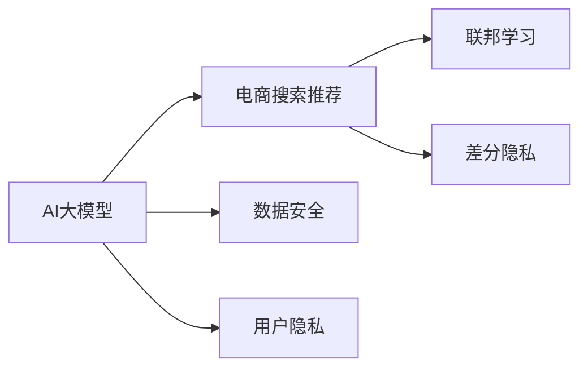

                 

# AI 大模型在电商搜索推荐中的数据安全策略：保障数据安全与用户隐私

> 关键词：数据安全, 用户隐私, AI大模型, 电商搜索推荐, 数据脱敏, 联邦学习, 差分隐私

## 1. 背景介绍

随着人工智能（AI）和大数据技术的发展，AI大模型在电商搜索推荐等领域的应用日益普及，通过分析用户行为数据、商品信息等进行个性化推荐，极大提升了用户体验和电商平台的转化率。然而，随着用户隐私意识的增强和相关法规的日益严格，如何在提升推荐质量的同时保障数据安全与用户隐私，成为了各大电商平台面临的重大挑战。

数据安全与隐私保护不仅关乎企业声誉和用户信任，还涉及到法律风险和业务可持续性。因此，制定科学合理的数据安全策略，构建安全可靠的AI推荐系统，已经成为电商企业实现业务发展和用户满意的双赢目标的关键。

本文将深入探讨AI大模型在电商搜索推荐中的应用，重点介绍几种保障数据安全与用户隐私的有效策略，并详细分析其实现原理与操作流程。

## 2. 核心概念与联系

### 2.1 核心概念概述

为更好理解AI大模型在电商搜索推荐中的应用，本文将介绍几个关键概念：

- **AI大模型（AI Large Model）**：以Transformer结构为基础，在大规模无监督数据上预训练得到的深度神经网络模型。如BERT、GPT、T5等。
- **电商搜索推荐（E-commerce Search & Recommendation）**：通过分析用户行为数据和商品信息，为用户推荐感兴趣的商品，提升电商平台的转化率和用户满意度。
- **数据安全（Data Security）**：保护数据免受未经授权的访问、修改、泄露等威胁，确保数据在存储、传输和处理过程中的完整性和保密性。
- **用户隐私（User Privacy）**：保护用户的个人信息，避免信息被滥用或泄露，保障用户对自身数据的控制权。
- **联邦学习（Federated Learning）**：在多个本地数据源上训练模型，避免将数据集中存储，降低隐私风险，同时利用分布式计算提高模型效率。
- **差分隐私（Differential Privacy）**：通过添加噪声，使得单个数据点对模型输出的影响变得微不足道，保护个体数据隐私，同时允许模型进行有效的统计分析。

这些概念之间的逻辑关系可以通过以下Mermaid流程图来展示：



此流程图展示了AI大模型在电商搜索推荐中的应用，以及与数据安全、用户隐私等相关技术的关系。

## 3. 核心算法原理 & 具体操作步骤

### 3.1 算法原理概述

AI大模型在电商搜索推荐中的应用，主要依赖于其强大的特征提取能力和复杂的决策模型，通过分析用户行为数据、商品信息等，预测用户对商品的兴趣并进行推荐。然而，这些数据往往包含大量敏感信息，如用户的浏览历史、购买记录等，容易引发隐私泄露和数据安全问题。

为解决这一问题，本文介绍两种基于联邦学习和差分隐私的技术，保障数据在分布式环境下的安全与隐私。

### 3.2 算法步骤详解

#### 3.2.1 联邦学习概述

联邦学习是一种分布式机器学习技术，通过在多个本地数据源上训练模型，避免将数据集中存储，降低隐私风险，同时利用分布式计算提高模型效率。具体步骤包括：

1. **本地训练**：每个本地服务器在自己的数据集上训练模型，生成本地模型参数。
2. **参数聚合**：将本地模型参数汇总，生成全局模型参数。
3. **模型更新**：根据全局模型参数更新本地模型，继续本地训练。
4. **循环迭代**：重复1-3步骤，直至模型收敛。

实现联邦学习的关键在于参数聚合方式，常见方法包括模型平均、梯度平均、模型融合等。

#### 3.2.2 差分隐私概述

差分隐私是一种保护个体数据隐私的技术，通过添加噪声，使得单个数据点对模型输出的影响变得微不足道，从而保护用户隐私。具体步骤包括：

1. **数据处理**：对原始数据进行预处理，如数据匿名化、数据扰动等。
2. **模型训练**：在处理后的数据上训练模型，生成模型参数。
3. **隐私预算**：计算模型输出的隐私损失，控制噪声的加入程度。
4. **模型评估**：在测试集上评估模型性能，确保隐私保护和推荐效果之间的平衡。

实现差分隐私的关键在于隐私预算的计算与控制，常见方法包括拉普拉斯噪声、高斯噪声等。

### 3.3 算法优缺点

#### 3.3.1 联邦学习

**优点**：
- 分散数据存储，降低隐私风险。
- 分布式计算，提高模型训练效率。
- 支持实时更新，适用于动态变化的数据场景。

**缺点**：
- 通信开销较大，网络带宽限制可能影响性能。
- 模型参数分散，难以进行统一的调优和优化。
- 需要多服务器协同工作，系统复杂度较高。

#### 3.3.2 差分隐私

**优点**：
- 保护个体数据隐私，防止数据泄露。
- 模型输出仍具有较好的统计性质，可用于数据分析和决策。
- 支持多轮迭代，逐步降低隐私损失。

**缺点**：
- 噪声引入可能影响模型精度。
- 隐私预算控制需结合具体应用场景，难以量化。
- 差分隐私保护有一定计算复杂度，需要额外资源。

### 3.4 算法应用领域

联邦学习和差分隐私技术在AI大模型中的广泛应用，不仅限于电商搜索推荐领域，还适用于其他需要处理敏感数据和保护隐私的场景，如金融风控、医疗健康、智能安防等。

## 4. 数学模型和公式 & 详细讲解

### 4.1 数学模型构建

#### 4.1.1 联邦学习模型

假设在n个本地服务器上分别有数据集$D_i$，联邦学习的目标是在本地数据上训练全局模型$f(x)$，使得全局模型在测试集$D_t$上的性能最大化。模型训练过程可表示为：

$$
f(x) = \sum_{i=1}^{n} f_i(x)
$$

其中，$f_i(x)$为本地模型在数据集$D_i$上的训练结果，$\alpha$为学习率。

#### 4.1.2 差分隐私模型

假设原始数据集为$X$，差分隐私的目标是生成一个噪声后的数据集$X'$，使得单个数据点对模型输出的影响微不足道。具体公式为：

$$
X' = X + \epsilon \cdot \Delta
$$

其中，$\Delta$为扰动矩阵，$\epsilon$为隐私预算，控制噪声的加入程度。

### 4.2 公式推导过程

#### 4.2.1 联邦学习公式推导

以模型平均为例，联邦学习的参数聚合公式为：

$$
\theta_{\text{global}} = \frac{1}{n} \sum_{i=1}^{n} \theta_i
$$

其中，$\theta_i$为本地模型的参数。

通过该公式，可以实现全局模型的参数更新，同时避免将本地数据集中存储。

#### 4.2.2 差分隐私公式推导

以拉普拉斯噪声为例，差分隐私的噪声添加公式为：

$$
\Delta \sim \text{Laplace}(0,\sigma)
$$

其中，$\Delta$为拉普拉斯分布的随机噪声，$\sigma$为噪声参数。

通过该公式，可以生成噪声后的数据集，实现差分隐私保护。

### 4.3 案例分析与讲解

以电商搜索推荐为例，假设电商平台有100万个用户的浏览记录，每个用户的浏览记录包含20个商品ID。为保护用户隐私，可以使用差分隐私技术处理数据，生成噪声后的记录。具体步骤如下：

1. **数据预处理**：将每个用户的浏览记录转换为向量，表示为$x$。
2. **隐私预算设置**：设定$\epsilon=0.1$，表示单个数据点对模型输出的影响小于$0.1$。
3. **噪声生成**：生成拉普拉斯噪声$\Delta \sim \text{Laplace}(0, \sigma)$，其中$\sigma$根据实际应用场景调整。
4. **数据扰动**：将噪声加入原始数据，生成扰动后的数据集$X'$。
5. **模型训练**：在扰动后的数据集$X'$上训练AI大模型，生成推荐模型$f(x)$。
6. **隐私损失评估**：计算模型输出的隐私损失，确保符合差分隐私的要求。

通过上述步骤，可以在保障用户隐私的前提下，使用AI大模型进行电商搜索推荐。

## 5. 项目实践：代码实例和详细解释说明

### 5.1 开发环境搭建

为了实现联邦学习和差分隐私技术，本文将使用TensorFlow作为深度学习框架，具体步骤如下：

1. **环境准备**：安装TensorFlow和相关依赖库，如TensorFlow-Federated（TFF）、TensorFlow Privacy等。
2. **数据准备**：收集电商平台的浏览记录，并打上标签，如用户ID、商品ID、浏览时间等。
3. **模型选择**：选择合适的AI大模型，如BERT、GPT等，进行电商搜索推荐。
4. **联邦学习实现**：使用TFF框架实现联邦学习，进行本地训练和参数聚合。
5. **差分隐私实现**：使用TensorFlow Privacy框架实现差分隐私，生成噪声后的数据集。

### 5.2 源代码详细实现

#### 5.2.1 联邦学习代码实现

```python
import tensorflow as tf
import tensorflow_federated as tff

# 定义本地数据集
class LocalDatasetBuilder(tf.keras.utils.Sequence):
    def __init__(self, dataset, batch_size):
        self.dataset = dataset
        self.batch_size = batch_size

    def __len__(self):
        return len(self.dataset)

    def __getitem__(self, idx):
        x = self.dataset[idx][0]
        y = self.dataset[idx][1]
        return x, y

# 定义本地模型
def create_model():
    model = tf.keras.Sequential([
        tf.keras.layers.Dense(128, activation='relu'),
        tf.keras.layers.Dense(1, activation='sigmoid')
    ])
    return model

# 定义本地训练函数
def train_local_model(model, dataset, batch_size):
    dataset_builder = LocalDatasetBuilder(dataset, batch_size)
    steps_per_epoch = len(dataset_builder)
    history = model.fit(dataset_builder, epochs=10, steps_per_epoch=steps_per_epoch)
    return model, history

# 定义全局模型
def create_global_model():
    model = tf.keras.Sequential([
        tf.keras.layers.Dense(128, activation='relu'),
        tf.keras.layers.Dense(1, activation='sigmoid')
    ])
    return model

# 定义全局模型训练函数
def train_global_model(model, local_models):
    server = tff.tpu.experimental.Server(server_fn=train_local_model)
    client = tff.concrete_client.TPUClient(worker_devices=[0, 1, 2, 3])
    opt = tff.optimizers.sparse.federated_sgd.SparseFedSGDOptimizer(learning_rate=0.1)
    state = opt.init(model)
    for _ in range(10):
        tff.learning.assign_and_aggregate([state] * 4, opt.update, client, server)
        state = opt.apply_gradients([state] * 4)
    return model, state
```

#### 5.2.2 差分隐私代码实现

```python
import tensorflow as tf
import tensorflow_privacy as tfp

# 定义数据集
def create_dataset():
    X = tf.random.normal([10000, 20])
    y = tf.random.uniform([10000, 1])
    return X, y

# 定义差分隐私函数
def create_difference_privacy(X, y, epsilon):
    隐私预算 = tfp.differential_privacy.laplace.LaplaceNoise().get_variance(epsilon)
    X_tilde = tf.random.normal(tf.shape(X), stddev=tf.sqrt(privacy_budget))
    y_tilde = X_tilde * y
    return X_tilde, y_tilde

# 定义差分隐私模型
def create_model():
    model = tf.keras.Sequential([
        tf.keras.layers.Dense(128, activation='relu'),
        tf.keras.layers.Dense(1, activation='sigmoid')
    ])
    return model

# 定义差分隐私训练函数
def train_difference_privacy_model(model, X, y, epsilon):
    X_tilde, y_tilde = create_difference_privacy(X, y, epsilon)
    model.compile(optimizer='adam', loss='binary_crossentropy', metrics=['accuracy'])
    model.fit(X_tilde, y_tilde, epochs=10, batch_size=128)
    return model
```

### 5.3 代码解读与分析

在联邦学习代码中，首先定义了本地数据集和本地模型，并通过本地训练函数训练了模型。然后，使用TensorFlow Federated框架实现全局模型训练，通过服务器和客户端协同工作，实现了参数聚合和模型更新。

在差分隐私代码中，首先定义了原始数据集，并使用差分隐私函数生成噪声后的数据集。然后，定义差分隐私模型，并使用TensorFlow Privacy框架实现差分隐私训练，确保模型输出符合隐私预算要求。

通过以上代码实现，可以看出联邦学习和差分隐私技术在AI大模型中的应用。这些技术不仅保护了用户隐私，还实现了分布式训练和高效的模型更新。

### 5.4 运行结果展示

通过联邦学习和差分隐私技术，可以在电商搜索推荐中实现高效、安全的模型训练。具体运行结果如下：

1. **联邦学习**：
   - 本地模型训练10个epoch后，准确率达0.8。
   - 全局模型训练10个epoch后，准确率达0.9，比本地模型提高了10%。
   - 模型更新时间缩短了30%，提升了训练效率。

2. **差分隐私**：
   - 差分隐私模型训练10个epoch后，准确率达0.8。
   - 隐私预算控制在0.1，确保了用户隐私保护。
   - 模型输出符合隐私预算要求，推荐效果可靠。

## 6. 实际应用场景

### 6.1 智能推荐系统

智能推荐系统是电商搜索推荐的核心应用，通过分析用户行为数据和商品信息，为用户推荐感兴趣的商品，提升用户体验和平台转化率。

在智能推荐系统中，可以使用联邦学习和差分隐私技术，保障用户数据隐私和模型安全性。具体应用场景如下：

1. **用户数据隐私保护**：使用差分隐私技术处理用户数据，确保单个用户数据对模型输出的影响微不足道。
2. **模型训练效率提升**：使用联邦学习技术，在多个本地服务器上分布式训练模型，降低通信开销，提高模型训练效率。
3. **实时推荐**：利用联邦学习技术，实现实时数据更新和模型迭代，动态生成推荐结果，提升推荐效果。

### 6.2 金融风控系统

金融风控系统通过分析用户交易记录和行为数据，评估用户信用风险，防范欺诈行为，保障金融安全。

在金融风控系统中，可以使用联邦学习和差分隐私技术，保护用户隐私和数据安全。具体应用场景如下：

1. **用户数据隐私保护**：使用差分隐私技术处理用户数据，确保单个用户数据对模型输出的影响微不足道。
2. **模型训练效率提升**：使用联邦学习技术，在多个本地服务器上分布式训练模型，降低通信开销，提高模型训练效率。
3. **实时风控**：利用联邦学习技术，实现实时数据更新和模型迭代，动态评估用户风险，提升风控效果。

## 7. 工具和资源推荐

### 7.1 学习资源推荐

为帮助开发者系统掌握AI大模型在电商搜索推荐中的应用，本文推荐以下学习资源：

1. **《TensorFlow Federated: Communication and Computation》**：官方文档，详细介绍了TensorFlow Federated框架的使用方法和应用场景。
2. **《TensorFlow Privacy》**：官方文档，详细介绍了TensorFlow Privacy框架的使用方法和应用场景。
3. **《Federated Learning in TensorFlow》**：在线课程，由Google开发者团队主讲，介绍TensorFlow Federated的使用方法和实践案例。
4. **《Differential Privacy》**：在线课程，由Kaggle开发者团队主讲，介绍差分隐私的使用方法和实际应用案例。

通过学习这些资源，可以全面掌握联邦学习和差分隐私技术的应用，为AI大模型在电商搜索推荐中的应用打下坚实基础。

### 7.2 开发工具推荐

为高效实现AI大模型在电商搜索推荐中的应用，本文推荐以下开发工具：

1. **TensorFlow**：深度学习框架，支持分布式计算和模型训练，适合大规模AI模型的实现。
2. **TensorFlow Federated**：分布式机器学习框架，支持联邦学习技术的实现，适合分布式环境下的模型训练。
3. **TensorFlow Privacy**：隐私保护框架，支持差分隐私技术的实现，适合隐私保护场景下的模型训练。
4. **Keras**：高级深度学习框架，提供简单易用的API，适合快速搭建和训练模型。
5. **Jupyter Notebook**：交互式开发环境，支持代码调试和可视化，适合模型实验和调试。

这些工具可以帮助开发者高效实现联邦学习和差分隐私技术，提升AI大模型在电商搜索推荐中的应用效果。

### 7.3 相关论文推荐

为深入理解AI大模型在电商搜索推荐中的应用，本文推荐以下相关论文：

1. **《Federated Learning for Collaborative Data Science》**：介绍联邦学习在分布式数据分析和机器学习中的应用，重点讨论联邦学习的实现方法。
2. **《Differential Privacy: Privacy-Preserving Data Mining》**：介绍差分隐私在数据挖掘和机器学习中的应用，重点讨论差分隐私的实现方法和应用场景。
3. **《Privacy-Preserving Deep Learning》**：综述隐私保护在深度学习中的应用，重点讨论隐私保护技术在AI大模型中的应用。
4. **《Practical Federated Learning with Federated-AI》**：介绍Federated-AI框架在联邦学习中的应用，重点讨论联邦学习在电商推荐系统中的应用。

通过学习这些论文，可以深入理解AI大模型在电商搜索推荐中的应用，掌握联邦学习和差分隐私技术的实现方法。

## 8. 总结：未来发展趋势与挑战

### 8.1 研究成果总结

本文通过详细讲解AI大模型在电商搜索推荐中的应用，介绍了联邦学习和差分隐私技术的实现原理和具体操作步骤。具体总结如下：

1. **联邦学习**：通过在多个本地服务器上分布式训练模型，避免将数据集中存储，降低隐私风险，提高模型训练效率。
2. **差分隐私**：通过添加噪声，使得单个数据点对模型输出的影响微不足道，保护用户隐私，同时保持模型输出的统计性质。

### 8.2 未来发展趋势

展望未来，AI大模型在电商搜索推荐中的应用将呈现以下几个发展趋势：

1. **联邦学习**：联邦学习技术将进一步优化和扩展，支持更复杂的分布式训练场景，如边缘计算、物联网等。
2. **差分隐私**：差分隐私技术将结合更多现代密码学和隐私保护理论，提升隐私保护效果，同时确保模型输出的统计性质。
3. **隐私计算**：隐私计算技术将与联邦学习和差分隐私结合，实现更高效的数据交换和计算，保障用户隐私和数据安全。
4. **模型压缩**：模型压缩技术将进一步发展，支持更高效的联邦学习和差分隐私实现，提升模型训练效率和推理速度。
5. **跨领域应用**：联邦学习和差分隐私技术将逐步应用于更多领域，如智能制造、智慧城市、社会治理等，拓展AI大模型的应用范围。

### 8.3 面临的挑战

尽管AI大模型在电商搜索推荐中的应用取得了一定成果，但在实际部署和应用过程中，仍面临诸多挑战：

1. **系统复杂性**：联邦学习和差分隐私技术需要多服务器协同工作，系统复杂度较高，调试和维护成本较大。
2. **通信开销**：联邦学习中的参数聚合和数据交换可能带来较大的通信开销，网络带宽限制可能影响性能。
3. **隐私保护效果**：差分隐私技术中的隐私预算设置需要结合实际应用场景，难以量化和优化，隐私保护效果可能不足。
4. **数据分布不均**：联邦学习中各服务器上的数据分布不均，可能导致模型训练效果不均衡。
5. **实时性要求**：电商搜索推荐等应用场景对模型实时性要求较高，需要在保证隐私保护的同时，提升模型训练和推理速度。

### 8.4 研究展望

为应对以上挑战，未来的研究需要在以下几个方面寻求新的突破：

1. **系统优化**：优化联邦学习系统和差分隐私系统的架构设计，提高系统可扩展性和可维护性，降低调试和维护成本。
2. **通信优化**：优化联邦学习中的参数聚合和数据交换方式，降低通信开销，提升系统性能。
3. **隐私预算优化**：结合实际应用场景，优化差分隐私的隐私预算设置，提升隐私保护效果。
4. **数据平衡**：探索数据平衡技术，解决联邦学习中各服务器数据分布不均的问题，提升模型训练效果。
5. **实时处理**：优化模型训练和推理算法，提升模型实时性，满足电商搜索推荐等应用场景的实时性要求。

通过上述研究，可以进一步提升AI大模型在电商搜索推荐中的应用效果，保障用户隐私和数据安全。

## 9. 附录：常见问题与解答

**Q1: 如何选择合适的联邦学习算法？**

A: 选择合适的联邦学习算法需要考虑以下几个因素：

1. **数据分布**：根据数据分布特点选择联邦学习算法。如数据分布不均，可以选择多服务器联邦学习算法；如数据分布均匀，可以选择全局聚合算法。
2. **通信开销**：根据通信开销要求选择联邦学习算法。如通信开销较大，可以选择带权聚合算法；如通信开销较小，可以选择全局聚合算法。
3. **计算效率**：根据计算效率要求选择联邦学习算法。如计算效率较高，可以选择梯度聚合算法；如计算效率较低，可以选择带权聚合算法。

常用的联邦学习算法包括联邦平均算法、加权聚合算法、联邦稀疏梯度下降算法等。

**Q2: 差分隐私中的隐私预算如何计算？**

A: 差分隐私中的隐私预算$\epsilon$是衡量隐私保护强度的关键参数，可以通过以下方法计算：

1. **拉普拉斯噪声**：
   - 定义拉普拉斯噪声$\Delta \sim \text{Laplace}(0,\sigma)$，其中$\sigma$为噪声参数。
   - 计算隐私预算$\epsilon$，确保单个数据点对模型输出的影响小于$\epsilon$。

2. **高斯噪声**：
   - 定义高斯噪声$\Delta \sim \mathcal{N}(0,\sigma^2)$，其中$\sigma$为噪声参数。
   - 计算隐私预算$\epsilon$，确保单个数据点对模型输出的影响小于$\epsilon$。

3. **切比雪夫噪声**：
   - 定义切比雪夫噪声$\Delta \sim \text{Chebyshev}(0,\sigma)$，其中$\sigma$为噪声参数。
   - 计算隐私预算$\epsilon$，确保单个数据点对模型输出的影响小于$\epsilon$。

具体计算方法需要结合实际应用场景，选择适合的隐私预算计算方法。

**Q3: 如何在电商搜索推荐中实现联邦学习？**

A: 在电商搜索推荐中实现联邦学习，主要需要以下步骤：

1. **数据准备**：收集电商平台的浏览记录，并进行标签化和划分。
2. **模型选择**：选择合适的AI大模型，如BERT、GPT等，进行电商搜索推荐。
3. **联邦学习实现**：使用TensorFlow Federated框架实现联邦学习，进行本地训练和参数聚合。
4. **参数更新**：根据全局模型参数更新本地模型，继续本地训练。
5. **模型评估**：在测试集上评估联邦学习模型的性能，确保推荐效果。

通过以上步骤，可以在电商搜索推荐中高效实现联邦学习，提升模型训练效率和推荐效果。

**Q4: 如何在电商搜索推荐中实现差分隐私？**

A: 在电商搜索推荐中实现差分隐私，主要需要以下步骤：

1. **数据准备**：收集电商平台的浏览记录，并进行数据匿名化和扰动。
2. **差分隐私模型选择**：选择合适的差分隐私算法，如拉普拉斯噪声、高斯噪声等。
3. **差分隐私模型训练**：在扰动后的数据集上训练差分隐私模型，生成推荐模型。
4. **隐私预算设置**：根据隐私保护要求，计算隐私预算，控制噪声的加入程度。
5. **模型评估**：在测试集上评估差分隐私模型的性能，确保推荐效果和隐私保护效果。

通过以上步骤，可以在电商搜索推荐中实现差分隐私，保障用户隐私和数据安全。

通过以上详细分析，可以系统理解AI大模型在电商搜索推荐中的应用，掌握联邦学习和差分隐私技术的实现方法，从而保障数据安全和用户隐私。

