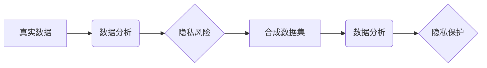

> 合成数据集,隐私保护,数据安全,人工智能,机器学习,软件2.0

## 1. 背景介绍

在当今数据驱动时代，数据已成为企业和研究机构的核心资产。然而，数据的使用也带来了严峻的隐私保护挑战。传统的数据收集和使用方式往往会泄露敏感信息，引发隐私泄露事件和社会伦理争议。

随着人工智能（AI）技术的快速发展，数据分析和机器学习（ML）应用日益广泛，对海量数据的依赖也更加深刻。然而，真实数据的获取和使用面临着诸多限制，例如：

* **数据隐私问题:** 真实数据往往包含敏感个人信息，直接使用可能违反隐私法规和伦理规范。
* **数据获取成本高:** 收集、清洗和标注真实数据需要投入大量时间、人力和物力。
* **数据可用性有限:** 某些特定领域的真实数据可能难以获取，限制了模型的训练和应用。

为了解决这些问题，合成数据集应运而生。合成数据集是指通过算法生成模拟真实数据的虚拟数据集，保留真实数据的统计特性和分布规律，同时保护敏感信息。

## 2. 核心概念与联系

合成数据集是一种利用人工智能技术模拟真实数据的虚拟数据集，其核心概念包括：

* **数据生成:** 利用机器学习算法，从真实数据中学习数据分布规律，并生成新的虚拟数据。
* **隐私保护:** 合成数据不包含真实用户的敏感信息，能够有效保护用户隐私。
* **数据可控性:** 合成数据可以根据需要进行定制和调整，例如控制数据分布、添加噪声等。

**核心概念架构**



## 3. 核心算法原理 & 具体操作步骤

### 3.1  算法原理概述

合成数据集的生成主要依赖于以下几种机器学习算法：

* **生成对抗网络 (GAN):** GAN由两个神经网络组成，一个是生成器，负责生成虚拟数据；另一个是鉴别器，负责判断数据是否真实。两者相互竞争，生成器不断改进生成数据质量，鉴别器不断提高识别能力。
* **变分自编码器 (VAE):** VAE通过编码器将数据压缩成低维表示，然后通过解码器将其恢复成原始数据。训练过程中，VAE学习到数据的潜在结构和分布规律，可以根据潜在表示生成新的虚拟数据。
* **Transformer:** Transformer是一种强大的序列模型，可以学习数据之间的长距离依赖关系。在合成数据集生成中，Transformer可以用于生成文本、音频、图像等多种类型的虚拟数据。

### 3.2  算法步骤详解

以GAN为例，其生成合成数据集的步骤如下：

1. **数据预处理:** 对真实数据进行清洗、格式化和特征工程，以便于模型训练。
2. **模型训练:** 训练生成器和鉴别器网络，使生成器能够生成逼真的虚拟数据，而鉴别器能够准确区分真实数据和虚拟数据。
3. **数据生成:** 利用训练好的生成器网络，根据需要生成新的虚拟数据。
4. **数据评估:** 对生成的虚拟数据进行评估，例如与真实数据进行比较，评估其统计特性和分布规律。

### 3.3  算法优缺点

**优点:**

* **隐私保护:** 合成数据不包含真实用户的敏感信息，能够有效保护用户隐私。
* **数据可控性:** 合成数据可以根据需要进行定制和调整，例如控制数据分布、添加噪声等。
* **数据丰富性:** 合成数据可以生成各种类型的虚拟数据，丰富数据资源。

**缺点:**

* **数据真实性:** 合成数据可能无法完全模拟真实数据的复杂性和多样性。
* **算法复杂度:** 合成数据集的生成算法通常比较复杂，需要较高的计算资源和技术水平。
* **数据偏差:** 合成数据可能存在偏差，例如数据分布不均匀，导致模型训练效果不佳。

### 3.4  算法应用领域

合成数据集在以下领域具有广泛的应用前景：

* **医疗保健:** 生成模拟患者数据的虚拟数据集，用于训练医疗诊断模型，保护患者隐私。
* **金融服务:** 生成模拟交易数据的虚拟数据集，用于训练欺诈检测模型，保护用户资金安全。
* **教育:** 生成模拟学生数据的虚拟数据集，用于个性化教学，保护学生隐私。
* **自动驾驶:** 生成模拟驾驶场景数据的虚拟数据集，用于训练自动驾驶模型，提高模型安全性。

## 4. 数学模型和公式 & 详细讲解 & 举例说明

### 4.1  数学模型构建

合成数据集的生成可以看作是一个概率模型的构建过程。假设真实数据服从某个概率分布 $P_{data}(x)$，我们的目标是构建一个概率模型 $P_{synthetic}(x)$，使得 $P_{synthetic}(x)$ 与 $P_{data}(x)$ 尽可能接近。

### 4.2  公式推导过程

GAN的训练过程可以看作是两个概率分布之间的博弈过程。生成器网络 $G$ 试图最大化以下目标函数：

$$
\max_G V(D,G) = E_{x \sim P_{data}(x)}[log D(x)] + E_{z \sim P_z(z)}[log(1-D(G(z)))]
$$

其中，$D$ 是鉴别器网络，$P_z(z)$ 是噪声分布。

鉴别器网络 $D$ 试图最小化以下目标函数：

$$
\min_D V(D,G) = E_{x \sim P_{data}(x)}[log D(x)] + E_{z \sim P_z(z)}[log(1-D(G(z)))]
$$

通过不断训练，生成器网络 $G$ 可以生成越来越逼真的虚拟数据。

### 4.3  案例分析与讲解

例如，在生成合成图像数据时，我们可以使用GAN训练一个生成器网络，使其能够生成逼真的图像。训练过程中，生成器网络会从随机噪声中生成图像，并将其与真实图像进行比较。鉴别器网络则会判断图像是否真实，并反馈给生成器网络。通过不断迭代，生成器网络可以学习到真实图像的特征，并生成越来越逼真的虚拟图像。

## 5. 项目实践：代码实例和详细解释说明

### 5.1  开发环境搭建

* Python 3.7+
* TensorFlow/PyTorch
* Jupyter Notebook

### 5.2  源代码详细实现

```python
# 导入必要的库
import tensorflow as tf

# 定义生成器网络
def generator(z):
  # ...

# 定义鉴别器网络
def discriminator(x):
  # ...

# 定义损失函数
def loss_function(real_output, fake_output):
  # ...

# 定义优化器
optimizer_G = tf.keras.optimizers.Adam(learning_rate=0.0002, beta_1=0.5)
optimizer_D = tf.keras.optimizers.Adam(learning_rate=0.0002, beta_1=0.5)

# 训练循环
for epoch in range(num_epochs):
  # ...
```

### 5.3  代码解读与分析

* 生成器网络和鉴别器网络的结构可以根据具体应用场景进行调整。
* 损失函数用于衡量生成器和鉴别器网络的性能。
* 优化器用于更新生成器和鉴别器网络的权重。

### 5.4  运行结果展示

训练完成后，可以利用生成器网络生成新的虚拟数据，并进行评估。

## 6. 实际应用场景

### 6.1  医疗保健

* 生成模拟患者数据的虚拟数据集，用于训练医疗诊断模型，保护患者隐私。
* 生成模拟医学影像数据的虚拟数据集，用于训练图像识别模型，提高诊断准确率。

### 6.2  金融服务

* 生成模拟交易数据的虚拟数据集，用于训练欺诈检测模型，保护用户资金安全。
* 生成模拟客户数据的虚拟数据集，用于训练个性化金融服务模型，提升客户体验。

### 6.3  教育

* 生成模拟学生数据的虚拟数据集，用于个性化教学，保护学生隐私。
* 生成模拟考试数据的虚拟数据集，用于训练智能批改系统，提高效率。

### 6.4  未来应用展望

随着人工智能技术的不断发展，合成数据集将在更多领域得到应用，例如：

* **自动驾驶:** 生成模拟驾驶场景数据的虚拟数据集，用于训练自动驾驶模型，提高模型安全性。
* **机器人:** 生成模拟环境数据的虚拟数据集，用于训练机器人控制算法，提高机器人智能化程度。
* **游戏:** 生成模拟游戏场景数据的虚拟数据集，用于训练游戏人工智能，提升游戏体验。

## 7. 工具和资源推荐

### 7.1  学习资源推荐

* **书籍:**
    * "Generative Deep Learning" by David Foster
    * "Deep Learning" by Ian Goodfellow, Yoshua Bengio, and Aaron Courville
* **在线课程:**
    * Coursera: "Deep Learning Specialization" by Andrew Ng
    * Udacity: "Deep Learning Nanodegree"

### 7.2  开发工具推荐

* **TensorFlow:** https://www.tensorflow.org/
* **PyTorch:** https://pytorch.org/
* **Keras:** https://keras.io/

### 7.3  相关论文推荐

* "Generative Adversarial Networks" by Ian Goodfellow et al. (2014)
* "Variational Autoencoders for Learning Implicit Distributions" by Diederik P. Kingma and Max Welling (2013)
* "Attention Is All You Need" by Ashish Vaswani et al. (2017)

## 8. 总结：未来发展趋势与挑战

### 8.1  研究成果总结

合成数据集技术在隐私保护、数据安全和数据可控性方面取得了显著进展，为人工智能应用提供了新的思路和解决方案。

### 8.2  未来发展趋势

* **算法创新:** 研究更先进的生成模型，提高合成数据质量和真实性。
* **数据多样性:** 生成更多类型和领域的合成数据，满足不同应用场景的需求。
* **隐私增强:** 开发更有效的隐私保护机制，确保合成数据不泄露敏感信息。

### 8.3  面临的挑战

* **数据真实性:** 合成数据可能无法完全模拟真实数据的复杂性和多样性。
* **算法复杂度:** 合成数据集的生成算法通常比较复杂，需要较高的计算资源和技术水平。
* **数据偏差:** 合成数据可能存在偏差，例如数据分布不均匀，导致模型训练效果不佳。

### 8.4  研究展望

未来，合成数据集技术将继续发展，并与其他人工智能技术相结合，例如联邦学习、差分隐私等，为构建更加安全、隐私保护的智能应用提供更强大的支持。

## 9. 附录：常见问题与解答

**Q1: 合成数据集与真实数据集相比，有什么优势？**

**A1:** 合成数据集可以有效保护用户隐私，同时可以根据需要进行定制和调整，例如控制数据分布、添加噪声等。

**Q2: 合成数据集的生成过程是否复杂？**

**A2:** 合成数据集的生成算法通常比较复杂，需要一定的技术水平和计算资源。

**Q3: 合成数据集的真实性如何保证？**

**A3:** 合成数据集的真实性取决于生成模型的复杂性和训练数据质量。

**Q4: 合成数据集有哪些应用场景？**

**A4:** 合成数据集可以应用于医疗保健、金融服务、教育、自动驾驶等多个领域。


作者：禅与计算机程序设计艺术 / Zen and the Art of Computer Programming 
<end_of_turn>