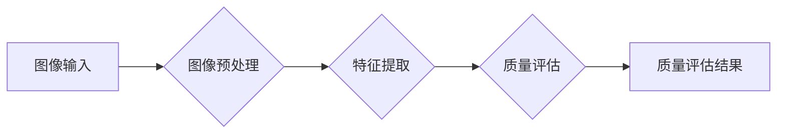

> OpenCV, 图像质量分析, 图像处理, 算法设计, 代码实现, 深度学习

## 1. 背景介绍

在数字图像处理和计算机视觉领域，图像质量分析是一个至关重要的环节。图像质量直接影响着图像的应用效果，例如在医疗诊断、遥感监测、视频监控等领域，高质量的图像能够提供更准确、更可靠的信息。随着数字图像技术的快速发展，图像质量分析的需求也日益增长。

传统的图像质量评估方法主要依赖于主观评价，例如人类专家对图像进行打分。这种方法虽然能够反映图像质量的整体感受，但缺乏客观性和可重复性。近年来，随着计算机视觉技术的进步，基于算法的图像质量评估方法逐渐成为主流。这些方法利用图像的特征和统计信息，对图像质量进行客观量化评估。

OpenCV是一个开源的计算机视觉库，提供了丰富的图像处理和分析功能。利用OpenCV，我们可以开发出高效、灵活的图像质量分析系统。

## 2. 核心概念与联系

图像质量分析系统通常包括以下几个核心模块：

* **图像预处理模块:** 对输入图像进行预处理，例如调整亮度、对比度、去除噪声等，以提高图像质量分析的准确性。
* **特征提取模块:** 从图像中提取关键特征，例如边缘、纹理、结构等，这些特征能够反映图像的质量特性。
* **质量评估模块:** 根据提取的特征，对图像质量进行量化评估，并输出评估结果。

**核心概念架构图:**



## 3. 核心算法原理 & 具体操作步骤

### 3.1  算法原理概述

本系统采用基于结构相似度 (SSIM) 的图像质量评估算法。SSIM算法是一种客观图像质量评估方法，它通过比较原图像和参考图像的结构相似度来衡量图像质量。SSIM算法考虑了图像的亮度、对比度和结构信息，能够更全面地反映图像质量。

### 3.2  算法步骤详解

1. **计算图像的均值和标准差:** 对原图像和参考图像分别计算像素值的均值和标准差。
2. **计算图像的协方差:** 计算原图像和参考图像的像素值之间的协方差。
3. **计算结构相似度:** 根据公式计算原图像和参考图像的结构相似度。

### 3.3  算法优缺点

**优点:**

* 能够客观地量化图像质量。
* 考虑了图像的亮度、对比度和结构信息。
* 计算速度较快。

**缺点:**

* 对图像噪声的敏感度较高。
* 难以准确评估图像的艺术性和美感。

### 3.4  算法应用领域

SSIM算法广泛应用于图像质量评估、图像压缩、图像修复等领域。

## 4. 数学模型和公式 & 详细讲解 & 举例说明

### 4.1  数学模型构建

SSIM算法的数学模型如下：

$$
SSIM(x, y) = \frac{(2 \mu_x \mu_y + C_1)(2 \sigma_{xy} + C_2)}{(\mu_x^2 + \mu_y^2 + C_1)(\sigma_x^2 + \sigma_y^2 + C_2)}
$$

其中：

* $x$ 和 $y$ 分别表示原图像和参考图像。
* $\mu_x$ 和 $\mu_y$ 分别表示 $x$ 和 $y$ 的均值。
* $\sigma_x^2$ 和 $\sigma_y^2$ 分别表示 $x$ 和 $y$ 的方差。
* $\sigma_{xy}$ 表示 $x$ 和 $y$ 的协方差。
* $C_1$ 和 $C_2$ 是常数，用于稳定化计算。

### 4.2  公式推导过程

SSIM算法的公式推导过程较为复杂，涉及到图像的统计特性和数学期望的计算。

### 4.3  案例分析与讲解

假设我们有两个图像，一个是原图像，一个是经过压缩后的图像。我们可以使用SSIM算法计算这两个图像的结构相似度。如果结构相似度较高，则表示压缩后的图像质量较好。反之，如果结构相似度较低，则表示压缩后的图像质量较差。

## 5. 项目实践：代码实例和详细解释说明

### 5.1  开发环境搭建

本项目使用Python语言开发，需要安装OpenCV库和NumPy库。

```bash
pip install opencv-python numpy
```

### 5.2  源代码详细实现

```python
import cv2
import numpy as np

def calculate_ssim(image1, image2):
    """
    计算图像的结构相似度 (SSIM)

    Args:
        image1: 原图像
        image2: 参考图像

    Returns:
        SSIM值
    """
    # 计算图像的均值和标准差
    mu1 = cv2.mean(image1)[0]
    mu2 = cv2.mean(image2)[0]
    sigma1 = cv2.meanStdDev(image1)[1][0]
    sigma2 = cv2.meanStdDev(image2)[1][0]

    # 计算图像的协方差
    sigma12 = cv2.cov(image1.reshape(-1, 1), image2.reshape(-1, 1))[0][0]

    # 计算结构相似度
    C1 = (0.01 * 255)**2
    C2 = (0.03 * 255)**2
    ssim = ((2 * mu1 * mu2 + C1) * (2 * sigma12 + C2)) / ((mu1**2 + mu2**2 + C1) * (sigma1**2 + sigma2**2 + C2))

    return ssim

# 加载图像
image1 = cv2.imread("image1.jpg")
image2 = cv2.imread("image2.jpg")

# 计算图像的结构相似度
ssim = calculate_ssim(image1, image2)

# 打印结果
print("SSIM:", ssim)
```

### 5.3  代码解读与分析

* `calculate_ssim()` 函数计算图像的结构相似度。
* `cv2.mean()` 函数计算图像的均值。
* `cv2.meanStdDev()` 函数计算图像的均值和标准差。
* `cv2.cov()` 函数计算图像的协方差。

### 5.4  运行结果展示

运行代码后，将输出图像的结构相似度值。

## 6. 实际应用场景

图像质量分析系统在各个领域都有广泛的应用场景：

* **医疗诊断:** 评估医学图像的质量，例如X光片、CT扫描、MRI扫描等，以确保诊断的准确性。
* **遥感监测:** 评估遥感图像的质量，例如卫星图像、航空照片等，以提高环境监测和资源管理的效率。
* **视频监控:** 评估视频监控图像的质量，例如监控摄像头拍摄的视频，以确保视频的清晰度和可靠性。
* **图像压缩:** 评估图像压缩算法的质量，以确保压缩后的图像质量损失最小。

## 7. 工具和资源推荐

### 7.1  学习资源推荐

* OpenCV官方文档: https://docs.opencv.org/
* 图像处理与分析书籍:
    * 图像处理与分析 (Gonzalez & Woods)
    * 数字图像处理 (Jain)

### 7.2  开发工具推荐

* Python: https://www.python.org/
* OpenCV: https://pypi.org/project/opencv-python/

### 7.3  相关论文推荐

* Wang, Z., Bovik, A. C., Sheikh, H. R., & Simoncelli, E. P. (2004). Image quality assessment: from error visibility to structural similarity. IEEE Transactions on Image Processing, 13(4), 600-612.

## 8. 总结：未来发展趋势与挑战

### 8.1  研究成果总结

基于OpenCV的图像质量分析系统能够有效地评估图像质量，并应用于各个领域。

### 8.2  未来发展趋势

* **深度学习:** 利用深度学习技术，开发更准确、更鲁棒的图像质量评估算法。
* **多模态融合:** 将图像质量评估与其他模态信息（例如音频、文本）融合，提高评估的准确性和全面性。
* **个性化评估:** 开发能够根据用户需求进行个性化图像质量评估的系统。

### 8.3  面临的挑战

* **数据标注:** 深度学习算法需要大量的标注数据，而图像质量评估数据的标注工作较为复杂。
* **算法解释性:** 深度学习算法的决策过程难以解释，这使得算法的可靠性和可信度受到质疑。
* **跨领域应用:** 不同领域对图像质量的定义和要求可能不同，需要开发能够适应不同应用场景的图像质量评估算法。

### 8.4  研究展望

未来，图像质量分析技术将继续朝着更智能、更精准、更普适的方向发展，为各个领域提供更优质的图像处理和分析服务。

## 9. 附录：常见问题与解答

* **Q: 如何选择合适的图像质量评估算法？**

* **A:** 选择合适的图像质量评估算法需要根据具体的应用场景和需求进行考虑。例如，对于医疗诊断领域，需要选择能够准确评估图像细节和边缘信息的算法；而对于视频监控领域，则需要选择能够评估视频清晰度和流畅度的算法。

* **Q: 如何提高图像质量评估的准确性？**

* **A:** 提高图像质量评估的准确性可以通过以下方式实现：
    * 使用高质量的参考图像。
    * 采用更先进的图像质量评估算法。
    * 对图像进行预处理，例如去除噪声、调整亮度和对比度等。
    * 使用多模态融合技术，将图像质量评估与其他模态信息融合。


作者：禅与计算机程序设计艺术 / Zen and the Art of Computer Programming 
<end_of_turn>