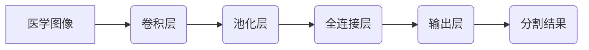

> 卷积神经网络，医学图像分割，深度学习，图像处理，计算机视觉

## 1. 背景介绍

医学图像分割是计算机辅助诊断 (CAD) 和治疗计划中至关重要的步骤。它涉及从医学图像中分离出感兴趣的器官、组织或病变区域。传统的医学图像分割方法通常依赖于手工设计的特征和规则，但这些方法往往难以处理复杂图像结构和噪声，并且需要专业知识进行操作。

近年来，深度学习技术，特别是卷积神经网络 (CNN)，在医学图像分割领域取得了显著进展。CNNs 能够自动学习图像特征，并具有强大的泛化能力，因此在医学图像分割任务中表现出优异的性能。

## 2. 核心概念与联系

### 2.1 卷积神经网络 (CNN)

CNNs 是一种专门设计用于处理图像数据的深度神经网络。其核心结构是卷积层和池化层。卷积层使用卷积核对图像进行卷积运算，提取图像局部特征。池化层通过下采样操作，减少图像尺寸，同时保留重要特征信息。

### 2.2 医学图像分割

医学图像分割的目标是将医学图像中的像素或体素划分为不同的类别，例如器官、组织或病变。分割结果可以用于多种临床应用，例如肿瘤检测、器官定位、手术规划和治疗效果评估。

### 2.3 核心概念联系

CNNs 的强大特征提取能力和强大的泛化能力使其成为医学图像分割的理想选择。



## 3. 核心算法原理 & 具体操作步骤

### 3.1 算法原理概述

基于 CNN 的医学图像分割算法通常包括以下步骤：

1. **数据预处理:** 对医学图像进行预处理，例如归一化、增强和裁剪。
2. **网络架构设计:** 设计适合医学图像分割任务的 CNN 架构，例如 U-Net、ResNet 和 SegNet。
3. **模型训练:** 使用训练数据训练 CNN 模型，并使用损失函数和优化算法进行模型优化。
4. **模型评估:** 使用测试数据评估模型性能，例如 Dice 系数、交并比 (IoU) 和平均像素误差 (MAE)。
5. **模型部署:** 将训练好的模型部署到实际应用场景中，例如临床诊断和治疗规划。

### 3.2 算法步骤详解

1. **数据预处理:**

   - **归一化:** 将图像像素值归一化到 [0, 1] 范围，提高模型训练的稳定性。
   - **增强:** 使用数据增强技术，例如旋转、翻转和缩放，增加训练数据的多样性，提高模型的泛化能力。
   - **裁剪:** 将图像裁剪成固定大小，方便模型输入。

2. **网络架构设计:**

   - **U-Net:** U-Net 是一种专门设计用于医学图像分割的 CNN 架构，其特点是包含一个编码器和一个解码器，编码器用于提取图像特征，解码器用于生成分割结果。
   - **ResNet:** ResNet 是一种具有残差连接的 CNN 架构，可以训练更深的网络，提高模型性能。
   - **SegNet:** SegNet 是一种具有跳跃连接的 CNN 架构，可以有效地利用图像特征，提高分割精度。

3. **模型训练:**

   - **损失函数:** 使用 Dice 系数、交叉熵损失函数或其他损失函数来衡量模型预测结果与真实分割结果之间的差异。
   - **优化算法:** 使用随机梯度下降 (SGD)、Adam 或其他优化算法来更新模型参数，最小化损失函数值。

4. **模型评估:**

   - **Dice 系数:** Dice 系数衡量分割结果与真实分割结果之间的重叠程度。
   - **交并比 (IoU):** IoU 衡量分割结果与真实分割结果之间的交集与并集的比值。
   - **平均像素误差 (MAE):** MAE 衡量分割结果与真实分割结果之间的平均像素差异。

5. **模型部署:**

   - 将训练好的模型部署到实际应用场景中，例如临床诊断和治疗规划。

### 3.3 算法优缺点

**优点:**

- 自动学习图像特征，无需手工设计特征。
- 具有强大的泛化能力，可以应用于不同类型的医学图像。
- 能够处理复杂图像结构和噪声。

**缺点:**

- 需要大量的训练数据。
- 训练时间较长。
- 模型解释性较差。

### 3.4 算法应用领域

- 肿瘤检测和分割
- 器官定位和分割
- 手术规划和导航
- 治疗效果评估
- 病理诊断

## 4. 数学模型和公式 & 详细讲解 & 举例说明

### 4.1 数学模型构建

CNNs 的数学模型主要基于卷积运算、池化运算和全连接运算。

**卷积运算:**

$$
y_{i,j} = \sum_{m=0}^{M-1} \sum_{n=0}^{N-1} x_{i+m,j+n} * w_{m,n} + b
$$

其中：

- $y_{i,j}$ 是卷积输出的像素值。
- $x_{i+m,j+n}$ 是输入图像的像素值。
- $w_{m,n}$ 是卷积核的权重。
- $b$ 是偏置项。

**池化运算:**

池化运算通常使用最大池化或平均池化操作，用于减少图像尺寸和提取特征。

**全连接运算:**

全连接层将卷积层和池化层的输出连接起来，并进行线性变换和激活函数操作。

### 4.2 公式推导过程

卷积运算的公式推导过程可以参考相关文献，例如 LeCun 等人的论文 "Gradient-Based Learning Applied to Document Recognition"。

### 4.3 案例分析与讲解

例如，在 U-Net 架构中，编码器部分使用多个卷积层和池化层提取图像特征，解码器部分使用反卷积层和上采样操作生成分割结果。

## 5. 项目实践：代码实例和详细解释说明

### 5.1 开发环境搭建

- Python 3.x
- TensorFlow 或 PyTorch 深度学习框架
- NumPy、Scikit-learn 等常用库

### 5.2 源代码详细实现

```python
# 使用 TensorFlow 实现 U-Net 模型

import tensorflow as tf

# 定义 U-Net 模型
def unet(input_shape):
    inputs = tf.keras.Input(shape=input_shape)

    # 编码器部分
    conv1 = tf.keras.layers.Conv2D(64, 3, activation='relu', padding='same')(inputs)
    conv1 = tf.keras.layers.Conv2D(64, 3, activation='relu', padding='same')(conv1)
    pool1 = tf.keras.layers.MaxPooling2D(pool_size=(2, 2))(conv1)

    conv2 = tf.keras.layers.Conv2D(128, 3, activation='relu', padding='same')(pool1)
    conv2 = tf.keras.layers.Conv2D(128, 3, activation='relu', padding='same')(conv2)
    pool2 = tf.keras.layers.MaxPooling2D(pool_size=(2, 2))(conv2)

    conv3 = tf.keras.layers.Conv2D(256, 3, activation='relu', padding='same')(pool2)
    conv3 = tf.keras.layers.Conv2D(256, 3, activation='relu', padding='same')(conv3)
    pool3 = tf.keras.layers.MaxPooling2D(pool_size=(2, 2))(conv3)

    # 解码器部分
    up4 = tf.keras.layers.Conv2DTranspose(128, 2, strides=(2, 2), padding='same')(pool3)
    merge4 = tf.keras.layers.concatenate([up4, conv2], axis=3)
    conv4 = tf.keras.layers.Conv2D(128, 3, activation='relu', padding='same')(merge4)
    conv4 = tf.keras.layers.Conv2D(128, 3, activation='relu', padding='same')(conv4)

    up5 = tf.keras.layers.Conv2DTranspose(64, 2, strides=(2, 2), padding='same')(conv4)
    merge5 = tf.keras.layers.concatenate([up5, conv1], axis=3)
    conv5 = tf.keras.layers.Conv2D(64, 3, activation='relu', padding='same')(merge5)
    conv5 = tf.keras.layers.Conv2D(64, 3, activation='relu', padding='same')(conv5)

    outputs = tf.keras.layers.Conv2D(1, 1, activation='sigmoid')(conv5)

    model = tf.keras.Model(inputs=inputs, outputs=outputs)
    return model

# 实例化模型
model = unet(input_shape=(256, 256, 3))

# 打印模型结构
model.summary()

# 编译模型
model.compile(optimizer='adam', loss='binary_crossentropy', metrics=['accuracy'])

# 训练模型
model.fit(train_data, train_labels, epochs=10)

# 评估模型
loss, accuracy = model.evaluate(test_data, test_labels)
print('Loss:', loss)
print('Accuracy:', accuracy)
```

### 5.3 代码解读与分析

- 代码首先定义了 U-Net 模型的架构，包括编码器和解码器部分。
- 然后实例化模型，打印模型结构，并使用 Adam 优化器、二元交叉熵损失函数和精度作为评估指标进行编译。
- 最后，使用训练数据和标签训练模型，并使用测试数据评估模型性能。

### 5.4 运行结果展示

训练完成后，可以将模型应用于新的医学图像，并生成分割结果。分割结果可以用于多种临床应用，例如肿瘤检测、器官定位和治疗规划。

## 6. 实际应用场景

### 6.1 肿瘤检测和分割

CNNs 可以用于检测和分割肿瘤，帮助医生诊断和治疗癌症。例如，可以训练 CNN 模型识别肺癌、脑肿瘤和乳腺癌等不同类型的肿瘤。

### 6.2 器官定位和分割

CNNs 可以用于定位和分割器官，例如心脏、肝脏和肺部，帮助医生进行手术规划和治疗评估。

### 6.3 手术规划和导航

CNNs 可以用于生成手术导航图，帮助外科医生进行更精准的手术。例如，可以训练 CNN 模型识别血管和神经，避免手术损伤。

### 6.4 治疗效果评估

CNNs 可以用于评估治疗效果，例如观察肿瘤大小的变化或器官功能的恢复情况。

### 6.5 病理诊断

CNNs 可以用于辅助病理诊断，例如识别癌细胞和判断肿瘤的类型。

## 7. 工具和资源推荐

### 7.1 学习资源推荐

- **书籍:**
    - "Deep Learning" by Ian Goodfellow, Yoshua Bengio, and Aaron Courville
    - "Medical Image Computing and Computer-Assisted Intervention" by Michael Sonka, Stephen Fitzpatrick, and Roger Johnston
- **在线课程:**
    - Coursera: Deep Learning Specialization
    - Udacity: Deep Learning Nanodegree
- **博客和网站:**
    - Towards Data Science
    - Machine Learning Mastery

### 7.2 开发工具推荐

- **深度学习框架:** TensorFlow, PyTorch, Keras
- **图像处理库:** OpenCV, scikit-image
- **数据可视化工具:** Matplotlib, Seaborn

### 7.3 相关论文推荐

- "U-Net: Convolutional Networks for