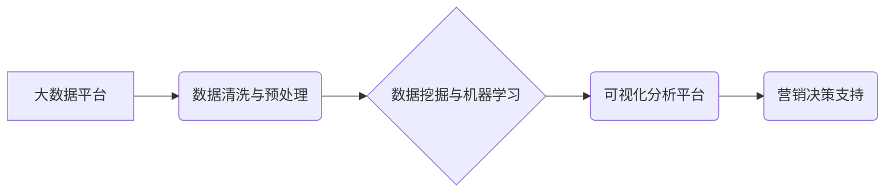

> 大数据，汽车营销，可视化分析，数据挖掘，机器学习，预测模型

## 1. 背景介绍

汽车行业作为全球经济的重要支柱，近年来面临着激烈的市场竞争和不断变化的消费者需求。传统汽车营销模式逐渐难以满足市场发展需求，数据驱动型营销模式成为汽车企业转型升级的重要方向。大数据技术为汽车营销提供了强大的数据支撑和分析工具，通过对海量汽车销售数据、消费者行为数据、市场趋势数据等进行挖掘和分析，可以帮助汽车企业精准定位目标客户、优化营销策略、提升营销效果。

可视化分析作为一种直观、易懂的数据呈现方式，能够有效地帮助汽车企业理解复杂的数据结构和潜在的商业价值。通过将数据转化为图表、地图、交互式报表等形式，可以更直观地展示数据趋势、关联关系和异常情况，从而帮助汽车企业做出更明智的决策。

## 2. 核心概念与联系

**2.1 大数据**

大数据是指规模庞大、结构复杂、更新速度快、类型多样化的数据。汽车营销大数据主要包括以下几类：

* **销售数据:** 包括汽车销量、销售额、车型销售情况、销售区域分布等。
* **消费者行为数据:** 包括消费者浏览记录、购买历史、在线评论、社交媒体互动等。
* **市场趋势数据:** 包括行业发展趋势、竞争对手分析、政策法规变化等。

**2.2 可视化分析**

可视化分析是指通过图形、图表、地图等视觉化方式，将数据转化为易于理解和分析的形式。汽车营销可视化分析主要应用于以下几个方面：

* **市场趋势分析:** 通过可视化展示汽车市场销量趋势、车型流行趋势、消费者需求变化等，帮助汽车企业了解市场动态，制定营销策略。
* **客户画像分析:** 通过可视化展示客户的年龄、性别、收入、兴趣爱好等特征，帮助汽车企业精准定位目标客户，制定个性化营销方案。
* **营销效果评估:** 通过可视化展示营销活动的效果指标，例如点击率、转化率、ROI等，帮助汽车企业评估营销效果，优化营销策略。

**2.3 数据挖掘与机器学习**

数据挖掘和机器学习是实现汽车营销可视化分析的关键技术。数据挖掘技术可以从海量数据中发现隐藏的模式和规律，而机器学习技术可以根据已有的数据训练模型，预测未来的趋势和行为。

**2.4 架构图**



## 3. 核心算法原理 & 具体操作步骤

### 3.1 算法原理概述

汽车营销可视化分析中常用的算法包括：

* **聚类算法:** 将具有相似特征的客户进行分组，形成客户画像。
* **关联规则挖掘算法:** 发现数据中存在的关联关系，例如哪些车型经常被一起购买。
* **预测模型算法:** 利用历史数据预测未来的趋势，例如未来汽车销量的预测。

### 3.2 算法步骤详解

以聚类算法为例，其具体操作步骤如下：

1. **数据收集:** 收集汽车销售数据、消费者行为数据等相关数据。
2. **数据预处理:** 对数据进行清洗、转换、归一化等处理，使其适合聚类算法的输入。
3. **选择聚类算法:** 根据数据特点和分析目标选择合适的聚类算法，例如K-means算法、层次聚类算法等。
4. **参数设置:** 设置聚类算法的参数，例如K值、距离度量等。
5. **聚类执行:** 使用选择的聚类算法对数据进行聚类，将客户分成不同的群组。
6. **结果分析:** 分析聚类结果，例如每个群组的特征、规模、购买行为等，形成客户画像。

### 3.3 算法优缺点

**聚类算法的优点:**

* 可以发现数据中潜在的结构和模式。
* 可以将客户进行分组，形成客户画像。
* 可以用于市场细分和精准营销。

**聚类算法的缺点:**

* 需要预先设定聚类数量，难以确定最佳聚类数量。
* 对数据质量要求较高，数据噪声和异常值会影响聚类结果。
* 难以解释聚类结果，难以理解每个群组的特征。

### 3.4 算法应用领域

聚类算法在汽车营销领域有广泛的应用，例如：

* **客户细分:** 将客户根据他们的购买行为、兴趣爱好等特征进行分组，制定针对不同群组的营销策略。
* **产品推荐:** 根据用户的购买历史和浏览记录，推荐相关的汽车产品。
* **市场趋势分析:** 分析汽车市场销售数据，发现潜在的市场趋势和机会。

## 4. 数学模型和公式 & 详细讲解 & 举例说明

### 4.1 数学模型构建

汽车营销可视化分析中常用的数学模型包括：

* **线性回归模型:** 用于预测汽车销量的趋势。
* **逻辑回归模型:** 用于预测客户是否购买汽车。
* **决策树模型:** 用于根据客户特征预测客户的购买行为。

### 4.2 公式推导过程

以线性回归模型为例，其目标是找到一条直线，使得预测值与实际值之间的误差最小。

线性回归模型的公式如下：

$$y = mx + c$$

其中：

* $y$ 是预测值
* $x$ 是自变量
* $m$ 是斜率
* $c$ 是截距

为了找到最佳的 $m$ 和 $c$ 值，可以使用最小二乘法。最小二乘法的目标是找到一条直线，使得所有数据点到直线的距离之和最小。

### 4.3 案例分析与讲解

假设我们想要预测汽车销量的趋势，可以使用线性回归模型。我们可以收集过去几年的汽车销量数据，以及相关的自变量，例如经济增长率、油价等。然后，使用最小二乘法训练线性回归模型，得到最佳的 $m$ 和 $c$ 值。最后，我们可以使用训练好的模型预测未来的汽车销量。

## 5. 项目实践：代码实例和详细解释说明

### 5.1 开发环境搭建

* 操作系统：Windows/macOS/Linux
* Python 版本：3.6+
* 必要的库：pandas, numpy, matplotlib, scikit-learn

### 5.2 源代码详细实现

```python
import pandas as pd
from sklearn.linear_model import LinearRegression
from sklearn.model_selection import train_test_split
import matplotlib.pyplot as plt

# 加载数据
data = pd.read_csv('car_sales_data.csv')

# 选择特征和目标变量
X = data[['economic_growth_rate', 'oil_price']]
y = data['sales_volume']

# 将数据分成训练集和测试集
X_train, X_test, y_train, y_test = train_test_split(X, y, test_size=0.2, random_state=42)

# 创建线性回归模型
model = LinearRegression()

# 训练模型
model.fit(X_train, y_train)

# 预测测试集数据
y_pred = model.predict(X_test)

# 评估模型性能
from sklearn.metrics import mean_squared_error
mse = mean_squared_error(y_test, y_pred)
print(f'Mean Squared Error: {mse}')

# 可视化预测结果
plt.scatter(y_test, y_pred)
plt.xlabel('Actual Sales Volume')
plt.ylabel('Predicted Sales Volume')
plt.title('Linear Regression Model')
plt.show()
```

### 5.3 代码解读与分析

* 首先，我们加载数据并选择特征和目标变量。
* 然后，我们将数据分成训练集和测试集，用于训练和评估模型。
* 接下来，我们创建线性回归模型并训练模型。
* 训练完成后，我们可以使用模型预测测试集数据。
* 最后，我们评估模型性能并可视化预测结果。

### 5.4 运行结果展示

运行代码后，会输出模型的均方误差值，以及一个散点图，展示实际销售量与预测销售量的关系。

## 6. 实际应用场景

汽车营销可视化分析在实际应用中可以应用于以下场景：

* **客户关系管理 (CRM):** 通过可视化分析客户数据，了解客户的购买行为、偏好和需求，从而提供个性化的服务和营销方案。
* **市场营销策划:** 通过可视化分析市场趋势和竞争对手情况，制定更有效的营销策略，提高营销效果。
* **产品开发:** 通过可视化分析客户反馈和市场需求，了解客户对产品的期望和需求，从而开发更符合市场需求的产品。

### 6.4 未来应用展望

随着大数据技术的不断发展，汽车营销可视化分析将更加深入地应用于汽车行业各个环节，例如：

* **智能营销:** 利用机器学习算法，实现智能化的客户画像分析和精准营销。
* **个性化服务:** 根据客户的个性化需求，提供定制化的服务和产品。
* **预测分析:** 利用预测模型，预测未来的市场趋势和客户行为，帮助汽车企业提前做好准备。

## 7. 工具和资源推荐

### 7.1 学习资源推荐

* **书籍:**
    * 《数据可视化》
    * 《Python数据分析》
    * 《机器学习实战》
* **在线课程:**
    * Coursera: 数据科学与机器学习
    * edX: 数据分析与可视化
    * Udemy: Python数据分析与可视化

### 7.2 开发工具推荐

* **Python:** 强大的数据分析和可视化编程语言。
* **pandas:** 用于数据处理和分析的Python库。
* **numpy:** 用于数值计算的Python库。
* **matplotlib:** 用于数据可视化的Python库。
* **seaborn:** 基于matplotlib的统计数据可视化库。
* **plotly:** 用于交互式数据可视化的库。

### 7.3 相关论文推荐

* **"Data Visualization for Marketing Analytics"**
* **"Predictive Analytics in Automotive Marketing"**
* **"Customer Segmentation and Targeting in the Automotive Industry"**

## 8. 总结：未来发展趋势与挑战

### 8.1 研究成果总结

汽车营销可视化分析已经取得了一定的成果，能够帮助汽车企业更好地了解市场趋势、客户需求和营销效果。

### 8.2 未来发展趋势

未来，汽车营销可视化分析将朝着以下几个方向发展：

* **更智能化:** 利用人工智能和机器学习算法，实现更智能化的客户画像分析和精准营销。
* **更个性化:** 根据客户的个性化需求，提供定制化的服务和产品。
* **更实时化:** 利用实时数据分析技术，及时了解市场变化和客户行为，并做出相应的调整。

### 8.3 面临的挑战

汽车营销可视化分析也面临着一些挑战：

* **数据质量:** 汽车营销数据往往是多源、异构、不完整的数据，需要进行清洗和预处理。
* **算法复杂性:** 一些复杂的算法需要专业的技术人员进行开发和维护。
* **隐私保护:** 汽车营销数据包含大量的个人信息，需要妥善保护客户隐私。

### 8.4 研究展望

未来，我们需要继续研究更有效的算法和技术，解决汽车营销可视化分析面临的挑战，并将其应用于更多场景，帮助汽车企业更好地发展。

## 9. 附录：常见问题与解答

**1. 如何选择合适的聚类算法？**

选择合适的聚类算法需要根据数据的特点和分析目标进行选择。例如，如果数据是高维数据，可以使用层次聚类算法；如果数据是结构化数据，可以使用K-means算法。

**2. 如何评估聚类结果？**

常用的聚类结果评估指标包括Silhouette score、Dunn index等。

**3. 如何处理数据噪声和异常值？**

可以使用数据清洗和预处理技术，例如删除异常值、进行