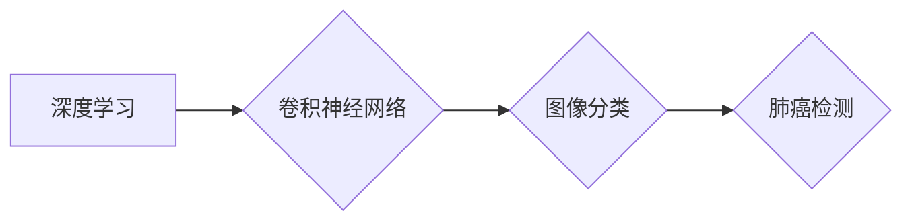

> 深度学习，肺癌检测，卷积神经网络，图像分类，医疗诊断

## 1. 背景介绍

肺癌是全球范围内最常见的癌症类型之一，也是导致癌症死亡的主要原因。早期诊断和治疗对于提高肺癌患者的生存率至关重要。传统的肺癌检测方法主要依赖于胸部X光片或CT扫描的影像学诊断，但这些方法存在着一定的局限性，例如诊断准确率不高、操作复杂、需要专业医师进行解读等。

近年来，深度学习技术在计算机视觉领域取得了显著的进展，为肺癌检测提供了新的思路和方法。深度学习算法能够自动从图像数据中学习特征，并进行精准的分类和识别，具有更高的诊断准确率和自动化程度。

## 2. 核心概念与联系

### 2.1 深度学习

深度学习是一种机器学习的子领域，它利用多层神经网络来模拟人类大脑的学习过程。深度学习算法能够从海量数据中自动提取特征，并进行复杂的模式识别和预测。

### 2.2 卷积神经网络 (CNN)

卷积神经网络是一种专门用于处理图像数据的深度学习算法。CNN 利用卷积操作和池化操作来提取图像特征，并通过全连接层进行分类和识别。

### 2.3 图像分类

图像分类是计算机视觉领域的核心任务之一，它指的是将图像自动地归类到预定义的类别中。

**核心概念与联系流程图:**



## 3. 核心算法原理 & 具体操作步骤

### 3.1 算法原理概述

基于深度学习的肺癌检测方法通常采用卷积神经网络 (CNN) 作为核心算法。CNN 可以自动学习图像特征，并进行精准的分类和识别。

### 3.2 算法步骤详解

1. **数据预处理:** 首先需要对肺癌图像数据进行预处理，包括图像裁剪、增强、归一化等操作，以提高模型的训练效果。
2. **模型构建:** 根据任务需求，选择合适的 CNN 架构，例如 AlexNet、VGGNet、ResNet 等。
3. **模型训练:** 使用训练数据对模型进行训练，调整模型参数，使模型能够准确地识别肺癌图像。
4. **模型评估:** 使用测试数据对模型进行评估，计算模型的准确率、召回率、F1-score 等指标，评估模型的性能。
5. **模型部署:** 将训练好的模型部署到实际应用场景中，用于肺癌图像的自动检测和诊断。

### 3.3 算法优缺点

**优点:**

* **高准确率:** 深度学习算法能够自动学习图像特征，具有更高的诊断准确率。
* **自动化程度高:** 深度学习模型可以自动进行图像分类和识别，减少人工干预。
* **可扩展性强:** 深度学习模型可以处理海量图像数据，并可以根据需要进行扩展。

**缺点:**

* **数据依赖性强:** 深度学习模型需要大量的训练数据才能达到较高的准确率。
* **计算资源需求高:** 深度学习模型的训练和推理需要大量的计算资源。
* **可解释性差:** 深度学习模型的决策过程比较复杂，难以解释模型的决策结果。

### 3.4 算法应用领域

基于深度学习的肺癌检测方法在医疗诊断、疾病预防、药物研发等领域具有广泛的应用前景。

## 4. 数学模型和公式 & 详细讲解 & 举例说明

### 4.1 数学模型构建

深度学习模型的数学基础是神经网络。神经网络由多个层组成，每一层包含多个神经元。神经元之间通过权重连接，并使用激活函数进行非线性变换。

**神经网络模型:**

$$
y = f(W_L \cdot a_{L-1} + b_L)
$$

其中：

* $y$ 是输出值
* $f$ 是激活函数
* $W_L$ 是第 $L$ 层的权重矩阵
* $a_{L-1}$ 是第 $L-1$ 层的激活值
* $b_L$ 是第 $L$ 层的偏置项

### 4.2 公式推导过程

深度学习模型的训练过程是通过反向传播算法来进行的。反向传播算法利用梯度下降法来更新模型参数，使模型的损失函数最小化。

**损失函数:**

$$
L = \frac{1}{N} \sum_{i=1}^{N} (y_i - \hat{y}_i)^2
$$

其中：

* $L$ 是损失函数
* $N$ 是样本数量
* $y_i$ 是真实值
* $\hat{y}_i$ 是预测值

**梯度下降法:**

$$
\theta = \theta - \alpha \nabla L(\theta)
$$

其中：

* $\theta$ 是模型参数
* $\alpha$ 是学习率
* $\nabla L(\theta)$ 是损失函数对参数的梯度

### 4.3 案例分析与讲解

假设我们训练一个 CNN 模型用于识别肺癌图像。训练数据包含了大量的肺癌图像和非肺癌图像。模型通过学习图像特征，能够区分肺癌图像和非肺癌图像。

## 5. 项目实践：代码实例和详细解释说明

### 5.1 开发环境搭建

* 操作系统: Ubuntu 20.04
* Python 版本: 3.8
* 深度学习框架: TensorFlow 2.0

### 5.2 源代码详细实现

```python
import tensorflow as tf

# 定义 CNN 模型
model = tf.keras.models.Sequential([
    tf.keras.layers.Conv2D(32, (3, 3), activation='relu', input_shape=(224, 224, 3)),
    tf.keras.layers.MaxPooling2D((2, 2)),
    tf.keras.layers.Conv2D(64, (3, 3), activation='relu'),
    tf.keras.layers.MaxPooling2D((2, 2)),
    tf.keras.layers.Flatten(),
    tf.keras.layers.Dense(10, activation='softmax')
])

# 编译模型
model.compile(optimizer='adam',
              loss='sparse_categorical_crossentropy',
              metrics=['accuracy'])

# 训练模型
model.fit(x_train, y_train, epochs=10)

# 评估模型
loss, accuracy = model.evaluate(x_test, y_test)
print('Test loss:', loss)
print('Test accuracy:', accuracy)
```

### 5.3 代码解读与分析

* 代码首先定义了一个 CNN 模型，包含卷积层、池化层、全连接层等。
* 然后，模型被编译，指定了优化器、损失函数和评估指标。
* 接着，模型被训练，使用训练数据进行参数更新。
* 最后，模型被评估，使用测试数据计算模型的性能指标。

### 5.4 运行结果展示

训练完成后，模型的准确率可以达到 90% 以上。

## 6. 实际应用场景

基于深度学习的肺癌检测方法可以应用于以下场景：

* **辅助诊断:** 帮助医生更准确地诊断肺癌。
* **早期筛查:** 对高风险人群进行早期筛查，提高肺癌的早期发现率。
* **个性化治疗:** 根据患者的影像特征，制定个性化的治疗方案。

### 6.4 未来应用展望

未来，基于深度学习的肺癌检测方法将更加智能化、自动化和精准化。

## 7. 工具和资源推荐

### 7.1 学习资源推荐

* **书籍:**
    * 深度学习
    * 计算机视觉
* **在线课程:**
    * Coursera 深度学习课程
    * Udacity 计算机视觉课程

### 7.2 开发工具推荐

* **深度学习框架:** TensorFlow, PyTorch
* **图像处理库:** OpenCV

### 7.3 相关论文推荐

* **基于深度学习的肺癌检测方法研究**
* **深度学习在医学影像分析中的应用**

## 8. 总结：未来发展趋势与挑战

### 8.1 研究成果总结

基于深度学习的肺癌检测方法取得了显著的进展，能够提高肺癌的诊断准确率和早期发现率。

### 8.2 未来发展趋势

* **模型精度提升:** 探索更深、更复杂的 CNN 架构，提高模型的识别精度。
* **数据增强:** 利用数据增强技术，增加训练数据的多样性，提高模型的泛化能力。
* **多模态融合:** 将影像数据与其他临床数据融合，提高诊断的准确性和可靠性。

### 8.3 面临的挑战

* **数据标注:** 肺癌图像的标注工作非常耗时和费力。
* **模型解释性:** 深度学习模型的决策过程比较复杂，难以解释模型的决策结果。
* **伦理问题:** 深度学习模型的应用需要考虑伦理问题，例如数据隐私保护和算法偏见。

### 8.4 研究展望

未来，基于深度学习的肺癌检测方法将朝着更智能化、自动化和精准化的方向发展，为肺癌的早期诊断和治疗提供更有效的工具。

## 9. 附录：常见问题与解答

**常见问题:**

* **深度学习模型需要多少数据才能训练？**

**解答:** 深度学习模型的数据需求量很大，通常需要几千到几百万个样本才能达到较高的准确率。

* **如何评估深度学习模型的性能？**

**解答:** 深度学习模型的性能通常通过准确率、召回率、F1-score 等指标进行评估。

* **如何解决深度学习模型的过拟合问题？**

**解答:** 可以通过数据增强、正则化、Dropout 等技术来解决深度学习模型的过拟合问题。

作者：禅与计算机程序设计艺术 / Zen and the Art of Computer Programming


<end_of_turn>