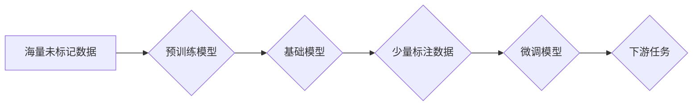

> 基础模型、预训练、微调、深度学习、自然语言处理、计算机视觉

## 1. 背景介绍

近年来，深度学习在人工智能领域取得了显著进展，其中基础模型的预训练与微调技术扮演着越来越重要的角色。基础模型是指在海量数据上进行预训练的强大模型，它能够学习到通用的知识和表示，为下游任务提供强大的基础。微调则是针对特定任务对基础模型进行进一步训练，以提高其在该任务上的性能。

传统的深度学习模型通常需要针对特定任务进行专门设计和训练，这需要大量的标注数据和计算资源。而基础模型的预训练与微调技术可以有效解决这个问题。通过在海量数据上预训练基础模型，可以学习到通用的知识和表示，从而减少下游任务所需的训练数据和计算资源。

## 2. 核心概念与联系

**2.1 预训练**

预训练是指在未标记数据上训练深度学习模型的过程。预训练模型学习到数据的潜在模式和结构，为后续任务提供有价值的初始化。

**2.2 微调**

微调是指在预训练模型的基础上，针对特定任务进行进一步训练的过程。微调通常只需要少量标注数据，就可以有效提高模型在该任务上的性能。

**2.3 基础模型**

基础模型是指在海量数据上进行预训练的强大模型，它能够学习到通用的知识和表示，为下游任务提供强大的基础。

**2.4 下游任务**

下游任务是指利用预训练模型进行特定任务的应用，例如文本分类、机器翻译、图像识别等。

**2.5 流程图**



## 3. 核心算法原理 & 具体操作步骤

### 3.1 算法原理概述

基础模型的预训练与微调技术主要基于深度学习的迁移学习思想。迁移学习是指利用已训练好的模型在新的任务上进行训练，从而减少训练数据和时间。

预训练阶段，模型在海量未标记数据上进行训练，学习到数据的潜在模式和结构。微调阶段，模型在少量标注数据上进行训练，针对特定任务进行调整。

### 3.2 算法步骤详解

**3.2.1 预训练阶段**

1. 选择合适的预训练模型架构，例如BERT、GPT、Vision Transformer等。
2. 收集海量未标记数据，并进行预处理，例如文本清洗、图像裁剪等。
3. 使用预训练模型在未标记数据上进行训练，目标函数通常是预测下一个词或图像的上下文信息。
4. 保存预训练模型的权重。

**3.2.2 微调阶段**

1. 加载预训练模型的权重。
2. 收集少量标注数据，并进行预处理。
3. 对预训练模型进行微调，目标函数通常是针对特定任务的损失函数，例如分类损失、回归损失等。
4. 保存微调后的模型权重。

### 3.3 算法优缺点

**优点:**

* 减少训练数据和计算资源需求。
* 提高模型在特定任务上的性能。
* 能够推广到新的任务和领域。

**缺点:**

* 预训练模型的规模较大，需要较大的存储空间和计算资源。
* 微调过程可能需要较长时间。
* 预训练模型可能存在偏差，需要进行仔细的评估和调整。

### 3.4 算法应用领域

基础模型的预训练与微调技术在多个领域都有广泛的应用，例如：

* 自然语言处理：文本分类、机器翻译、问答系统、文本生成等。
* 计算机视觉：图像识别、目标检测、图像分割、图像生成等。
* 语音识别：语音转文本、语音合成等。
* 其他领域：药物发现、金融预测、医疗诊断等。

## 4. 数学模型和公式 & 详细讲解 & 举例说明

### 4.1 数学模型构建

基础模型的预训练与微调通常基于深度神经网络模型，例如Transformer、CNN等。这些模型的数学模型构建基于矩阵运算和激活函数。

**4.1.1 Transformer模型**

Transformer模型的核心是自注意力机制，它能够捕捉序列数据中的长距离依赖关系。

**4.1.2 CNN模型**

CNN模型利用卷积核进行特征提取，能够有效地学习图像中的局部特征。

### 4.2 公式推导过程

**4.2.1 自注意力机制**

自注意力机制的计算公式如下：

$$
Attention(Q, K, V) = softmax(\frac{QK^T}{\sqrt{d_k}})V
$$

其中：

* $Q$：查询矩阵
* $K$：键矩阵
* $V$：值矩阵
* $d_k$：键向量的维度

**4.2.2 损失函数**

常用的损失函数包括交叉熵损失和均方误差损失。

* 交叉熵损失：用于分类任务，计算预测概率与真实标签之间的差异。

$$
Loss = - \sum_{i=1}^{N} y_i \log(p_i)
$$

其中：

* $N$：样本数量
* $y_i$：真实标签
* $p_i$：预测概率

* 均方误差损失：用于回归任务，计算预测值与真实值的平方差。

$$
Loss = \frac{1}{N} \sum_{i=1}^{N} (y_i - \hat{y}_i)^2
$$

其中：

* $N$：样本数量
* $y_i$：真实值
* $\hat{y}_i$：预测值

### 4.3 案例分析与讲解

**4.3.1 BERT模型在文本分类任务上的应用**

BERT模型在预训练阶段使用Masked Language Modeling (MLM)和Next Sentence Prediction (NSP)两种任务进行训练。微调阶段，BERT模型可以用于文本分类任务，例如情感分析、主题分类等。

**4.3.2 Vision Transformer模型在图像分类任务上的应用**

Vision Transformer模型将图像分割成patches，并将其作为序列数据进行处理。预训练阶段，Vision Transformer模型使用图像分类任务进行训练。微调阶段，Vision Transformer模型可以用于图像分类任务，例如识别物体、场景分类等。

## 5. 项目实践：代码实例和详细解释说明

### 5.1 开发环境搭建

* Python 3.7+
* PyTorch 1.7+
* CUDA 10.2+

### 5.2 源代码详细实现

```python
# 预训练模型加载
model = torch.load('pretrained_model.pth')

# 微调模型
optimizer = torch.optim.Adam(model.parameters(), lr=0.001)
criterion = nn.CrossEntropyLoss()

# 训练循环
for epoch in range(num_epochs):
    for batch_idx, (data, target) in enumerate(train_loader):
        optimizer.zero_grad()
        output = model(data)
        loss = criterion(output, target)
        loss.backward()
        optimizer.step()

# 保存微调模型
torch.save(model.state_dict(), 'fine_tuned_model.pth')
```

### 5.3 代码解读与分析

* 代码首先加载预训练模型。
* 然后定义优化器和损失函数。
* 训练循环中，模型输入数据，计算损失，并使用优化器更新模型参数。
* 最后保存微调后的模型。

### 5.4 运行结果展示

训练完成后，可以评估模型在测试集上的性能，例如准确率、F1-score等。

## 6. 实际应用场景

基础模型的预训练与微调技术在多个领域都有广泛的应用，例如：

* **自然语言处理:**

    * **文本分类:** 基于BERT的模型可以用于情感分析、主题分类、垃圾邮件过滤等任务。
    * **机器翻译:** 基于T5的模型可以用于多种语言之间的机器翻译。
    * **问答系统:** 基于RoBERTa的模型可以用于构建更准确的问答系统。

* **计算机视觉:**

    * **图像识别:** 基于Vision Transformer的模型可以用于识别物体、场景、人物等。
    * **目标检测:** 基于Faster R-CNN的模型可以用于检测图像中的多个目标。
    * **图像分割:** 基于U-Net的模型可以用于分割图像中的不同区域。

* **语音识别:**

    * **语音转文本:** 基于Transformer的模型可以用于语音转文本，例如语音助手、会议记录等。
    * **语音合成:** 基于Tacotron 2的模型可以用于语音合成，例如虚拟助手、语音朗读等。

### 6.4 未来应用展望

基础模型的预训练与微调技术还在不断发展，未来将有更多新的应用场景出现，例如：

* **个性化推荐:** 基于用户行为数据进行个性化推荐，例如商品推荐、内容推荐等。
* **自动代码生成:** 基于代码库进行自动代码生成，提高开发效率。
* **药物发现:** 基于生物数据进行药物发现，加速新药研发。

## 7. 工具和资源推荐

### 7.1 学习资源推荐

* **书籍:**
    * Deep Learning by Ian Goodfellow, Yoshua Bengio, and Aaron Courville
    * Hands-On Machine Learning with Scikit-Learn, Keras & TensorFlow by Aurélien Géron
* **在线课程:**
    * Stanford CS231n: Convolutional Neural Networks for Visual Recognition
    * Deep Learning Specialization by Andrew Ng
* **博客:**
    * The Gradient
    * Towards Data Science

### 7.2 开发工具推荐

* **深度学习框架:** PyTorch, TensorFlow
* **自然语言处理库:** Hugging Face Transformers, spaCy
* **计算机视觉库:** OpenCV, Pillow

### 7.3 相关论文推荐

* BERT: Pre-training of Deep Bidirectional Transformers for Language Understanding
* GPT-3: Language Models are Few-Shot Learners
* Vision Transformer: An Image Transformer

## 8. 总结：未来发展趋势与挑战

### 8.1 研究成果总结

基础模型的预训练与微调技术取得了显著进展，在多个领域取得了优异的性能。

### 8.2 未来发展趋势

* **模型规模的进一步扩大:** 预训练模型的规模将继续扩大，以学习更丰富的知识和表示。
* **多模态学习:** 将文本、图像、音频等多种模态数据进行融合，学习更全面的知识。
* **可解释性研究:** 研究基础模型的决策过程，提高模型的可解释性和可信度。

### 8.3 面临的挑战

* **计算资源需求:** 预训练大型模型需要大量的计算资源，这对于资源有限的机构和个人来说是一个挑战。
* **数据偏见:** 预训练模型可能存在数据偏见，需要进行仔细的评估和缓解。
* **安全性和隐私性:** 基础模型的应用可能涉及到敏感数据，需要考虑安全性和隐私性问题。

### 8.4 研究展望

未来，基础模型的预训练与微调技术将继续发展，为人工智能的进步做出更大的贡献。

## 9. 附录：常见问题与解答

**9.1 如何选择合适的预训练模型？**

选择预训练模型需要考虑任务类型、数据规模、计算资源等因素。

**9.2 如何进行微调？**

微调需要根据任务类型选择合适的损失函数和优化器，并调整学习率等超参数。

**9.3 如何评估微调模型的性能？**

可以使用测试集上的准确率、F1-score等指标评估微调模型的性能。


作者：禅与计算机程序设计艺术 / Zen and the Art of Computer Programming 
<end_of_turn>