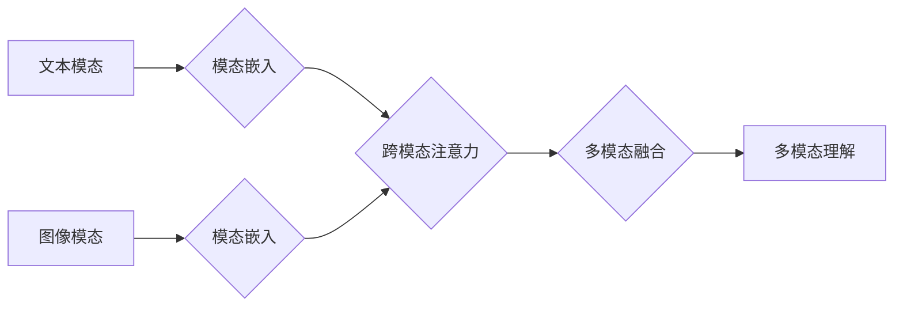

> 多模态大模型，BERT模型，自然语言处理，计算机视觉，深度学习，Transformer，多模态融合

## 1. 背景介绍

近年来，人工智能领域取得了令人瞩目的进展，其中深度学习技术扮演着至关重要的角色。传统的深度学习模型主要专注于单一模态数据，例如文本或图像。然而，现实世界中信息往往以多模态形式存在，例如文本、图像、音频、视频等。如何有效地融合多模态信息，构建能够理解和生成跨模态内容的大模型，成为人工智能领域的一项重要研究方向。

多模态大模型 (Multimodal Large Models) 旨在学习和理解不同模态数据之间的关系，从而实现跨模态的感知、理解和生成。与单模态模型相比，多模态大模型具有以下优势：

* **更丰富的语义表示:** 多模态融合可以提供更全面的语义信息，提升模型的理解能力。
* **更强的泛化能力:** 多模态训练可以帮助模型学习更通用的特征，提高其在不同场景下的应用能力。
* **更自然的交互体验:** 多模态模型可以支持文本、图像、语音等多种交互方式，提供更自然的用户体验。

## 2. 核心概念与联系

多模态大模型的核心概念包括：

* **模态:** 指不同类型的数据表示形式，例如文本、图像、音频、视频等。
* **模态嵌入:** 将不同模态的数据映射到同一个低维空间，以便进行融合。
* **跨模态注意力:** 学习不同模态之间的关系，赋予不同模态数据不同的权重。
* **多模态融合:** 将不同模态的特征信息融合在一起，形成更丰富的语义表示。

**Mermaid 流程图:**



## 3. 核心算法原理 & 具体操作步骤

### 3.1  算法原理概述

BERT模型是一种基于Transformer架构的预训练语言模型，它通过大量的文本数据进行预训练，学习到语言的语义和语法知识。BERT模型的核心思想是利用“Masked Language Modeling” (MLM) 和 “Next Sentence Prediction” (NSP) 两种预训练任务来学习语言表示。

### 3.2  算法步骤详解

1. **文本预处理:** 将输入文本进行分词、标记等预处理操作。
2. **词嵌入:** 将每个词映射到一个低维向量空间。
3. **Transformer编码:** 使用Transformer编码器将文本序列编码成上下文相关的语义表示。
4. **Masked Language Modeling:** 在输入文本中随机掩盖部分词，并预测被掩盖词的词语。
5. **Next Sentence Prediction:** 判断两个句子是否相邻。
6. **微调:** 将预训练的BERT模型微调到特定任务，例如文本分类、问答系统等。

### 3.3  算法优缺点

**优点:**

* **强大的语言理解能力:** BERT模型在许多自然语言处理任务中取得了state-of-the-art的性能。
* **预训练模型可复用:** 预训练的BERT模型可以用于各种下游任务，节省训练时间和资源。
* **开源代码和模型:** BERT模型的代码和模型权重开源，方便研究和应用。

**缺点:**

* **计算资源需求高:** BERT模型训练和推理需要大量的计算资源。
* **数据依赖性强:** BERT模型的性能依赖于训练数据的质量和数量。
* **可解释性差:** BERT模型是一个复杂的深度学习模型，其内部工作机制难以解释。

### 3.4  算法应用领域

BERT模型在自然语言处理领域有着广泛的应用，例如：

* **文本分类:** 识别文本的类别，例如情感分析、主题分类等。
* **问答系统:** 回答用户提出的问题。
* **机器翻译:** 将文本从一种语言翻译成另一种语言。
* **文本摘要:** 生成文本的简短摘要。
* **对话系统:** 与用户进行自然语言对话。

## 4. 数学模型和公式 & 详细讲解 & 举例说明

### 4.1  数学模型构建

BERT模型的核心是Transformer架构，其主要包含以下组件：

* **词嵌入层:** 将每个词映射到一个低维向量空间。
* **多头注意力层:** 学习不同词之间的关系，赋予不同词不同的权重。
* **前馈神经网络层:** 对每个词的嵌入向量进行非线性变换。
* **位置编码层:** 为每个词添加位置信息，以便模型理解词序。

### 4.2  公式推导过程

BERT模型的训练目标是最大化以下两个损失函数的加权平均值：

* **Masked Language Modeling (MLM) 损失函数:**

$$
L_{MLM} = -\sum_{i \in M} \log p(w_i | context_i)
$$

其中，$M$ 是被掩盖词的集合，$w_i$ 是被掩盖词，$context_i$ 是被掩盖词的上下文信息。

* **Next Sentence Prediction (NSP) 损失函数:**

$$
L_{NSP} = -\log p(label | sentence_1, sentence_2)
$$

其中，$label$ 是两个句子是否相邻的标签，$sentence_1$ 和 $sentence_2$ 是两个句子。

### 4.3  案例分析与讲解

假设我们有一个句子：“The cat sat on the mat”。BERT模型会将每个词映射到一个低维向量空间，然后使用多头注意力层学习每个词之间的关系。例如，模型会学习到“cat” 和 “sat” 之间的关系，以及“sat” 和 “on” 之间的关系。

通过训练，BERT模型可以学习到语言的语义和语法知识，例如“cat” 是一个动物，“sat” 是一个动词，“on” 是一个介词。当我们输入一个新的句子时，BERT模型可以利用其学习到的知识来理解句子的含义。

## 5. 项目实践：代码实例和详细解释说明

### 5.1  开发环境搭建

* Python 3.6+
* TensorFlow 2.0+
* PyTorch 1.0+
* CUDA 10.0+

### 5.2  源代码详细实现

```python
# 导入必要的库
import tensorflow as tf

# 定义BERT模型的架构
class BERT(tf.keras.Model):
    def __init__(self, vocab_size, embedding_dim, num_heads, num_layers):
        super(BERT, self).__init__()
        self.embedding = tf.keras.layers.Embedding(vocab_size, embedding_dim)
        self.transformer = tf.keras.layers.Transformer(num_heads=num_heads, num_layers=num_layers)

    def call(self, inputs):
        embeddings = self.embedding(inputs)
        outputs = self.transformer(embeddings)
        return outputs

# 实例化BERT模型
model = BERT(vocab_size=30000, embedding_dim=128, num_heads=8, num_layers=6)

# 定义训练数据和标签
train_data = ...
train_labels = ...

# 编译模型
model.compile(optimizer='adam', loss='categorical_crossentropy', metrics=['accuracy'])

# 训练模型
model.fit(train_data, train_labels, epochs=10)
```

### 5.3  代码解读与分析

* **模型架构:** BERT模型的架构由词嵌入层、Transformer编码器和输出层组成。
* **词嵌入层:** 将每个词映射到一个低维向量空间。
* **Transformer编码器:** 学习不同词之间的关系，并生成上下文相关的语义表示。
* **输出层:** 将Transformer编码器的输出映射到目标标签空间。
* **训练过程:** 使用Masked Language Modeling (MLM) 和 Next Sentence Prediction (NSP) 两种预训练任务来训练BERT模型。

### 5.4  运行结果展示

训练完成后，可以将BERT模型应用于各种下游任务，例如文本分类、问答系统等。

## 6. 实际应用场景

BERT模型在许多实际应用场景中取得了成功，例如：

* **搜索引擎:** BERT模型可以用于理解用户搜索意图，并返回更相关的搜索结果。
* **聊天机器人:** BERT模型可以用于训练更智能的聊天机器人，能够进行更自然的人机对话。
* **客户服务:** BERT模型可以用于自动处理客户服务请求，例如回答常见问题、提供产品信息等。

### 6.4  未来应用展望

随着多模态技术的不断发展，BERT模型的应用场景将会更加广泛，例如：

* **多模态搜索:** 结合文本、图像、音频等多模态信息进行搜索。
* **跨模态对话:** 构建能够理解和生成多种模态内容的对话系统。
* **虚拟现实和增强现实:** 在虚拟现实和增强现实场景中，BERT模型可以用于理解用户意图，并提供更沉浸式的体验。

## 7. 工具和资源推荐

### 7.1  学习资源推荐

* **BERT论文:** https://arxiv.org/abs/1810.04805
* **Hugging Face Transformers:** https://huggingface.co/transformers/
* **TensorFlow Tutorials:** https://www.tensorflow.org/tutorials

### 7.2  开发工具推荐

* **TensorFlow:** https://www.tensorflow.org/
* **PyTorch:** https://pytorch.org/
* **Jupyter Notebook:** https://jupyter.org/

### 7.3  相关论文推荐

* **GPT-3:** https://arxiv.org/abs/2005.14165
* **T5:** https://arxiv.org/abs/1910.10683
* **XLNet:** https://arxiv.org/abs/1906.08237

## 8. 总结：未来发展趋势与挑战

### 8.1  研究成果总结

BERT模型的提出标志着自然语言处理领域取得了重大进展，它为理解和生成人类语言提供了新的思路和方法。BERT模型的成功也促进了多模态大模型的研究，推动了人工智能技术的快速发展。

### 8.2  未来发展趋势

* **更大规模的模型:** 未来将会有更大规模的多模态大模型，能够学习更丰富的知识和技能。
* **更强的泛化能力:** 未来多模态大模型将更加注重泛化能力，能够应用于更广泛的场景。
* **更强的可解释性:** 未来将会有更多研究致力于提高多模态大模型的可解释性，以便更好地理解模型的决策过程。

### 8.3  面临的挑战

* **数据获取和标注:** 多模态数据的获取和标注成本较高，这限制了多模态大模型的训练和应用。
* **模型训练和推理效率:** 多模态大模型的训练和推理效率仍然是一个挑战，需要进一步优化算法和硬件资源。
* **伦理和安全问题:** 多模态大模型的应用可能带来伦理和安全问题，例如数据隐私、算法偏见等，需要引起足够的重视。

### 8.4  研究展望

未来，多模态大模型的研究将继续朝着更强大、更泛化、更安全的方向发展。随着技术的进步和应用场景的拓展，多模态大模型将为人类社会带来更多福祉。

## 9. 附录：常见问题与解答

**Q1: BERT模型的预训练数据是什么？**

A1: BERT模型的预训练数据主要来自英文维基百科和书籍。

**Q2: 如何使用预训练的BERT模型进行微调？**

A2: 可以使用Hugging Face Transformers库中的预训练模型，并根据具体任务进行微调。

**Q3: BERT模型的计算资源需求