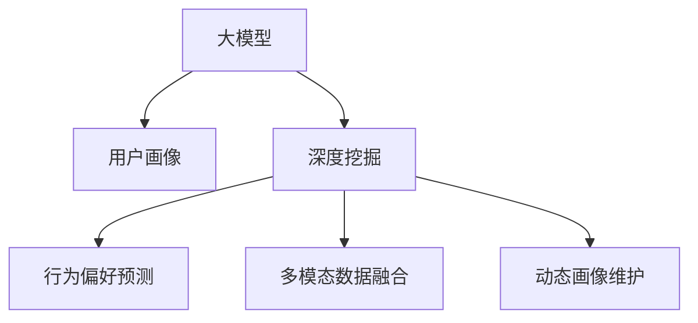

                 

# AI 大模型在电商搜索推荐中的用户画像构建：深度挖掘用户需求与行为偏好

> 关键词：电商搜索推荐，用户画像，用户需求，行为偏好，深度挖掘，大模型，AI技术

## 1. 背景介绍

### 1.1 问题由来
随着互联网技术的飞速发展，电商平台的数量与日俱增，用户获取商品信息的方式也更加多样化和便捷化。在电商搜索推荐系统中，用户画像的构建与维护是提升推荐效果的关键。通过分析用户的历史行为、搜索记录、浏览记录、点击行为等数据，可以构建出用户画像，进而为用户提供更加精准的推荐服务。

然而，传统的用户画像构建方法需要大量的标注数据，且难以覆盖用户的多样性和动态性，导致推荐效果欠佳。为了提升搜索推荐系统的精准度和个性化水平，近年来，越来越多的电商企业开始引入大模型进行用户画像的深度挖掘。

### 1.2 问题核心关键点
大模型在电商搜索推荐中的用户画像构建主要关注以下几个核心问题：
- **用户需求的理解与表达**：如何通过大模型深度理解用户的搜索意图、偏好和需求？
- **行为偏好的预测与建模**：如何基于用户行为数据构建行为偏好模型，预测用户的未来行为？
- **多模态数据的融合**：如何将用户的多模态数据（如文本、图片、音频等）融合，构建全面的用户画像？
- **动态用户画像的维护**：如何在大模型和实时数据的结合下，动态更新用户画像，保持其时效性和准确性？

## 2. 核心概念与联系

### 2.1 核心概念概述

为了更好地理解大模型在电商搜索推荐中的用户画像构建方法，本文将介绍几个关键概念及其相互联系：

- **大模型（Large Language Model, LLM）**：以自回归（如GPT）或自编码（如BERT）模型为代表的大规模预训练语言模型。通过在大规模无标签文本数据上进行预训练，学习通用的语言表示，具备强大的语言理解和生成能力。

- **用户画像（User Profile）**：描述用户个体特征和行为信息的集合。电商搜索推荐系统中的用户画像通常包含用户的基本信息、购买历史、浏览历史、搜索偏好等。

- **深度挖掘（Deep Mining）**：利用大模型的强大表征能力，从海量数据中挖掘出更加深层次的用户特征和行为模式。

- **行为偏好预测（Behavioral Prediction）**：通过分析用户的历史行为数据，构建行为偏好模型，预测用户未来的行为。

- **多模态数据融合（Multi-modal Data Fusion）**：将用户的多模态数据（如文本、图片、音频等）融合，构建全面的用户画像。

- **动态画像维护（Dynamic Profile Update）**：利用实时数据，动态更新用户画像，确保其时效性和准确性。

这些核心概念之间的逻辑关系可以通过以下Mermaid流程图来展示：



这个流程图展示了大模型在电商搜索推荐中的用户画像构建过程，包括深度挖掘、行为偏好预测、多模态数据融合、动态画像维护等关键环节。

## 3. 核心算法原理 & 具体操作步骤
### 3.1 算法原理概述

在大模型构建用户画像的过程中，主要利用了监督学习和预训练-微调的方法。具体而言，通过在大规模无标签文本数据上进行预训练，学习通用的语言表示，然后在电商搜索推荐中的标注数据上进行微调，优化模型以适应电商推荐任务的需求。

### 3.2 算法步骤详解

#### 3.2.1 数据收集与处理

电商搜索推荐系统的用户画像构建，需要从多个渠道收集用户的多模态数据。具体步骤包括：

1. **数据来源**：收集用户的浏览历史、点击历史、购买历史、评价历史、搜索关键词等数据。
2. **数据清洗**：去除数据中的噪声、重复、不完整等无效信息，确保数据的质量。
3. **数据标注**：为部分数据进行人工标注，用于监督学习的微调过程。

#### 3.2.2 模型预训练

选择一种大模型（如GPT、BERT），在大规模无标签文本数据上进行预训练，学习通用的语言表示。预训练的过程通常包括自监督学习任务，如掩码语言模型、下一句子预测等。

#### 3.2.3 任务适配层设计

根据电商推荐任务的具体需求，设计合适的任务适配层，通常包括输入层、输出层和损失函数。例如，对于分类任务，可以在顶层添加线性分类器和交叉熵损失函数。

#### 3.2.4 微调

在预训练模型的基础上，使用电商推荐任务的数据集进行有监督微调。微调的目标是优化模型在特定任务上的性能，即针对电商搜索推荐任务进行优化，使其能够更好地适应电商推荐的需求。

#### 3.2.5 结果评估与部署

微调完成后，在测试集上评估模型性能。如果模型表现符合预期，可以将模型部署到电商搜索推荐系统中，实时生成推荐结果。

### 3.3 算法优缺点

大模型在电商搜索推荐中的用户画像构建具有以下优点：

1. **数据需求量低**：相比于传统的用户画像构建方法，大模型所需的标注数据量较少，可以大大降低数据采集和标注的成本。
2. **泛化能力强**：大模型能够从大量的数据中学习到通用的语言表示，具有良好的泛化能力，能够适应多种电商推荐任务。
3. **动态更新**：大模型可以实时接收新数据，动态更新用户画像，保持其时效性和准确性。
4. **多模态融合**：大模型能够处理多种模态的数据，如文本、图片、音频等，构建全面的用户画像。

同时，该方法也存在一些缺点：

1. **计算成本高**：大模型的训练和推理需要大量的计算资源，成本较高。
2. **解释性不足**：大模型通常被视为"黑盒"模型，其内部工作机制难以解释，不利于理解和调试。
3. **数据隐私问题**：在数据收集和处理过程中，可能涉及到用户隐私问题，需要谨慎处理。
4. **模型规模庞大**：大模型通常参数量巨大，内存和存储需求高，对系统资源要求较高。

### 3.4 算法应用领域

大模型在电商搜索推荐中的用户画像构建，已经在电商、金融、零售等多个领域得到了广泛应用，具体包括：

- **电商推荐系统**：利用用户画像进行商品推荐，提升用户体验和转化率。
- **个性化广告系统**：通过用户画像进行精准广告投放，提高广告效果和ROI。
- **金融风控系统**：构建用户画像，评估用户信用风险，进行风险控制。
- **内容推荐系统**：分析用户画像，推荐相关内容，提高内容点击率和用户留存率。

## 4. 数学模型和公式 & 详细讲解  
### 4.1 数学模型构建

本节将使用数学语言对大模型在电商搜索推荐中构建用户画像的过程进行更加严格的刻画。

记电商搜索推荐系统中的用户画像为 $U=\{u_1,u_2,...,u_n\}$，其中 $u_i$ 表示第 $i$ 个用户，包含其基本信息、历史行为等特征。假设电商平台收集到的用户行为数据为 $D=\{(x_i,y_i)\}_{i=1}^N$，其中 $x_i$ 为输入特征，如搜索关键词、浏览记录、点击记录等，$y_i$ 为输出标签，如商品ID、广告ID等。

定义用户画像构建模型的损失函数为 $\mathcal{L}(U,D)=\sum_{i=1}^N \ell(x_i,y_i)$，其中 $\ell$ 为模型在特定任务上的损失函数。微调的目标是最小化损失函数，即优化模型参数 $\theta$，使其能够准确地预测用户画像。

### 4.2 公式推导过程

以下我们以分类任务为例，推导损失函数的公式及其梯度的计算。

假设大模型 $M_{\theta}$ 在输入 $x$ 上的输出为 $\hat{y}=M_{\theta}(x)$，表示模型预测用户 $x$ 是否购买某商品。真实标签 $y \in \{0,1\}$。则二分类交叉熵损失函数定义为：

$$
\ell(M_{\theta}(x),y) = -[y\log \hat{y} + (1-y)\log (1-\hat{y})]
$$

将其代入损失函数公式，得：

$$
\mathcal{L}(\theta) = -\frac{1}{N}\sum_{i=1}^N [y_i\log M_{\theta}(x_i)+(1-y_i)\log(1-M_{\theta}(x_i))]
$$

根据链式法则，损失函数对模型参数 $\theta$ 的梯度为：

$$
\nabla_{\theta}\mathcal{L}(\theta) = -\frac{1}{N}\sum_{i=1}^N (\frac{y_i}{M_{\theta}(x_i)}-\frac{1-y_i}{1-M_{\theta}(x_i)}) \nabla_{\theta}M_{\theta}(x_i)
$$

其中 $\nabla_{\theta}M_{\theta}(x_i)$ 为模型在输入 $x_i$ 上的梯度，可以通过反向传播算法高效计算。

在得到损失函数的梯度后，即可带入模型参数 $\theta$ 的更新公式，完成模型的迭代优化。重复上述过程直至收敛，最终得到适应电商搜索推荐任务的用户画像。

## 5. 项目实践：代码实例和详细解释说明
### 5.1 开发环境搭建

在进行用户画像构建实践前，我们需要准备好开发环境。以下是使用Python进行PyTorch开发的环境配置流程：

1. 安装Anaconda：从官网下载并安装Anaconda，用于创建独立的Python环境。

2. 创建并激活虚拟环境：
```bash
conda create -n pytorch-env python=3.8 
conda activate pytorch-env
```

3. 安装PyTorch：根据CUDA版本，从官网获取对应的安装命令。例如：
```bash
conda install pytorch torchvision torchaudio cudatoolkit=11.1 -c pytorch -c conda-forge
```

4. 安装Transformers库：
```bash
pip install transformers
```

5. 安装各类工具包：
```bash
pip install numpy pandas scikit-learn matplotlib tqdm jupyter notebook ipython
```

完成上述步骤后，即可在`pytorch-env`环境中开始用户画像构建实践。

### 5.2 源代码详细实现

下面以电商推荐系统的分类任务为例，给出使用Transformers库对BERT模型进行用户画像构建的PyTorch代码实现。

首先，定义数据处理函数：

```python
from transformers import BertTokenizer
from torch.utils.data import Dataset
import torch

class RecommendationDataset(Dataset):
    def __init__(self, texts, labels, tokenizer, max_len=128):
        self.texts = texts
        self.labels = labels
        self.tokenizer = tokenizer
        self.max_len = max_len
        
    def __len__(self):
        return len(self.texts)
    
    def __getitem__(self, item):
        text = self.texts[item]
        label = self.labels[item]
        
        encoding = self.tokenizer(text, return_tensors='pt', max_length=self.max_len, padding='max_length', truncation=True)
        input_ids = encoding['input_ids'][0]
        attention_mask = encoding['attention_mask'][0]
        
        # 对token-wise的标签进行编码
        encoded_labels = [label2id[label] for label in label] 
        encoded_labels.extend([label2id['O']] * (self.max_len - len(encoded_labels)))
        labels = torch.tensor(encoded_labels, dtype=torch.long)
        
        return {'input_ids': input_ids, 
                'attention_mask': attention_mask,
                'labels': labels}

# 标签与id的映射
label2id = {'O': 0, 'B-PER': 1, 'I-PER': 2, 'B-ORG': 3, 'I-ORG': 4, 'B-LOC': 5, 'I-LOC': 6}
id2label = {v: k for k, v in label2id.items()}

# 创建dataset
tokenizer = BertTokenizer.from_pretrained('bert-base-cased')

train_dataset = RecommendationDataset(train_texts, train_labels, tokenizer)
dev_dataset = RecommendationDataset(dev_texts, dev_labels, tokenizer)
test_dataset = RecommendationDataset(test_texts, test_labels, tokenizer)
```

然后，定义模型和优化器：

```python
from transformers import BertForTokenClassification, AdamW

model = BertForTokenClassification.from_pretrained('bert-base-cased', num_labels=len(label2id))

optimizer = AdamW(model.parameters(), lr=2e-5)
```

接着，定义训练和评估函数：

```python
from torch.utils.data import DataLoader
from tqdm import tqdm
from sklearn.metrics import classification_report

device = torch.device('cuda') if torch.cuda.is_available() else torch.device('cpu')
model.to(device)

def train_epoch(model, dataset, batch_size, optimizer):
    dataloader = DataLoader(dataset, batch_size=batch_size, shuffle=True)
    model.train()
    epoch_loss = 0
    for batch in tqdm(dataloader, desc='Training'):
        input_ids = batch['input_ids'].to(device)
        attention_mask = batch['attention_mask'].to(device)
        labels = batch['labels'].to(device)
        model.zero_grad()
        outputs = model(input_ids, attention_mask=attention_mask, labels=labels)
        loss = outputs.loss
        epoch_loss += loss.item()
        loss.backward()
        optimizer.step()
    return epoch_loss / len(dataloader)

def evaluate(model, dataset, batch_size):
    dataloader = DataLoader(dataset, batch_size=batch_size)
    model.eval()
    preds, labels = [], []
    with torch.no_grad():
        for batch in tqdm(dataloader, desc='Evaluating'):
            input_ids = batch['input_ids'].to(device)
            attention_mask = batch['attention_mask'].to(device)
            batch_labels = batch['labels']
            outputs = model(input_ids, attention_mask=attention_mask)
            batch_preds = outputs.logits.argmax(dim=2).to('cpu').tolist()
            batch_labels = batch_labels.to('cpu').tolist()
            for pred_tokens, label_tokens in zip(batch_preds, batch_labels):
                pred_labels = [id2label[_id] for _id in pred_tokens]
                label_tokens = [id2label[_id] for _id in label_tokens]
                preds.append(pred_labels[:len(label_tokens)])
                labels.append(label_tokens)
                
    print(classification_report(labels, preds))
```

最后，启动训练流程并在测试集上评估：

```python
epochs = 5
batch_size = 16

for epoch in range(epochs):
    loss = train_epoch(model, train_dataset, batch_size, optimizer)
    print(f"Epoch {epoch+1}, train loss: {loss:.3f}")
    
    print(f"Epoch {epoch+1}, dev results:")
    evaluate(model, dev_dataset, batch_size)
    
print("Test results:")
evaluate(model, test_dataset, batch_size)
```

以上就是使用PyTorch对BERT进行电商推荐系统用户画像构建的完整代码实现。可以看到，得益于Transformers库的强大封装，我们可以用相对简洁的代码完成BERT模型的加载和微调。

### 5.3 代码解读与分析

让我们再详细解读一下关键代码的实现细节：

**RecommendationDataset类**：
- `__init__`方法：初始化文本、标签、分词器等关键组件。
- `__len__`方法：返回数据集的样本数量。
- `__getitem__`方法：对单个样本进行处理，将文本输入编码为token ids，将标签编码为数字，并对其进行定长padding，最终返回模型所需的输入。

**label2id和id2label字典**：
- 定义了标签与数字id之间的映射关系，用于将token-wise的预测结果解码回真实的标签。

**训练和评估函数**：
- 使用PyTorch的DataLoader对数据集进行批次化加载，供模型训练和推理使用。
- 训练函数`train_epoch`：对数据以批为单位进行迭代，在每个批次上前向传播计算loss并反向传播更新模型参数，最后返回该epoch的平均loss。
- 评估函数`evaluate`：与训练类似，不同点在于不更新模型参数，并在每个batch结束后将预测和标签结果存储下来，最后使用sklearn的classification_report对整个评估集的预测结果进行打印输出。

**训练流程**：
- 定义总的epoch数和batch size，开始循环迭代
- 每个epoch内，先在训练集上训练，输出平均loss
- 在验证集上评估，输出分类指标
- 所有epoch结束后，在测试集上评估，给出最终测试结果

可以看到，PyTorch配合Transformers库使得BERT微调的代码实现变得简洁高效。开发者可以将更多精力放在数据处理、模型改进等高层逻辑上，而不必过多关注底层的实现细节。

当然，工业级的系统实现还需考虑更多因素，如模型的保存和部署、超参数的自动搜索、更灵活的任务适配层等。但核心的微调范式基本与此类似。

## 6. 实际应用场景
### 6.1 智能客服系统

基于大模型构建的用户画像，可以广泛应用于智能客服系统的构建。传统的客服往往需要配备大量人力，高峰期响应缓慢，且一致性和专业性难以保证。而使用构建好的用户画像进行推荐，可以7x24小时不间断服务，快速响应客户咨询，用自然流畅的语言解答各类常见问题。

在技术实现上，可以收集用户的历史咨询记录，将其作为监督数据，在此基础上对大模型进行微调。微调后的模型能够自动理解用户意图，匹配最合适的回答模板进行回复。对于客户提出的新问题，还可以接入检索系统实时搜索相关内容，动态组织生成回答。如此构建的智能客服系统，能大幅提升客户咨询体验和问题解决效率。

### 6.2 个性化推荐系统

构建用户画像的核心在于理解用户需求和行为偏好。在电商搜索推荐系统中，通过用户画像可以获取用户的历史行为数据，如浏览记录、点击记录、购买记录等。这些数据可以帮助构建出用户的兴趣图谱，分析用户的偏好，从而在推荐时能够提供更加个性化、精准的推荐结果。

在大模型的帮助下，可以从用户的历史行为中提取特征，构建用户画像。通过分析用户的兴趣变化、行为偏好等特征，能够更好地为用户提供个性化的推荐服务。例如，对于某位用户，如果他在电商平台上经常浏览家居用品，那么系统可以推荐更多相关的家居产品。

### 6.3 实时广告投放

广告投放是电商平台的重要收入来源，通过构建用户画像，可以更精准地进行广告投放，提升广告效果和ROI。在广告投放过程中，可以根据用户画像进行用户分群，针对不同用户群体投放不同的广告，避免广告资源浪费，提高广告投放的精准性。

### 6.4 未来应用展望

随着大模型和微调方法的不断发展，基于用户画像的推荐系统将进一步提升电商搜索推荐系统的精准度和个性化水平。未来的推荐系统有望更加智能、高效、可靠，为电商平台的运营带来新的价值。

在大模型的帮助下，用户画像将能够更加全面、深入地挖掘用户的兴趣和行为，提升推荐系统的智能化水平。例如，通过分析用户的搜索记录、浏览记录、点击记录等，可以更好地理解用户的兴趣，提高推荐效果。

此外，未来的推荐系统将更加注重用户隐私保护，避免数据泄露和滥用。在大模型的帮助下，可以更好地处理用户的多模态数据，构建更加全面的用户画像。例如，通过融合用户的文本数据、图片数据、音频数据等，能够更全面地了解用户的兴趣和行为。

## 7. 工具和资源推荐
### 7.1 学习资源推荐

为了帮助开发者系统掌握大模型在电商搜索推荐中的用户画像构建的理论基础和实践技巧，这里推荐一些优质的学习资源：

1. 《Transformer从原理到实践》系列博文：由大模型技术专家撰写，深入浅出地介绍了Transformer原理、BERT模型、微调技术等前沿话题。

2. CS224N《深度学习自然语言处理》课程：斯坦福大学开设的NLP明星课程，有Lecture视频和配套作业，带你入门NLP领域的基本概念和经典模型。

3. 《Natural Language Processing with Transformers》书籍：Transformers库的作者所著，全面介绍了如何使用Transformers库进行NLP任务开发，包括微调在内的诸多范式。

4. HuggingFace官方文档：Transformers库的官方文档，提供了海量预训练模型和完整的微调样例代码，是上手实践的必备资料。

5. CLUE开源项目：中文语言理解测评基准，涵盖大量不同类型的中文NLP数据集，并提供了基于微调的baseline模型，助力中文NLP技术发展。

通过对这些资源的学习实践，相信你一定能够快速掌握大模型在电商搜索推荐中的用户画像构建的精髓，并用于解决实际的电商推荐问题。

### 7.2 开发工具推荐

高效的开发离不开优秀的工具支持。以下是几款用于大模型用户画像构建开发的常用工具：

1. PyTorch：基于Python的开源深度学习框架，灵活动态的计算图，适合快速迭代研究。大部分预训练语言模型都有PyTorch版本的实现。

2. TensorFlow：由Google主导开发的开源深度学习框架，生产部署方便，适合大规模工程应用。同样有丰富的预训练语言模型资源。

3. Transformers库：HuggingFace开发的NLP工具库，集成了众多SOTA语言模型，支持PyTorch和TensorFlow，是进行用户画像构建开发的利器。

4. Weights & Biases：模型训练的实验跟踪工具，可以记录和可视化模型训练过程中的各项指标，方便对比和调优。与主流深度学习框架无缝集成。

5. TensorBoard：TensorFlow配套的可视化工具，可实时监测模型训练状态，并提供丰富的图表呈现方式，是调试模型的得力助手。

6. Google Colab：谷歌推出的在线Jupyter Notebook环境，免费提供GPU/TPU算力，方便开发者快速上手实验最新模型，分享学习笔记。

合理利用这些工具，可以显著提升大模型用户画像构建的开发效率，加快创新迭代的步伐。

### 7.3 相关论文推荐

大模型在电商搜索推荐中的用户画像构建技术，近年来得到了诸多学者的关注，并涌现出大量研究成果。以下是几篇具有代表性的论文，推荐阅读：

1. Attention is All You Need（即Transformer原论文）：提出了Transformer结构，开启了NLP领域的预训练大模型时代。

2. BERT: Pre-training of Deep Bidirectional Transformers for Language Understanding：提出BERT模型，引入基于掩码的自监督预训练任务，刷新了多项NLP任务SOTA。

3. Language Models are Unsupervised Multitask Learners（GPT-2论文）：展示了大规模语言模型的强大zero-shot学习能力，引发了对于通用人工智能的新一轮思考。

4. Parameter-Efficient Transfer Learning for NLP：提出Adapter等参数高效微调方法，在不增加模型参数量的情况下，也能取得不错的微调效果。

5. Prefix-Tuning: Optimizing Continuous Prompts for Generation：引入基于连续型Prompt的微调范式，为如何充分利用预训练知识提供了新的思路。

6. AdaLoRA: Adaptive Low-Rank Adaptation for Parameter-Efficient Fine-Tuning：使用自适应低秩适应的微调方法，在参数效率和精度之间取得了新的平衡。

这些论文代表了大模型用户画像构建技术的发展脉络。通过学习这些前沿成果，可以帮助研究者把握学科前进方向，激发更多的创新灵感。

## 8. 总结：未来发展趋势与挑战

### 8.1 总结

本文对基于大模型在电商搜索推荐中的用户画像构建方法进行了全面系统的介绍。首先阐述了电商搜索推荐系统中用户画像构建的重要性，明确了大模型在用户画像构建中的独特价值。其次，从原理到实践，详细讲解了监督学习和大模型微调的用户画像构建过程，给出了用户画像构建的完整代码实例。同时，本文还广泛探讨了大模型在电商搜索推荐中的实际应用场景，展示了用户画像构建技术的广阔前景。最后，本文精选了用户画像构建技术的各类学习资源，力求为开发者提供全方位的技术指引。

通过本文的系统梳理，可以看到，基于大模型的方法在大规模电商推荐系统中的应用前景广阔，通过用户画像的深度挖掘和行为分析，能够显著提升电商推荐系统的精准度和个性化水平。未来，大模型在电商推荐系统中的应用将更加广泛，为电商平台的运营带来新的价值。

### 8.2 未来发展趋势

展望未来，大模型在电商搜索推荐中的用户画像构建技术将呈现以下几个发展趋势：

1. **多模态数据融合**：未来推荐系统将更加注重多模态数据的融合，构建更加全面的用户画像。通过融合文本、图片、音频等多模态数据，可以更全面地理解用户行为和需求，提高推荐效果。

2. **个性化推荐算法**：基于用户画像，推荐系统将更加注重个性化推荐算法的优化，如协同过滤、基于内容的推荐、混合推荐等，以提升推荐效果和用户体验。

3. **实时动态更新**：未来的推荐系统将更加注重实时动态更新，通过实时数据不断优化用户画像，确保其时效性和准确性。

4. **深度学习与知识融合**：未来的推荐系统将更多地结合深度学习和知识图谱等技术，构建更加全面的知识图谱，提升推荐效果。

5. **联邦学习**：在用户隐私保护的需求下，未来的推荐系统将更多地采用联邦学习等分布式训练技术，避免数据泄露和滥用。

### 8.3 面临的挑战

尽管大模型在电商搜索推荐中的用户画像构建技术已经取得了显著进展，但在迈向更加智能化、普适化应用的过程中，仍面临以下挑战：

1. **数据隐私问题**：在用户画像构建过程中，涉及大量用户隐私数据，如何保障数据安全是关键问题。

2. **计算资源需求**：大模型的训练和推理需要大量的计算资源，如何在资源有限的情况下进行高效优化，仍是重要课题。

3. **模型解释性不足**：大模型通常被视为"黑盒"模型，其内部工作机制难以解释，不利于理解和调试。

4. **多模态数据处理**：多模态数据的融合处理复杂，如何高效处理和融合不同模态的数据，是技术难点之一。

5. **实时动态更新**：实时动态更新需要高效的算法和系统支持，如何在高并发、大流量的场景下实现高效更新，是重要挑战。

6. **个性化推荐算法优化**：个性化推荐算法的优化需要大量的实验和调参，如何高效优化算法，提升推荐效果，仍是重要课题。

7. **模型泛化能力不足**：当前大模型的泛化能力有待提高，如何在大规模无标签数据上进行更好的预训练，是提升模型泛化能力的有效途径。

### 8.4 研究展望

面对大模型在电商搜索推荐中的用户画像构建所面临的挑战，未来的研究需要在以下几个方面寻求新的突破：

1. **无监督学习与半监督学习**：摆脱对大规模标注数据的依赖，利用无监督和半监督学习方法，最大化利用非结构化数据，提高用户画像构建的准确性和泛化能力。

2. **多模态数据融合技术**：结合深度学习和知识图谱等技术，构建更加全面的多模态用户画像，提升推荐系统的智能化水平。

3. **联邦学习与分布式训练**：在用户隐私保护的需求下，采用联邦学习等分布式训练技术，提高数据处理和模型更新的效率，降低计算成本。

4. **高效计算优化**：在资源有限的情况下，优化大模型的训练和推理过程，提升模型的计算效率和资源利用率。

5. **实时动态更新算法**：在用户行为不断变化的情况下，设计高效的实时动态更新算法，确保用户画像的时效性和准确性。

6. **个性化推荐算法优化**：结合深度学习和知识图谱等技术，优化个性化推荐算法，提升推荐效果和用户体验。

7. **模型泛化能力提升**：在预训练大模型的基础上，结合无监督和半监督学习方法，提升模型的泛化能力和泛化效果。

这些研究方向的探索，必将引领大模型在电商搜索推荐中的用户画像构建技术迈向更高的台阶，为构建安全、可靠、可解释、可控的智能推荐系统铺平道路。面向未来，大模型在电商推荐系统中的应用将更加广泛，为电商平台的运营带来新的价值。

## 9. 附录：常见问题与解答

**Q1：电商搜索推荐系统中，用户画像构建的数据来源有哪些？**

A: 电商搜索推荐系统中的用户画像构建，需要从多个渠道收集用户的多模态数据。具体数据来源包括：
1. **用户浏览记录**：用户在电商平台上浏览的商品页面、商品详情等。
2. **用户点击记录**：用户在电商平台上点击的商品页面、商品详情等。
3. **用户购买记录**：用户在电商平台上购买商品的记录。
4. **用户评价记录**：用户在电商平台上对商品的评价记录。
5. **用户搜索关键词**：用户在电商平台上搜索商品的关键词。

这些数据来源可以综合使用，构建出更加全面、准确的用户画像。

**Q2：电商搜索推荐系统中，用户画像构建的标签有哪些？**

A: 在电商搜索推荐系统中，用户画像构建的标签需要根据具体的推荐任务来定义。常见的标签包括：
1. **用户基本信息**：用户的年龄、性别、地域、职业等基本信息。
2. **用户行为记录**：用户的浏览记录、点击记录、购买记录、评价记录等行为记录。
3. **商品属性标签**：商品的属性标签，如商品分类、品牌、价格等。
4. **用户兴趣标签**：用户的兴趣标签，如爱好、兴趣等。
5. **用户历史偏好**：用户的历史偏好，如历史浏览记录、点击记录、购买记录等。

这些标签需要根据具体的推荐任务进行定义，以便更好地构建用户画像，提升推荐效果。

**Q3：电商搜索推荐系统中，用户画像构建的常用模型有哪些？**

A: 在电商搜索推荐系统中，常用的用户画像构建模型包括：
1. **大模型**：以BERT、GPT等为代表的大模型，可以在大规模无标签数据上进行预训练，学习通用的语言表示。
2. **集成学习模型**：通过集成多个小模型，构建更加精准的用户画像，如Adaboost、Random Forest等。
3. **深度学习模型**：利用深度学习模型进行用户画像构建，如神经网络、卷积神经网络等。

这些模型各有优缺点，可以根据具体的场景和需求进行选择。

**Q4：电商搜索推荐系统中，用户画像构建的常见问题有哪些？**

A: 在电商搜索推荐系统中，用户画像构建可能面临以下常见问题：
1. **数据质量问题**：数据来源复杂，数据质量难以保证，存在噪声、重复、不完整等无效信息。
2. **用户隐私问题**：用户数据涉及隐私，数据收集和处理过程中需注意用户隐私保护。
3. **计算资源需求高**：大模型的训练和推理需要大量的计算资源，成本较高。
4. **模型解释性不足**：大模型通常被视为"黑盒"模型，其内部工作机制难以解释，不利于理解和调试。
5. **多模态数据处理复杂**：用户数据是多模态的，如何高效处理和融合不同模态的数据是技术难点。
6. **实时动态更新困难**：实时动态更新需要高效的算法和系统支持，如何在高并发、大流量的场景下实现高效更新，是重要挑战。

这些问题需要综合考虑，通过技术创新和优化来解决。

**Q5：电商搜索推荐系统中，用户画像构建的应用场景有哪些？**

A: 在电商搜索推荐系统中，用户画像构建可以应用于以下场景：
1. **个性化推荐系统**：通过用户画像构建推荐算法，提升推荐效果和用户体验。
2. **智能客服系统**：构建用户画像，提供智能客服服务，提升客户咨询体验。
3. **实时广告投放**：利用用户画像进行用户分群，针对不同用户群体投放不同的广告，提高广告效果和ROI。
4. **实时动态更新**：通过实时数据不断优化用户画像，确保其时效性和准确性。

这些应用场景展示了用户画像构建技术的广泛应用前景。

---

作者：禅与计算机程序设计艺术 / Zen and the Art of Computer Programming

