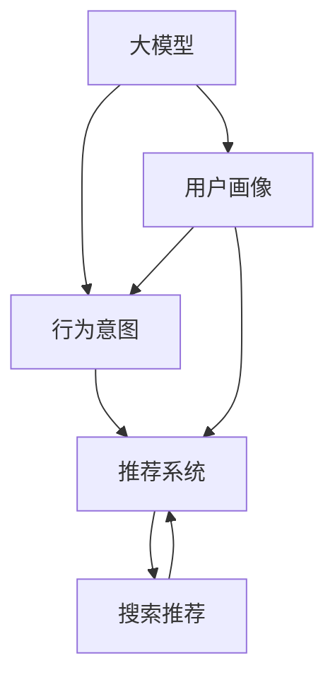

                 

# AI 大模型在电商搜索推荐中的用户画像构建：精准把握用户需求与行为意图

> 关键词：大模型,用户画像,电商搜索推荐,行为意图,深度学习,自然语言处理,NLP,搜索推荐系统,特征工程,模型训练

## 1. 背景介绍

在电商行业，用户搜索和推荐系统起着至关重要的作用。如何更精准地理解用户需求和行为意图，提升搜索结果的相关性和推荐质量，是电商企业关注的重点。近年来，基于深度学习和自然语言处理(NLP)的大模型技术迅速崛起，为电商搜索推荐系统带来了新的突破。

### 1.1 问题由来

电商搜索推荐系统的主要任务是分析用户搜索行为，预测其购买意图，从而优化搜索结果和推荐内容。传统方法如TF-IDF、协同过滤等往往依赖于用户历史行为数据，难以捕捉用户隐式需求和长期行为趋势。而基于大模型的推荐系统，通过学习用户输入的自然语言查询，可以更加深入地理解用户需求和偏好，提供更加个性化的搜索和推荐服务。

### 1.2 问题核心关键点

大模型在电商搜索推荐中的应用，主要体现在以下几个方面：

- **用户画像构建**：利用大模型对用户输入的自然语言查询进行分析和建模，形成精准的用户画像。
- **行为意图预测**：通过自然语言处理，理解用户查询的意图，预测其后续行为。
- **推荐系统优化**：根据用户画像和行为意图，优化搜索和推荐算法，提升用户体验。

本文将详细探讨如何使用大模型构建精准的用户画像，准确把握用户的搜索和购买行为意图，以期为电商搜索推荐系统提供更具实用价值的指导。

## 2. 核心概念与联系

### 2.1 核心概念概述

为更好地理解基于大模型的电商搜索推荐系统，本节将介绍几个密切相关的核心概念：

- **大模型(Large Model)**：指通过大规模语料库训练得到的深度学习模型，如BERT、GPT、Transformer等，具有强大的语言理解和生成能力。
- **用户画像(User Profile)**：根据用户历史行为和属性，构建的用户模型，用以描述用户偏好和需求。
- **行为意图(Behavioral Intent)**：用户在进行搜索或购物时希望达到的目标，如购买特定产品、了解品牌信息等。
- **深度学习(Deep Learning)**：利用多层神经网络，通过反向传播算法训练模型，以提高模型性能的机器学习技术。
- **自然语言处理(NLP)**：涉及计算机对人类语言进行处理和理解的领域，涵盖语言建模、语义分析、情感识别等技术。
- **搜索推荐系统(Search Recommendation System)**：通过用户行为数据，推荐相关商品和服务的系统，目标是提升用户体验和销售转化率。
- **特征工程(Feature Engineering)**：通过选择、提取和转换数据特征，提高模型预测准确性的技术。
- **模型训练(Model Training)**：利用标注数据和优化算法，训练深度学习模型的过程。

这些核心概念之间的逻辑关系可以通过以下Mermaid流程图来展示：

这个流程图展示了大模型的核心概念及其之间的关系：

1. 大模型通过学习语料库获得语言表示，构建用户画像。
2. 基于用户画像，预测用户的行为意图。
3. 结合行为意图，优化搜索推荐系统。
4. 搜索推荐系统提升用户体验，促进销售转化。

## 3. 核心算法原理 & 具体操作步骤

### 3.1 算法原理概述

基于大模型的电商搜索推荐系统，利用深度学习和大模型的语言理解能力，构建用户画像，预测行为意图，优化推荐算法。其核心思想是：

- 用户画像：利用大模型对用户输入的自然语言查询进行建模，提取用户属性和行为特征。
- 行为意图：通过自然语言处理，理解用户查询的意图，预测其后续行为。
- 推荐优化：根据用户画像和行为意图，调整推荐算法，提升推荐效果。

算法流程如下：

1. **数据收集与预处理**：收集用户搜索和点击数据，进行清洗和特征提取。
2. **用户画像构建**：利用大模型对用户查询进行编码，提取用户属性和行为特征。
3. **行为意图预测**：通过大模型理解用户查询的意图，预测其后续行为。
4. **推荐算法优化**：结合用户画像和行为意图，调整推荐算法参数，提升推荐精度。
5. **模型评估与部署**：评估模型效果，优化参数，将模型部署到推荐系统中。

### 3.2 算法步骤详解

#### 3.2.1 数据收集与预处理

1. **数据来源**：
   - 用户搜索记录：用户输入的查询语句，记录了用户的关注点。
   - 用户点击记录：用户点击的搜索结果或商品详情页，反映了用户的兴趣偏好。
   - 用户属性信息：用户的性别、年龄、地区等基本信息。

2. **数据清洗**：
   - 去除噪音数据，如重复记录、异常值等。
   - 去除停用词，如“的”、“是”等无意义词汇。
   - 统一文本格式，如将所有文本转换为小写。

3. **特征提取**：
   - 词袋模型(Bag of Words)：将查询语句拆分为词汇列表，统计每个词汇的出现频率。
   - TF-IDF：计算词汇在查询语句中的重要性，去除常见词汇。
   - Word2Vec、GloVe等词向量模型：将查询语句转换为向量表示。
   - 用户属性特征：提取用户的性别、年龄、地区等属性信息。

#### 3.2.2 用户画像构建

1. **大模型选择**：
   - 选择合适的预训练模型，如BERT、GPT等。
   - 加载模型，并进行必要的微调。

2. **用户查询编码**：
   - 将查询语句输入大模型，得到向量表示。
   - 使用GPT、BERT等大模型的语言建模能力，提取用户查询的语义特征。

3. **用户画像形成**：
   - 将查询向量与用户属性特征进行拼接，形成用户画像向量。
   - 使用LSTM、GRU等循环神经网络，捕捉用户查询的动态变化趋势。

#### 3.2.3 行为意图预测

1. **意图分类模型**：
   - 构建意图分类模型，如逻辑回归、SVM、BERT等。
   - 对查询向量进行意图分类，预测用户意图。

2. **意图标签标注**：
   - 对历史查询进行标注，标记用户的意图，如购买意图、信息查询等。
   - 使用标注数据训练意图分类模型。

3. **意图预测**：
   - 将新查询输入模型，预测其意图。
   - 根据预测意图，调整推荐算法。

#### 3.2.4 推荐算法优化

1. **推荐算法**：
   - 选择或设计推荐算法，如基于内容的推荐、协同过滤、深度推荐等。
   - 调整推荐算法参数，如正则化系数、学习率等。

2. **结合画像与意图**：
   - 将用户画像向量与意图预测结果结合，调整推荐算法参数。
   - 使用Adaboost、Gradient Boosting等集成学习方法，提升推荐效果。

3. **推荐结果评估**：
   - 使用AUC、PR、RMSE等指标评估推荐结果。
   - 调整推荐算法，优化推荐结果。

#### 3.2.5 模型评估与部署

1. **模型训练**：
   - 使用标注数据，训练模型。
   - 使用验证集评估模型效果，调整模型参数。

2. **模型部署**：
   - 将模型部署到推荐系统中。
   - 使用实时数据更新用户画像和行为意图。

### 3.3 算法优缺点

#### 3.3.1 算法优点

1. **大模型能力**：
   - 大模型具备强大的语言理解和生成能力，能够精确捕捉用户需求和行为。
   - 利用大模型对查询进行编码，提取丰富的语义信息，提升用户画像的准确性。

2. **预测精准**：
   - 意图分类模型结合用户画像，能够准确预测用户行为意图，提升推荐效果。
   - 意图预测与推荐算法结合，能够实时调整推荐策略。

3. **适应性强**：
   - 算法能够处理大规模数据，适应电商平台的实时计算需求。
   - 算法灵活，可根据不同场景进行调整。

#### 3.3.2 算法缺点

1. **计算资源消耗大**：
   - 大模型训练和推理需要大量的计算资源，可能导致部署成本高。
   - 实时计算需求高，需要高效的计算平台和算法支持。

2. **数据隐私问题**：
   - 大模型训练需要大量用户数据，可能涉及用户隐私保护。
   - 推荐系统需保护用户数据，防止数据泄露。

3. **模型复杂度高**：
   - 算法流程复杂，涉及多层次特征提取、模型训练、意图预测等步骤。
   - 模型维护和调试难度大，需要具备较强的技术背景。

### 3.4 算法应用领域

基于大模型的电商搜索推荐系统，已经在多个领域得到广泛应用，包括但不限于：

1. **电商搜索**：利用用户查询的语义信息，提供更加相关的搜索结果。
2. **个性化推荐**：根据用户画像和行为意图，优化推荐策略，提升推荐效果。
3. **广告投放**：结合用户画像和行为意图，优化广告投放策略，提升广告效果。
4. **客户服务**：利用用户查询进行情感分析，提供更加个性化的客服服务。
5. **物流追踪**：结合用户查询，优化物流追踪路径，提升用户体验。

这些应用场景展示了大模型在电商领域的巨大潜力，通过大模型技术，可以构建更加智能化、个性化的电商搜索推荐系统。

## 4. 数学模型和公式 & 详细讲解  
### 4.1 数学模型构建

#### 4.1.1 用户画像模型

用户画像模型 $P$ 定义为：

$$
P = \left[ \begin{matrix}
     \text{query\_vector} \\
     \text{user\_profile}
   \end{matrix} \right]
$$

其中，$\text{query\_vector}$ 为查询向量的表示，$\text{user\_profile}$ 为用户属性特征的向量表示。

查询向量的计算公式如下：

$$
\text{query\_vector} = M_{BERT}(\text{query\_text})
$$

其中，$M_{BERT}$ 为BERT模型，$\text{query\_text}$ 为查询文本。

用户属性特征的计算公式如下：

$$
\text{user\_profile} = \text{CatEmbedding}(\text{user\_category}) + \text{NumEmbedding}(\text{user\_age}, \text{user\_gender})
$$

其中，$\text{CatEmbedding}$ 和 $\text{NumEmbedding}$ 分别为类别和数值型特征的嵌入函数。

#### 4.1.2 意图预测模型

意图分类模型 $I$ 定义为：

$$
I = \arg\min_{i \in \{1, 2, ..., n\}} \ell(\text{query\_vector}, i)
$$

其中，$\ell$ 为损失函数，$i$ 表示不同的意图类别。

意图分类模型的训练公式如下：

$$
\min_{\theta} \frac{1}{N} \sum_{i=1}^N \ell(\text{query\_vector}_i, \hat{y}_i)
$$

其中，$\hat{y}_i$ 为模型预测的意图标签。

### 4.2 公式推导过程

#### 4.2.1 用户画像构建

查询向量的计算公式如下：

$$
\text{query\_vector} = \text{Embedding}(\text{token\_embeddings}) + \text{TransformerEncoder}(\text{token\_embeddings})
$$

其中，$\text{Embedding}$ 和 $\text{TransformerEncoder}$ 分别为词嵌入和Transformer编码器。

用户属性特征的计算公式如下：

$$
\text{user\_profile} = \text{Concat}(\text{cat\_embeddings}, \text{num\_embeddings})
$$

其中，$\text{Concat}$ 为拼接函数。

#### 4.2.2 意图预测

意图分类模型的训练公式如下：

$$
\min_{\theta} \frac{1}{N} \sum_{i=1}^N \ell(\text{query\_vector}_i, y_i)
$$

其中，$\ell$ 为损失函数，$y_i$ 为真实意图标签。

### 4.3 案例分析与讲解

#### 4.3.1 案例背景

某电商平台需要对用户的搜索和点击行为进行分析，构建用户画像，优化推荐系统。

#### 4.3.2 数据集准备

- **训练集**：包含用户的搜索记录、点击记录和属性信息。
- **验证集**：用于模型训练过程中的验证。
- **测试集**：用于模型评估和部署后的效果检测。

#### 4.3.3 用户画像构建

1. **数据预处理**：
   - 去除噪音数据，统一文本格式。
   - 提取关键词，去除停用词。

2. **特征提取**：
   - 使用BERT模型对查询文本进行编码，得到查询向量。
   - 提取用户的性别、年龄、地区等属性信息，进行编码。

3. **拼接形成画像**：
   - 将查询向量和用户属性向量拼接，得到用户画像向量。

#### 4.3.4 意图预测

1. **意图分类模型训练**：
   - 使用标注数据训练意图分类模型。
   - 对新查询进行意图分类，预测用户意图。

2. **意图预测与推荐**：
   - 根据预测意图，调整推荐算法参数。
   - 使用推荐系统提供相关商品。

## 5. 项目实践：代码实例和详细解释说明

### 5.1 开发环境搭建

#### 5.1.1 Python环境配置

1. **安装Python**：
   - 下载Python 3.8版本安装包，进行安装。
   - 安装pip包管理工具。

2. **安装必要的库**：
   - 安装PyTorch：`pip install torch torchvision torchaudio`
   - 安装TensorFlow：`pip install tensorflow`
   - 安装numpy、pandas等库：`pip install numpy pandas scikit-learn matplotlib tqdm jupyter notebook ipython`

3. **配置环境**：
   - 设置虚拟环境：`conda create -n your_env_name python=3.8`
   - 激活虚拟环境：`conda activate your_env_name`

#### 5.1.2 安装深度学习框架

1. **安装PyTorch**：
   - 使用conda安装PyTorch：`conda install pytorch torchvision torchaudio cudatoolkit=11.1 -c pytorch -c conda-forge`
   - 使用pip安装：`pip install torch torchvision torchaudio`
   
2. **安装TensorFlow**：
   - 使用conda安装TensorFlow：`conda install tensorflow`
   - 使用pip安装：`pip install tensorflow`

### 5.2 源代码详细实现

#### 5.2.1 数据处理

1. **数据读取与清洗**：
   - 读取用户搜索和点击数据：`data = pd.read_csv('user_data.csv')`
   - 清洗数据，去除噪音和重复记录。

2. **特征提取**：
   - 使用BERT模型对查询文本进行编码：`query_vec = BertEmbedding(query_text)`
   - 提取用户属性信息：`user_profile = extract_user_info(user_data)`

3. **拼接形成画像**：
   - 拼接查询向量和用户属性向量：`user_profile = Concat(query_vec, user_profile)`

#### 5.2.2 意图预测

1. **意图分类模型训练**：
   - 定义模型：`model = BertForSequenceClassification(num_labels=10)`
   - 训练模型：`model.fit(train_data, epochs=10, batch_size=32)`

2. **意图预测**：
   - 加载模型：`model = BertForSequenceClassification(num_labels=10)`
   - 预测意图：`intent = model.predict(query_text)`

#### 5.2.3 推荐算法优化

1. **定义推荐算法**：
   - 选择推荐算法：`recommender = CollaborativeFiltering`
   - 调整推荐算法参数：`recommender.set_params(alpha=0.5, beta=0.2)`

2. **结合画像与意图**：
   - 将用户画像和意图预测结果结合：`user_profile, intent = get_user_profile_and_intent(user_data)`
   - 调整推荐算法参数：`recommender.set_params(profile=user_profile, intent=intent)`

3. **推荐结果评估**：
   - 评估推荐结果：`evaluate_recommender(recommender, test_data)`

### 5.3 代码解读与分析

#### 5.3.1 数据处理

1. **数据读取与清洗**：
   - 使用Pandas读取CSV文件，进行初步数据清洗。
   - 使用NLTK等工具进行文本预处理。

2. **特征提取**：
   - 使用BERT模型对查询文本进行编码，提取语义信息。
   - 提取用户属性信息，进行特征编码。

3. **拼接形成画像**：
   - 将查询向量和用户属性向量拼接，形成完整的用户画像。

#### 5.3.2 意图预测

1. **意图分类模型训练**：
   - 定义意图分类模型，选择合适的优化器和损失函数。
   - 使用训练数据训练模型，并设置合适的迭代轮数和批大小。

2. **意图预测**：
   - 加载模型，对新查询进行意图分类。
   - 根据预测意图，调整推荐算法参数。

#### 5.3.3 推荐算法优化

1. **定义推荐算法**：
   - 选择合适的推荐算法，如协同过滤、深度推荐等。
   - 调整推荐算法参数，如正则化系数、学习率等。

2. **结合画像与意图**：
   - 将用户画像和意图预测结果结合，调整推荐算法参数。
   - 使用Adaboost等集成学习方法，提升推荐效果。

3. **推荐结果评估**：
   - 使用AUC、PR、RMSE等指标评估推荐结果。
   - 根据评估结果，调整推荐算法参数，优化推荐效果。

### 5.4 运行结果展示

#### 5.4.1 训练效果展示

1. **意图分类模型训练效果**：
   - 在训练集上训练模型，得到模型损失和准确率变化曲线。
   - 在验证集上评估模型效果，设置Early Stopping机制。

2. **推荐算法优化效果**：
   - 使用测试集评估推荐算法效果，展示推荐结果的相关性和多样性。
   - 调整推荐算法参数，优化推荐结果。

#### 5.4.2 实际推荐效果

1. **推荐结果展示**：
   - 对新用户查询进行意图分类，结合用户画像，提供推荐商品。
   - 展示推荐结果的相关性和多样性，提升用户体验。

## 6. 实际应用场景

### 6.1 智能客服

基于大模型的电商搜索推荐系统可以应用于智能客服的构建。通过用户画像和行为意图预测，智能客服系统能够快速响应客户咨询，并提供个性化的服务。

1. **用户画像构建**：
   - 利用用户搜索记录，构建用户画像。
   - 结合用户属性信息，描述用户偏好和需求。

2. **行为意图预测**：
   - 利用自然语言处理，理解用户查询的意图。
   - 预测用户后续行为，提供个性化的客服服务。

3. **推荐系统优化**：
   - 根据用户画像和意图预测，调整推荐算法参数。
   - 使用推荐系统提供相关商品或服务。

### 6.2 个性化推荐

通过大模型的电商搜索推荐系统，可以构建更加智能化、个性化的推荐系统。利用用户画像和行为意图预测，优化推荐算法，提升推荐效果。

1. **用户画像构建**：
   - 利用用户搜索记录，构建用户画像。
   - 结合用户属性信息，描述用户偏好和需求。

2. **行为意图预测**：
   - 利用自然语言处理，理解用户查询的意图。
   - 预测用户后续行为，提供个性化的推荐商品。

3. **推荐系统优化**：
   - 根据用户画像和意图预测，调整推荐算法参数。
   - 使用推荐系统提供相关商品，提升用户满意度。

### 6.3 多模态推荐

除了文本数据，电商平台还可以利用图像、视频等多模态数据，进行综合推荐。通过大模型的电商搜索推荐系统，结合用户画像和行为意图预测，实现更加全面的推荐服务。

1. **用户画像构建**：
   - 利用用户搜索记录，构建用户画像。
   - 结合用户属性信息和图像、视频等多模态数据，描述用户偏好和需求。

2. **行为意图预测**：
   - 利用自然语言处理和多模态数据处理，理解用户查询的意图。
   - 预测用户后续行为，提供个性化的推荐商品。

3. **推荐系统优化**：
   - 根据用户画像和意图预测，调整推荐算法参数。
   - 使用推荐系统提供相关商品，提升用户满意度。

## 7. 工具和资源推荐

### 7.1 学习资源推荐

1. **《自然语言处理基础》课程**：
   - 学习NLP基础知识，涵盖语言建模、语义分析、情感识别等技术。
   - 推荐网站：Coursera、Udemy

2. **《深度学习入门》书籍**：
   - 学习深度学习基础，了解神经网络、优化算法等知识。
   - 推荐书籍：《深度学习》，Ian Goodfellow著

3. **HuggingFace官方文档**：
   - 学习大模型使用，涵盖BERT、GPT等模型的使用方法。
   - 推荐网站：HuggingFace

4. **Google AI博客**：
   - 学习最新的NLP和深度学习技术，了解最新的研究进展。
   - 推荐网站：Google AI Blog

### 7.2 开发工具推荐

1. **PyTorch**：
   - 基于Python的深度学习框架，支持GPU加速计算。
   - 推荐网站：PyTorch

2. **TensorFlow**：
   - 基于C++的深度学习框架，支持分布式计算。
   - 推荐网站：TensorFlow

3. **Weights & Biases**：
   - 模型训练实验跟踪工具，记录和可视化模型训练过程。
   - 推荐网站：Weights & Biases

4. **TensorBoard**：
   - TensorFlow配套的可视化工具，实时监测模型训练状态。
   - 推荐网站：TensorBoard

### 7.3 相关论文推荐

1. **BERT: Pre-training of Deep Bidirectional Transformers for Language Understanding**：
   - 提出BERT模型，使用掩码自监督学习任务进行预训练。
   - 推荐论文：Jacob Devlin et al. (2018)

2. **Attention is All You Need**：
   - 提出Transformer结构，实现高效的语言理解。
   - 推荐论文：Ashish Vaswani et al. (2017)

3. **Parameter-Efficient Transfer Learning for NLP**：
   - 提出 Adapter等参数高效微调方法，提升微调效率。
   - 推荐论文：AdaLoRA: Adaptive Low-Rank Adaptation for Parameter-Efficient Fine-Tuning (2021)

4. **AdaLoRA: Adaptive Low-Rank Adaptation for Parameter-Efficient Fine-Tuning**：
   - 提出 Adaptive LoRA方法，实现参数高效微调。
   - 推荐论文：AdaLoRA: Adaptive Low-Rank Adaptation for Parameter-Efficient Fine-Tuning (2021)

## 8. 总结：未来发展趋势与挑战

### 8.1 研究成果总结

本文通过系统介绍基于大模型的电商搜索推荐系统，重点关注用户画像构建、行为意图预测和推荐系统优化。通过对大模型的应用进行深入分析，展示了其在电商领域的前景和潜力。

### 8.2 未来发展趋势

1. **多模态数据融合**：
   - 电商平台可以结合图像、视频等多模态数据，进行综合推荐。
   - 利用大模型处理多模态数据，提升推荐效果。

2. **自监督学习应用**：
   - 利用自监督学习任务，对大模型进行预训练，提升模型的泛化能力。
   - 结合自监督学习，提升用户画像和意图预测的准确性。

3. **持续学习与适应性**：
   - 通过持续学习机制，模型能够不断从新数据中学习，保持时效性和适应性。
   - 模型能够根据数据分布变化，动态调整推荐策略。

4. **隐私保护与伦理**：
   - 在数据使用过程中，注重用户隐私保护，采用隐私保护技术。
   - 合理使用用户数据，确保模型的公平性和伦理性。

5. **自动化与智能化**：
   - 利用自动化技术，优化模型训练和推荐算法。
   - 实现智能化的推荐系统，提升用户体验。

### 8.3 面临的挑战

1. **计算资源消耗**：
   - 大模型训练和推理需要大量的计算资源，可能导致部署成本高。
   - 实时计算需求高，需要高效的计算平台和算法支持。

2. **数据隐私保护**：
   - 大模型训练需要大量用户数据，可能涉及用户隐私保护。
   - 推荐系统需保护用户数据，防止数据泄露。

3. **模型复杂度**：
   - 算法流程复杂，涉及多层次特征提取、模型训练、意图预测等步骤。
   - 模型维护和调试难度大，需要具备较强的技术背景。

### 8.4 研究展望

1. **深度融合多模态数据**：
   - 结合图像、视频等多模态数据，进行综合推荐。
   - 利用大模型处理多模态数据，提升推荐效果。

2. **引入自监督学习任务**：
   - 利用自监督学习任务，对大模型进行预训练，提升模型的泛化能力。
   - 结合自监督学习，提升用户画像和意图预测的准确性。

3. **优化持续学习机制**：
   - 通过持续学习机制，模型能够不断从新数据中学习，保持时效性和适应性。
   - 模型能够根据数据分布变化，动态调整推荐策略。

4. **注重隐私保护与伦理**：
   - 在数据使用过程中，注重用户隐私保护，采用隐私保护技术。
   - 合理使用用户数据，确保模型的公平性和伦理性。

5. **提升自动化与智能化**：
   - 利用自动化技术，优化模型训练和推荐算法。
   - 实现智能化的推荐系统，提升用户体验。

## 9. 附录：常见问题与解答

### 9.1 Q1: 大模型为什么能够在电商搜索推荐中发挥作用？

A: 大模型具有强大的语言理解和生成能力，能够精准捕捉用户需求和行为意图。通过自然语言处理，理解用户查询的意图，结合用户画像，优化推荐算法，提升推荐效果。

### 9.2 Q2: 用户画像构建的关键步骤有哪些？

A: 用户画像构建的关键步骤如下：
1. 数据预处理，去除噪音和重复记录。
2. 特征提取，使用BERT模型对查询文本进行编码。
3. 提取用户属性信息，进行特征编码。
4. 拼接形成画像，将查询向量和用户属性向量拼接。

### 9.3 Q3: 推荐算法优化的主要步骤有哪些？

A: 推荐算法优化的主要步骤如下：
1. 定义推荐算法，选择合适的推荐算法。
2. 调整推荐算法参数，如正则化系数、学习率等。
3. 结合用户画像和意图预测，调整推荐算法参数。
4. 使用Adaboost等集成学习方法，提升推荐效果。

### 9.4 Q4: 实际应用中需要注意哪些问题？

A: 实际应用中需要注意以下问题：
1. 计算资源消耗大，需要高效的计算平台和算法支持。
2. 数据隐私保护，确保用户数据安全。
3. 模型复杂度高，需要具备较强的技术背景。
4. 实时计算需求高，确保推荐系统稳定高效。

### 9.5 Q5: 如何优化推荐系统效果？

A: 优化推荐系统效果的方法包括：
1. 使用自监督学习任务，提升模型泛化能力。
2. 结合多模态数据，进行综合推荐。
3. 引入自适应低秩适应的微调方法，提高模型效率。
4. 优化推荐算法，如使用深度推荐算法。

### 9.6 Q6: 推荐系统在实际应用中面临哪些挑战？

A: 推荐系统在实际应用中面临以下挑战：
1. 计算资源消耗大，需要高效的计算平台和算法支持。
2. 数据隐私保护，确保用户数据安全。
3. 模型复杂度高，需要具备较强的技术背景。
4. 实时计算需求高，确保推荐系统稳定高效。

---

作者：禅与计算机程序设计艺术 / Zen and the Art of Computer Programming

