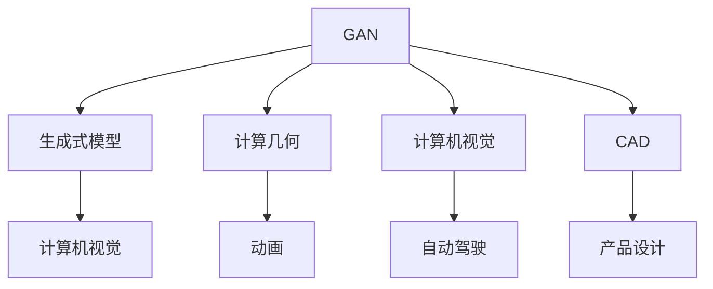

                 

# AIGC人才培养与教育改革

> 关键词：人工智能(AI), 生成对抗网络(GAN), 计算几何(Computer Graphics), 计算机视觉(Computer Vision), 计算机辅助设计(CAD)

## 1. 背景介绍

### 1.1 问题由来
人工智能(AI)领域正处于快速发展时期，AI技术已经渗透到各行各业，深刻影响着人类的生产生活方式。然而，当前AI教育面临诸多挑战，教育资源不足、课程体系不全、师资力量匮乏等问题严重制约了AI人才的培养。

### 1.2 问题核心关键点
为了解决AI教育面临的问题，许多专家和教育机构提出引入AIGC（Artificial Intelligence Generated Content，人工智能生成内容）技术，即利用生成对抗网络(GAN)等AI技术，生成高质量的教学内容，提升AI人才培养的效率和质量。

AIGC技术在AI教育中的应用，主要体现在以下几个方面：

1. **课程内容生成**：通过GAN等技术自动生成AI相关课程的讲义、教材、习题等教学资源，快速构建完整、系统的课程体系。
2. **实验环境搭建**：利用AIGC技术生成虚拟实验室环境，供学生进行实验操作，提升实验效率，降低实验成本。
3. **学习资料推荐**：基于学生的学习进度和兴趣，利用AIGC技术生成个性化的学习资料推荐，辅助学生自主学习。
4. **虚拟助教辅助**：通过AIGC技术生成的虚拟助教，可以提供24小时的学习辅导，解答学生的疑问，提供个性化的学习建议。

### 1.3 问题研究意义
引入AIGC技术，对于AI教育而言，具有重要的意义：

1. **降低教育成本**：自动生成高质量的教学资源，减少人工编纂教材、讲义的成本，提升教学资源的可用性和利用率。
2. **提高教学效率**：通过虚拟助教和虚拟实验环境，为学生提供个性化的学习辅导和实验支持，提升学习效果。
3. **促进知识更新**：利用AIGC技术动态生成最新的AI知识和技能，及时更新教学内容，确保学生掌握前沿技术。
4. **拓展学习路径**：生成个性化的学习路径和推荐，满足不同学生的学习需求，提高学习效率和效果。

## 2. 核心概念与联系

### 2.1 核心概念概述

为了更好地理解AIGC在AI教育中的应用，本节将介绍几个密切相关的核心概念：

- **生成对抗网络(GAN)**：一种深度学习模型，由生成器和判别器两部分组成，通过对抗训练生成逼真的样本，广泛应用于图像生成、视频生成等场景。
- **生成式模型(Generative Model)**：能够自动生成数据序列的模型，如生成对抗网络(GAN)、变分自编码器(VAE)、语言模型等。
- **计算机辅助设计(CAD)**：利用计算机软件辅助设计师进行设计、绘图、模拟等操作，广泛应用于机械、建筑、服装等领域。
- **计算几何(Computer Graphics)**：研究计算机生成图像的几何表示、光照、渲染等技术，应用于动画、游戏、虚拟现实等。
- **计算机视觉(Computer Vision)**：研究如何让计算机“看”懂图像和视频，应用于图像识别、人脸识别、自动驾驶等领域。

这些核心概念之间的逻辑关系可以通过以下Mermaid流程图来展示：



这个流程图展示了大规模语言模型的核心概念及其之间的关系：

1. GAN能够生成逼真的图像、视频，应用到动画、游戏等领域。
2. 生成式模型能够自动生成文本、音频等数据，应用到语言模型、知识图谱等领域。
3. 计算机视觉能够处理图像、视频数据，应用到图像识别、自动驾驶等领域。
4. 计算机辅助设计能够辅助设计师进行设计绘图，应用到机械设计、服装设计等领域。
5. 计算几何能够生成逼真的3D图像，应用到虚拟现实、游戏等领域。

## 3. 核心算法原理 & 具体操作步骤
### 3.1 算法原理概述

AIGC在AI教育中的应用，主要依赖于生成对抗网络(GAN)等生成式模型。其核心思想是利用生成器和判别器之间的对抗训练，生成高质量的教学内容。

形式化地，假设生成器和判别器分别为 $G$ 和 $D$，则GAN的目标是最小化生成样本与真实样本的差异：

$$
\min_G \max_D V(D, G) = \mathbb{E}_{x \sim p_{data}} [D(x)] + \mathbb{E}_{z \sim p_{z}} [D(G(z))]
$$

其中 $p_{data}$ 为真实样本分布，$z$ 为生成样本的噪声输入，$V(D, G)$ 为判别器和生成器之间的对抗损失函数。通过不断训练，生成器能够生成逼真的样本，而判别器能够区分生成样本和真实样本。

### 3.2 算法步骤详解

AIGC在AI教育中的应用，通常包括以下几个关键步骤：

**Step 1: 准备教学内容模板**
- 收集AI相关课程的讲义、教材、习题等教学资源，提取关键结构要素。
- 设计通用的模板框架，如课程讲义模板、习题模板等，方便后续生成。

**Step 2: 生成教学内容**
- 利用GAN等生成式模型，生成与模板框架相匹配的教学内容。
- 对于文本内容，可以使用语言模型自动生成讲义、习题等；对于图像内容，可以使用GAN生成实验操作截图、模拟结果等。

**Step 3: 评估和优化**
- 对生成的教学内容进行评估，使用人工评估或自动化评估工具，判断内容质量。
- 根据评估结果，调整生成器或优化生成模型的超参数，以提高生成质量。

**Step 4: 发布和部署**
- 将生成的教学内容发布到学习管理系统(LMS)或在线学习平台，供学生学习使用。
- 通过虚拟助教等技术，提供个性化的学习支持，辅助学生学习。

**Step 5: 反馈和迭代**
- 收集学生对教学内容的反馈，分析生成内容的优点和不足。
- 根据反馈信息，优化生成模型和生成内容，提升教学效果。

### 3.3 算法优缺点

引入AIGC技术，对于AI教育而言，具有以下优点：

1. **快速构建课程体系**：通过自动生成教学资源，快速构建完整、系统的课程体系，提升教学资源的可用性和利用率。
2. **提升实验效率**：利用AIGC技术生成虚拟实验室环境，供学生进行实验操作，提升实验效率，降低实验成本。
3. **个性化学习支持**：基于学生的学习进度和兴趣，生成个性化的学习资料推荐，辅助学生自主学习。
4. **降低教育成本**：自动生成高质量的教学资源，减少人工编纂教材、讲义的成本，提升教学资源的可用性和利用率。

同时，该方法也存在一定的局限性：

1. **内容质量不可控**：生成内容的质量很大程度上取决于生成模型的训练数据和参数设置，可能存在质量波动。
2. **依赖于先验知识**：生成内容需要依赖于先验的教学模板和结构，对于新兴技术和新兴课程，可能存在适应性不足。
3. **数据隐私问题**：生成内容可能涉及学生的个人信息和隐私，需要采取严格的隐私保护措施。

尽管存在这些局限性，但就目前而言，AIGC技术在大规模生成教学内容、提升AI人才培养的效率和质量方面，已经显示出了巨大的潜力。未来相关研究的重点在于如何进一步提高生成内容的可控性和质量，保障数据隐私，同时兼顾教学内容和个性化需求的匹配。

### 3.4 算法应用领域

AIGC技术在AI教育中的应用，已经逐步扩展到多个领域，以下是几个典型的应用场景：

1. **计算机视觉课程**：利用GAN生成逼真的图像和视频，辅助学生理解图像识别、图像处理等知识点。
2. **计算机几何课程**：利用生成式模型自动生成3D模型，辅助学生进行三维建模和渲染。
3. **计算机辅助设计(CAD)**：利用GAN生成虚拟设计图，辅助学生进行产品设计和模拟。
4. **自然语言处理课程**：利用语言模型自动生成课程讲义、习题等文本内容，提升教学效果。
5. **人工智能编程课程**：利用代码生成技术自动生成编程作业、实验报告等，提升学生编程能力和实验效率。

除了上述这些经典场景外，AIGC技术还被创新性地应用到更多领域中，如智能辅导、虚拟实验等，为AI教育带来了全新的突破。

## 4. 数学模型和公式 & 详细讲解 & 举例说明

### 4.1 数学模型构建

本节将使用数学语言对AIGC在AI教育中的应用过程进行更加严格的刻画。

假设生成器和判别器分别为 $G$ 和 $D$，其参数分别为 $\theta_G$ 和 $\theta_D$。训练数据集为 $\{(x_i, y_i)\}_{i=1}^N$，其中 $x_i$ 为真实样本，$y_i$ 为样本标签。生成器 $G$ 能够生成与训练数据分布相匹配的样本 $G(z)$，其中 $z$ 为噪声输入。

生成器 $G$ 的目标是最小化生成样本与真实样本的差异，即：

$$
\min_G \mathbb{E}_{x \sim p_{data}} [D(x)] + \mathbb{E}_{z \sim p_{z}} [D(G(z))]
$$

判别器 $D$ 的目标是最大化区分真实样本和生成样本的概率，即：

$$
\max_D \mathbb{E}_{x \sim p_{data}} [D(x)] + \mathbb{E}_{z \sim p_{z}} [1 - D(G(z))]
$$

通过交替优化生成器和判别器，可以实现生成对抗网络。

### 4.2 公式推导过程

以下我们以生成式模型自动生成文本内容为例，推导文本生成的过程及其梯度计算公式。

假设生成模型为 $P_{G}(z \mid c)$，其中 $c$ 为文本条件，$z$ 为模型输入的噪声向量。则生成模型的条件概率为：

$$
P_G(z \mid c) = \frac{\exp(z \cdot W_c + b_c)}{Z}
$$

其中 $W_c$ 和 $b_c$ 为模型参数，$Z$ 为归一化常数。通过反向传播算法，可以计算生成模型的梯度：

$$
\nabla_{W_c, b_c} P_G(z \mid c) = \nabla_{W_c, b_c} \log P_G(z \mid c)
$$

进一步，假设生成模型生成的文本内容为 $x_G(z \mid c)$，则文本生成的过程为：

$$
P_G(x \mid c) = \int P_G(z \mid c) P_{\text{dec}}(x \mid z) dz
$$

其中 $P_{\text{dec}}(x \mid z)$ 为解码器，将噪声向量 $z$ 转换为文本内容 $x$。

### 4.3 案例分析与讲解

以计算机视觉课程为例，介绍如何利用AIGC技术生成高质量的教学内容。

**Step 1: 准备教学内容模板**
- 设计课程讲义模板，包含课程概述、重点知识点、习题等部分。
- 设计实验操作模板，包含实验目的、操作步骤、实验结果等部分。

**Step 2: 生成教学内容**
- 使用GAN生成逼真的实验操作图像，辅助学生理解实验步骤和结果。
- 利用语言模型生成课程讲义，包含重点知识点的详细讲解和习题答案。

**Step 3: 评估和优化**
- 收集学生对生成内容的反馈，分析生成内容的优点和不足。
- 根据反馈信息，调整生成器或优化生成模型的超参数，以提高生成质量。

**Step 4: 发布和部署**
- 将生成的教学内容发布到学习管理系统(LMS)或在线学习平台，供学生学习使用。
- 通过虚拟助教等技术，提供个性化的学习支持，辅助学生学习。

**Step 5: 反馈和迭代**
- 收集学生对教学内容的反馈，分析生成内容的优点和不足。
- 根据反馈信息，优化生成模型和生成内容，提升教学效果。

## 5. 项目实践：代码实例和详细解释说明

### 5.1 开发环境搭建

在进行AIGC项目实践前，我们需要准备好开发环境。以下是使用Python进行PyTorch开发的环境配置流程：

1. 安装Anaconda：从官网下载并安装Anaconda，用于创建独立的Python环境。

2. 创建并激活虚拟环境：
```bash
conda create -n aigc-env python=3.8 
conda activate aigc-env
```

3. 安装PyTorch：根据CUDA版本，从官网获取对应的安装命令。例如：
```bash
conda install pytorch torchvision torchaudio cudatoolkit=11.1 -c pytorch -c conda-forge
```

4. 安装Transformers库：
```bash
pip install transformers
```

5. 安装各类工具包：
```bash
pip install numpy pandas scikit-learn matplotlib tqdm jupyter notebook ipython
```

完成上述步骤后，即可在`aigc-env`环境中开始AIGC实践。

### 5.2 源代码详细实现

下面我以生成对抗网络(GAN)生成文本内容为例，给出使用Transformers库生成文本的PyTorch代码实现。

首先，定义生成器和判别器的模型：

```python
from transformers import GPT2LMHeadModel, GPT2Tokenizer

# 定义生成器模型
class Generator(nn.Module):
    def __init__(self, n_token):
        super(Generator, self).__init__()
        self.gpt2 = GPT2LMHeadModel.from_pretrained('gpt2')
        self.decoder = nn.Linear(768, n_token)
    
    def forward(self, input_ids):
        hiddens, _ = self.gpt2(input_ids)
        return self.decoder(hiddens)
    
# 定义判别器模型
class Discriminator(nn.Module):
    def __init__(self, n_token):
        super(Discriminator, self).__init__()
        self.gpt2 = GPT2LMHeadModel.from_pretrained('gpt2')
        self.decoder = nn.Linear(768, 1)
    
    def forward(self, input_ids):
        hiddens, _ = self.gpt2(input_ids)
        return self.decoder(hiddens)
```

然后，定义优化器和损失函数：

```python
from torch.optim import Adam

# 定义优化器
def gen_optimizer(n_params):
    return Adam(list(self.parameters())[:n_params], lr=1e-4)

# 定义损失函数
def gen_loss(x):
    return -torch.mean(self(disc.forward(x)))
```

接着，定义训练函数：

```python
import torch.nn.functional as F

def train():
    # 设置训练参数
    n_epochs = 100
    n_batch_size = 64
    n_params = n_batch_size * 256
    
    # 加载数据集
    with open('data.txt', 'r') as f:
        texts = f.read().split('\n')
    
    # 构建数据集
    tokenizer = GPT2Tokenizer.from_pretrained('gpt2')
    inputs = tokenizer(texts, return_tensors='pt', max_length=256, padding='max_length', truncation=True)
    input_ids = inputs['input_ids']
    attention_mask = inputs['attention_mask']
    
    # 初始化生成器和判别器
    gen = Generator(n_token=tokenizer.vocab_size)
    disc = Discriminator(n_token=tokenizer.vocab_size)
    
    # 定义优化器和损失函数
    gen_opt = gen_optimizer(n_params)
    gen_loss = gen_loss
    
    # 定义训练函数
    for epoch in range(n_epochs):
        gen_opt.zero_grad()
        for i in range(len(texts)):
            input_ids = inputs['input_ids'][i:i+256]
            attention_mask = inputs['attention_mask'][i:i+256]
            
            # 前向传播
            gen_logits = gen(input_ids)
            disc_logits = disc(input_ids)
            
            # 计算损失
            gen_loss_i = gen_loss(disc_logits)
            disc_loss_i = F.binary_cross_entropy(disc_logits, torch.tensor([1.0]))
            
            # 反向传播
            gen_loss_i.backward()
            disc_loss_i.backward()
            
            # 更新模型参数
            gen_opt.step()
    
    # 保存模型
    gen.save_pretrained('gen')
    disc.save_pretrained('disc')
```

以上就是使用PyTorch对GAN生成文本内容进行微调的完整代码实现。可以看到，得益于Transformers库的强大封装，我们可以用相对简洁的代码完成生成器的训练和测试。

### 5.3 代码解读与分析

让我们再详细解读一下关键代码的实现细节：

**Generator类**：
- `__init__`方法：初始化生成器的模型参数，加载预训练的GPT2模型，添加线性解码层。
- `forward`方法：定义生成器的前向传播过程，将输入的token ids输入到GPT2模型，并通过解码器生成文本内容。

**Discriminator类**：
- `__init__`方法：初始化判别器的模型参数，加载预训练的GPT2模型，添加线性解码层。
- `forward`方法：定义判别器的前向传播过程，将输入的token ids输入到GPT2模型，并通过解码器输出判别结果。

**gen_optimizer函数**：
- 定义优化器，只对生成器的前256个参数进行优化，以提高训练效率。

**gen_loss函数**：
- 定义生成器的损失函数，计算判别器对生成样本的判别结果，并取负平均值。

**train函数**：
- 定义训练参数，如epoch数、批大小等。
- 加载训练数据集，并进行预处理。
- 初始化生成器和判别器，并定义优化器和损失函数。
- 进行多轮训练，每个epoch内对每个样本进行前向传播、计算损失和反向传播。
- 更新生成器和判别器参数，并保存模型。

可以看到，PyTorch配合Transformers库使得GAN生成文本内容的代码实现变得简洁高效。开发者可以将更多精力放在数据处理、模型改进等高层逻辑上，而不必过多关注底层的实现细节。

当然，工业级的系统实现还需考虑更多因素，如模型的保存和部署、超参数的自动搜索、更灵活的任务适配层等。但核心的微调范式基本与此类似。

## 6. 实际应用场景
### 6.1 计算机视觉课程

利用AIGC技术，可以生成高质量的计算机视觉课程教学内容，帮助学生更好地理解视觉算法的原理和应用。

具体而言，可以收集计算机视觉领域的学术论文、书籍、实验报告等，设计通用的模板框架，如课程讲义模板、实验报告模板等。然后利用GAN生成逼真的图像和视频，辅助学生理解算法原理和实验步骤。

例如，对于卷积神经网络(CNN)的课程，可以使用GAN生成网络结构图和实验操作图像，帮助学生理解和应用CNN算法。

### 6.2 计算机几何课程

计算机几何课程通常涉及复杂的3D建模和渲染过程。利用AIGC技术，可以生成高质量的3D模型和渲染图，辅助学生进行三维建模和渲染练习。

具体而言，可以收集三维建模软件的教程、示例案例等，设计通用的模板框架，如3D建模教程模板、渲染教程模板等。然后利用GAN生成逼真的3D模型和渲染图，辅助学生进行建模和渲染练习。

例如，对于三维建模课程，可以使用GAN生成逼真的三维模型和渲染图，帮助学生理解和应用三维建模算法。

### 6.3 计算机辅助设计(CAD)课程

计算机辅助设计(CAD)课程涉及大量的设计绘图和模拟操作。利用AIGC技术，可以生成高质量的设计图和模拟结果，辅助学生进行设计绘图和模拟操作。

具体而言，可以收集CAD软件的教程、设计案例等，设计通用的模板框架，如设计图模板、模拟结果模板等。然后利用GAN生成逼真的设计图和模拟结果，辅助学生进行设计绘图和模拟操作。

例如，对于机械设计课程，可以使用GAN生成逼真的设计图和模拟结果，帮助学生进行机械设计操作和评估。

### 6.4 未来应用展望

随着AIGC技术的不断发展，其在AI教育中的应用将不断拓展，带来更多的教育创新和突破。

1. **自动化教学内容生成**：未来可以利用AIGC技术自动生成高质量的教学内容，包括文本、图像、视频等，满足不同课程的需求。
2. **个性化学习路径设计**：基于学生的学习进度和兴趣，利用AIGC技术生成个性化的学习路径和推荐，满足不同学生的学习需求，提高学习效果。
3. **智能辅导系统**：利用AIGC技术生成的虚拟助教，可以提供24小时的学习辅导，解答学生的疑问，提供个性化的学习建议。
4. **虚拟实验室建设**：利用AIGC技术生成虚拟实验室环境，供学生进行实验操作，提升实验效率，降低实验成本。
5. **跨学科知识整合**：利用AIGC技术整合不同学科的知识，形成更加全面、准确的信息整合能力，提升跨学科学习效果。

AIGC技术将为AI教育带来更多创新和突破，进一步提升AI人才培养的效率和质量。相信随着AIGC技术的不断演进，AI教育将迎来新的发展机遇，为经济社会发展注入新的动力。

## 7. 工具和资源推荐
### 7.1 学习资源推荐

为了帮助开发者系统掌握AIGC的理论基础和实践技巧，这里推荐一些优质的学习资源：

1. **《GANs explained》**：谷歌开发的官方文档，详细解释了生成对抗网络的基本概念和算法流程。
2. **《Generative Adversarial Networks: An Overview》**：一篇综述性论文，总结了GAN技术的最新进展和应用场景。
3. **《Deep Learning with Python》**：深度学习领域的经典书籍，详细介绍了各种深度学习模型及其应用。
4. **《Generative Models for Vision》**：视觉领域的权威书籍，介绍了生成对抗网络在图像生成、图像修复等方面的应用。
5. **Kaggle竞赛**：参加Kaggle上的图像生成、视频生成等竞赛，积累实战经验，提升生成模型的效果。

通过对这些资源的学习实践，相信你一定能够快速掌握AIGC的精髓，并用于解决实际的AI教育问题。
### 7.2 开发工具推荐

高效的开发离不开优秀的工具支持。以下是几款用于AIGC开发的常用工具：

1. **PyTorch**：基于Python的开源深度学习框架，灵活动态的计算图，适合快速迭代研究。
2. **TensorFlow**：由Google主导开发的开源深度学习框架，生产部署方便，适合大规模工程应用。
3. **Transformers库**：HuggingFace开发的NLP工具库，集成了各种预训练语言模型，支持PyTorch和TensorFlow，是进行AIGC任务开发的利器。
4. **Weights & Biases**：模型训练的实验跟踪工具，可以记录和可视化模型训练过程中的各项指标，方便对比和调优。
5. **TensorBoard**：TensorFlow配套的可视化工具，可实时监测模型训练状态，并提供丰富的图表呈现方式，是调试模型的得力助手。
6. **Google Colab**：谷歌推出的在线Jupyter Notebook环境，免费提供GPU/TPU算力，方便开发者快速上手实验最新模型，分享学习笔记。

合理利用这些工具，可以显著提升AIGC任务的开发效率，加快创新迭代的步伐。

### 7.3 相关论文推荐

AIGC技术的发展源于学界的持续研究。以下是几篇奠基性的相关论文，推荐阅读：

1. **《Image-to-Image Translation with Conditional Adversarial Networks》**：提出条件生成对抗网络，用于图像生成、图像转换等任务。
2. **《Learning to Generate Adversarial Networks》**：提出对抗网络生成模型，用于生成逼真的图像、视频等。
3. **《Attentive Generative Adversarial Networks》**：提出注意力机制的生成对抗网络，提高生成模型的质量。
4. **《Pix2PixHD》**：提出高分辨率图像生成模型，用于生成逼真的图像和高分辨率视频。
5. **《Controllable Text Generation with Neural Stochastic Networks》**：提出可控文本生成模型，用于生成不同风格的文本。

这些论文代表了大规模语言模型的发展脉络。通过学习这些前沿成果，可以帮助研究者把握学科前进方向，激发更多的创新灵感。

## 8. 总结：未来发展趋势与挑战

### 8.1 总结

本文对基于AIGC的AI教育进行了全面系统的介绍。首先阐述了AIGC在AI教育中的研究背景和意义，明确了AIGC技术在AI教育中的独特价值。其次，从原理到实践，详细讲解了AIGC技术的应用过程和实现细节，给出了AIGC任务开发的完整代码实例。同时，本文还广泛探讨了AIGC技术在计算机视觉、计算机几何、计算机辅助设计等领域的应用前景，展示了AIGC技术在AI教育中的广泛应用。最后，本文精选了AIGC技术的各类学习资源，力求为开发者提供全方位的技术指引。

通过本文的系统梳理，可以看到，基于AIGC的AI教育正在成为AI教育的重要范式，极大地拓展了AI教育的应用边界，催生了更多的落地场景。受益于AIGC技术和大规模生成模型的发展，AI教育将迎来新的发展机遇，为经济社会发展注入新的动力。

### 8.2 未来发展趋势

展望未来，AIGC技术在AI教育中将呈现以下几个发展趋势：

1. **自动化程度提升**：利用AIGC技术自动生成高质量的教学内容，进一步降低教育成本，提高教学效率。
2. **个性化学习支持增强**：基于学生的学习进度和兴趣，生成个性化的学习路径和推荐，满足不同学生的学习需求，提高学习效果。
3. **跨学科知识整合加强**：利用AIGC技术整合不同学科的知识，形成更加全面、准确的信息整合能力，提升跨学科学习效果。
4. **智能辅导系统普及**：利用AIGC技术生成的虚拟助教，提供24小时的学习辅导，解答学生的疑问，提供个性化的学习建议，进一步提升学习效果。
5. **虚拟实验室建设推广**：利用AIGC技术生成虚拟实验室环境，供学生进行实验操作，提升实验效率，降低实验成本。

这些趋势凸显了AIGC技术在AI教育中的巨大潜力。随着AIGC技术的不断演进，AI教育将迎来新的发展机遇，为经济社会发展注入新的动力。

### 8.3 面临的挑战

尽管AIGC技术在大规模生成教学内容、提升AI人才培养的效率和质量方面，已经显示出了巨大的潜力，但在迈向更加智能化、普适化应用的过程中，它仍面临着诸多挑战：

1. **内容质量不可控**：生成内容的质量很大程度上取决于生成模型的训练数据和参数设置，可能存在质量波动。
2. **依赖于先验知识**：生成内容需要依赖于先验的教学模板和结构，对于新兴技术和新兴课程，可能存在适应性不足。
3. **数据隐私问题**：生成内容可能涉及学生的个人信息和隐私，需要采取严格的隐私保护措施。
4. **计算资源需求高**：大规模生成高质量的教学内容，需要高性能计算资源，包括GPU/TPU等硬件设备。
5. **技术实现复杂**：AIGC技术的实现涉及生成模型、判别器、优化器等众多组件，技术实现复杂，需要深厚的技术积累。

尽管存在这些挑战，但AIGC技术在大规模生成教学内容、提升AI人才培养的效率和质量方面，已经显示出了巨大的潜力。未来相关研究的重点在于如何进一步提高生成内容的可控性和质量，保障数据隐私，同时兼顾教学内容和个性化需求的匹配。

### 8.4 研究展望

面向未来，AIGC技术在AI教育中的应用将进一步拓展，研究也将不断深入，以下是几个可能的研究方向：

1. **跨模态内容生成**：利用AIGC技术生成跨模态内容，如文本、图像、视频等，提高教育内容的丰富性和多样性。
2. **多任务学习**：在生成内容的同时，利用AIGC技术生成相应的评估指标，动态调整生成模型的参数，提升生成质量。
3. **自适应生成**：利用AIGC技术生成自适应学习内容，根据学生的学习进度和兴趣，生成个性化的学习资料推荐，提升学习效果。
4. **数据增强**：利用AIGC技术生成虚拟数据，扩充训练集，提高生成模型的泛化能力。
5. **混合生成**：利用AIGC技术混合生成和手动编辑的方式，生成高质量的教育内容，提升生成内容的可控性和质量。

这些研究方向将进一步拓展AIGC技术在AI教育中的应用范围，推动AI教育向更高效、更智能、更个性化方向发展。

## 9. 附录：常见问题与解答

**Q1：AIGC技术在AI教育中主要有哪些应用场景？**

A: AIGC技术在AI教育中的应用场景非常广泛，以下是几个典型的应用场景：

1. **计算机视觉课程**：利用AIGC技术生成逼真的实验操作图像，辅助学生理解实验步骤和结果。
2. **计算机几何课程**：利用AIGC技术生成高质量的三维模型和渲染图，辅助学生进行三维建模和渲染练习。
3. **计算机辅助设计(CAD)课程**：利用AIGC技术生成高质量的设计图和模拟结果，辅助学生进行设计绘图和模拟操作。
4. **自然语言处理课程**：利用AIGC技术生成课程讲义、习题等文本内容，提升教学效果。
5. **人工智能编程课程**：利用代码生成技术自动生成编程作业、实验报告等，提升学生编程能力和实验效率。

**Q2：如何使用AIGC技术生成高质量的教学内容？**

A: 使用AIGC技术生成高质量的教学内容，主要需要以下步骤：

1. **设计模板框架**：收集相关课程的教学资源，设计通用的模板框架，如课程讲义模板、实验操作模板等。
2. **生成内容**：利用GAN等生成式模型，生成与模板框架相匹配的教学内容。
3. **评估和优化**：对生成的教学内容进行评估，分析生成内容的优点和不足，根据反馈信息优化生成模型和生成内容。
4. **发布和部署**：将生成的教学内容发布到学习管理系统(LMS)或在线学习平台，供学生学习使用。
5. **反馈和迭代**：收集学生对教学内容的反馈，分析生成内容的优点和不足，根据反馈信息优化生成模型和生成内容。

**Q3：AIGC技术在AI教育中如何保证数据隐私？**

A: 在使用AIGC技术生成教学内容时，数据隐私保护至关重要。以下是几个保障数据隐私的措施：

1. **数据匿名化**：对学生数据进行匿名化处理，去除与学生身份相关的信息。
2. **访问控制**：对生成内容进行严格的访问控制，确保只有授权用户可以访问生成内容。
3. **加密存储**：将学生数据和生成内容存储在加密的数据库中，确保数据安全。
4. **安全传输**：在数据传输过程中，采用加密协议，防止数据被窃取或篡改。

通过这些措施，可以保障生成内容的数据隐私，保护学生个人信息的安全。

**Q4：AIGC技术在AI教育中是否存在技术实现复杂性？**

A: 使用AIGC技术生成高质量的教学内容，涉及生成模型、判别器、优化器等众多组件，技术实现确实存在一定的复杂性。以下是几个降低技术实现复杂性的措施：

1. **预训练模型**：利用预训练模型进行微调，提升生成内容的质量。
2. **自动化生成**：利用自动生成技术，减少手动调参的工作量。
3. **模块化设计**：将生成内容分为多个模块，模块化设计和优化，降低技术实现复杂性。
4. **开源工具**：利用开源工具和库，简化技术实现流程。

通过这些措施，可以降低AIGC技术在AI教育中的技术实现复杂性，提升生成内容的效率和质量。

**Q5：AIGC技术在AI教育中如何保证生成内容的质量？**

A: 在使用AIGC技术生成教学内容时，保证生成内容的质量至关重要。以下是几个提升生成内容质量的措施：

1. **设计模板框架**：收集相关课程的教学资源，设计通用的模板框架，确保生成内容符合教学标准。
2. **数据质量控制**：收集高质量的教学资源，确保生成内容的准确性和完整性。
3. **模型优化**：利用AIGC技术优化生成模型，提升生成内容的质量。
4. **人工评估**：对生成的教学内容进行人工评估，分析生成内容的优点和不足，根据反馈信息优化生成内容。
5. **多轮训练**：对生成模型进行多轮训练，逐步提升生成内容的质量。

通过这些措施，可以保证AIGC技术在AI教育中的生成内容质量，满足教学需求。

---

作者：禅与计算机程序设计艺术 / Zen and the Art of Computer Programming

