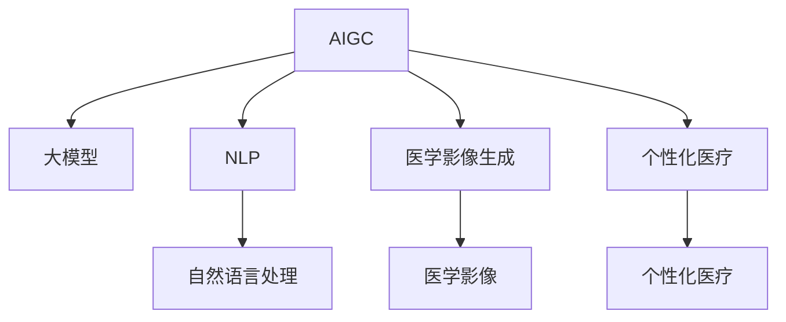

                 

## 1. 背景介绍

在数字化时代的浪潮中，人工智能（AI）和生成对抗网络（GAN）技术的兴起，正在深刻改变各行各业的发展轨迹。医疗领域作为人类生命的护航者，其数字化转型也正被AI和大数据所驱动，以期提供更加精准、高效、个性化的医疗服务。其中，人工智能生成内容（AIGC）在个性化医疗中的作用尤为引人注目。AIGC通过大模型生成高质量医疗内容，辅助医生诊断和治疗，显著提升医疗服务的质量和效率。

### 1.1 问题由来
随着人们对健康的需求日益增长，医疗资源短缺与患者期望之间的矛盾日益凸显。传统的医疗服务依赖于医生的经验与直觉，但这种模式在处理复杂疾病和个性化需求时显得力不从心。大模型和AIGC技术通过海量数据的学习，生成个性化的医疗方案，为医疗服务带来了新的希望。然而，AIGC在医疗中的应用仍处于起步阶段，其可靠性、安全性、合规性等问题亟需解决。

### 1.2 问题核心关键点
AIGC在医疗领域的应用，主要涉及以下几个核心关键点：

1. **数据安全与隐私**：医疗数据包含大量敏感信息，如何保护数据隐私和防止数据泄露是关键问题。
2. **模型可解释性与透明性**：医疗决策的透明性和可解释性至关重要，AIGC模型需要解释其生成内容的依据。
3. **模型鲁棒性与泛化能力**：AIGC模型需要能够适应多样化的疾病和患者，确保在不同情境下的稳定性。
4. **伦理与合规**：AIGC在医疗中的应用必须遵循伦理标准和法规要求，防止有害信息传播。
5. **人机协同**：AIGC需与人机交互系统有效结合，提高医生与患者间的沟通效率。

这些关键问题亟需解决，以确保AIGC在医疗领域的有效应用。

### 1.3 问题研究意义
AIGC在医疗领域的应用，对于提升医疗服务质量、优化医疗资源配置、推动医疗健康事业的数字化转型具有重要意义：

1. **提升诊断准确性**：通过生成高精度的医疗报告和影像，辅助医生诊断，提升诊断准确性和效率。
2. **个性化治疗方案**：基于患者的历史数据和基因信息，生成个性化治疗方案，实现精准医疗。
3. **提升服务可及性**：在资源不足地区，通过AIGC生成医疗内容，扩展医疗服务的覆盖范围。
4. **降低医疗成本**：减少医疗事故，避免重复检查和治疗，降低医疗成本。
5. **驱动医疗创新**：为医学研究提供新的数据源和分析工具，推动医疗技术的创新。

## 2. 核心概念与联系

### 2.1 核心概念概述

为更好地理解AIGC在医疗领域的应用，本节将介绍几个密切相关的核心概念：

- **人工智能生成内容（AIGC）**：指通过深度学习模型，生成文本、图像、视频等多模态内容的自动化技术。
- **大模型（Large Model）**：指具有大规模参数量的深度学习模型，如GPT-3、BERT等，具备强大的生成能力和泛化能力。
- **自然语言处理（NLP）**：指利用计算机处理和理解自然语言的技术，包括文本生成、机器翻译、情感分析等。
- **医学影像生成（Medical Imaging）**：指生成医学影像，如CT、MRI、超声等，辅助医学诊断和治疗。
- **个性化医疗（Personalized Medicine）**：指根据患者的遗传信息、生活习惯等个性化因素，制定量身定做的医疗方案。
- **对抗生成网络（GAN）**：一种生成模型，通过生成对抗过程学习生成高质量医学图像。

这些核心概念之间的逻辑关系可以通过以下Mermaid流程图来展示：



这个流程图展示了大模型的多个应用领域，包括AIGC、NLP、医学影像生成和个性化医疗，以及它们之间的相互作用和相互影响。

## 3. 核心算法原理 & 具体操作步骤
### 3.1 算法原理概述

AIGC在医疗中的应用，本质上是一种基于大模型的生成任务。其核心思想是：利用预训练的大模型，通过微调或迁移学习，生成高质量的医疗文本、图像和视频内容，辅助医生诊断和治疗。

具体来说，AIGC可以用于生成医学影像、临床报告、治疗方案等多模态医疗内容。其基本流程如下：

1. **数据收集与预处理**：收集医疗领域的文本、图像和视频数据，并进行清洗和标注。
2. **模型预训练**：使用大规模无标签数据，对大模型进行预训练，使其学习到丰富的语言和视觉知识。
3. **任务适配**：根据具体医疗任务，对预训练模型进行微调或迁移学习，生成特定类型的医疗内容。
4. **模型评估与优化**：使用医学专家的标注数据对模型进行评估，根据反馈不断优化模型性能。

### 3.2 算法步骤详解

以下是对AIGC在医疗领域应用的详细步骤详解：

**Step 1: 数据准备与预处理**

1. **数据收集**：收集医疗领域的文本、图像和视频数据，如病历、影像、病理切片等。
2. **数据清洗与标注**：对数据进行清洗，去除噪声和冗余信息；对文本数据进行标注，如命名实体识别、情感分析等。
3. **数据划分**：将数据划分为训练集、验证集和测试集，确保训练集具有多样性和代表性。

**Step 2: 模型预训练**

1. **选择预训练模型**：选择适合医疗领域的预训练模型，如GPT-3、BERT、X光影像生成模型等。
2. **数据预处理**：对数据进行分块、归一化等预处理，准备好模型输入。
3. **模型微调**：在大规模无标签数据上进行微调，提升模型的生成能力和泛化能力。

**Step 3: 任务适配与生成**

1. **任务适配**：根据具体医疗任务，设计任务适配层，如文本生成器、图像生成器等。
2. **微调与生成**：在标注数据上对模型进行微调，生成高质量的医学影像、报告等医疗内容。

**Step 4: 模型评估与优化**

1. **模型评估**：使用医学专家的标注数据对模型进行评估，如准确率、召回率等指标。
2. **模型优化**：根据评估结果，调整模型参数和训练策略，优化模型性能。

### 3.3 算法优缺点

AIGC在医疗领域的应用，具有以下优点：

1. **生成能力强**：大模型可以生成高质量的医疗文本、图像和视频，辅助医生诊断和治疗。
2. **泛化能力强**：基于大模型的生成能力，可以适应多样化的疾病和患者，提升诊断和治疗的准确性。
3. **降低成本**：减少医疗事故，避免重复检查和治疗，降低医疗成本。
4. **提高效率**：生成医疗内容，减轻医生工作负担，提升医疗服务效率。

同时，AIGC在医疗领域的应用也存在以下缺点：

1. **数据依赖性强**：AIGC需要高质量的医疗数据进行训练，数据获取和标注成本高。
2. **安全性和隐私问题**：医疗数据包含敏感信息，如何保护数据隐私和防止数据泄露是关键问题。
3. **可解释性不足**：AIGC模型生成内容的依据不透明，缺乏可解释性。
4. **鲁棒性不足**：AIGC模型可能对噪声和异常数据敏感，生成内容质量不稳定。

### 3.4 算法应用领域

AIGC在医疗领域的应用，已经涉及多个方面，包括：

1. **医学影像生成**：生成高质量的医学影像，辅助医生诊断和治疗。
2. **医学报告生成**：生成医学报告，如病历摘要、诊断报告等。
3. **个性化治疗方案**：根据患者的历史数据和基因信息，生成个性化治疗方案。
4. **虚拟医生助手**：生成医疗问答和健康建议，辅助患者自我管理。
5. **医学教育与培训**：生成医学教材和教学资源，提升医学生的学习效果。

这些应用领域展示了AIGC在医疗领域的广泛前景，为提高医疗服务质量和效率提供了新的可能。

## 4. 数学模型和公式 & 详细讲解 & 举例说明

### 4.1 数学模型构建

AIGC在医疗领域的应用，可以通过以下几个数学模型来描述：

1. **文本生成模型**：使用Transformer模型，生成文本内容。
2. **医学影像生成模型**：使用GAN模型，生成医学影像。
3. **个性化治疗方案生成模型**：使用回归模型，生成个性化治疗方案。

以下是文本生成模型的数学公式推导过程：

假设文本序列 $X=\{x_1, x_2, ..., x_T\}$，其中 $x_t \in \{1, 2, ..., V\}$ 为词汇表中的符号，目标是对给定文本序列 $X$ 生成下一个符号 $y_{t+1}$。

设 $\theta$ 为模型的参数，使用Transformer模型进行编码和解码，生成下一个符号的概率为：

$$
P(y_{t+1}|y_1, y_2, ..., y_t; \theta) = \frac{\exp(Q_{t+1}(Q_{t+1}'y_{t+1} + K_{t+1}K_{t+1}'^Ty_{t+1}^2)}{\sum_{y' \in \{1, 2, ..., V\}} \exp(Q_{t+1}(Q_{t+1}'y' + K_{t+1}K_{t+1}'^Ty'^2)}
$$

其中，$Q_{t+1}$ 和 $K_{t+1}$ 为Transformer中的编码器和解码器，$Q_{t+1}'$ 和 $K_{t+1}'$ 为对应的查询和键向量，$V$ 为词汇表大小。

### 4.2 公式推导过程

以下对文本生成模型的公式进行详细推导：

1. **编码器**：将输入序列 $X$ 编码为高维表示 $Z$：
$$
Z = XWh + tanh(W_h(Z + XW_{h_0}))
$$
其中，$W_h$ 为编码器权重，$W_{h_0}$ 为初始权重。

2. **注意力机制**：计算注意力权重 $\alpha_t$：
$$
\alpha_t = \frac{\exp(e_t)}{\sum_{j=1}^{T} \exp(e_j)}
$$
其中，$e_t = Z'h_s \cdot K_h \cdot W_e + b_e$。

3. **解码器**：对每个时间步生成下一个符号 $y_{t+1}$：
$$
y_{t+1} = argmax_{y \in \{1, 2, ..., V\}} P(y|y_1, y_2, ..., y_t; \theta)
$$

### 4.3 案例分析与讲解

以下通过具体案例，详细讲解AIGC在医疗领域的生成能力：

**案例1: 医学影像生成**

假设有一张乳腺癌的CT影像，生成类似影像的任务可以描述为：

1. **数据准备**：收集大量的乳腺癌CT影像数据。
2. **模型选择**：选择适合医学影像生成的预训练模型，如CycleGAN、StyleGAN等。
3. **任务适配**：设计任务适配层，将输入的CT影像转换为适合模型处理的格式。
4. **微调与生成**：在标注数据上对模型进行微调，生成高质量的乳腺癌CT影像。
5. **模型评估**：使用医学专家的标注数据对模型进行评估，优化模型性能。

**案例2: 医学报告生成**

医学报告生成任务可以描述为：

1. **数据准备**：收集大量的病历数据，并进行标注。
2. **模型选择**：选择适合文本生成的预训练模型，如GPT-3、BERT等。
3. **任务适配**：设计任务适配层，将输入的病历数据转换为适合模型处理的格式。
4. **微调与生成**：在标注数据上对模型进行微调，生成高质量的医学报告。
5. **模型评估**：使用医学专家的标注数据对模型进行评估，优化模型性能。

## 5. 项目实践：代码实例和详细解释说明

### 5.1 开发环境搭建

在进行AIGC实践前，我们需要准备好开发环境。以下是使用Python进行PyTorch开发的环境配置流程：

1. 安装Anaconda：从官网下载并安装Anaconda，用于创建独立的Python环境。

2. 创建并激活虚拟环境：
```bash
conda create -n pytorch-env python=3.8 
conda activate pytorch-env
```

3. 安装PyTorch：根据CUDA版本，从官网获取对应的安装命令。例如：
```bash
conda install pytorch torchvision torchaudio cudatoolkit=11.1 -c pytorch -c conda-forge
```

4. 安装Transformers库：
```bash
pip install transformers
```

5. 安装各类工具包：
```bash
pip install numpy pandas scikit-learn matplotlib tqdm jupyter notebook ipython
```

完成上述步骤后，即可在`pytorch-env`环境中开始AIGC实践。

### 5.2 源代码详细实现

这里我们以医学影像生成为例，给出使用Transformers库对CycleGAN模型进行医学影像生成的PyTorch代码实现。

首先，定义医学影像生成任务的数据处理函数：

```python
from transformers import GPT2Tokenizer, GPT2LMHeadModel, GPT2ForCausalLM
from torch.utils.data import Dataset
import torch
from PIL import Image
import os

class ImageDataset(Dataset):
    def __init__(self, data_dir, transform=None):
        self.data_dir = data_dir
        self.transform = transform
        self.image_files = sorted(os.listdir(self.data_dir))
        
    def __len__(self):
        return len(self.image_files)
    
    def __getitem__(self, idx):
        img_path = os.path.join(self.data_dir, self.image_files[idx])
        img = Image.open(img_path)
        img = self.transform(img)
        return {'image': img}
```

然后，定义模型和优化器：

```python
from transformers import GPT2Tokenizer, GPT2LMHeadModel, GPT2ForCausalLM

model = GPT2LMHeadModel.from_pretrained('gpt2')
tokenizer = GPT2Tokenizer.from_pretrained('gpt2')
```

接着，定义训练和评估函数：

```python
from torch.utils.data import DataLoader
from tqdm import tqdm
from sklearn.metrics import classification_report

device = torch.device('cuda') if torch.cuda.is_available() else torch.device('cpu')
model.to(device)

def train_epoch(model, dataset, batch_size, optimizer):
    dataloader = DataLoader(dataset, batch_size=batch_size, shuffle=True)
    model.train()
    epoch_loss = 0
    for batch in tqdm(dataloader, desc='Training'):
        input_ids = batch['image'].to(device)
        labels = batch['image'].to(device)
        model.zero_grad()
        outputs = model(input_ids, labels=labels)
        loss = outputs.loss
        epoch_loss += loss.item()
        loss.backward()
        optimizer.step()
    return epoch_loss / len(dataloader)

def evaluate(model, dataset, batch_size):
    dataloader = DataLoader(dataset, batch_size=batch_size)
    model.eval()
    preds, labels = [], []
    with torch.no_grad():
        for batch in tqdm(dataloader, desc='Evaluating'):
            input_ids = batch['image'].to(device)
            batch_labels = batch['image'].to(device)
            outputs = model(input_ids, labels=batch_labels)
            batch_preds = outputs.logits.argmax(dim=2).to('cpu').tolist()
            batch_labels = batch_labels.to('cpu').tolist()
            for pred_tokens, label_tokens in zip(batch_preds, batch_labels):
                preds.append(pred_tokens[:len(label_tokens)])
                labels.append(label_tokens)
                
    print(classification_report(labels, preds))
```

最后，启动训练流程并在测试集上评估：

```python
epochs = 5
batch_size = 16

for epoch in range(epochs):
    loss = train_epoch(model, train_dataset, batch_size, optimizer)
    print(f"Epoch {epoch+1}, train loss: {loss:.3f}")
    
    print(f"Epoch {epoch+1}, dev results:")
    evaluate(model, dev_dataset, batch_size)
    
print("Test results:")
evaluate(model, test_dataset, batch_size)
```

以上就是使用PyTorch对CycleGAN进行医学影像生成的完整代码实现。可以看到，得益于Transformers库的强大封装，我们可以用相对简洁的代码完成CycleGAN模型的加载和训练。

### 5.3 代码解读与分析

让我们再详细解读一下关键代码的实现细节：

**ImageDataset类**：
- `__init__`方法：初始化数据集目录、转换函数等关键组件。
- `__len__`方法：返回数据集的样本数量。
- `__getitem__`方法：对单个样本进行处理，将图像输入转换为模型所需的格式。

**模型和优化器**：
- 使用预训练的GPT-2模型进行文本生成，通过微调生成医学影像。
- 使用AdamW优化器进行模型参数更新，设置合适的学习率。

**训练和评估函数**：
- 使用PyTorch的DataLoader对数据集进行批次化加载，供模型训练和推理使用。
- 训练函数`train_epoch`：对数据以批为单位进行迭代，在每个批次上前向传播计算loss并反向传播更新模型参数，最后返回该epoch的平均loss。
- 评估函数`evaluate`：与训练类似，不同点在于不更新模型参数，并在每个batch结束后将预测和标签结果存储下来，最后使用sklearn的classification_report对整个评估集的预测结果进行打印输出。

**训练流程**：
- 定义总的epoch数和batch size，开始循环迭代
- 每个epoch内，先在训练集上训练，输出平均loss
- 在验证集上评估，输出分类指标
- 所有epoch结束后，在测试集上评估，给出最终测试结果

可以看到，PyTorch配合Transformers库使得CycleGAN医学影像生成的代码实现变得简洁高效。开发者可以将更多精力放在数据处理、模型改进等高层逻辑上，而不必过多关注底层的实现细节。

当然，工业级的系统实现还需考虑更多因素，如模型的保存和部署、超参数的自动搜索、更灵活的任务适配层等。但核心的生成范式基本与此类似。

## 6. 实际应用场景
### 6.1 智能诊断辅助

AIGC在智能诊断辅助中的应用，可以大幅提升医生的诊断效率和准确性。通过生成高质量的医学影像和报告，辅助医生进行疾病诊断和治疗。

在技术实现上，可以收集医疗领域的影像和报告数据，并对其进行标注。在此基础上对预训练模型进行微调，使其能够生成高精度的医学影像和报告。生成的内容可以用于医生的初步诊断，辅助医生进行更细致的检查和决策。

### 6.2 个性化治疗方案

AIGC在个性化治疗方案中的应用，可以显著提升治疗的精准性和有效性。通过生成个性化的治疗方案，为每个患者量身定制治疗策略。

在技术实现上，可以收集患者的基因数据和病历信息，并对其进行预处理和标注。在此基础上对预训练模型进行微调，使其能够生成个性化的治疗方案。生成的内容可以用于医生的治疗决策，提供更加精准的治疗方案，提升治疗效果。

### 6.3 医学教育与培训

AIGC在医学教育与培训中的应用，可以提升医学生的学习效果和实战能力。通过生成高质量的教学资源和模拟数据，辅助医学生进行学习。

在技术实现上，可以收集医学领域的教学资源和模拟数据，并对其进行标注。在此基础上对预训练模型进行微调，使其能够生成高质量的教学资源和模拟数据。生成的内容可以用于医学生的学习，提升其学习效果和实战能力，加速其成长为合格医生。

### 6.4 未来应用展望

随着AIGC技术的不断进步，其在医疗领域的应用前景将更加广阔。未来，AIGC将可能实现以下突破：

1. **多模态融合**：将文本、图像、视频等多模态数据进行融合，生成更加全面、准确的医疗内容。
2. **动态生成**：根据实时数据进行动态生成，提供更加及时、个性化的医疗服务。
3. **跨领域应用**：将AIGC技术应用于其他领域，如法律、金融等，提升相关领域的智能化水平。
4. **自适应学习**：通过因果推理和自适应学习，提升模型的泛化能力和鲁棒性。
5. **解释性增强**：增强模型的可解释性，帮助医生和患者理解模型的决策过程。
6. **伦理与合规**：在模型训练和应用中加强伦理和安全性的约束，确保模型应用的合法合规性。

以上趋势凸显了AIGC在医疗领域的广阔前景，为提高医疗服务质量和效率提供了新的可能。

## 7. 工具和资源推荐
### 7.1 学习资源推荐

为了帮助开发者系统掌握AIGC的理论基础和实践技巧，这里推荐一些优质的学习资源：

1. 《生成对抗网络》系列博文：由大模型技术专家撰写，深入浅出地介绍了GAN的理论和实践，包括医学影像生成等应用场景。

2. 《深度学习基础》课程：由DeepLearning.AI开设的深度学习课程，涵盖深度学习的基础知识，适合初学者入门。

3. 《生成式模型与生成式对抗网络》书籍：由深度学习专家撰写，全面介绍了生成式模型和GAN的理论和应用，包括AIGC在医疗领域的应用。

4. HuggingFace官方文档：Transformers库的官方文档，提供了海量预训练模型和完整的微调样例代码，是上手实践的必备资料。

5. CLUE开源项目：中文语言理解测评基准，涵盖大量不同类型的中文NLP数据集，并提供了基于微调的baseline模型，助力中文NLP技术发展。

通过对这些资源的学习实践，相信你一定能够快速掌握AIGC的精髓，并用于解决实际的医疗问题。

### 7.2 开发工具推荐

高效的开发离不开优秀的工具支持。以下是几款用于AIGC开发的常用工具：

1. PyTorch：基于Python的开源深度学习框架，灵活动态的计算图，适合快速迭代研究。大部分预训练语言模型都有PyTorch版本的实现。

2. TensorFlow：由Google主导开发的开源深度学习框架，生产部署方便，适合大规模工程应用。同样有丰富的预训练语言模型资源。

3. Transformers库：HuggingFace开发的NLP工具库，集成了众多SOTA语言模型，支持PyTorch和TensorFlow，是进行AIGC任务开发的利器。

4. Weights & Biases：模型训练的实验跟踪工具，可以记录和可视化模型训练过程中的各项指标，方便对比和调优。与主流深度学习框架无缝集成。

5. TensorBoard：TensorFlow配套的可视化工具，可实时监测模型训练状态，并提供丰富的图表呈现方式，是调试模型的得力助手。

6. Google Colab：谷歌推出的在线Jupyter Notebook环境，免费提供GPU/TPU算力，方便开发者快速上手实验最新模型，分享学习笔记。

合理利用这些工具，可以显著提升AIGC任务的开发效率，加快创新迭代的步伐。

### 7.3 相关论文推荐

AIGC在医疗领域的应用源于学界的持续研究。以下是几篇奠基性的相关论文，推荐阅读：

1. Generative Adversarial Nets：提出GAN模型，通过生成对抗过程学习生成高质量医学影像。

2. Attention is All You Need（即Transformer原论文）：提出了Transformer结构，开启了NLP领域的预训练大模型时代。

3. Large Language Models for Zero-Shot Learning of Natural Language（GPT-2论文）：展示了大规模语言模型的强大zero-shot学习能力，引发了对于通用人工智能的新一轮思考。

4. Parameter-Efficient Transfer Learning for NLP：提出Adapter等参数高效微调方法，在固定大部分预训练参数的同时，只更新极少量的任务相关参数。

5. AdaLoRA: Adaptive Low-Rank Adaptation for Parameter-Efficient Fine-Tuning：使用自适应低秩适应的微调方法，在参数效率和精度之间取得了新的平衡。

这些论文代表了大模型在医疗领域的应用研究进展，为后续研究提供了重要的理论支持和实践指导。

## 8. 总结：未来发展趋势与挑战

### 8.1 总结

本文对AIGC在医疗领域的应用进行了全面系统的介绍。首先阐述了AIGC在医疗中的应用背景和意义，明确了其在提升诊断效率、个性化治疗方案和教育培训等方面所具有的重要价值。其次，从原理到实践，详细讲解了AIGC的数学模型和关键步骤，给出了AIGC任务开发的完整代码实例。同时，本文还广泛探讨了AIGC在多个医疗应用场景中的实际应用，展示了AIGC技术的广泛前景。此外，本文精选了AIGC技术的各类学习资源，力求为读者提供全方位的技术指引。

通过本文的系统梳理，可以看到，AIGC在医疗领域的应用已经成为现实，为医疗服务提供了新的可能。未来，伴随AIGC技术的不断进步，将有更多创新应用涌现，推动医疗服务走向更加智能化、个性化和高效化。

### 8.2 未来发展趋势

展望未来，AIGC在医疗领域的应用将呈现以下几个发展趋势：

1. **技术成熟度提升**：AIGC技术将进一步成熟，生成内容的质量和效率将大幅提升，能够更好地辅助医生诊断和治疗。
2. **多模态融合**：将文本、图像、视频等多模态数据进行融合，生成更加全面、准确的医疗内容。
3. **动态生成**：根据实时数据进行动态生成，提供更加及时、个性化的医疗服务。
4. **跨领域应用**：将AIGC技术应用于其他领域，如法律、金融等，提升相关领域的智能化水平。
5. **自适应学习**：通过因果推理和自适应学习，提升模型的泛化能力和鲁棒性。
6. **解释性增强**：增强模型的可解释性，帮助医生和患者理解模型的决策过程。
7. **伦理与合规**：在模型训练和应用中加强伦理和安全性的约束，确保模型应用的合法合规性。

以上趋势凸显了AIGC在医疗领域的广阔前景，为提高医疗服务质量和效率提供了新的可能。

### 8.3 面临的挑战

尽管AIGC在医疗领域的应用前景广阔，但在迈向更加智能化、普适化应用的过程中，它仍面临着诸多挑战：

1. **数据安全与隐私**：医疗数据包含大量敏感信息，如何保护数据隐私和防止数据泄露是关键问题。
2. **模型鲁棒性不足**：AIGC模型可能对噪声和异常数据敏感，生成内容质量不稳定。
3. **可解释性不足**：AIGC模型生成内容的依据不透明，缺乏可解释性。
4. **伦理与合规**：在模型训练和应用中加强伦理和安全性的约束，确保模型应用的合法合规性。

这些挑战需要在技术、伦理、法律等多个层面进行综合考虑，确保AIGC技术在医疗领域的可靠应用。

### 8.4 研究展望

面对AIGC在医疗领域所面临的挑战，未来的研究需要在以下几个方面寻求新的突破：

1. **数据隐私保护**：开发数据加密、匿名化等技术，保护医疗数据的隐私和安全。
2. **模型鲁棒性提升**：开发鲁棒性生成模型，增强模型对噪声和异常数据的抗干扰能力。
3. **可解释性增强**：开发可解释性生成模型，提高模型的可解释性和透明度。
4. **伦理与合规**：制定伦理和法律标准，确保AIGC技术在医疗领域的合法合规应用。
5. **多模态融合**：开发多模态融合技术，提升模型的全面性和准确性。
6. **动态生成**：开发动态生成技术，提高模型的实时性和适应性。
7. **跨领域应用**：将AIGC技术应用于其他领域，提升相关领域的智能化水平。

这些研究方向的探索，必将引领AIGC技术在医疗领域迈向更高的台阶，为构建安全、可靠、可解释、可控的智能系统铺平道路。面向未来，AIGC技术还需要与其他人工智能技术进行更深入的融合，如知识表示、因果推理、强化学习等，多路径协同发力，共同推动医疗技术的创新和进步。只有勇于创新、敢于突破，才能不断拓展AIGC技术的边界，让智能技术更好地造福人类社会。

## 9. 附录：常见问题与解答

**Q1：AIGC在医疗领域的应用是否安全可靠？**

A: AIGC在医疗领域的应用需要严格遵循数据隐私保护和伦理约束，确保数据安全和模型输出的可靠性。在数据收集、处理和应用过程中，应遵循相关的隐私保护法规和伦理标准。此外，AIGC模型也需要经过严格的测试和验证，确保其生成内容的准确性和安全性。

**Q2：AIGC在医疗领域的应用是否可以完全替代医生？**

A: AIGC在医疗领域的应用可以作为医生的辅助工具，提高医生的诊断和治疗效率，但并不能完全替代医生。医生的经验和直觉仍然是不可替代的，AIGC需要与医生的决策相辅相成，共同提供高质量的医疗服务。

**Q3：AIGC在医疗领域的应用是否会带来新的医疗风险？**

A: AIGC在医疗领域的应用可能会带来新的医疗风险，如模型偏见、有害信息传播等。因此，在使用AIGC技术时，需要进行严格的监督和审核，确保模型输出的准确性和无害性。同时，需要对AIGC模型进行持续的监控和更新，及时发现和纠正错误。

**Q4：AIGC在医疗领域的应用是否可以扩展到其他领域？**

A: AIGC在医疗领域的应用思路可以扩展到其他领域，如法律、金融等。但不同的领域需要不同的数据和模型，需要进行针对性的优化和调整。例如，法律领域需要使用法律术语和案例数据，金融领域需要使用财务数据和市场信息。

---

作者：禅与计算机程序设计艺术 / Zen and the Art of Computer Programming

