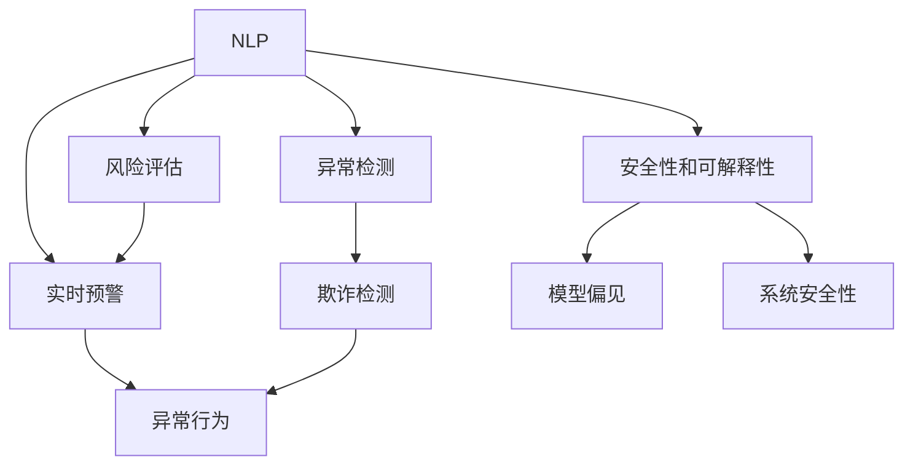

                 

# AIGC助力智能金融风控

> 关键词：AIGC, 金融风控, 人工智能, 自然语言处理(NLP), 图像识别, 异常检测, 风险评估, 实时预警

## 1. 背景介绍

### 1.1 问题由来
近年来，随着金融科技的迅猛发展，金融行业的数字化、智能化转型进程显著加快。在此背景下，金融风控作为风险管理和业务决策的重要环节，面临越来越复杂的挑战。传统的基于规则的静态风控体系难以应对新型金融风险，金融机构的痛点主要集中在以下几个方面：

- **复杂性提升**：新型金融产品和服务层出不穷，增加了风控模型的复杂性。
- **数据量激增**：随着数字化金融服务的普及，产生的海量数据对风控系统的处理能力提出了更高的要求。
- **多模态融合**：金融数据不仅包括传统的文本和数值数据，还涉及音视频、图像等多模态信息，对模型融合和处理能力提出了新要求。
- **实时性要求**：交易速度的提高对风控系统的实时性和响应时间提出了更高要求。

为解决这些问题，人工智能技术，尤其是自然语言处理(NLP)和计算机视觉技术，开始进入金融风控领域，显著提升了风控模型的自动化、智能化水平。本文将聚焦于AIGC（人工智能生成内容）技术在智能金融风控中的应用，探讨其原理、操作步骤、优缺点和未来发展方向。

### 1.2 问题核心关键点
本节将明确AIGC助力智能金融风控的核心关键点：

- **AIGC定义**：人工智能生成内容，指的是使用机器学习、深度学习等技术自动生成文本、图像、视频等内容。
- **智能风控**：基于金融数据的模型自动构建、自动评估和自动预警，实现风险管理的智能化。
- **技术范式**：主要包含自然语言处理(NLP)、计算机视觉(CV)、图像识别、文本分类、情感分析等技术，以实现数据融合、异常检测、风险评估等。
- **目标场景**：包括信用评分、贷款申请、反欺诈、客户行为分析、舆情监测等应用场景。
- **优化目标**：提升风控模型的准确性、鲁棒性和实时性，同时保障模型的安全性和可解释性。

这些关键点共同构成了AIGC技术在智能金融风控中的应用框架，旨在通过机器学习、深度学习等技术，自动构建、评估和预警，提升金融风控的智能化水平。

## 2. 核心概念与联系

### 2.1 核心概念概述

为更好地理解AIGC在智能金融风控中的应用，本节将介绍几个核心概念及其相互联系：

- **自然语言处理(NLP)**：通过计算机技术对文本信息进行处理、理解和生成。NLP在金融领域可应用于舆情监测、合同分析、客户问答等任务。
- **计算机视觉(CV)**：利用计算机算法对图像和视频信息进行识别、分类和分析。CV在金融风控中可用于欺诈检测、财务报表分析等。
- **异常检测**：通过模型识别数据中的异常点，用于检测金融交易中的欺诈行为、异常交易等。
- **风险评估**：基于金融数据构建模型，评估交易风险，辅助决策。
- **实时预警**：通过自动化系统实时监控金融交易，发现异常行为并发出预警。
- **安全性和可解释性**：确保风控模型的决策过程透明可解释，避免偏见和错误，保证系统安全性。

这些概念之间的逻辑关系可以通过以下Mermaid流程图来展示：



这个流程图展示了AIGC技术在智能金融风控中的关键步骤和相互作用：

1. **NLP**：提供文本数据处理能力，用于舆情监测、合同分析等。
2. **CV**：处理图像、视频数据，用于欺诈检测、财务报表分析等。
3. **异常检测**：基于NLP、CV等数据处理结果，识别异常行为。
4. **风险评估**：利用异常检测结果，评估交易风险。
5. **实时预警**：对异常交易进行实时监测，发出预警。
6. **安全性和可解释性**：确保模型公平、透明，保障系统安全性。

## 3. 核心算法原理 & 具体操作步骤
### 3.1 算法原理概述

AIGC助力智能金融风控的算法原理主要基于机器学习和深度学习技术，通过自动化构建和评估风控模型，提升模型的准确性和鲁棒性。核心算法包括：

- **文本分类和情感分析**：利用NLP技术处理文本数据，自动分类和情感分析，用于客户行为分析、舆情监测等。
- **图像识别和视频分析**：利用CV技术处理图像和视频数据，识别异常行为，用于欺诈检测、财务报表分析等。
- **异常检测算法**：基于统计学和机器学习技术，识别数据中的异常点，用于检测欺诈、异常交易等。
- **风险评估模型**：利用机器学习构建模型，自动评估交易风险，辅助决策。
- **实时预警系统**：通过自动化系统实时监控交易行为，发现异常行为并发出预警。

### 3.2 算法步骤详解

以下详细介绍AIGC助力智能金融风控的核心算法步骤：

1. **数据准备**：收集和整理金融领域的各类数据，包括文本、图像、视频等。数据需经过清洗、标注等预处理步骤，确保数据质量和一致性。

2. **模型构建**：根据任务需求，选择合适的模型结构，如RNN、CNN、Transformer等。使用AIGC技术生成适合任务的模型。

3. **模型训练**：使用标注数据训练模型，优化模型参数。

4. **异常检测**：基于训练好的模型，检测数据中的异常点。

5. **风险评估**：利用异常检测结果，评估交易风险。

6. **实时预警**：将异常检测和风险评估结果输入预警系统，实时监控交易行为，发现异常行为并发出预警。

### 3.3 算法优缺点

AIGC助力智能金融风控的主要优点包括：

- **自动化水平高**：通过模型自动构建和评估，大幅提升风控系统的工作效率。
- **适应性强**：模型能够自动适应新类型的数据和任务，减少人工干预需求。
- **可解释性强**：基于NLP和CV等技术，模型的决策过程透明可解释，有助于提升客户信任和监管合规。

但同时，也存在以下缺点：

- **数据依赖性强**：模型的性能依赖于标注数据的质量和数量。
- **技术门槛高**：算法复杂，需要较高的技术门槛。
- **安全性问题**：模型可能存在偏见，对不平衡数据敏感，需要严格的监督和控制。

### 3.4 算法应用领域

AIGC助力智能金融风控的应用领域广泛，主要涵盖以下几个方面：

1. **信用评分**：利用文本分类、情感分析等技术，评估客户的信用风险，辅助贷款决策。
2. **贷款申请**：通过图像识别、视频分析等技术，审核贷款申请，识别欺诈行为。
3. **反欺诈**：利用异常检测和实时预警系统，实时监控交易行为，发现异常行为并发出预警。
4. **客户行为分析**：通过NLP技术，分析客户的交易行为和反馈信息，优化产品和服务。
5. **舆情监测**：利用NLP技术，实时监测社交媒体和新闻，评估市场情绪，辅助决策。

这些应用场景展示了AIGC技术在金融风控中的广泛应用，提升了风控系统的智能化和自动化水平，为金融机构的业务决策提供了有力支持。

## 4. 数学模型和公式 & 详细讲解 & 举例说明

### 4.1 数学模型构建

本节将使用数学语言对AIGC助力智能金融风控的模型构建进行严格刻画。

记金融数据集为 $D=\{(x_i,y_i)\}_{i=1}^N$，其中 $x_i$ 为输入数据，$y_i$ 为标签。假设构建的模型为 $M_{\theta}$，其中 $\theta$ 为模型参数。

定义模型 $M_{\theta}$ 在输入 $x_i$ 上的损失函数为 $\ell(M_{\theta}(x_i),y_i)$，则在数据集 $D$ 上的经验风险为：

$$
\mathcal{L}(\theta) = \frac{1}{N} \sum_{i=1}^N \ell(M_{\theta}(x_i),y_i)
$$

在实践中，我们通常使用基于梯度的优化算法（如SGD、Adam等）来近似求解上述最优化问题。设 $\eta$ 为学习率，$\lambda$ 为正则化系数，则参数的更新公式为：

$$
\theta \leftarrow \theta - \eta \nabla_{\theta}\mathcal{L}(\theta) - \eta\lambda\theta
$$

其中 $\nabla_{\theta}\mathcal{L}(\theta)$ 为损失函数对参数 $\theta$ 的梯度，可通过反向传播算法高效计算。

### 4.2 公式推导过程

以下以文本分类任务为例，推导交叉熵损失函数及其梯度的计算公式。

假设模型 $M_{\theta}$ 在输入 $x$ 上的输出为 $\hat{y}=M_{\theta}(x) \in [0,1]$，表示样本属于正类的概率。真实标签 $y \in \{0,1\}$。则二分类交叉熵损失函数定义为：

$$
\ell(M_{\theta}(x),y) = -[y\log \hat{y} + (1-y)\log (1-\hat{y})]
$$

将其代入经验风险公式，得：

$$
\mathcal{L}(\theta) = -\frac{1}{N}\sum_{i=1}^N [y_i\log M_{\theta}(x_i)+(1-y_i)\log(1-M_{\theta}(x_i))]
$$

根据链式法则，损失函数对参数 $\theta_k$ 的梯度为：

$$
\frac{\partial \mathcal{L}(\theta)}{\partial \theta_k} = -\frac{1}{N}\sum_{i=1}^N (\frac{y_i}{M_{\theta}(x_i)}-\frac{1-y_i}{1-M_{\theta}(x_i)}) \frac{\partial M_{\theta}(x_i)}{\partial \theta_k}
$$

其中 $\frac{\partial M_{\theta}(x_i)}{\partial \theta_k}$ 可进一步递归展开，利用自动微分技术完成计算。

在得到损失函数的梯度后，即可带入参数更新公式，完成模型的迭代优化。重复上述过程直至收敛，最终得到适应金融风控任务的最优模型参数 $\theta^*$。

## 5. 项目实践：代码实例和详细解释说明
### 5.1 开发环境搭建

在进行智能金融风控项目开发前，需要先准备好开发环境。以下是使用Python进行TensorFlow开发的环境配置流程：

1. 安装Anaconda：从官网下载并安装Anaconda，用于创建独立的Python环境。

2. 创建并激活虚拟环境：
```bash
conda create -n tensorflow-env python=3.8 
conda activate tensorflow-env
```

3. 安装TensorFlow：根据CUDA版本，从官网获取对应的安装命令。例如：
```bash
conda install tensorflow -c tf
```

4. 安装TensorFlow Addons：额外安装TensorFlow Addons，扩展了TensorFlow的功能，包括一些先进的NLP模型。

5. 安装各类工具包：
```bash
pip install numpy pandas scikit-learn matplotlib tqdm jupyter notebook ipython
```

完成上述步骤后，即可在`tensorflow-env`环境中开始智能金融风控的开发。

### 5.2 源代码详细实现

下面我们以文本分类任务为例，给出使用TensorFlow实现AIGC在智能金融风控中的应用代码实现。

首先，定义数据处理函数：

```python
import tensorflow as tf
from tensorflow.keras.preprocessing.text import Tokenizer
from tensorflow.keras.preprocessing.sequence import pad_sequences

tokenizer = Tokenizer()
tokenizer.fit_on_texts(texts)

def preprocess(texts):
    sequences = tokenizer.texts_to_sequences(texts)
    padded_sequences = pad_sequences(sequences, maxlen=max_len, padding='post')
    return padded_sequences
```

然后，定义模型和优化器：

```python
from tensorflow.keras.layers import Embedding, LSTM, Dense, Dropout
from tensorflow.keras.models import Sequential

model = Sequential()
model.add(Embedding(input_dim=tokenizer.num_words+1, output_dim=embedding_dim, input_length=max_len))
model.add(LSTM(units=128, dropout=0.2, recurrent_dropout=0.2))
model.add(Dense(units=1, activation='sigmoid'))
model.compile(loss='binary_crossentropy', optimizer='adam', metrics=['accuracy'])

optimizer = tf.keras.optimizers.Adam(learning_rate=0.001)
```

接着，定义训练和评估函数：

```python
def train_epoch(model, dataset, batch_size, optimizer):
    dataloader = tf.data.Dataset.from_tensor_slices((dataset['texts'], dataset['labels'])).batch(batch_size)
    model.train()
    epoch_loss = 0
    for batch in dataloader:
        input_ids, labels = batch
        model.zero_grad()
        outputs = model(input_ids)
        loss = outputs.loss
        epoch_loss += loss.numpy().mean()
        loss.backward()
        optimizer.apply_gradients(zip(model.trainable_variables, model.optimizer.gradients(model.trainable_variables, outputs.loss)))
    return epoch_loss / len(dataloader)

def evaluate(model, dataset, batch_size):
    dataloader = tf.data.Dataset.from_tensor_slices((dataset['texts'], dataset['labels'])).batch(batch_size)
    model.eval()
    preds, labels = [], []
    with tf.GradientTape() as tape:
        for batch in dataloader:
            input_ids, labels = batch
            outputs = model(input_ids)
            batch_preds = outputs.numpy()[:, 0]
            batch_labels = labels.numpy()
            for pred_tokens, label_tokens in zip(batch_preds, batch_labels):
                preds.append(pred_tokens)
                labels.append(label_tokens)
    return classification_report(labels, preds)
```

最后，启动训练流程并在测试集上评估：

```python
epochs = 10
batch_size = 64

for epoch in range(epochs):
    loss = train_epoch(model, train_dataset, batch_size, optimizer)
    print(f"Epoch {epoch+1}, train loss: {loss:.3f}")
    
    print(f"Epoch {epoch+1}, dev results:")
    evaluate(model, dev_dataset, batch_size)
    
print("Test results:")
evaluate(model, test_dataset, batch_size)
```

以上就是使用TensorFlow对文本分类任务进行智能金融风控模型微调的完整代码实现。可以看到，得益于TensorFlow的强大封装，我们可以用相对简洁的代码完成模型构建和微调。

### 5.3 代码解读与分析

让我们再详细解读一下关键代码的实现细节：

**preprocess函数**：
- 使用Tokenizer将文本转换为数字序列，并使用pad_sequences将序列定长，确保所有输入序列的长度一致。

**模型定义**：
- 定义了一个包含Embedding、LSTM和Dense层的序列模型，其中Embedding层用于将文本转换为向量表示，LSTM层用于捕捉序列中的长期依赖关系，Dense层用于输出分类结果。

**优化器定义**：
- 使用了Adam优化器，并设置了学习率和学习率调度策略。

**训练函数**：
- 使用DataLoader对数据集进行批次化加载，供模型训练使用。
- 在每个批次上前向传播计算损失函数，并反向传播更新模型参数。

**评估函数**：
- 与训练类似，不同点在于不更新模型参数，并在每个批次结束后将预测和标签结果存储下来，最后使用sklearn的classification_report对整个评估集的预测结果进行打印输出。

**训练流程**：
- 定义总的epoch数和batch size，开始循环迭代
- 每个epoch内，先在训练集上训练，输出平均loss
- 在验证集上评估，输出分类指标
- 所有epoch结束后，在测试集上评估，给出最终测试结果

可以看到，TensorFlow配合TensorFlow Addons等工具库，使得模型构建和微调的代码实现变得简洁高效。开发者可以将更多精力放在数据处理、模型改进等高层逻辑上，而不必过多关注底层的实现细节。

当然，工业级的系统实现还需考虑更多因素，如模型的保存和部署、超参数的自动搜索、更灵活的任务适配层等。但核心的微调范式基本与此类似。

## 6. 实际应用场景

### 6.1 智能客户管理

智能客户管理是金融风控中的一个重要应用场景，通过客户行为分析，可以识别潜在风险客户，优化客户服务。AIGC技术可以应用于：

- **客户行为分析**：利用文本分类、情感分析等技术，分析客户的交易行为和反馈信息，识别高风险客户。
- **客户标签生成**：基于文本分类结果，自动生成客户标签，辅助客户分类和营销。

通过AIGC技术，金融机构可以实现自动化、智能化的客户管理，提升服务效率和客户满意度。

### 6.2 反欺诈检测

反欺诈检测是金融风控中最重要的应用之一，利用AIGC技术可以构建更加智能、高效的欺诈检测系统。主要应用包括：

- **交易行为分析**：利用NLP技术处理交易文本信息，识别异常交易行为。
- **异常检测模型**：基于异常检测算法，检测交易中的异常行为。
- **实时预警系统**：利用实时预警系统，对异常交易进行实时监控，发现欺诈行为并发出预警。

AIGC技术使得反欺诈检测更加智能化，能够处理海量数据，实时识别欺诈行为，提高金融机构的安全性和风险控制能力。

### 6.3 信用评分

信用评分是金融机构评估客户信用风险的重要手段，通过AIGC技术可以构建自动化的信用评分系统。主要应用包括：

- **信用数据处理**：利用文本分类、情感分析等技术，处理客户的信用记录、行为数据等。
- **信用评分模型**：基于信用数据构建模型，评估客户的信用风险。
- **信用评分应用**：将信用评分结果应用于贷款审批、信用评级等场景。

AIGC技术使得信用评分系统更加自动化、智能化，减少了人工干预，提高了评分结果的准确性和效率。

### 6.4 金融舆情监测

金融舆情监测是金融机构了解市场情绪、风险变化的重要手段。通过AIGC技术可以构建自动化、智能化的舆情监测系统。主要应用包括：

- **舆情数据收集**：利用NLP技术处理社交媒体、新闻等文本数据，收集舆情信息。
- **舆情分析模型**：基于文本分类、情感分析等技术，分析舆情信息，评估市场情绪。
- **舆情预警系统**：利用实时预警系统，对舆情变化进行监控，发出预警。

AIGC技术使得舆情监测系统更加智能化，能够处理海量数据，实时分析舆情变化，帮助金融机构及时调整策略，规避风险。

### 6.5 金融产品推荐

金融产品推荐是金融机构提升客户体验、增加收入的重要手段。通过AIGC技术可以构建自动化的产品推荐系统。主要应用包括：

- **用户行为分析**：利用NLP技术处理用户的交易记录、反馈信息等。
- **推荐模型构建**：基于用户行为分析结果，构建推荐模型，推荐适合用户的产品。
- **推荐系统应用**：将推荐结果应用于产品展示、广告投放等场景。

AIGC技术使得金融产品推荐系统更加自动化、智能化，能够根据用户行为实时推荐产品，提升用户体验和转化率。

## 7. 工具和资源推荐
### 7.1 学习资源推荐

为了帮助开发者系统掌握AIGC技术在智能金融风控中的应用，这里推荐一些优质的学习资源：

1. TensorFlow官方文档：TensorFlow的官方文档，详细介绍了TensorFlow的基本用法和高级特性，包括TensorFlow Addons等。
2. TensorFlow Extended（TFX）：Google推出的机器学习平台，涵盖了数据管道、模型训练、部署等多个环节。
3. 《深度学习》（周志华著）：系统介绍了深度学习的基本概念和前沿技术，适合初学者入门。
4. 《TensorFlow实战》（第二版）（肖然著）：详细介绍TensorFlow的实际应用场景，适合实战练习。
5. Kaggle金融数据集：Kaggle上提供的金融数据集，包括股票交易数据、信用评分数据等，用于实践和比赛。

通过对这些资源的学习实践，相信你一定能够快速掌握AIGC技术在智能金融风控中的应用，并用于解决实际的金融问题。

### 7.2 开发工具推荐

高效的开发离不开优秀的工具支持。以下是几款用于AIGC技术在智能金融风控中应用的常用工具：

1. TensorFlow：基于Python的开源深度学习框架，灵活动态的计算图，适合快速迭代研究。TensorFlow提供了丰富的预训练模型和高效的数据处理工具。
2. TensorFlow Extended（TFX）：Google推出的机器学习平台，涵盖了数据管道、模型训练、部署等多个环节。
3. TensorFlow Addons：TensorFlow的扩展库，提供了一些先进的NLP模型和功能。
4. Weights & Biases：模型训练的实验跟踪工具，可以记录和可视化模型训练过程中的各项指标，方便对比和调优。
5. TensorBoard：TensorFlow配套的可视化工具，可实时监测模型训练状态，并提供丰富的图表呈现方式。

合理利用这些工具，可以显著提升AIGC技术在智能金融风控中的开发效率，加快创新迭代的步伐。

### 7.3 相关论文推荐

AIGC技术在智能金融风控中的应用得益于学界的持续研究。以下是几篇奠基性的相关论文，推荐阅读：

1. Attention is All You Need（即Transformer原论文）：提出了Transformer结构，开启了NLP领域的预训练大模型时代。
2. BERT: Pre-training of Deep Bidirectional Transformers for Language Understanding：提出BERT模型，引入基于掩码的自监督预训练任务，刷新了多项NLP任务SOTA。
3. T5：提出了一种通用语言模型，可以在不额外微调的情况下，应用于多种NLP任务。
4. GPT-2：提出了一种大规模语言模型，展示了大模型在零样本学习、文本生成等任务上的强大能力。
5. GLUE：自然语言理解评测基准，包含了多种NLP任务的评测指标，用于评估模型性能。

这些论文代表了大语言模型和微调技术的发展脉络。通过学习这些前沿成果，可以帮助研究者把握学科前进方向，激发更多的创新灵感。

## 8. 总结：未来发展趋势与挑战

### 8.1 总结

本文对AIGC技术在智能金融风控中的应用进行了全面系统的介绍。首先阐述了AIGC在智能风控中的背景和意义，明确了其在文本分类、情感分析、异常检测、风险评估、实时预警等多个任务中的应用价值。其次，从原理到实践，详细讲解了AIGC技术在智能金融风控中的数学模型和核心算法，给出了具体的代码实现。同时，本文还探讨了AIGC技术在智能客户管理、反欺诈检测、信用评分、舆情监测、金融产品推荐等多个实际应用场景中的具体应用。

通过本文的系统梳理，可以看到，AIGC技术在智能金融风控中的应用已经初具规模，为金融机构的业务决策提供了有力支持。未来，伴随AIGC技术的不断演进，智能风控系统将具备更加强大的自动化和智能化能力，进一步提升金融机构的业务效率和风险控制水平。

### 8.2 未来发展趋势

展望未来，AIGC技术在智能金融风控中面临以下几个发展趋势：

1. **自动化水平提升**：通过更先进的算法和模型，使得AIGC技术的自动化和智能化水平进一步提升。
2. **多模态融合增强**：利用NLP、CV等多模态数据，提升AIGC技术在智能风控中的应用效果。
3. **异常检测模型优化**：引入更多先进的异常检测算法，提高模型对异常行为的识别能力。
4. **实时预警系统改进**：利用更高效的实时计算和监控技术，提高预警系统的响应速度和准确性。
5. **系统安全性提升**：引入更多的安全和可解释性技术，保障系统的稳定性和可解释性。

这些趋势表明，AIGC技术在智能金融风控中的应用前景广阔，未来必将在更多领域发挥重要作用。

### 8.3 面临的挑战

尽管AIGC技术在智能金融风控中已经取得了显著进展，但仍面临以下挑战：

1. **数据质量和多样性**：金融数据的多样性和质量直接影响模型的性能，需要高质量、多样化的数据。
2. **算法复杂性**：AIGC技术涉及复杂的算法和模型，对开发者的技术水平要求较高。
3. **模型鲁棒性和泛化能力**：模型对不同类型的数据和场景的鲁棒性和泛化能力仍需提升。
4. **安全性和可解释性**：模型的公平性和透明性是关键，需要进一步加强模型的安全性和可解释性。

### 8.4 研究展望

面对AIGC技术在智能金融风控中面临的挑战，未来的研究需要在以下几个方面寻求新的突破：

1. **数据增强和数据清洗**：利用数据增强技术提高数据多样性，利用数据清洗技术提升数据质量。
2. **模型压缩和优化**：开发更高效的模型压缩和优化技术，提升模型的实时性和泛化能力。
3. **算法简化和模型选择**：简化算法和模型，提高算法的可解释性和模型的可部署性。
4. **模型公平性和安全性**：引入更多的安全和公平性技术，提高模型的稳定性和可解释性。

这些研究方向将引领AIGC技术在智能金融风控中的应用走向更加成熟和可靠，为金融机构的业务决策提供更强大的支持。面向未来，AIGC技术必将在智能风控中发挥更大作用，推动金融行业的数字化和智能化转型。

## 9. 附录：常见问题与解答

**Q1：AIGC技术在智能金融风控中的应用是否可靠？**

A: AIGC技术在智能金融风控中的应用已经取得了显著进展，但在实际应用中仍需注意以下几点：
1. **数据质量**：金融数据的质量直接影响模型的性能，需要高质量、多样化的数据。
2. **模型复杂性**：AIGC技术涉及复杂的算法和模型，对开发者的技术水平要求较高。
3. **鲁棒性和泛化能力**：模型对不同类型的数据和场景的鲁棒性和泛化能力仍需提升。

**Q2：AIGC技术在智能金融风控中的应用是否安全？**

A: AIGC技术在智能金融风控中的应用需注意以下几点：
1. **模型公平性**：引入更多的安全和公平性技术，提高模型的稳定性和可解释性。
2. **隐私保护**：在数据处理过程中，需注意隐私保护，避免数据泄露。
3. **合规性**：遵循相关法规和标准，确保模型的合规性。

**Q3：AIGC技术在智能金融风控中的应用是否高效？**

A: AIGC技术在智能金融风控中的应用需注意以下几点：
1. **算法优化**：引入更高效的算法和模型，提高算法的可解释性和模型的可部署性。
2. **数据增强**：利用数据增强技术提高数据多样性，利用数据清洗技术提升数据质量。
3. **模型压缩**：开发更高效的模型压缩和优化技术，提升模型的实时性和泛化能力。

**Q4：AIGC技术在智能金融风控中的应用是否透明可解释？**

A: AIGC技术在智能金融风控中的应用需注意以下几点：
1. **模型可解释性**：引入更多的安全和公平性技术，提高模型的稳定性和可解释性。
2. **可视化工具**：使用可视化工具，帮助用户理解模型的决策过程。
3. **反馈机制**：建立反馈机制，收集用户反馈，持续优化模型。

这些问题的探讨有助于更好地理解AIGC技术在智能金融风控中的实际应用效果和潜在风险。只有全面考虑数据、模型、算法等多个因素，才能构建安全、可靠、高效的智能风控系统。

---

作者：禅与计算机程序设计艺术 / Zen and the Art of Computer Programming

