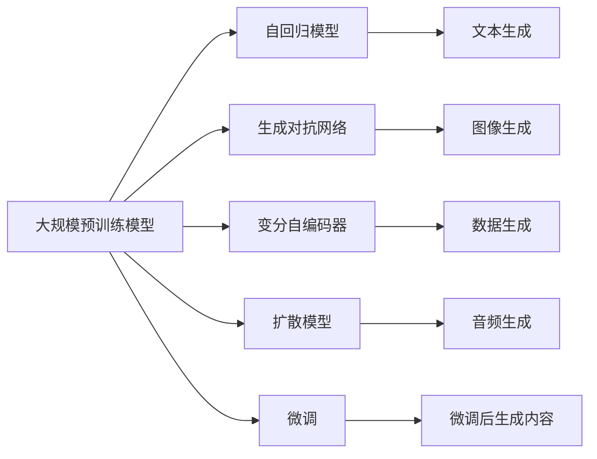

                 

# AIGC技术演进路线图

在信息科技的飞速发展下，人工智能生成内容（AIGC）技术正成为推动媒体、娱乐、教育等诸多行业变革的关键力量。本文将系统回顾AIGC技术从萌芽到成熟的演进历程，并展望未来发展方向，旨在为读者提供全面、深入的技术视角和应用洞见。

## 1. 背景介绍

### 1.1 问题由来

AIGC技术的出现和发展，源于计算机图形学、自然语言处理、语音识别和机器学习等领域的技术进步。尤其是深度学习技术的突破，使得计算机具备了自动分析和生成内容的能力，AIGC技术应运而生。近年来，AIGC技术在图像、视频、音频、文本等多种生成内容的应用中取得了显著进展，逐步从实验室研究走向商业化应用。

### 1.2 问题核心关键点

AIGC技术涉及的关键问题包括：
- **数据驱动**：AIGC模型的生成质量高度依赖于训练数据的质量和多样性。
- **算法优化**：如何设计高效的生成算法，提高生成内容的连贯性和真实感。
- **计算资源**：生成高质量内容需要庞大的计算资源支持，包括GPU、TPU等硬件。
- **应用场景**：AIGC技术在多个领域的应用场景，如新闻报道、影视制作、虚拟主播等。
- **伦理和安全**：确保生成内容的安全性、合法性，避免误导信息传播。

### 1.3 问题研究意义

AIGC技术的演进，不仅提升了内容生成的自动化水平，还推动了各行各业的数字化转型。通过AIGC技术，用户能够更快速、高效地生产高质量内容，降低人力和时间成本，同时也为创意工作者提供了无限可能的创作空间。此外，AIGC技术的应用还促进了信息传播方式的变化，增强了用户体验，具有广泛的市场前景和社会价值。

## 2. 核心概念与联系

### 2.1 核心概念概述

AIGC技术涉及多个核心概念，包括但不限于：

- **生成对抗网络（GANs）**：一种通过两个神经网络对抗训练生成图像、音频等内容的深度学习框架。
- **变分自编码器（VAEs）**：通过学习数据分布，生成新的样本数据。
- **自回归模型（AR）**：根据已有文本生成新的文本内容，如语言模型。
- **扩散模型（Diffusion Models）**：通过时间步长的迭代过程生成高质量图像和音频。
- **大规模预训练模型（如GPT、BERT）**：通过海量数据预训练，用于内容生成和微调。

### 2.2 核心概念原理和架构的 Mermaid 流程图



此图表展示了AIGC技术中各核心概念及其联系。大规模预训练模型（A）通过自回归模型（B）生成文本内容，生成对抗网络（C）用于生成图像，变分自编码器（D）用于生成数据，扩散模型（E）用于生成音频。微调（J）过程用于提升模型在特定任务上的生成效果。

## 3. 核心算法原理 & 具体操作步骤

### 3.1 算法原理概述

AIGC技术的核心算法原理包括但不限于生成对抗网络（GANs）、变分自编码器（VAEs）和自回归模型（AR）等。这些算法通过不同的机制生成高质量的内容。

- **生成对抗网络（GANs）**：由生成器和判别器两部分组成，通过对抗训练的方式生成逼真的图像和音频内容。
- **变分自编码器（VAEs）**：通过学习数据的潜在分布，生成新的数据样本，常用于图像生成任务。
- **自回归模型（AR）**：利用已有文本信息预测下一个单词，生成连贯的文本内容。

### 3.2 算法步骤详解

以生成对抗网络（GANs）为例，具体步骤包括：

1. **定义模型**：生成器和判别器分别定义，生成器目标是生成逼真的图像或音频，判别器的目标是区分真实数据和生成数据。
2. **初始化参数**：生成器和判别器初始化参数。
3. **对抗训练**：通过生成器生成假数据，判别器判别真伪，然后调整生成器和判别器的参数。
4. **优化过程**：生成器生成大量假数据，判别器不断更新参数，直到生成数据难以被区分。

### 3.3 算法优缺点

AIGC技术的主要优点包括：
- **自动化生成**：大规模自动生成内容，提高效率。
- **多样性**：能够生成多种类型的内容，丰富表达方式。
- **成本低**：相对于人工创作，成本较低。

主要缺点包括：
- **质量不稳定**：生成内容质量受训练数据影响大，不稳定。
- **生成速度慢**：生成高质量内容需要大量计算资源和时间。
- **缺乏创造力**：生成内容可能缺乏原创性，依赖数据和模型。

### 3.4 算法应用领域

AIGC技术在多个领域得到了广泛应用，具体包括：

- **娱乐与游戏**：影视制作、动画制作、虚拟主播等。
- **媒体与广告**：自动生成新闻、广告文案、图片等。
- **教育与培训**：自动生成教学视频、学习材料等。
- **医疗与健康**：生成医疗图像、模拟病历等。
- **商业与金融**：自动生成市场分析报告、金融新闻等。

## 4. 数学模型和公式 & 详细讲解 & 举例说明

### 4.1 数学模型构建

以生成对抗网络（GANs）为例，假设生成器为$G(z)$，判别器为$D(x)$。目标函数为$V(G, D)$。生成器的目标是最大化生成数据被误认为真实数据的概率，判别器的目标是最大化区分真实数据和生成数据的概率。目标函数定义为：

$$
V(G, D) = \mathbb{E}_{x\sim p_{data}}[logD(x)] + \mathbb{E}_{z\sim p_{z}}[log(1-D(G(z)))]
$$

### 4.2 公式推导过程

GANs的推导过程涉及梯度下降和对抗训练。假设生成器和判别器的损失函数分别为$L_G$和$L_D$，通过反向传播更新模型参数，得到更新公式：

$$
\frac{\partial L_G}{\partial G} = \nabla_G \mathbb{E}_{z\sim p_{z}}[log(1-D(G(z)))]
$$
$$
\frac{\partial L_D}{\partial D} = \nabla_D \mathbb{E}_{x\sim p_{data}}[logD(x)] + \mathbb{E}_{z\sim p_{z}}[log(1-D(G(z))))
$$

通过迭代优化这两个损失函数，生成器和判别器的参数逐渐优化，生成高质量的样本数据。

### 4.3 案例分析与讲解

假设生成器$G(z)$为卷积神经网络（CNN），判别器$D(x)$为全连接神经网络（FCN）。具体推导过程为：

1. 定义损失函数$L_G$和$L_D$。
2. 计算梯度$\frac{\partial L_G}{\partial G}$和$\frac{\partial L_D}{\partial D}$。
3. 利用反向传播算法，更新生成器和判别器的参数。
4. 不断迭代，直到生成数据难以被区分。

## 5. 项目实践：代码实例和详细解释说明

### 5.1 开发环境搭建

搭建AIGC项目开发环境，需要安装必要的Python库和框架，如TensorFlow、PyTorch、Keras等。建议使用Anaconda环境管理工具，创建虚拟环境，安装所需的库和依赖。

### 5.2 源代码详细实现

以下是一个简单的GANs代码示例，使用TensorFlow框架实现图像生成：

```python
import tensorflow as tf

class Generator(tf.keras.Model):
    def __init__(self):
        super(Generator, self).__init__()
        self.dense = tf.keras.layers.Dense(256, input_dim=100)
        self.reshape = tf.keras.layers.Reshape((7, 7, 256))
        self.conv1 = tf.keras.layers.Conv2DTranspose(128, (5, 5), strides=(1, 1), padding='same')
        self.conv2 = tf.keras.layers.Conv2DTranspose(64, (5, 5), strides=(2, 2), padding='same')
        self.conv3 = tf.keras.layers.Conv2DTranspose(1, (5, 5), strides=(2, 2), padding='same', activation='tanh')

    def call(self, x):
        x = self.dense(x)
        x = self.reshape(x)
        x = self.conv1(x)
        x = self.conv2(x)
        x = self.conv3(x)
        return x

class Discriminator(tf.keras.Model):
    def __init__(self):
        super(Discriminator, self).__init__()
        self.conv1 = tf.keras.layers.Conv2D(64, (5, 5), strides=(2, 2), padding='same')
        self.conv2 = tf.keras.layers.Conv2D(128, (5, 5), strides=(2, 2), padding='same')
        self.flatten = tf.keras.layers.Flatten()
        self.dense = tf.keras.layers.Dense(1)

    def call(self, x):
        x = self.conv1(x)
        x = self.conv2(x)
        x = self.flatten(x)
        x = self.dense(x)
        return x

# 构建生成器和判别器
gen = Generator()
disc = Discriminator()

# 定义损失函数
def loss_fn(disc, gen, real_data):
    real_loss = tf.reduce_mean(tf.log(disc(real_data)))
    fake_data = gen(tf.random.normal([32, 100]))
    fake_loss = tf.reduce_mean(tf.log(1 - disc(fake_data)))
    total_loss = real_loss + fake_loss
    return total_loss

# 定义优化器
optimizer_G = tf.keras.optimizers.Adam(learning_rate=0.0002)
optimizer_D = tf.keras.optimizers.Adam(learning_rate=0.0002)

# 训练过程
for epoch in range(1000):
    with tf.GradientTape() as tape_G:
        generated_data = gen(tf.random.normal([32, 100]))
        real_data = tf.random.normal([32, 28, 28, 1])
        loss_G = loss_fn(disc, gen, real_data)
    grads_G = tape_G.gradient(loss_G, gen.trainable_variables)
    optimizer_G.apply_gradients(zip(grads_G, gen.trainable_variables))

    with tf.GradientTape() as tape_D:
        real_data = tf.random.normal([32, 28, 28, 1])
        loss_D_real = tf.reduce_mean(tf.log(disc(real_data)))
        fake_data = gen(tf.random.normal([32, 100]))
        loss_D_fake = tf.reduce_mean(tf.log(1 - disc(fake_data)))
        loss_D = loss_D_real + loss_D_fake
    grads_D = tape_D.gradient(loss_D, disc.trainable_variables)
    optimizer_D.apply_gradients(zip(grads_D, disc.trainable_variables))

    if epoch % 50 == 0:
        print("Epoch:", epoch, "Loss:", loss_G, "Fake Loss:", loss_D_fake, "Real Loss:", loss_D_real)
```

### 5.3 代码解读与分析

上述代码展示了如何使用TensorFlow实现GANs。首先定义生成器和判别器模型，然后定义损失函数，并使用Adam优化器进行训练。在每个epoch中，生成器生成假数据，判别器分别判别真实数据和生成数据，然后通过梯度下降更新模型参数，交替优化生成器和判别器。

## 6. 实际应用场景

### 6.1 娱乐与游戏

在影视制作中，AIGC技术可以自动生成背景、特效和角色动作，大幅降低制作成本。虚拟主播和虚拟偶像通过AIGC技术生成实时语音和面部表情，为观众带来沉浸式的观影体验。

### 6.2 媒体与广告

AIGC技术可以自动生成新闻摘要、广告文案等，提高内容生产效率，降低人工成本。通过自动生成图像和视频，AIGC技术可以用于广告素材的制作，增强广告的吸引力和感染力。

### 6.3 教育与培训

在教育领域，AIGC技术可以生成虚拟教师、虚拟实验和互动游戏，增强学生的学习体验。在线教育平台可以使用AIGC技术自动生成教学视频和互动内容，满足不同学习者的需求。

### 6.4 医疗与健康

医疗影像生成是AIGC技术的重要应用之一。通过生成虚拟的CT、MRI等医学影像，AIGC技术可以为医生提供更多诊断依据。自动生成病历和医疗报告，提高医疗文档的生成效率。

### 6.5 商业与金融

AIGC技术可以自动生成市场分析报告、新闻和金融评论，提高媒体和分析师的工作效率。通过自动生成金融新闻，AIGC技术可以增强信息传播的时效性和广泛性。

### 6.6 未来应用展望

未来，AIGC技术将进一步扩展其应用领域，预计会有以下趋势：

- **多模态生成**：结合文本、图像、视频和音频等多模态数据，生成更加丰富的内容。
- **实时生成**：通过边缘计算和硬件加速，实现实时生成高质量内容。
- **个性化生成**：根据用户偏好和行为数据，生成个性化内容。
- **可解释性增强**：提高生成内容的可解释性，便于用户理解和接受。

## 7. 工具和资源推荐

### 7.1 学习资源推荐

- **Deep Learning Specialization by Andrew Ng**：斯坦福大学推出的深度学习课程，系统介绍深度学习原理和AIGC技术。
- **Generative Adversarial Nets by Ian Goodfellow**：GANs论文作者的作品，详细讲解GANs的原理和应用。
- **The Unreasonable Effectiveness of Transfer Learning in Natural Language Processing**：探讨预训练模型和微调技术在NLP中的应用。

### 7.2 开发工具推荐

- **TensorFlow**：Google推出的深度学习框架，支持GPU和TPU加速。
- **PyTorch**：Facebook开发的深度学习框架，灵活性高，社区活跃。
- **JAX**：谷歌开发的基于Python的自动微分库，支持高效计算和分布式训练。

### 7.3 相关论文推荐

- **Generative Adversarial Nets**：Ian Goodfellow等人发表的GANs开创性论文，详细讲解GANs的原理和算法。
- **Learning Deep Architectures for AI**：Hinton等人提出的深度学习模型，奠定了深度学习的基础。
- **Attention Is All You Need**：Vaswani等人发表的Transformer论文，开启了自注意力机制在语言模型中的应用。

## 8. 总结：未来发展趋势与挑战

### 8.1 研究成果总结

AIGC技术在多个领域取得了显著进展，包括影视制作、自动新闻生成、虚拟主播等。预训练模型和微调技术的应用，使得AIGC技术能够高效生成高质量内容，推动各行各业的数字化转型。

### 8.2 未来发展趋势

未来，AIGC技术将呈现出以下几个趋势：

- **多模态融合**：结合多种模态数据，生成更丰富、更真实的内容。
- **实时生成**：通过边缘计算和硬件加速，实现实时生成高质量内容。
- **个性化推荐**：根据用户偏好和行为数据，生成个性化内容，提升用户体验。
- **可解释性增强**：提高生成内容的可解释性，增强用户信任度。

### 8.3 面临的挑战

尽管AIGC技术取得了显著进展，但仍面临以下挑战：

- **数据质量**：高质量数据的获取和标注是生成高质量内容的前提。
- **计算资源**：生成高质量内容需要大量计算资源和时间。
- **伦理和安全**：生成内容可能存在伦理风险和安全隐患。

### 8.4 研究展望

未来的研究方向包括：

- **模型优化**：提高生成内容的连贯性和真实感，降低计算资源消耗。
- **多模态生成**：结合多种模态数据，生成更丰富、更真实的内容。
- **可解释性增强**：提高生成内容的可解释性，增强用户信任度。

## 9. 附录：常见问题与解答

**Q1：如何提升AIGC生成内容的质量？**

A: 提升AIGC生成内容质量，可以从以下几个方面着手：

- **数据质量**：确保训练数据的多样性和高质量，避免偏差和噪声。
- **模型优化**：优化生成器、判别器和解码器，提高生成内容的连贯性和真实感。
- **计算资源**：使用更高效的算法和硬件加速，降低生成时间。

**Q2：AIGC技术在各个领域的应用前景如何？**

A: AIGC技术在多个领域具有广泛的应用前景，具体包括：

- **娱乐与游戏**：自动生成背景、特效和角色动作，降低制作成本。
- **媒体与广告**：自动生成新闻摘要、广告文案等，提高内容生产效率。
- **教育与培训**：生成虚拟教师、虚拟实验和互动游戏，增强学生学习体验。
- **医疗与健康**：自动生成医学影像和病历报告，提高医疗文档生成效率。
- **商业与金融**：自动生成市场分析报告和金融新闻，提高信息传播的时效性和广泛性。

**Q3：AIGC技术的伦理和安全问题有哪些？**

A: AIGC技术的伦理和安全问题主要包括以下几个方面：

- **内容真实性**：生成内容可能存在虚假信息，误导用户。
- **版权问题**：生成内容可能侵犯版权，引发法律纠纷。
- **隐私保护**：生成内容可能泄露用户隐私，侵犯个人隐私权。

**Q4：AIGC技术的发展方向有哪些？**

A: AIGC技术的发展方向包括：

- **多模态融合**：结合文本、图像、视频和音频等多模态数据，生成更加丰富的内容。
- **实时生成**：通过边缘计算和硬件加速，实现实时生成高质量内容。
- **个性化生成**：根据用户偏好和行为数据，生成个性化内容。
- **可解释性增强**：提高生成内容的可解释性，增强用户信任度。

---

作者：禅与计算机程序设计艺术 / Zen and the Art of Computer Programming

