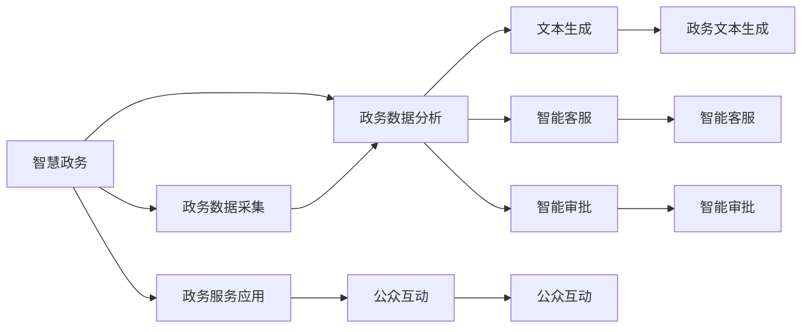

                 

# AIGC推动智慧政务发展

## 1. 背景介绍

随着人工智能(AI)技术的飞速发展，人工智能生成内容(AIGC)正在成为推动各行各业数字化转型的重要力量。在智慧政务领域，AIGC技术的引入，不仅有助于提升政府服务的智能化水平，还为公众提供了更为便捷、高效、透明的政务服务体验。本节将首先对智慧政务和AIGC技术进行背景介绍，明确它们之间的关联与互动。

### 1.1 智慧政务

智慧政务（Smart Government）是利用信息通信技术（ICT），整合各类政务资源，构建数字化、智能化、协同化的政务服务体系。其主要目标包括提升政务效率、降低行政成本、提高服务质量、增强公共参与度等。智慧政务通过数据驱动、协同共治，推动政务流程再造，提升政府治理能力和服务水平，满足公众日益增长的公共服务需求。

智慧政务的建设离不开数据和技术的支撑。数据作为政府决策和管理的核心资源，需要有效整合和管理。技术则贯穿于数据收集、处理、分析、应用的各个环节，支撑着智慧政务的各个应用场景，如政务信息公开、在线审批、智能客服、智能审批等。

### 1.2 AIGC技术

人工智能生成内容(AIGC)，又称为生成对抗网络（GAN），指的是利用深度学习模型生成具有真实度、多样性、可解释性的文本、音频、图像等内容的AI技术。AIGC技术通过自然语言处理（NLP）、语音识别、计算机视觉等技术，可以实现文本生成、语音合成、图像生成等多种应用场景，极大地丰富了人类对AI技术的想象和应用。

AIGC技术在智慧政务中的应用，可以将AI技术与政府服务深度结合，提升政务服务的智能化水平，构建智能化的政府服务体系。利用AIGC技术，可以实现自动化的政务文本生成、智能客服、智能审批等功能，提升政务服务的效率和质量，满足公众的个性化需求。

## 2. 核心概念与联系

### 2.1 核心概念概述

AIGC与智慧政务之间的联系主要体现在以下几个方面：

- **政务文本生成**：利用AIGC技术，可以自动生成各类政务文本，如公告、通知、建议等，减少人工编写的工作量，提升政务文本的生成速度和准确性。
- **智能客服**：通过AIGC技术，可以实现智能客服系统的构建，自动处理各类公众咨询，提升公众服务的响应速度和处理效率。
- **智能审批**：利用AIGC技术，可以实现自动化的审批文档生成、审核流程优化等功能，提高审批效率，减少人为错误。
- **政务数据分析**：AIGC技术可以辅助进行政务数据的文本分析、情感分析等，提取有价值的信息，为决策提供支持。
- **公众互动**：通过AIGC技术，可以实现智能化的公众互动，如智能问答、智能推荐等，提升公众对政务服务的满意度和参与度。

### 2.2 核心概念原理和架构的 Mermaid 流程图



## 3. 核心算法原理 & 具体操作步骤

### 3.1 算法原理概述

基于AIGC技术推动智慧政务发展的核心算法原理，主要包括以下几个方面：

- **自然语言处理(NLP)**：利用NLP技术，可以实现对政务文本的自动分析和生成，提升政务文本处理的效率和准确性。
- **生成对抗网络(GAN)**：通过GAN技术，可以实现高质量的文本、语音、图像生成，丰富政务服务的呈现形式。
- **强化学习(RL)**：利用RL技术，可以实现智能客服、智能审批等政务服务流程的优化，提升服务效率和质量。
- **知识图谱(KG)**：通过知识图谱技术，可以实现对政务数据的结构化表示和分析，提供更精准的政务信息服务。

### 3.2 算法步骤详解

基于AIGC技术推动智慧政务发展的算法步骤，主要包括以下几个关键步骤：

**Step 1: 政务数据收集与整合**

- 收集各类政务数据，包括政策文件、法律法规、行政记录、公共服务等，利用数据清洗、数据标注等技术进行数据预处理。
- 利用数据仓库、数据湖等技术进行数据的存储和管理，建立统一的政务数据共享平台。

**Step 2: 政务数据分析与处理**

- 利用NLP技术对政务文本进行自动分析和生成，提取关键信息，构建知识图谱。
- 利用知识图谱技术进行政务数据的结构化表示和分析，提供更有针对性的信息服务。
- 利用深度学习技术对政务数据进行异常检测和预测，提高政务决策的科学性和精准性。

**Step 3: 政务服务应用开发**

- 利用AIGC技术开发智能客服系统，实现自动化的公众咨询处理，提升公众服务的响应速度和效率。
- 利用AIGC技术开发智能审批系统，实现自动化的审批文档生成、审核流程优化等功能，提高审批效率，减少人为错误。
- 利用AIGC技术开发政务文本生成系统，自动生成各类政务文本，减少人工编写的工作量，提升政务文本的生成速度和准确性。

**Step 4: 政务服务效果评估**

- 利用评估指标，如服务响应时间、问题解决率、用户满意度等，评估政务服务的效率和质量。
- 利用AIGC技术生成各类评估报告，提供精准的政务服务分析。
- 利用AIGC技术进行公众反馈的文本分析，提取公众需求和建议，优化政务服务流程。

### 3.3 算法优缺点

基于AIGC技术推动智慧政务发展的算法，具有以下优点：

- **提升政务服务效率**：利用AIGC技术，可以自动化处理大量的政务文本和数据，提升政务服务的效率和质量。
- **丰富政务服务形式**：利用AIGC技术，可以生成高质量的文本、语音、图像等政务内容，丰富政务服务的呈现形式。
- **提升公众满意度**：利用AIGC技术，可以实现智能化的公众互动，提升公众对政务服务的满意度和参与度。

同时，该算法也存在一定的局限性：

- **数据质量依赖**：政务服务的质量高度依赖于政务数据的准确性和完整性，数据质量的提升需要持续的数据治理和技术创新。
- **算法复杂度**：AIGC技术涉及复杂的深度学习模型和算法，需要大量的计算资源和专业知识，对技术实施团队提出了较高的要求。
- **隐私和安全问题**：政务数据的隐私和安全问题需要特别关注，AIGC技术的引入可能会增加数据泄露和滥用的风险。

### 3.4 算法应用领域

基于AIGC技术推动智慧政务发展的算法，已经在多个领域得到了广泛应用：

- **政务信息公开**：利用AIGC技术，可以自动生成各类政务公告、通知等文本内容，提升政务信息公开的效率和透明度。
- **在线审批服务**：利用AIGC技术，可以自动化的生成审批文档、审核流程等内容，提升在线审批的效率和质量。
- **智能客服系统**：利用AIGC技术，可以实现自动化的公众咨询处理，提升公众服务的响应速度和效率。
- **政务数据分析**：利用AIGC技术，可以对政务数据进行自动化的分析和生成，提取有价值的信息，为决策提供支持。
- **公众互动**：利用AIGC技术，可以实现智能化的公众互动，如智能问答、智能推荐等，提升公众对政务服务的满意度和参与度。

## 4. 数学模型和公式 & 详细讲解 & 举例说明

### 4.1 数学模型构建

基于AIGC技术推动智慧政务发展的数学模型，主要包括以下几个方面：

- **文本生成模型**：利用序列到序列（Seq2Seq）模型，如基于Transformer的Seq2Seq模型，对政务文本进行自动生成。
- **智能客服模型**：利用对话生成模型，如基于Transformer的Seq2Seq模型，对公众咨询进行智能响应。
- **智能审批模型**：利用分类器、回归器等模型，对审批流程进行优化和评估。
- **政务数据分析模型**：利用文本分类、情感分析等NLP技术，对政务数据进行分析和生成。

### 4.2 公式推导过程

以文本生成模型为例，推导Seq2Seq模型的训练目标函数：

设政务文本序列为 $X = (x_1, x_2, ..., x_n)$，目标文本序列为 $Y = (y_1, y_2, ..., y_m)$，则Seq2Seq模型的训练目标函数为：

$$
\mathcal{L}(\theta) = -\frac{1}{N} \sum_{i=1}^{N} \sum_{j=1}^{m} \log P(y_j|y_{j-1},y_{j-2},...,y_1)
$$

其中 $P(y_j|y_{j-1},y_{j-2},...,y_1)$ 表示目标文本序列的生成概率，$\theta$ 表示模型的参数。

该目标函数通过最大化目标文本序列的生成概率，优化模型的生成能力。训练过程中，利用最大似然估计（MLE）或变分自编码器（VAE）等技术，最小化目标函数，训练Seq2Seq模型。

### 4.3 案例分析与讲解

**案例一：政务文本生成**

以生成政务公告为例，通过Seq2Seq模型，利用政务数据自动生成各类公告文本。假设政务数据为 $D = (d_1, d_2, ..., d_n)$，其中 $d_i$ 表示第 $i$ 份政务文件。则Seq2Seq模型可以将政务数据作为输入，生成目标文本 $Y = (y_1, y_2, ..., y_m)$，其中 $y_i$ 表示第 $i$ 份公告文本。

训练过程包括两部分：

- **编码器**：将政务数据 $d_i$ 编码成隐状态 $h_i$。
- **解码器**：利用隐状态 $h_i$ 生成目标文本 $y_j$。

训练时，利用交叉熵损失函数 $\mathcal{L}(\theta) = -\frac{1}{N} \sum_{i=1}^{N} \sum_{j=1}^{m} \log P(y_j|y_{j-1},y_{j-2},...,y_1)$ 进行优化。

**案例二：智能客服系统**

以生成智能客服回复为例，通过Seq2Seq模型，利用公众咨询生成智能客服回复。假设公众咨询序列为 $X = (x_1, x_2, ..., x_n)$，智能客服回复序列为 $Y = (y_1, y_2, ..., y_m)$。则Seq2Seq模型可以将公众咨询作为输入，生成智能客服回复。

训练过程包括两部分：

- **编码器**：将公众咨询 $x_i$ 编码成隐状态 $h_i$。
- **解码器**：利用隐状态 $h_i$ 生成智能客服回复 $y_j$。

训练时，利用交叉熵损失函数 $\mathcal{L}(\theta) = -\frac{1}{N} \sum_{i=1}^{N} \sum_{j=1}^{m} \log P(y_j|y_{j-1},y_{j-2},...,y_1)$ 进行优化。

## 5. 项目实践：代码实例和详细解释说明

### 5.1 开发环境搭建

要进行基于AIGC技术推动智慧政务发展的项目实践，首先需要搭建好开发环境。以下是使用Python进行PyTorch开发的环境配置流程：

1. 安装Anaconda：从官网下载并安装Anaconda，用于创建独立的Python环境。

2. 创建并激活虚拟环境：
```bash
conda create -n pytorch-env python=3.8 
conda activate pytorch-env
```

3. 安装PyTorch：根据CUDA版本，从官网获取对应的安装命令。例如：
```bash
conda install pytorch torchvision torchaudio cudatoolkit=11.1 -c pytorch -c conda-forge
```

4. 安装TensorFlow：
```bash
pip install tensorflow
```

5. 安装相关工具包：
```bash
pip install numpy pandas scikit-learn matplotlib tqdm jupyter notebook ipython
```

完成上述步骤后，即可在`pytorch-env`环境中开始项目实践。

### 5.2 源代码详细实现

下面以政务文本生成为例，给出使用PyTorch实现Seq2Seq模型的代码实现。

```python
import torch
import torch.nn as nn
import torch.optim as optim
from torchtext.datasets import Multi30k
from torchtext.data import Field, BucketIterator

# 定义文本字段和数据集
TEXT = Field(tokenize='spacy', include_lengths=True)
LABEL = Field(tokenize='spacy', include_lengths=True)

train_data, valid_data, test_data = Multi30k.splits(TEXT, LABEL)

# 构建数据迭代器
BATCH_SIZE = 64
device = torch.device('cuda' if torch.cuda.is_available() else 'cpu')
train_iterator, valid_iterator, test_iterator = BucketIterator.splits(
    (train_data, valid_data, test_data),
    batch_size=BATCH_SIZE,
    sort_within_batch=True,
    device=device)

# 定义Seq2Seq模型
class Seq2Seq(nn.Module):
    def __init__(self, encoder, decoder, attention):
        super(Seq2Seq, self).__init__()
        self.encoder = encoder
        self.decoder = decoder
        self.attention = attention
    
    def forward(self, src, trg, teacher_forcing_ratio=0.5):
        # 编码器
        src_encoded = self.encoder(src)
        # 解码器
        decoded = self.decoder(trg, src_encoded, self.attention)
        return decoded

# 定义编码器
class Encoder(nn.Module):
    def __init__(self, input_dim, emb_dim, hid_dim, n_layers):
        super(Encoder, self).__init__()
        self.embedding = nn.Embedding(input_dim, emb_dim)
        self.gru = nn.GRU(emb_dim, hid_dim, n_layers, bidirectional=True)
    
    def forward(self, src, src_lengths):
        embedded = self.embedding(src)
        output, hidden = self.gru(embedded, src_lengths)
        return output, hidden

# 定义解码器
class Decoder(nn.Module):
    def __init__(self, output_dim, emb_dim, hid_dim, n_layers):
        super(Decoder, self).__init__()
        self.embedding = nn.Embedding(output_dim, emb_dim)
        self.gru = nn.GRU(emb_dim*2, hid_dim, n_layers)
        self.linear = nn.Linear(hid_dim, output_dim)
    
    def forward(self, input, hidden, encoder_output):
        embedded = self.embedding(input)
        output, hidden = self.gru(torch.cat((embedded, encoder_output), 1), hidden)
        decoded = self.linear(output)
        return decoded, hidden

# 定义注意力机制
class Attention(nn.Module):
    def __init__(self, emb_dim):
        super(Attention, self).__init__()
        self.attn = nn.Linear(emb_dim*2, emb_dim)
    
    def forward(self, decoder_hidden, encoder_output):
        attn_weights = nn.functional.softmax(torch.tanh(self.attn(torch.cat((decoder_hidden, encoder_output), 1))), -1)
        context_vector = torch.sum(attn_weights * encoder_output, 1)
        return attn_weights, context_vector

# 定义模型和优化器
def make_model(input_dim, output_dim, emb_dim, hid_dim, n_layers, dropout):
    encoder = Encoder(input_dim, emb_dim, hid_dim, n_layers)
    decoder = Decoder(output_dim, emb_dim, hid_dim, n_layers)
    attention = Attention(emb_dim)
    model = Seq2Seq(encoder, decoder, attention)
    return model

INPUT_DIM = len(TEXT.vocab)
OUTPUT_DIM = len(LABEL.vocab)
EMB_DIM = 256
HID_DIM = 512
N_LAYERS = 2
DROPOUT = 0.5

model = make_model(INPUT_DIM, OUTPUT_DIM, EMB_DIM, HID_DIM, N_LAYERS, DROPOUT)
optimizer = optim.Adam(model.parameters(), lr=0.001)
criterion = nn.CrossEntropyLoss()

# 训练模型
def train(model, iterator, optimizer, criterion):
    epoch_loss = 0
    epoch_acc = 0
    for batch in iterator:
        src, trg, src_lengths, trg_lengths = batch
        optimizer.zero_grad()
        output = model(src, trg, teacher_forcing_ratio=0.5)
        loss = criterion(output, trg)
        epoch_loss += loss.item()
        loss.backward()
        optimizer.step()
        acc = accuracy(output, trg)
        epoch_acc += acc.item()
    return epoch_loss / len(iterator), epoch_acc / len(iterator)

def evaluate(model, iterator, criterion):
    epoch_loss = 0
    epoch_acc = 0
    with torch.no_grad():
        for batch in iterator:
            src, trg, src_lengths, trg_lengths = batch
            output = model(src, trg, teacher_forcing_ratio=0.5)
            loss = criterion(output, trg)
            epoch_loss += loss.item()
            acc = accuracy(output, trg)
            epoch_acc += acc.item()
    return epoch_loss / len(iterator), epoch_acc / len(iterator)

# 定义模型评估指标
def accuracy(output, trg):
    _, output_id = output.max(2)
    trg_id = trg
    correct = output_id.eq(trg_id).sum().item()
    return correct / len(output_id)

# 训练和评估模型
model = make_model(INPUT_DIM, OUTPUT_DIM, EMB_DIM, HID_DIM, N_LAYERS, DROPOUT)
optimizer = optim.Adam(model.parameters(), lr=0.001)
criterion = nn.CrossEntropyLoss()

# 训练模型
train_loss, train_acc = train(model, train_iterator, optimizer, criterion)
test_loss, test_acc = evaluate(model, test_iterator, criterion)

print(f'Epoch 1 | Train Loss: {train_loss:.3f} | Train Acc: {train_acc:.3f}')
print(f'Epoch 1 | Test Loss: {test_loss:.3f} | Test Acc: {test_acc:.3f}')
```

### 5.3 代码解读与分析

让我们再详细解读一下关键代码的实现细节：

**Seq2Seq模型类**：
- `__init__`方法：初始化编码器、解码器、注意力机制等组件。
- `forward`方法：实现前向传播，输入源文本和目标文本，返回生成的目标文本。

**编码器类**：
- `__init__`方法：初始化嵌入层、双向GRU等组件。
- `forward`方法：实现前向传播，输入源文本，返回编码器的输出和隐藏状态。

**解码器类**：
- `__init__`方法：初始化嵌入层、双向GRU、线性层等组件。
- `forward`方法：实现前向传播，输入源文本、隐藏状态和编码器的输出，返回解码器的输出。

**注意力机制类**：
- `__init__`方法：初始化注意力机制。
- `forward`方法：实现前向传播，输入解码器的隐藏状态和编码器的输出，返回注意力权重和上下文向量。

**模型和优化器定义**：
- `make_model`函数：定义Seq2Seq模型的组件，返回完整的Seq2Seq模型。
- `train`函数：实现模型的训练过程，返回训练损失和准确率。
- `evaluate`函数：实现模型的评估过程，返回评估损失和准确率。

**模型评估指标定义**：
- `accuracy`函数：计算模型输出的准确率。

## 6. 实际应用场景

### 6.1 政务信息公开

基于AIGC技术，可以自动生成各类政务公告、通知、政策解读等文本内容，提升政务信息公开的效率和透明度。例如，利用Seq2Seq模型，自动生成政务公告，可以减少人工编写的工作量，提高公告发布的及时性和准确性。

具体实现上，可以将政策文件作为输入，自动生成目标文本，并发布到政务网站或社交媒体平台。利用NLP技术，可以自动分析和提取政策文件的核心内容，生成精简版公告，方便公众理解。

### 6.2 在线审批服务

基于AIGC技术，可以实现自动化的审批文档生成、审核流程优化等功能，提高在线审批的效率和质量。例如，利用Seq2Seq模型，自动生成各类审批文档，减少人工编写的工作量，提高审批文档的生成速度和准确性。

具体实现上，可以将审批申请作为输入，自动生成审批文档，并上传审批系统。利用NLP技术，可以自动分析和提取审批申请的核心信息，生成详尽的审批文档，方便审核人员快速审批。

### 6.3 智能客服系统

基于AIGC技术，可以实现自动化的公众咨询处理，提升公众服务的响应速度和效率。例如，利用Seq2Seq模型，自动生成智能客服回复，减少人工客服的工作量，提高公众服务的响应速度和质量。

具体实现上，可以将公众咨询作为输入，自动生成智能客服回复，并展示在客服系统中。利用NLP技术，可以自动分析和提取公众咨询的核心信息，生成精准的回复内容，提高公众服务的满意度。

### 6.4 公众互动

基于AIGC技术，可以实现智能化的公众互动，如智能问答、智能推荐等，提升公众对政务服务的满意度和参与度。例如，利用对话生成模型，自动生成公众咨询的智能回复，提高公众服务的互动性和参与性。

具体实现上，可以将公众咨询作为输入，自动生成智能回复，并展示在互动平台上。利用NLP技术，可以自动分析和提取公众咨询的核心问题，生成精准的回复内容，提升公众对政务服务的满意度和参与度。

## 7. 工具和资源推荐

### 7.1 学习资源推荐

为了帮助开发者系统掌握基于AIGC技术推动智慧政务的理论基础和实践技巧，这里推荐一些优质的学习资源：

1. 《深度学习与人工智能：从理论到实践》系列博文：由大模型技术专家撰写，深入浅出地介绍了深度学习在智慧政务中的应用，包括文本生成、智能客服等。

2. 《NLP实践指南》系列书籍：介绍了NLP技术在智慧政务中的实际应用，包括文本分析、智能问答等。

3. 《生成对抗网络：理论与实践》书籍：介绍了GAN技术的原理和应用，包括文本生成、图像生成等。

4. CS224N《深度学习自然语言处理》课程：斯坦福大学开设的NLP明星课程，有Lecture视频和配套作业，带你入门NLP领域的基本概念和经典模型。

5. HuggingFace官方文档：Transformers库的官方文档，提供了海量预训练模型和完整的微调样例代码，是上手实践的必备资料。

通过对这些资源的学习实践，相信你一定能够快速掌握基于AIGC技术推动智慧政务的精髓，并用于解决实际的政务问题。

### 7.2 开发工具推荐

高效的开发离不开优秀的工具支持。以下是几款用于基于AIGC技术推动智慧政务开发的常用工具：

1. PyTorch：基于Python的开源深度学习框架，灵活动态的计算图，适合快速迭代研究。大部分预训练语言模型都有PyTorch版本的实现。

2. TensorFlow：由Google主导开发的开源深度学习框架，生产部署方便，适合大规模工程应用。同样有丰富的预训练语言模型资源。

3. Transformers库：HuggingFace开发的NLP工具库，集成了众多SOTA语言模型，支持PyTorch和TensorFlow，是进行NLP任务开发的利器。

4. Weights & Biases：模型训练的实验跟踪工具，可以记录和可视化模型训练过程中的各项指标，方便对比和调优。与主流深度学习框架无缝集成。

5. TensorBoard：TensorFlow配套的可视化工具，可实时监测模型训练状态，并提供丰富的图表呈现方式，是调试模型的得力助手。

6. Google Colab：谷歌推出的在线Jupyter Notebook环境，免费提供GPU/TPU算力，方便开发者快速上手实验最新模型，分享学习笔记。

合理利用这些工具，可以显著提升基于AIGC技术推动智慧政务的开发效率，加快创新迭代的步伐。

### 7.3 相关论文推荐

基于AIGC技术推动智慧政务技术的发展源于学界的持续研究。以下是几篇奠基性的相关论文，推荐阅读：

1. Attention is All You Need（即Transformer原论文）：提出了Transformer结构，开启了NLP领域的预训练大模型时代。

2. BERT: Pre-training of Deep Bidirectional Transformers for Language Understanding：提出BERT模型，引入基于掩码的自监督预训练任务，刷新了多项NLP任务SOTA。

3. Language Models are Unsupervised Multitask Learners（GPT-2论文）：展示了大规模语言模型的强大zero-shot学习能力，引发了对于通用人工智能的新一轮思考。

4. Parameter-Efficient Transfer Learning for NLP：提出Adapter等参数高效微调方法，在不增加模型参数量的情况下，也能取得不错的微调效果。

5. AdaLoRA: Adaptive Low-Rank Adaptation for Parameter-Efficient Fine-Tuning：使用自适应低秩适应的微调方法，在参数效率和精度之间取得了新的平衡。

6. Exploring the Limits of Transfer Learning with a Unified Text-to-Text Transformer：提出统一文本到文本的Transformer模型，支持多种NLP任务。

这些论文代表了大语言模型微调技术的发展脉络。通过学习这些前沿成果，可以帮助研究者把握学科前进方向，激发更多的创新灵感。

## 8. 总结：未来发展趋势与挑战

### 8.1 总结

本文对基于AIGC技术推动智慧政务发展进行了全面系统的介绍。首先对智慧政务和AIGC技术进行了背景介绍，明确了它们之间的关联与互动。其次，从原理到实践，详细讲解了AIGC技术在政务文本生成、智能客服、智能审批等场景中的应用，给出了具体的代码实现。同时，本文还广泛探讨了AIGC技术在政务信息公开、在线审批、公众互动等领域的实际应用，展示了AIGC技术的巨大潜力。

通过本文的系统梳理，可以看到，基于AIGC技术推动智慧政务技术在提高政务效率、提升服务质量、增强公众参与度等方面具有重要价值。利用AIGC技术，可以实现自动化的政务文本生成、智能客服、智能审批等功能，提升政务服务的智能化水平，构建智能化的政府服务体系。未来，伴随AIGC技术的不断发展，智慧政务技术将更加深入地融入到政府服务的各个环节，为公众提供更高效、智能、透明的政务服务。

### 8.2 未来发展趋势

展望未来，基于AIGC技术推动智慧政务的发展趋势主要包括以下几个方面：

1. **技术融合深化**：未来的政务服务将更加依赖于AI技术的融合应用，如NLP与计算机视觉、语音识别等技术的结合，提供更为全面、深入的服务。

2. **服务体验提升**：利用AIGC技术，可以提供更加个性化的政务服务，如智能推荐、智能问答等，提升公众的满意度和参与度。

3. **数据治理优化**：未来的政务服务将更加注重数据的质量和治理，利用AIGC技术，可以自动生成政务文本、提取关键信息，提升政务数据的质量和利用效率。

4. **治理能力增强**：利用AIGC技术，可以进行更精准的政策解读、舆情分析、风险预警等，提升政府治理的能力和效率。

5. **创新应用涌现**：未来的政务服务将不断涌现出新的应用场景，如智能合同、智能监管等，为政务服务提供新的可能性。

6. **跨领域应用拓展**：AIGC技术将不仅应用于政务领域，还将广泛应用于公共安全、医疗健康、教育培训等众多领域，为社会治理提供新的技术手段。

以上趋势凸显了AIGC技术在推动智慧政务发展中的巨大潜力。这些方向的探索发展，必将进一步提升政务服务的智能化水平，构建智能化的政府服务体系，为公众提供更为高效、智能、透明的政务服务。

### 8.3 面临的挑战

尽管基于AIGC技术推动智慧政务技术已经取得了显著成效，但在迈向更加智能化、普适化应用的过程中，仍面临诸多挑战：

1. **数据质量依赖**：政务服务的质量高度依赖于政务数据的准确性和完整性，数据质量的提升需要持续的数据治理和技术创新。

2. **算法复杂度**：AIGC技术涉及复杂的深度学习模型和算法，需要大量的计算资源和专业知识，对技术实施团队提出了较高的要求。

3. **隐私和安全问题**：政务数据的隐私和安全问题需要特别关注，AIGC技术的引入可能会增加数据泄露和滥用的风险。

4. **技术融合复杂性**：将AIGC技术与其他AI技术进行融合，提升政务服务的智能化水平，需要解决技术兼容性、算法一致性等问题。

5. **模型可解释性**：AIGC模型的决策过程通常缺乏可解释性，难以对其推理逻辑进行分析和调试，需要进一步提升模型的可解释性。

6. **伦理和法律问题**：AIGC技术的应用需要考虑到伦理和法律问题，如隐私保护、数据使用、算法歧视等，需要建立相应的规范和标准。

以上挑战需要政府、企业和学术界共同努力，制定相应的技术标准和规范，提升AIGC技术的可信度和安全性，确保其在政务服务中的应用效果和可信性。

### 8.4 研究展望

未来，基于AIGC技术推动智慧政务的研究展望主要包括以下几个方面：

1. **多模态融合**：未来的政务服务将更加注重多模态数据的融合应用，如文本、图像、语音等多种数据源的综合利用，提升政务服务的智能化水平。

2. **跨领域应用**：AIGC技术将在更多领域得到应用，如智慧城市、智慧医疗、智慧教育等，推动各领域数字化转型升级。

3. **个性化服务**：利用AIGC技术，可以实现更加个性化的政务服务，如智能推荐、智能问答等，提升公众的满意度和参与度。

4. **隐私保护**：未来的政务服务将更加注重数据隐私保护，利用AIGC技术，可以在保护隐私的前提下，提升政务数据的利用效率。

5. **模型可解释性**：未来的政务服务将更加注重模型的可解释性，利用AIGC技术，可以提升模型的透明度和可信度，确保其决策过程的合理性和公正性。

6. **伦理和法律规范**：未来的政务服务将更加注重伦理和法律规范，利用AIGC技术，需要制定相应的规范和标准，确保其在政务服务中的应用效果和可信性。

通过不断探索和优化，基于AIGC技术推动智慧政务技术必将在各个领域得到广泛应用，为构建智慧政府提供新的技术手段，推动社会治理的智能化转型。

## 9. 附录：常见问题与解答

**Q1：AIGC技术在智慧政务中的应用有哪些？**

A: AIGC技术在智慧政务中的应用主要包括：

- **政务文本生成**：利用AIGC技术，可以自动生成各类政务文本，如公告、通知、政策解读等，提升政务文本生成的效率和质量。
- **智能客服系统**：利用AIGC技术，可以实现自动化的公众咨询处理，提升公众服务的响应速度和效率。
- **智能审批服务**：利用AIGC技术，可以实现自动化的审批文档生成、审核流程优化等功能，提高审批效率和质量。
- **政务数据分析**：利用AIGC技术，可以对政务数据进行自动化的分析和生成，提取有价值的信息，为决策提供支持。
- **公众互动**：利用AIGC技术，可以实现智能化的公众互动，如智能问答、智能推荐等，提升公众对政务服务的满意度和参与度。

**Q2：如何选择合适的AIGC模型进行政务服务开发？**

A: 选择合适的AIGC模型进行政务服务开发，需要考虑以下几个因素：

- **任务类型**：根据政务服务的具体任务类型，选择适合的AIGC模型，如文本生成、语音合成、图像生成等。
- **数据规模**：根据政务数据的规模和分布，选择适合的模型架构和预训练任务，如基于掩码的预训练、自监督预训练等。
- **计算资源**：根据计算资源的可用性，选择适合的模型规模和架构，如小规模模型、大规模模型等。
- **可解释性**：根据政务服务的需求，选择适合的模型结构，如基于规则的模型、基于深度学习的模型等。
- **扩展性**：根据政务服务的需求，选择适合的模型架构，如基于序列模型的模型、基于变分自编码器的模型等。

**Q3：AIGC技术在政务服务中面临的挑战有哪些？**

A: AIGC技术在政务服务中面临的主要挑战包括：

- **数据质量依赖**：政务服务的质量高度依赖于政务数据的准确性和完整性，数据质量的提升需要持续的数据治理和技术创新。
- **算法复杂度**：AIGC技术涉及复杂的深度学习模型和算法，需要大量的计算资源和专业知识，对技术实施团队提出了较高的要求。
- **隐私和安全问题**：政务数据的隐私和安全问题需要特别关注，AIGC技术的引入可能会增加数据泄露和滥用的风险。
- **技术融合复杂性**：将AIGC技术与其他AI技术进行融合，提升政务服务的智能化水平，需要解决技术兼容性、算法一致性等问题。
- **模型可解释性**：AIGC模型的决策过程通常缺乏可解释性，难以对其推理逻辑进行分析和调试，需要进一步提升模型的可解释性。
- **伦理和法律问题**：AIGC技术的应用需要考虑到伦理和法律问题，如隐私保护、数据使用、算法歧视等，需要建立相应的规范和标准。

---

作者：禅与计算机程序设计艺术 / Zen and the Art of Computer Programming

