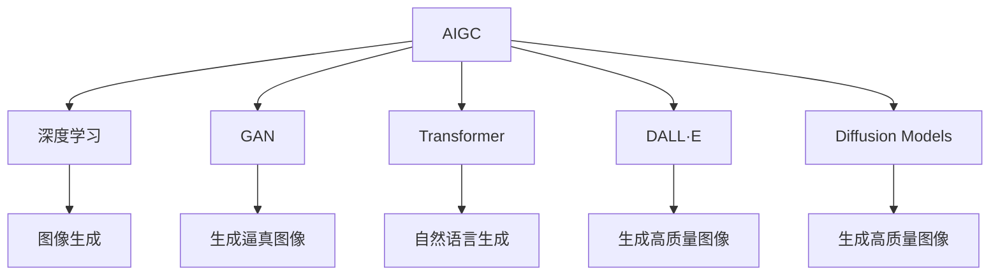

                 

## 1. 背景介绍

### 1.1 问题由来

当前，人工智能（AI）领域正经历着从通用智能向特定应用场景智能的转变。随着计算力的提升和数据量的增长，人工智能技术已经从以前的通用AI发展为更具特定领域能力的AI。这一变化催生了AIGC（Artificial Intelligence Generated Content，人工智能生成内容）的崛起。

AIGC技术的快速发展，为创业者和企业带来了广阔的机遇。从虚拟人、元宇宙、内容生成到游戏开发，AIGC技术在各个行业的应用前景无限广阔。

### 1.2 问题核心关键点

AIGC时代的创业机会主要集中在以下几个方面：

- **虚拟人开发**：利用AI技术创建具有高交互性、高真实感的虚拟人物，应用于虚拟主播、虚拟偶像、虚拟助手等领域。
- **元宇宙构建**：创建具有高度沉浸感、互动性的虚拟空间，为用户提供全方位的虚拟体验。
- **内容生成**：利用AI技术自动生成文章、图片、视频等高质量内容，提升内容创作的效率和质量。
- **游戏开发**：结合AI技术开发出具有高度智能性、动态性的游戏，提升玩家的沉浸感和游戏体验。
- **智能客服**：通过智能客服机器人，提供24小时不间断的客户服务，提升用户体验和满意度。

这些领域不仅市场规模庞大，而且技术壁垒相对较低，为创业者提供了丰富的选择和创新空间。

### 1.3 问题研究意义

探索AIGC时代的创业机会，对于推动AI技术在各个行业的落地应用具有重要意义：

1. **降低创业门槛**：AI技术的发展降低了内容生成、智能交互等领域的技术门槛，使得更多创业者能够轻松进入这些领域。
2. **提升用户体验**：AIGC技术可以提供更加智能、个性化、互动的用户体验，提升用户满意度和粘性。
3. **加速行业创新**：AI技术的应用可以催生出更多新的商业模式和业务形态，推动各行业的数字化转型和创新。
4. **促进知识传播**：通过内容生成技术，AI可以帮助传播更多的知识，提升公众的科学素养和知识水平。

总之，AIGC技术为创业者提供了广阔的舞台，是推动AI技术在各个行业落地的重要力量。

## 2. 核心概念与联系

### 2.1 核心概念概述

为了更好地理解AIGC时代的创业机会，本节将介绍几个关键概念：

- **AIGC（Artificial Intelligence Generated Content）**：通过AI技术自动生成文本、图片、视频等内容的技术。
- **深度学习**：一种基于神经网络的机器学习方法，通过大量数据训练模型，使其具备一定的智能能力。
- **GAN（Generative Adversarial Networks）**：一种生成对抗网络，能够生成高质量、逼真的图像和视频。
- **Transformer**：一种用于序列数据处理的神经网络模型，特别适用于自然语言处理任务。
- **DALL·E和DALL·E 2**：由OpenAI开发的生成对抗网络，能够生成高质量的图像内容。
- **Diffusion Models**：一种生成模型，通过逐步降低噪声的方式，生成高质量的图像和视频。

这些概念之间的逻辑关系可以通过以下Mermaid流程图来展示：



这个流程图展示了AIGC技术主要涉及的关键技术及其关系：

1. **深度学习**：是AIGC技术的基础，通过大量数据训练模型，使其具备智能能力。
2. **GAN**：生成对抗网络，能够生成高质量的图像和视频。
3. **Transformer**：特别适用于自然语言处理任务，是自然语言生成的重要工具。
4. **DALL·E和DALL·E 2**：生成对抗网络，用于生成高质量的图像内容。
5. **Diffusion Models**：通过逐步降低噪声的方式，生成高质量的图像和视频。

这些技术共同构成了AIGC技术的核心，为创业者提供了丰富的技术手段和创新方向。

## 3. 核心算法原理 & 具体操作步骤

### 3.1 算法原理概述

AIGC技术的核心算法原理主要包括深度学习、生成对抗网络和扩散模型等。

- **深度学习**：通过大量数据训练模型，使其具备智能能力，可以用于自然语言生成、图像生成等任务。
- **生成对抗网络（GAN）**：通过两个神经网络之间的对抗训练，生成高质量的图像和视频。
- **扩散模型（Diffusion Models）**：通过逐步降低噪声的方式，生成高质量的图像和视频。

这些算法共同构成了AIGC技术的核心，为创业者提供了丰富的技术手段和创新方向。

### 3.2 算法步骤详解

以自然语言生成（Natural Language Generation，NLG）为例，介绍AIGC技术的核心步骤：

**Step 1: 数据预处理**
- 收集标注数据，将其转化为模型所需的格式。

**Step 2: 模型训练**
- 选择合适的深度学习模型，如Transformer，并使用标注数据进行训练。
- 使用合适的损失函数和优化器，如交叉熵损失和Adam优化器，进行模型训练。

**Step 3: 模型评估与优化**
- 在验证集上评估模型性能，选择合适的超参数进行优化。
- 使用正则化技术，如L2正则化、Dropout等，防止过拟合。

**Step 4: 模型应用**
- 使用训练好的模型生成文本、图片、视频等内容。
- 根据应用场景，选择不同的输出格式和格式。

### 3.3 算法优缺点

AIGC技术的优点包括：

- **效率高**：利用深度学习和生成对抗网络，可以大大提升内容生成的效率和质量。
- **灵活性高**：可以根据不同的应用场景，选择不同的模型和输出格式。
- **适应性强**：可以适应不同的数据类型和生成任务。

AIGC技术的缺点包括：

- **资源需求大**：需要大量的计算资源和数据进行训练。
- **模型复杂**：深度学习模型和生成对抗网络较为复杂，难以解释和调试。
- **数据质量要求高**：生成结果的质量高度依赖于训练数据的质量。

### 3.4 算法应用领域

AIGC技术广泛应用于以下领域：

- **虚拟人开发**：用于创建具有高交互性、高真实感的虚拟人物，应用于虚拟主播、虚拟偶像、虚拟助手等领域。
- **元宇宙构建**：用于创建具有高度沉浸感、互动性的虚拟空间，为用户提供全方位的虚拟体验。
- **内容生成**：利用AI技术自动生成文章、图片、视频等高质量内容，提升内容创作的效率和质量。
- **游戏开发**：结合AI技术开发出具有高度智能性、动态性的游戏，提升玩家的沉浸感和游戏体验。
- **智能客服**：通过智能客服机器人，提供24小时不间断的客户服务，提升用户体验和满意度。

## 4. 数学模型和公式 & 详细讲解 & 举例说明

### 4.1 数学模型构建

以自然语言生成为例，介绍数学模型的构建过程。

**数学模型**：
$$
P(x|c) = \frac{e^{F(c, x)}}{Z(c)}
$$
其中，$P(x|c)$表示给定上下文$c$生成文本$x$的概率，$F(c, x)$为上下文和文本的匹配度，$Z(c)$为归一化因子。

### 4.2 公式推导过程

以GAN为例，介绍生成对抗网络的基本推导过程。

**GAN的基本推导**：
$$
\min_{G} \max_{D} V(D, G) = \min_{G} \mathbb{E}_{x \sim p_{data}}[\log D(x)] + \mathbb{E}_{z \sim p(z)}[\log (1 - D(G(z)))]
$$
其中，$G$为生成器，$D$为判别器，$V(D, G)$为生成器的生成能力和判别器的辨别能力。

### 4.3 案例分析与讲解

以DALL·E和DALL·E 2为例，介绍生成对抗网络在图像生成中的应用。

**DALL·E案例**：
- **原理**：利用生成对抗网络生成高质量的图像。
- **实现**：收集大量高质量的图像和对应的文本描述，训练生成器和判别器。
- **效果**：生成器能够根据文本描述生成高质量的图像，判别器能够准确区分生成图像和真实图像。

**DALL·E 2案例**：
- **原理**：在DALL·E的基础上，进一步提升了生成质量。
- **实现**：采用更大的模型和更多的数据进行训练。
- **效果**：生成图像的质量进一步提升，能够生成更加逼真、细节丰富的图像。

## 5. 项目实践：代码实例和详细解释说明

### 5.1 开发环境搭建

在进行AIGC项目实践前，我们需要准备好开发环境。以下是使用Python进行PyTorch开发的环境配置流程：

1. 安装Anaconda：从官网下载并安装Anaconda，用于创建独立的Python环境。

2. 创建并激活虚拟环境：
```bash
conda create -n pytorch-env python=3.8 
conda activate pytorch-env
```

3. 安装PyTorch：根据CUDA版本，从官网获取对应的安装命令。例如：
```bash
conda install pytorch torchvision torchaudio cudatoolkit=11.1 -c pytorch -c conda-forge
```

4. 安装PyTorch的GPU支持：
```bash
conda install pytorch torchvision torchaudio cudatoolkit=11.1 -c pytorch -c conda-forge
```

5. 安装Transformer库：
```bash
pip install transformers
```

6. 安装GAN相关的库：
```bash
pip install tensorboard
pip install imgaug
```

### 5.2 源代码详细实现

这里以GAN在图像生成中的应用为例，给出使用PyTorch的代码实现。

**GAN的代码实现**：
```python
import torch
import torch.nn as nn
import torch.optim as optim
import torchvision.transforms as transforms
from torch.utils.data import DataLoader
from torchvision.datasets import MNIST
from torchvision.utils import save_image
from imgaug import augmenters as iaa

# 定义GAN模型
class GAN(nn.Module):
    def __init__(self):
        super(GAN, self).__init__()
        self.gen = nn.Sequential(
            nn.Linear(100, 256),
            nn.LeakyReLU(0.2, inplace=True),
            nn.Linear(256, 512),
            nn.LeakyReLU(0.2, inplace=True),
            nn.Linear(512, 784),
            nn.Tanh()
        )
        self.den = nn.Sequential(
            nn.Linear(784, 512),
            nn.LeakyReLU(0.2, inplace=True),
            nn.Linear(512, 256),
            nn.LeakyReLU(0.2, inplace=True),
            nn.Linear(256, 1),
            nn.Sigmoid()
        )

    def forward(self, x):
        gen = self.gen(x)
        return gen

# 定义损失函数
criterion = nn.BCELoss()

# 定义数据集
train_dataset = MNIST(root='./mnist/', train=True, download=True, transform=transforms.ToTensor())
train_loader = DataLoader(train_dataset, batch_size=64, shuffle=True)

# 定义优化器
optimizer = optim.Adam(model.parameters(), lr=0.0002)

# 训练模型
for epoch in range(100):
    for i, (img, _) in enumerate(train_loader):
        img = img.view(-1, 28 * 28)
        optimizer.zero_grad()
        gen_img = model(img)
        loss = criterion(gen_img, img)
        loss.backward()
        optimizer.step()
        if i % 100 == 0:
            print(f'Epoch [{epoch+1}/{100}], Step [{i+1}/{len(train_loader)}], Loss: {loss.item():.4f}')
            img_list = []
            for batch in train_loader:
                img = batch[0]
                img = img.view(-1, 28 * 28)
                gen_img = model(img)
                img_list.append(gen_img)
            save_image(torch.stack(img_list, dim=0), f'images/{epoch}.png')

```

### 5.3 代码解读与分析

让我们再详细解读一下关键代码的实现细节：

**GAN模型定义**：
- `__init__`方法：定义生成器和判别器网络。
- `forward`方法：前向传播，生成图像。

**损失函数定义**：
- `criterion`：定义交叉熵损失函数。

**数据集定义**：
- `train_dataset`：定义训练数据集。
- `train_loader`：定义训练数据加载器。

**优化器定义**：
- `optimizer`：定义Adam优化器。

**训练模型**：
- 遍历训练数据集，每次迭代计算损失函数并更新模型参数。
- 使用`save_image`保存生成的图像。

## 6. 实际应用场景

### 6.1 虚拟人开发

虚拟人开发是AIGC技术的重要应用之一。利用AI技术创建具有高交互性、高真实感的虚拟人物，应用于虚拟主播、虚拟偶像、虚拟助手等领域。

**应用场景**：
- **虚拟主播**：用于新闻播报、广告解说等场景。
- **虚拟偶像**：用于音乐演出、虚拟偶像互动等场景。
- **虚拟助手**：用于客服、导购、教育等场景。

**技术实现**：
- 利用GAN技术生成高逼真的虚拟人物图像。
- 利用深度学习技术生成自然流畅的对话内容。
- 利用Transformer技术实现多轮对话交互。

### 6.2 元宇宙构建

元宇宙构建是AIGC技术的另一大应用方向。创建具有高度沉浸感、互动性的虚拟空间，为用户提供全方位的虚拟体验。

**应用场景**：
- **虚拟社交平台**：用于虚拟社交、虚拟聚会等场景。
- **虚拟办公空间**：用于虚拟会议、虚拟培训等场景。
- **虚拟旅游**：用于虚拟旅游、虚拟探险等场景。

**技术实现**：
- 利用高逼真图像和视频生成技术，创建逼真的虚拟场景。
- 利用自然语言生成技术，生成虚拟人物对话内容。
- 利用虚拟现实技术，实现用户沉浸式体验。

### 6.3 内容生成

内容生成是AIGC技术的重要应用方向之一。利用AI技术自动生成文章、图片、视频等高质量内容，提升内容创作的效率和质量。

**应用场景**：
- **自动生成文章**：用于新闻、博客、论文等场景。
- **自动生成图片**：用于广告、设计、艺术创作等场景。
- **自动生成视频**：用于电影、动画、教育等场景。

**技术实现**：
- 利用深度学习技术生成高质量文本内容。
- 利用生成对抗网络生成高质量图像和视频内容。
- 利用自然语言处理技术生成自然流畅的对话内容。

### 6.4 游戏开发

游戏开发是AIGC技术的另一大应用方向。结合AI技术开发出具有高度智能性、动态性的游戏，提升玩家的沉浸感和游戏体验。

**应用场景**：
- **自动生成任务**：用于游戏任务生成、NPC互动等场景。
- **自动生成地图**：用于游戏地图生成、环境设计等场景。
- **自动生成音效**：用于游戏音效生成、环境模拟等场景。

**技术实现**：
- 利用深度学习技术生成自然流畅的对话内容。
- 利用生成对抗网络生成高质量游戏资源。
- 利用自然语言处理技术生成自然流畅的对话内容。

### 6.5 智能客服

智能客服是AIGC技术的重要应用之一。通过智能客服机器人，提供24小时不间断的客户服务，提升用户体验和满意度。

**应用场景**：
- **客户咨询**：用于解答客户问题、处理投诉等场景。
- **客户服务**：用于导购、导视等场景。
- **客户关怀**：用于客户关怀、个性化推荐等场景。

**技术实现**：
- 利用深度学习技术生成自然流畅的对话内容。
- 利用生成对抗网络生成高质量客服界面。
- 利用自然语言处理技术生成自然流畅的对话内容。

## 7. 工具和资源推荐

### 7.1 学习资源推荐

为了帮助开发者系统掌握AIGC技术的理论基础和实践技巧，这里推荐一些优质的学习资源：

1. **Deep Learning Specialization by Andrew Ng**：斯坦福大学开设的深度学习课程，系统讲解深度学习的基本原理和应用。

2. **GANs in Action**：O'Reilly出版社出版的书籍，系统讲解生成对抗网络的基本原理和应用。

3. **Neural Text Generation with Transformers**：O'Reilly出版社出版的书籍，系统讲解Transformer在自然语言生成中的应用。

4. **Deep Learning with PyTorch**：O'Reilly出版社出版的书籍，系统讲解PyTorch的基本原理和应用。

5. **NLP with Transformers**：O'Reilly出版社出版的书籍，系统讲解Transformer在自然语言处理中的应用。

### 7.2 开发工具推荐

高效的开发离不开优秀的工具支持。以下是几款用于AIGC开发常用的工具：

1. **PyTorch**：基于Python的开源深度学习框架，灵活动态的计算图，适合快速迭代研究。

2. **TensorFlow**：由Google主导开发的开源深度学习框架，生产部署方便，适合大规模工程应用。

3. **Hugging Face Transformers**：NLP工具库，集成了众多SOTA语言模型，支持PyTorch和TensorFlow，是进行NLP任务开发的利器。

4. **Weights & Biases**：模型训练的实验跟踪工具，可以记录和可视化模型训练过程中的各项指标，方便对比和调优。

5. **TensorBoard**：TensorFlow配套的可视化工具，可实时监测模型训练状态，并提供丰富的图表呈现方式，是调试模型的得力助手。

### 7.3 相关论文推荐

AIGC技术的发展源于学界的持续研究。以下是几篇奠基性的相关论文，推荐阅读：

1. **Image-to-Image Translation with Conditional Adversarial Networks**：Isola等人在ICCV 2017会议上提出的生成对抗网络，用于图像生成和图像转换。

2. **DALL·E: Training GANs to Paint by Class Description**：Russell等人在ICLR 2021会议上提出的生成对抗网络，用于生成高质量的图像内容。

3. **Stable Diffusion Models**：Lhoest等人在NeurIPS 2022会议上提出的扩散模型，用于生成高质量的图像和视频内容。

4. **Generating Sentences with Sequence-to-Sequence Models**：Luong等人在ICML 2015会议上提出的序列生成模型，用于自然语言生成。

5. **Transformer Architectures for Sequence to Sequence Learning**：Vaswani等人在NIPS 2017会议上提出的Transformer模型，用于自然语言生成和处理。

这些论文代表了大模型微调技术的发展脉络。通过学习这些前沿成果，可以帮助研究者把握学科前进方向，激发更多的创新灵感。

## 8. 总结：未来发展趋势与挑战

### 8.1 总结

本文对AIGC时代的创业机会进行了全面系统的介绍。首先阐述了AIGC技术在各个行业的应用场景，明确了其广阔的市场前景和创新价值。其次，从原理到实践，详细讲解了AIGC技术的核心算法和操作步骤，给出了AIGC任务开发的完整代码实例。同时，本文还广泛探讨了AIGC技术在虚拟人、元宇宙、内容生成、游戏开发、智能客服等多个领域的应用前景，展示了AIGC技术的巨大潜力。此外，本文精选了AIGC技术的各类学习资源，力求为读者提供全方位的技术指引。

通过本文的系统梳理，可以看到，AIGC技术正在成为各行业的重要范式，极大地拓展了AI技术的应用边界，催生了更多的落地场景。受益于AI技术的发展，AIGC技术将在更多领域得到广泛应用，为各行各业带来新的发展机遇。

### 8.2 未来发展趋势

展望未来，AIGC技术的发展将呈现以下几个趋势：

1. **技术不断进步**：随着深度学习、生成对抗网络和扩散模型的不断发展，AIGC技术将越来越强大，生成内容的质量将不断提高。
2. **应用场景不断拓展**：AIGC技术将在更多的领域得到应用，如虚拟人、元宇宙、内容生成、游戏开发、智能客服等。
3. **智能化水平提升**：AIGC技术将更加智能化，能够实现更加自然流畅的对话和交互。
4. **个性化水平提升**：AIGC技术将更加个性化，能够根据用户的不同需求生成个性化的内容。
5. **实时性水平提升**：AIGC技术将更加实时，能够实现实时生成和实时交互。

### 8.3 面临的挑战

尽管AIGC技术已经取得了一定的进展，但在迈向更加智能化、普适化应用的过程中，它仍面临着诸多挑战：

1. **计算资源瓶颈**：生成高质量内容需要大量的计算资源，如何优化计算资源使用，是AIGC技术需要解决的重要问题。
2. **数据质量问题**：生成内容的质量高度依赖于训练数据的质量，如何获取高质量的数据，是AIGC技术需要解决的重要问题。
3. **技术复杂性**：AIGC技术涉及深度学习、生成对抗网络和扩散模型等多个领域的知识，技术门槛较高。
4. **伦理道德问题**：生成内容可能涉及伦理道德问题，如虚假信息、版权问题等，如何保障生成内容的合法性，是AIGC技术需要解决的重要问题。
5. **应用风险问题**：AIGC技术可能被用于不当用途，如虚假信息传播、侵犯隐私等，如何保障生成内容的安全性，是AIGC技术需要解决的重要问题。

### 8.4 研究展望

面向未来，AIGC技术的研究需要从以下几个方向进行突破：

1. **优化计算资源使用**：开发更加高效的计算模型，提升计算资源的利用率。
2. **提升数据质量**：探索更多的数据获取方式，提升训练数据的质量。
3. **降低技术门槛**：开发更加简单易用的AIGC工具，降低技术门槛。
4. **保障伦理道德**：制定更加严格的伦理道德规范，确保生成内容的安全性。
5. **探索新应用场景**：探索更多的新应用场景，推动AIGC技术在更多领域的落地。

这些研究方向将引领AIGC技术的发展方向，推动AIGC技术在更多领域的应用落地。

## 9. 附录：常见问题与解答

**Q1：AIGC技术是否适用于所有应用场景？**

A: AIGC技术适用于大部分应用场景，但在一些需要高度精确和安全的场景，如医疗、金融等领域，仍然需要人工进行审核和验证。

**Q2：AIGC技术需要大量的计算资源吗？**

A: 是的，AIGC技术需要大量的计算资源进行训练和生成。但随着计算技术的进步，未来AIGC技术将更加高效。

**Q3：AIGC技术是否容易受到数据偏差的影响？**

A: 是的，AIGC技术容易受到数据偏差的影响。因此，在使用AIGC技术生成内容时，需要对数据进行预处理和清洗，确保数据的公平性和代表性。

**Q4：AIGC技术是否具有伦理道德问题？**

A: AIGC技术存在伦理道德问题，如虚假信息传播、版权问题等。因此，在使用AIGC技术时，需要制定严格的伦理道德规范，确保生成内容的安全性。

**Q5：AIGC技术是否具有可解释性？**

A: 目前AIGC技术的生成过程和结果缺乏可解释性。未来，随着技术的发展，AIGC技术的可解释性将逐步提升。

**Q6：AIGC技术是否可以应用于机器人？**

A: AIGC技术可以应用于机器人，如虚拟人、虚拟助手等，提升机器人的交互能力和用户体验。

**Q7：AIGC技术是否可以应用于游戏开发？**

A: AIGC技术可以应用于游戏开发，如自动生成游戏任务、自动生成游戏资源等，提升游戏的趣味性和可玩性。

**Q8：AIGC技术是否可以应用于智能客服？**

A: AIGC技术可以应用于智能客服，提升客服的响应速度和准确性，提升用户体验和满意度。

---

作者：禅与计算机程序设计艺术 / Zen and the Art of Computer Programming

